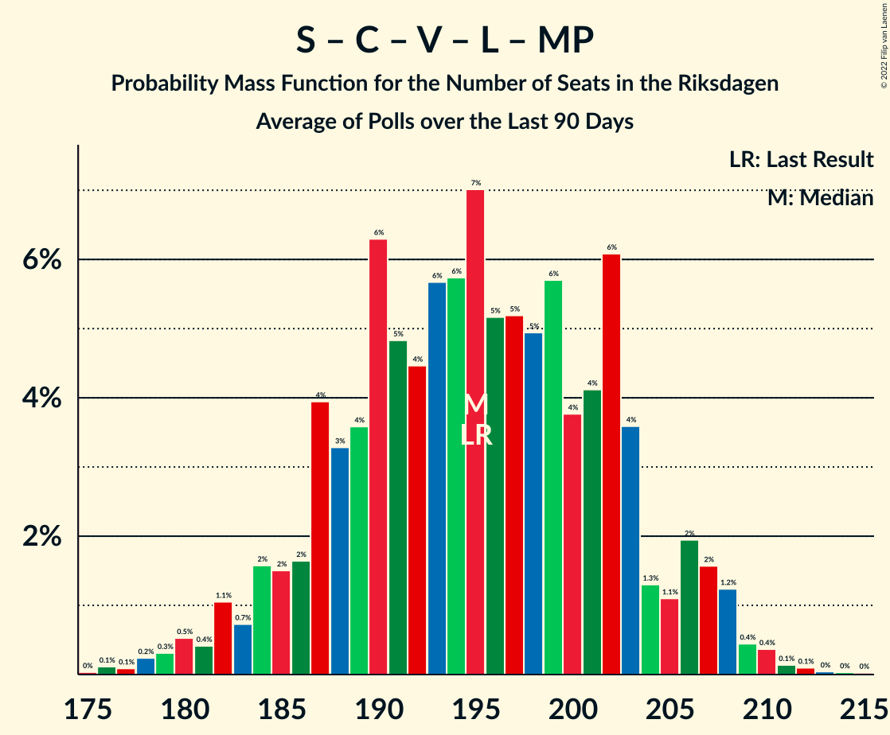

# Poll Average

<a href="#voting-intentions">Voting Intentions</a> | <a href="#seats">Seats</a> | <a href="#coalitions">Coalitions</a> | <a href="#technical-information">Technical Information</a>

## Summary

The table below lists the polls on which the average is based. They are the most recent polls (less than 90 days old) registered and analyzed so far.

| Period     | Polling firm/Commissioner(s) | S | M | SD | C | V | KD | L | MP |
|:----------:|:----------------------------:|:--:|:--:|:--:|:--:|:--:|:--:|:--:|:--:|
| 9 September 2018 | General Election | 28.3%   100 | 19.8%   70 | 17.5%   62 | 8.6%   31 | 8.0%   28 | 6.3%   22 | 5.5%   20 | 4.4%   16 |
| N/A | Poll Average | 24–30%   88–111 | 18–23%   67–85 | 17–24%   62–89 | 4–10%   16–38 | 8–12%   30–44 | 5–8%   17–29 | 2–5%   0–17 | 3–6%   0–22 |
| [5–15 October 2020](2020-10-15-Sifo.html) | Sifo | 25–27%   93–103 | 20–22%   72–80 | 19–21%   71–79 | 7–8%   26–31 | 9–11%   34–40 | 5–6%   20–24 | 3–4%   0 | 4–5%   0–18 |
| [14 September–11 October 2020](2020-10-11-Novus.html) | Novus   SVT | 25–28%   91–102 | 19–22%   71–81 | 18–20%   65–75 | 8–9%   28–34 | 9–11%   32–39 | 5–6%   18–23 | 3–4%   0–15 | 5–6%   16–22 |
| [1–7 October 2020](2020-10-07-Demoskop.html) | Demoskop | 23–27%   88–101 | 20–23%   74–86 | 18–21%   69–82 | 8–11%   32–40 | 8–10%   31–40 | 6–8%   22–29 | 3–4%   0–15 | 3–4%   0–16 |
| [8–21 September 2020](2020-09-21-Ipsos.html) | Ipsos   Dagens Nyheter | 24–28%   87–106 | 18–22%   66–82 | 18–22%   66–83 | 7–9%   25–36 | 8–11%   28–40 | 6–8%   21–31 | 3–5%   0–19 | 3–5%   0–19 |
| [20–25 August 2020](2020-08-25-Sentio.html) | Sentio   Nyheter Idag | 24–30%   87–110 | 18–23%   64–85 | 20–25%   72–94 | 4–7%   0–25 | 8–12%   30–45 | 4–7%   15–27 | 2–4%   0–15 | 4–7%   0–24 |
| [23–28 July 2020](2020-07-28-SKOP.html) | SKOP | 26–31%   94–116 | 19–24%   69–89 | 16–20%   58–77 | 6–10%   24–37 | 9–12%   32–46 | 5–8%   17–28 | 3–5%   0–18 | 2–5%   0–17 |
| 9 September 2018 | General Election | 28.3%   100 | 19.8%   70 | 17.5%   62 | 8.6%   31 | 8.0%   28 | 6.3%   22 | 5.5%   20 | 4.4%   16 |

Only polls for which at least the sample size has been published are included in the table above.

**Legend:**
+ **Top half of each row:** Voting intentions (95% confidence interval)
+ **Bottom half of each row:** Seat projections for the Riksdagen (95% confidence interval)
+ **S:** Sveriges socialdemokratiska arbetareparti
+ **M:** Moderata samlingspartiet
+ **SD:** Sverigedemokraterna
+ **C:** Centerpartiet
+ **V:** Vänsterpartiet
+ **KD:** Kristdemokraterna
+ **L:** Liberalerna
+ **MP:** Miljöpartiet de gröna
+ **N/A (single party):** Party not included the published results
+ **N/A (entire row):** Calculation for this opinion poll not started yet

## Voting Intentions

### Confidence Intervals

| Party | Last Result | Median | 80% Confidence Interval | 90% Confidence Interval | 95% Confidence Interval | 99% Confidence Interval |
|:-----:|:-----------:|:------:|:-----------------------:|:-----------------------:|:-----------------------:|:-----------------------:|
| <a href="#sveriges-socialdemokratiska-arbetareparti">Sveriges socialdemokratiska arbetareparti</a> | 28.3% | 26.4% | 24.7–28.5% |24.3–29.3% | 23.9–29.9% | 23.2–31.1% |
| <a href="#moderata-samlingspartiet">Moderata samlingspartiet</a> | 19.8% | 20.7% | 19.3–22.0% |18.8–22.4% | 18.4–22.9% | 17.6–23.8% |
| <a href="#sverigedemokraterna">Sverigedemokraterna</a> | 17.5% | 19.9% | 18.1–22.2% |17.3–23.3% | 16.7–24.0% | 15.8–25.4% |
| <a href="#centerpartiet">Centerpartiet</a> | 8.6% | 8.0% | 5.3–9.4% |4.7–9.8% | 4.4–10.1% | 3.8–10.6% |
| <a href="#vänsterpartiet">Vänsterpartiet</a> | 8.0% | 9.7% | 8.7–10.9% |8.4–11.4% | 8.1–11.8% | 7.6–12.6% |
| <a href="#kristdemokraterna">Kristdemokraterna</a> | 6.3% | 6.1% | 5.2–7.2% |4.9–7.5% | 4.6–7.8% | 4.1–8.3% |
| <a href="#liberalerna">Liberalerna</a> | 5.5% | 3.4% | 2.8–4.2% |2.5–4.5% | 2.3–4.8% | 1.9–5.2% |
| <a href="#miljöpartiet-de-gröna">Miljöpartiet de gröna</a> | 4.4% | 4.2% | 3.2–5.4% |3.0–5.7% | 2.8–6.0% | 2.5–6.6% |

### Sveriges socialdemokratiska arbetareparti

*For a full overview of the results for this party, see the [Sveriges socialdemokratiska arbetareparti](party-sverigessocialdemokratiskaarbetareparti.html) page.*

| Voting Intentions | Probability | Accumulated | Special Marks |
|:-----------------:|:-----------:|:-----------:|:-------------:|
| 20.5–21.5% | 0% | 100% |  |
| 21.5–22.5% | 0.1% | 100% |  |
| 22.5–23.5% | 1.1% | 99.9% |  |
| 23.5–24.5% | 7% | 98.8% |  |
| 24.5–25.5% | 16% | 92% |  |
| 25.5–26.5% | 31% | 76% | Median |
| 26.5–27.5% | 25% | 44% |  |
| 27.5–28.5% | 10% | 20% | Last Result |
| 28.5–29.5% | 6% | 9% |  |
| 29.5–30.5% | 3% | 4% |  |
| 30.5–31.5% | 0.9% | 1.1% |  |
| 31.5–32.5% | 0.2% | 0.2% |  |
| 32.5–33.5% | 0% | 0% |  |

### Moderata samlingspartiet

*For a full overview of the results for this party, see the [Moderata samlingspartiet](party-moderatasamlingspartiet.html) page.*

| Voting Intentions | Probability | Accumulated | Special Marks |
|:-----------------:|:-----------:|:-----------:|:-------------:|
| 15.5–16.5% | 0% | 100% |  |
| 16.5–17.5% | 0.4% | 99.9% |  |
| 17.5–18.5% | 3% | 99.5% |  |
| 18.5–19.5% | 10% | 97% |  |
| 19.5–20.5% | 31% | 87% | Last Result |
| 20.5–21.5% | 38% | 56% | Median |
| 21.5–22.5% | 13% | 18% |  |
| 22.5–23.5% | 3% | 4% |  |
| 23.5–24.5% | 0.7% | 0.8% |  |
| 24.5–25.5% | 0.1% | 0.1% |  |
| 25.5–26.5% | 0% | 0% |  |

### Sverigedemokraterna

*For a full overview of the results for this party, see the [Sverigedemokraterna](party-sverigedemokraterna.html) page.*

| Voting Intentions | Probability | Accumulated | Special Marks |
|:-----------------:|:-----------:|:-----------:|:-------------:|
| 13.5–14.5% | 0% | 100% |  |
| 14.5–15.5% | 0.3% | 100% |  |
| 15.5–16.5% | 2% | 99.7% |  |
| 16.5–17.5% | 4% | 98% |  |
| 17.5–18.5% | 9% | 94% | Last Result |
| 18.5–19.5% | 23% | 84% |  |
| 19.5–20.5% | 33% | 61% | Median |
| 20.5–21.5% | 14% | 28% |  |
| 21.5–22.5% | 6% | 14% |  |
| 22.5–23.5% | 4% | 8% |  |
| 23.5–24.5% | 3% | 4% |  |
| 24.5–25.5% | 1.1% | 1.4% |  |
| 25.5–26.5% | 0.3% | 0.4% |  |
| 26.5–27.5% | 0.1% | 0.1% |  |
| 27.5–28.5% | 0% | 0% |  |

### Centerpartiet

*For a full overview of the results for this party, see the [Centerpartiet](party-centerpartiet.html) page.*

| Voting Intentions | Probability | Accumulated | Special Marks |
|:-----------------:|:-----------:|:-----------:|:-------------:|
| 1.5–2.5% | 0% | 100% |  |
| 2.5–3.5% | 0.2% | 100% |  |
| 3.5–4.5% | 3% | 99.8% |  |
| 4.5–5.5% | 8% | 96% |  |
| 5.5–6.5% | 5% | 88% |  |
| 6.5–7.5% | 14% | 83% |  |
| 7.5–8.5% | 39% | 70% | Median |
| 8.5–9.5% | 23% | 31% | Last Result |
| 9.5–10.5% | 8% | 8% |  |
| 10.5–11.5% | 0.5% | 0.5% |  |
| 11.5–12.5% | 0% | 0% |  |

### Vänsterpartiet

*For a full overview of the results for this party, see the [Vänsterpartiet](party-vänsterpartiet.html) page.*

| Voting Intentions | Probability | Accumulated | Special Marks |
|:-----------------:|:-----------:|:-----------:|:-------------:|
| 5.5–6.5% | 0% | 100% |  |
| 6.5–7.5% | 0.4% | 100% |  |
| 7.5–8.5% | 7% | 99.6% | Last Result |
| 8.5–9.5% | 34% | 92% |  |
| 9.5–10.5% | 43% | 58% | Median |
| 10.5–11.5% | 12% | 15% |  |
| 11.5–12.5% | 3% | 4% |  |
| 12.5–13.5% | 0.5% | 0.6% |  |
| 13.5–14.5% | 0% | 0% |  |
| 14.5–15.5% | 0% | 0% |  |

### Kristdemokraterna

*For a full overview of the results for this party, see the [Kristdemokraterna](party-kristdemokraterna.html) page.*

| Voting Intentions | Probability | Accumulated | Special Marks |
|:-----------------:|:-----------:|:-----------:|:-------------:|
| 2.5–3.5% | 0% | 100% |  |
| 3.5–4.5% | 2% | 100% |  |
| 4.5–5.5% | 18% | 98% |  |
| 5.5–6.5% | 50% | 80% | Last Result, Median |
| 6.5–7.5% | 24% | 29% |  |
| 7.5–8.5% | 5% | 5% |  |
| 8.5–9.5% | 0.2% | 0.3% |  |
| 9.5–10.5% | 0% | 0% |  |

### Liberalerna

*For a full overview of the results for this party, see the [Liberalerna](party-liberalerna.html) page.*

| Voting Intentions | Probability | Accumulated | Special Marks |
|:-----------------:|:-----------:|:-----------:|:-------------:|
| 0.5–1.5% | 0.1% | 100% |  |
| 1.5–2.5% | 5% | 99.9% |  |
| 2.5–3.5% | 56% | 95% | Median |
| 3.5–4.5% | 35% | 39% |  |
| 4.5–5.5% | 4% | 5% | Last Result |
| 5.5–6.5% | 0.1% | 0.1% |  |
| 6.5–7.5% | 0% | 0% |  |

### Miljöpartiet de gröna

*For a full overview of the results for this party, see the [Miljöpartiet de gröna](party-miljöpartietdegröna.html) page.*

| Voting Intentions | Probability | Accumulated | Special Marks |
|:-----------------:|:-----------:|:-----------:|:-------------:|
| 0.5–1.5% | 0% | 100% |  |
| 1.5–2.5% | 0.8% | 100% |  |
| 2.5–3.5% | 21% | 99.2% |  |
| 3.5–4.5% | 44% | 78% | Last Result, Median |
| 4.5–5.5% | 27% | 34% |  |
| 5.5–6.5% | 7% | 7% |  |
| 6.5–7.5% | 0.5% | 0.6% |  |
| 7.5–8.5% | 0% | 0% |  |

## Seats

### Confidence Intervals

| Party | Last Result | Median | 80% Confidence Interval | 90% Confidence Interval | 95% Confidence Interval | 99% Confidence Interval |
|:-----:|:-----------:|:------:|:-----------------------:|:-----------------------:|:-----------------------:|:-----------------------:|
| <a href="#sveriges-socialdemokratiska-arbetareparti">Sveriges socialdemokratiska arbetareparti</a> | 100 | 97 | 92–105 |90–109 | 88–111 | 85–116 |
| <a href="#moderata-samlingspartiet">Moderata samlingspartiet</a> | 70 | 76 | 71–82 |69–84 | 67–85 | 64–90 |
| <a href="#sverigedemokraterna">Sverigedemokraterna</a> | 62 | 74 | 66–82 |63–86 | 62–89 | 58–94 |
| <a href="#centerpartiet">Centerpartiet</a> | 31 | 30 | 19–36 |17–37 | 16–38 | 0–40 |
| <a href="#vänsterpartiet">Vänsterpartiet</a> | 28 | 36 | 32–40 |31–42 | 30–44 | 28–47 |
| <a href="#kristdemokraterna">Kristdemokraterna</a> | 22 | 22 | 19–27 |18–28 | 17–29 | 15–31 |
| <a href="#liberalerna">Liberalerna</a> | 20 | 0 | 0–16 |0–16 | 0–17 | 0–19 |
| <a href="#miljöpartiet-de-gröna">Miljöpartiet de gröna</a> | 16 | 15 | 0–20 |0–21 | 0–22 | 0–24 |

### Sveriges socialdemokratiska arbetareparti

*For a full overview of the results for this party, see the [Sveriges socialdemokratiska arbetareparti](party-sverigessocialdemokratiskaarbetareparti.html) page.*

| Number of Seats | Probability | Accumulated | Special Marks |
|:---------------:|:-----------:|:-----------:|:-------------:|
| 82 | 0% | 100% |  |
| 83 | 0.1% | 99.9% |  |
| 84 | 0.1% | 99.8% |  |
| 85 | 0.2% | 99.7% |  |
| 86 | 0.4% | 99.5% |  |
| 87 | 0.5% | 99.1% |  |
| 88 | 1.3% | 98.6% |  |
| 89 | 1.2% | 97% |  |
| 90 | 2% | 96% |  |
| 91 | 3% | 94% |  |
| 92 | 4% | 92% |  |
| 93 | 6% | 88% |  |
| 94 | 6% | 82% |  |
| 95 | 9% | 76% |  |
| 96 | 12% | 67% |  |
| 97 | 11% | 55% | Median |
| 98 | 7% | 44% |  |
| 99 | 7% | 37% |  |
| 100 | 5% | 30% | Last Result |
| 101 | 4% | 24% |  |
| 102 | 4% | 20% |  |
| 103 | 3% | 16% |  |
| 104 | 2% | 13% |  |
| 105 | 2% | 11% |  |
| 106 | 2% | 10% |  |
| 107 | 1.0% | 7% |  |
| 108 | 1.0% | 6% |  |
| 109 | 1.0% | 5% |  |
| 110 | 1.0% | 4% |  |
| 111 | 1.0% | 3% |  |
| 112 | 0.7% | 2% |  |
| 113 | 0.3% | 2% |  |
| 114 | 0.5% | 1.4% |  |
| 115 | 0.3% | 0.9% |  |
| 116 | 0.2% | 0.6% |  |
| 117 | 0.2% | 0.4% |  |
| 118 | 0.1% | 0.3% |  |
| 119 | 0.1% | 0.2% |  |
| 120 | 0% | 0.1% |  |
| 121 | 0% | 0.1% |  |
| 122 | 0% | 0% |  |

### Moderata samlingspartiet

*For a full overview of the results for this party, see the [Moderata samlingspartiet](party-moderatasamlingspartiet.html) page.*

| Number of Seats | Probability | Accumulated | Special Marks |
|:---------------:|:-----------:|:-----------:|:-------------:|
| 61 | 0.1% | 100% |  |
| 62 | 0.1% | 99.9% |  |
| 63 | 0.1% | 99.8% |  |
| 64 | 0.5% | 99.7% |  |
| 65 | 0.3% | 99.2% |  |
| 66 | 0.8% | 98.9% |  |
| 67 | 1.2% | 98% |  |
| 68 | 1.4% | 97% |  |
| 69 | 2% | 96% |  |
| 70 | 2% | 94% | Last Result |
| 71 | 3% | 92% |  |
| 72 | 5% | 88% |  |
| 73 | 5% | 83% |  |
| 74 | 9% | 78% |  |
| 75 | 11% | 69% |  |
| 76 | 9% | 58% | Median |
| 77 | 10% | 49% |  |
| 78 | 9% | 39% |  |
| 79 | 5% | 30% |  |
| 80 | 5% | 25% |  |
| 81 | 7% | 19% |  |
| 82 | 4% | 13% |  |
| 83 | 2% | 9% |  |
| 84 | 3% | 7% |  |
| 85 | 1.2% | 4% |  |
| 86 | 0.7% | 2% |  |
| 87 | 0.7% | 2% |  |
| 88 | 0.3% | 1.0% |  |
| 89 | 0.2% | 0.7% |  |
| 90 | 0.2% | 0.5% |  |
| 91 | 0.1% | 0.3% |  |
| 92 | 0% | 0.2% |  |
| 93 | 0.1% | 0.1% |  |
| 94 | 0% | 0% |  |

### Sverigedemokraterna

*For a full overview of the results for this party, see the [Sverigedemokraterna](party-sverigedemokraterna.html) page.*

| Number of Seats | Probability | Accumulated | Special Marks |
|:---------------:|:-----------:|:-----------:|:-------------:|
| 54 | 0% | 100% |  |
| 55 | 0.1% | 99.9% |  |
| 56 | 0.1% | 99.9% |  |
| 57 | 0.2% | 99.8% |  |
| 58 | 0.2% | 99.6% |  |
| 59 | 0.6% | 99.4% |  |
| 60 | 0.6% | 98.8% |  |
| 61 | 0.7% | 98% |  |
| 62 | 1.2% | 98% | Last Result |
| 63 | 2% | 96% |  |
| 64 | 0.8% | 94% |  |
| 65 | 2% | 93% |  |
| 66 | 2% | 91% |  |
| 67 | 3% | 89% |  |
| 68 | 4% | 86% |  |
| 69 | 4% | 83% |  |
| 70 | 7% | 79% |  |
| 71 | 6% | 72% |  |
| 72 | 6% | 66% |  |
| 73 | 8% | 60% |  |
| 74 | 8% | 52% | Median |
| 75 | 7% | 44% |  |
| 76 | 10% | 37% |  |
| 77 | 5% | 27% |  |
| 78 | 4% | 23% |  |
| 79 | 3% | 19% |  |
| 80 | 2% | 15% |  |
| 81 | 2% | 13% |  |
| 82 | 2% | 11% |  |
| 83 | 2% | 9% |  |
| 84 | 1.5% | 8% |  |
| 85 | 1.2% | 6% |  |
| 86 | 1.3% | 5% |  |
| 87 | 0.8% | 4% |  |
| 88 | 0.6% | 3% |  |
| 89 | 0.4% | 3% |  |
| 90 | 0.4% | 2% |  |
| 91 | 0.6% | 2% |  |
| 92 | 0.4% | 1.1% |  |
| 93 | 0.2% | 0.8% |  |
| 94 | 0.2% | 0.5% |  |
| 95 | 0.1% | 0.4% |  |
| 96 | 0.1% | 0.3% |  |
| 97 | 0.1% | 0.2% |  |
| 98 | 0% | 0.1% |  |
| 99 | 0% | 0.1% |  |
| 100 | 0% | 0.1% |  |
| 101 | 0% | 0% |  |

### Centerpartiet

*For a full overview of the results for this party, see the [Centerpartiet](party-centerpartiet.html) page.*

| Number of Seats | Probability | Accumulated | Special Marks |
|:---------------:|:-----------:|:-----------:|:-------------:|
| 0 | 1.0% | 100% |  |
| 1 | 0% | 99.0% |  |
| 2 | 0% | 99.0% |  |
| 3 | 0% | 99.0% |  |
| 4 | 0% | 99.0% |  |
| 5 | 0% | 99.0% |  |
| 6 | 0% | 99.0% |  |
| 7 | 0% | 99.0% |  |
| 8 | 0% | 99.0% |  |
| 9 | 0% | 99.0% |  |
| 10 | 0% | 99.0% |  |
| 11 | 0% | 99.0% |  |
| 12 | 0% | 99.0% |  |
| 13 | 0% | 99.0% |  |
| 14 | 0% | 99.0% |  |
| 15 | 0.8% | 98.9% |  |
| 16 | 2% | 98% |  |
| 17 | 2% | 96% |  |
| 18 | 2% | 95% |  |
| 19 | 2% | 92% |  |
| 20 | 2% | 90% |  |
| 21 | 2% | 88% |  |
| 22 | 1.4% | 87% |  |
| 23 | 1.3% | 85% |  |
| 24 | 1.0% | 84% |  |
| 25 | 2% | 83% |  |
| 26 | 3% | 82% |  |
| 27 | 6% | 79% |  |
| 28 | 10% | 72% |  |
| 29 | 10% | 62% |  |
| 30 | 11% | 51% | Median |
| 31 | 7% | 40% | Last Result |
| 32 | 8% | 33% |  |
| 33 | 6% | 24% |  |
| 34 | 4% | 19% |  |
| 35 | 4% | 15% |  |
| 36 | 3% | 11% |  |
| 37 | 3% | 7% |  |
| 38 | 2% | 5% |  |
| 39 | 2% | 2% |  |
| 40 | 0.4% | 0.7% |  |
| 41 | 0.2% | 0.3% |  |
| 42 | 0.1% | 0.1% |  |
| 43 | 0% | 0% |  |

### Vänsterpartiet

*For a full overview of the results for this party, see the [Vänsterpartiet](party-vänsterpartiet.html) page.*

| Number of Seats | Probability | Accumulated | Special Marks |
|:---------------:|:-----------:|:-----------:|:-------------:|
| 26 | 0.1% | 100% |  |
| 27 | 0.2% | 99.9% |  |
| 28 | 0.5% | 99.7% | Last Result |
| 29 | 0.9% | 99.3% |  |
| 30 | 2% | 98% |  |
| 31 | 5% | 97% |  |
| 32 | 5% | 92% |  |
| 33 | 8% | 87% |  |
| 34 | 11% | 79% |  |
| 35 | 13% | 68% |  |
| 36 | 15% | 55% | Median |
| 37 | 13% | 40% |  |
| 38 | 9% | 27% |  |
| 39 | 5% | 18% |  |
| 40 | 4% | 13% |  |
| 41 | 3% | 9% |  |
| 42 | 2% | 6% |  |
| 43 | 1.5% | 4% |  |
| 44 | 1.3% | 3% |  |
| 45 | 0.7% | 2% |  |
| 46 | 0.4% | 0.9% |  |
| 47 | 0.2% | 0.6% |  |
| 48 | 0.2% | 0.3% |  |
| 49 | 0.1% | 0.2% |  |
| 50 | 0% | 0.1% |  |
| 51 | 0% | 0.1% |  |
| 52 | 0% | 0% |  |

### Kristdemokraterna

*For a full overview of the results for this party, see the [Kristdemokraterna](party-kristdemokraterna.html) page.*

| Number of Seats | Probability | Accumulated | Special Marks |
|:---------------:|:-----------:|:-----------:|:-------------:|
| 0 | 0.4% | 100% |  |
| 1 | 0% | 99.6% |  |
| 2 | 0% | 99.6% |  |
| 3 | 0% | 99.6% |  |
| 4 | 0% | 99.6% |  |
| 5 | 0% | 99.6% |  |
| 6 | 0% | 99.6% |  |
| 7 | 0% | 99.6% |  |
| 8 | 0% | 99.6% |  |
| 9 | 0% | 99.6% |  |
| 10 | 0% | 99.6% |  |
| 11 | 0% | 99.6% |  |
| 12 | 0% | 99.6% |  |
| 13 | 0% | 99.6% |  |
| 14 | 0% | 99.6% |  |
| 15 | 0.3% | 99.6% |  |
| 16 | 1.2% | 99.3% |  |
| 17 | 2% | 98% |  |
| 18 | 3% | 96% |  |
| 19 | 6% | 93% |  |
| 20 | 11% | 87% |  |
| 21 | 14% | 77% |  |
| 22 | 14% | 62% | Last Result, Median |
| 23 | 11% | 48% |  |
| 24 | 8% | 37% |  |
| 25 | 10% | 29% |  |
| 26 | 7% | 20% |  |
| 27 | 5% | 13% |  |
| 28 | 4% | 8% |  |
| 29 | 2% | 4% |  |
| 30 | 1.0% | 2% |  |
| 31 | 0.4% | 0.7% |  |
| 32 | 0.2% | 0.3% |  |
| 33 | 0.1% | 0.1% |  |
| 34 | 0% | 0% |  |

### Liberalerna

*For a full overview of the results for this party, see the [Liberalerna](party-liberalerna.html) page.*

| Number of Seats | Probability | Accumulated | Special Marks |
|:---------------:|:-----------:|:-----------:|:-------------:|
| 0 | 84% | 100% | Median |
| 1 | 0% | 16% |  |
| 2 | 0% | 16% |  |
| 3 | 0% | 16% |  |
| 4 | 0% | 16% |  |
| 5 | 0% | 16% |  |
| 6 | 0% | 16% |  |
| 7 | 0% | 16% |  |
| 8 | 0% | 16% |  |
| 9 | 0% | 16% |  |
| 10 | 0% | 16% |  |
| 11 | 0% | 16% |  |
| 12 | 0% | 16% |  |
| 13 | 0% | 16% |  |
| 14 | 1.1% | 16% |  |
| 15 | 4% | 15% |  |
| 16 | 7% | 11% |  |
| 17 | 2% | 3% |  |
| 18 | 0.5% | 2% |  |
| 19 | 1.0% | 1.2% |  |
| 20 | 0.1% | 0.2% | Last Result |
| 21 | 0.1% | 0.1% |  |
| 22 | 0% | 0% |  |

### Miljöpartiet de gröna

*For a full overview of the results for this party, see the [Miljöpartiet de gröna](party-miljöpartietdegröna.html) page.*

| Number of Seats | Probability | Accumulated | Special Marks |
|:---------------:|:-----------:|:-----------:|:-------------:|
| 0 | 39% | 100% |  |
| 1 | 0% | 61% |  |
| 2 | 0% | 61% |  |
| 3 | 0% | 61% |  |
| 4 | 0% | 61% |  |
| 5 | 0% | 61% |  |
| 6 | 0% | 61% |  |
| 7 | 0% | 61% |  |
| 8 | 0% | 61% |  |
| 9 | 0% | 61% |  |
| 10 | 0% | 61% |  |
| 11 | 0% | 61% |  |
| 12 | 0% | 61% |  |
| 13 | 0% | 61% |  |
| 14 | 0.6% | 61% |  |
| 15 | 12% | 60% | Median |
| 16 | 12% | 48% | Last Result |
| 17 | 9% | 36% |  |
| 18 | 7% | 27% |  |
| 19 | 8% | 21% |  |
| 20 | 7% | 13% |  |
| 21 | 3% | 6% |  |
| 22 | 2% | 3% |  |
| 23 | 0.6% | 1.4% |  |
| 24 | 0.4% | 0.7% |  |
| 25 | 0.2% | 0.3% |  |
| 26 | 0.1% | 0.1% |  |
| 27 | 0% | 0.1% |  |
| 28 | 0% | 0% |  |

## Coalitions

### Confidence Intervals

| Coalition | Last Result | Median | Majority? | 80% Confidence Interval | 90% Confidence Interval | 95% Confidence Interval | 99% Confidence Interval |
|:---------:|:-----------:|:------:|:---------:|:-----------------------:|:-----------------------:|:-----------------------:|:-----------------------:|
| Sveriges socialdemokratiska arbetareparti – Moderata samlingspartiet – Centerpartiet | 201 | 203 | 99.8% | 191–215 | 186–218 | 183–221 | 177–227 |
| Sveriges socialdemokratiska arbetareparti – Moderata samlingspartiet | 170 | 174 | 44% | 166–183 | 163–187 | 161–191 | 156–197 |
| Sveriges socialdemokratiska arbetareparti – Centerpartiet – Vänsterpartiet – Liberalerna – Miljöpartiet de gröna | 195 | 177 | 60% | 165–186 | 163–189 | 161–190 | 155–195 |
| Moderata samlingspartiet – Sverigedemokraterna – Kristdemokraterna | 154 | 172 | 40% | 163–184 | 160–186 | 159–188 | 154–194 |
| Moderata samlingspartiet – Sverigedemokraterna | 132 | 150 | 0.3% | 141–160 | 138–162 | 136–165 | 132–172 |
| Sveriges socialdemokratiska arbetareparti – Vänsterpartiet – Miljöpartiet de gröna | 144 | 147 | 0% | 130–155 | 127–158 | 126–161 | 122–167 |
| Sveriges socialdemokratiska arbetareparti – Centerpartiet – Liberalerna – Miljöpartiet de gröna | 167 | 140 | 0% | 130–150 | 127–153 | 125–155 | 118–159 |
| Sveriges socialdemokratiska arbetareparti – Vänsterpartiet | 128 | 133 | 0% | 126–143 | 124–148 | 122–151 | 118–157 |
| Moderata samlingspartiet – Centerpartiet – Kristdemokraterna – Liberalerna | 143 | 130 | 0% | 115–145 | 110–147 | 106–150 | 97–154 |
| Moderata samlingspartiet – Centerpartiet – Kristdemokraterna | 123 | 128 | 0% | 115–141 | 110–144 | 106–146 | 97–149 |
| Moderata samlingspartiet – Centerpartiet – Liberalerna | 121 | 108 | 0% | 95–120 | 90–123 | 87–125 | 78–130 |
| Sveriges socialdemokratiska arbetareparti – Miljöpartiet de gröna | 116 | 111 | 0% | 95–118 | 93–121 | 91–123 | 88–129 |
| Moderata samlingspartiet – Centerpartiet | 101 | 106 | 0% | 94–116 | 90–118 | 86–120 | 78–123 |

### Sveriges socialdemokratiska arbetareparti – Moderata samlingspartiet – Centerpartiet

| Number of Seats | Probability | Accumulated | Special Marks |
|:---------------:|:-----------:|:-----------:|:-------------:|
| 170 | 0% | 100% |  |
| 171 | 0% | 99.9% |  |
| 172 | 0% | 99.9% |  |
| 173 | 0.1% | 99.9% |  |
| 174 | 0% | 99.8% |  |
| 175 | 0.1% | 99.8% | Majority |
| 176 | 0.1% | 99.7% |  |
| 177 | 0.2% | 99.6% |  |
| 178 | 0.2% | 99.3% |  |
| 179 | 0.4% | 99.1% |  |
| 180 | 0.2% | 98.7% |  |
| 181 | 0.3% | 98.5% |  |
| 182 | 0.4% | 98% |  |
| 183 | 0.6% | 98% |  |
| 184 | 0.6% | 97% |  |
| 185 | 1.0% | 97% |  |
| 186 | 1.0% | 96% |  |
| 187 | 1.2% | 95% |  |
| 188 | 1.0% | 93% |  |
| 189 | 1.0% | 92% |  |
| 190 | 0.9% | 91% |  |
| 191 | 1.4% | 90% |  |
| 192 | 1.2% | 89% |  |
| 193 | 2% | 88% |  |
| 194 | 2% | 86% |  |
| 195 | 2% | 84% |  |
| 196 | 2% | 83% |  |
| 197 | 3% | 80% |  |
| 198 | 4% | 78% |  |
| 199 | 5% | 74% |  |
| 200 | 5% | 69% |  |
| 201 | 5% | 63% | Last Result |
| 202 | 6% | 58% |  |
| 203 | 4% | 53% | Median |
| 204 | 6% | 48% |  |
| 205 | 4% | 43% |  |
| 206 | 3% | 38% |  |
| 207 | 4% | 35% |  |
| 208 | 3% | 31% |  |
| 209 | 2% | 28% |  |
| 210 | 3% | 26% |  |
| 211 | 3% | 23% |  |
| 212 | 3% | 20% |  |
| 213 | 5% | 17% |  |
| 214 | 2% | 13% |  |
| 215 | 2% | 11% |  |
| 216 | 1.4% | 8% |  |
| 217 | 1.0% | 7% |  |
| 218 | 1.1% | 6% |  |
| 219 | 0.9% | 5% |  |
| 220 | 0.7% | 4% |  |
| 221 | 1.0% | 3% |  |
| 222 | 0.4% | 2% |  |
| 223 | 0.5% | 2% |  |
| 224 | 0.2% | 1.3% |  |
| 225 | 0.4% | 1.2% |  |
| 226 | 0.2% | 0.8% |  |
| 227 | 0.2% | 0.6% |  |
| 228 | 0.1% | 0.4% |  |
| 229 | 0.1% | 0.3% |  |
| 230 | 0% | 0.2% |  |
| 231 | 0.1% | 0.1% |  |
| 232 | 0% | 0.1% |  |
| 233 | 0% | 0.1% |  |
| 234 | 0% | 0% |  |

### Sveriges socialdemokratiska arbetareparti – Moderata samlingspartiet

| Number of Seats | Probability | Accumulated | Special Marks |
|:---------------:|:-----------:|:-----------:|:-------------:|
| 151 | 0% | 100% |  |
| 152 | 0% | 99.9% |  |
| 153 | 0% | 99.9% |  |
| 154 | 0.1% | 99.9% |  |
| 155 | 0.1% | 99.8% |  |
| 156 | 0.4% | 99.8% |  |
| 157 | 0.3% | 99.4% |  |
| 158 | 0.7% | 99.1% |  |
| 159 | 0.3% | 98% |  |
| 160 | 0.5% | 98% |  |
| 161 | 0.6% | 98% |  |
| 162 | 0.7% | 97% |  |
| 163 | 1.3% | 96% |  |
| 164 | 1.4% | 95% |  |
| 165 | 2% | 94% |  |
| 166 | 3% | 92% |  |
| 167 | 2% | 89% |  |
| 168 | 3% | 87% |  |
| 169 | 4% | 84% |  |
| 170 | 7% | 80% | Last Result |
| 171 | 7% | 74% |  |
| 172 | 7% | 67% |  |
| 173 | 8% | 59% | Median |
| 174 | 8% | 52% |  |
| 175 | 6% | 44% | Majority |
| 176 | 6% | 38% |  |
| 177 | 6% | 32% |  |
| 178 | 4% | 26% |  |
| 179 | 3% | 22% |  |
| 180 | 3% | 19% |  |
| 181 | 2% | 16% |  |
| 182 | 2% | 14% |  |
| 183 | 2% | 12% |  |
| 184 | 2% | 10% |  |
| 185 | 1.0% | 8% |  |
| 186 | 1.4% | 7% |  |
| 187 | 1.1% | 6% |  |
| 188 | 0.6% | 5% |  |
| 189 | 0.7% | 4% |  |
| 190 | 1.0% | 4% |  |
| 191 | 0.3% | 3% |  |
| 192 | 0.6% | 2% |  |
| 193 | 0.3% | 2% |  |
| 194 | 0.2% | 1.4% |  |
| 195 | 0.4% | 1.1% |  |
| 196 | 0.1% | 0.8% |  |
| 197 | 0.3% | 0.7% |  |
| 198 | 0.1% | 0.4% |  |
| 199 | 0.1% | 0.3% |  |
| 200 | 0% | 0.2% |  |
| 201 | 0% | 0.1% |  |
| 202 | 0.1% | 0.1% |  |
| 203 | 0% | 0% |  |

### Sveriges socialdemokratiska arbetareparti – Centerpartiet – Vänsterpartiet – Liberalerna – Miljöpartiet de gröna

| Number of Seats | Probability | Accumulated | Special Marks |
|:---------------:|:-----------:|:-----------:|:-------------:|
| 148 | 0% | 100% |  |
| 149 | 0% | 99.9% |  |
| 150 | 0% | 99.9% |  |
| 151 | 0% | 99.9% |  |
| 152 | 0.1% | 99.8% |  |
| 153 | 0.1% | 99.8% |  |
| 154 | 0.1% | 99.6% |  |
| 155 | 0.1% | 99.5% |  |
| 156 | 0.1% | 99.5% |  |
| 157 | 0.1% | 99.3% |  |
| 158 | 0.2% | 99.2% |  |
| 159 | 0.4% | 99.0% |  |
| 160 | 0.6% | 98.6% |  |
| 161 | 0.9% | 98% |  |
| 162 | 1.4% | 97% |  |
| 163 | 2% | 96% |  |
| 164 | 2% | 94% |  |
| 165 | 2% | 92% |  |
| 166 | 2% | 90% |  |
| 167 | 3% | 88% |  |
| 168 | 4% | 84% |  |
| 169 | 3% | 80% |  |
| 170 | 3% | 77% |  |
| 171 | 3% | 74% |  |
| 172 | 3% | 70% |  |
| 173 | 3% | 67% |  |
| 174 | 4% | 64% |  |
| 175 | 4% | 60% | Majority |
| 176 | 6% | 56% |  |
| 177 | 6% | 51% |  |
| 178 | 5% | 45% | Median |
| 179 | 6% | 40% |  |
| 180 | 7% | 34% |  |
| 181 | 4% | 27% |  |
| 182 | 4% | 23% |  |
| 183 | 3% | 19% |  |
| 184 | 3% | 15% |  |
| 185 | 2% | 12% |  |
| 186 | 2% | 10% |  |
| 187 | 2% | 8% |  |
| 188 | 1.0% | 6% |  |
| 189 | 2% | 5% |  |
| 190 | 0.9% | 3% |  |
| 191 | 1.0% | 2% |  |
| 192 | 0.3% | 1.4% |  |
| 193 | 0.3% | 1.1% |  |
| 194 | 0.2% | 0.8% |  |
| 195 | 0.1% | 0.6% | Last Result |
| 196 | 0.1% | 0.4% |  |
| 197 | 0.1% | 0.3% |  |
| 198 | 0.1% | 0.3% |  |
| 199 | 0.1% | 0.2% |  |
| 200 | 0% | 0.1% |  |
| 201 | 0% | 0.1% |  |
| 202 | 0% | 0.1% |  |
| 203 | 0% | 0% |  |

### Moderata samlingspartiet – Sverigedemokraterna – Kristdemokraterna

| Number of Seats | Probability | Accumulated | Special Marks |
|:---------------:|:-----------:|:-----------:|:-------------:|
| 147 | 0% | 100% |  |
| 148 | 0% | 99.9% |  |
| 149 | 0% | 99.9% |  |
| 150 | 0.1% | 99.9% |  |
| 151 | 0.1% | 99.8% |  |
| 152 | 0.1% | 99.7% |  |
| 153 | 0.1% | 99.7% |  |
| 154 | 0.1% | 99.6% | Last Result |
| 155 | 0.2% | 99.4% |  |
| 156 | 0.3% | 99.2% |  |
| 157 | 0.3% | 98.9% |  |
| 158 | 1.0% | 98.6% |  |
| 159 | 0.9% | 98% |  |
| 160 | 2% | 97% |  |
| 161 | 1.0% | 95% |  |
| 162 | 2% | 94% |  |
| 163 | 2% | 92% |  |
| 164 | 2% | 90% |  |
| 165 | 3% | 88% |  |
| 166 | 3% | 85% |  |
| 167 | 4% | 81% |  |
| 168 | 4% | 77% |  |
| 169 | 7% | 73% |  |
| 170 | 6% | 66% |  |
| 171 | 5% | 60% |  |
| 172 | 6% | 55% | Median |
| 173 | 6% | 49% |  |
| 174 | 4% | 43% |  |
| 175 | 4% | 40% | Majority |
| 176 | 3% | 36% |  |
| 177 | 3% | 33% |  |
| 178 | 3% | 29% |  |
| 179 | 3% | 26% |  |
| 180 | 3% | 23% |  |
| 181 | 4% | 20% |  |
| 182 | 3% | 16% |  |
| 183 | 2% | 12% |  |
| 184 | 2% | 10% |  |
| 185 | 2% | 8% |  |
| 186 | 2% | 6% |  |
| 187 | 1.4% | 4% |  |
| 188 | 0.9% | 3% |  |
| 189 | 0.6% | 2% |  |
| 190 | 0.4% | 1.4% |  |
| 191 | 0.2% | 1.0% |  |
| 192 | 0.1% | 0.8% |  |
| 193 | 0.1% | 0.7% |  |
| 194 | 0.1% | 0.5% |  |
| 195 | 0.1% | 0.4% |  |
| 196 | 0.1% | 0.3% |  |
| 197 | 0.1% | 0.2% |  |
| 198 | 0% | 0.2% |  |
| 199 | 0% | 0.1% |  |
| 200 | 0% | 0.1% |  |
| 201 | 0% | 0% |  |

### Moderata samlingspartiet – Sverigedemokraterna

| Number of Seats | Probability | Accumulated | Special Marks |
|:---------------:|:-----------:|:-----------:|:-------------:|
| 127 | 0% | 100% |  |
| 128 | 0.1% | 99.9% |  |
| 129 | 0% | 99.9% |  |
| 130 | 0.1% | 99.8% |  |
| 131 | 0.1% | 99.7% |  |
| 132 | 0.1% | 99.6% | Last Result |
| 133 | 0.3% | 99.5% |  |
| 134 | 0.3% | 99.2% |  |
| 135 | 0.3% | 98.9% |  |
| 136 | 2% | 98.6% |  |
| 137 | 0.9% | 97% |  |
| 138 | 1.0% | 96% |  |
| 139 | 1.3% | 95% |  |
| 140 | 2% | 94% |  |
| 141 | 2% | 92% |  |
| 142 | 2% | 90% |  |
| 143 | 4% | 88% |  |
| 144 | 3% | 84% |  |
| 145 | 3% | 81% |  |
| 146 | 5% | 77% |  |
| 147 | 6% | 73% |  |
| 148 | 7% | 66% |  |
| 149 | 6% | 59% |  |
| 150 | 6% | 53% | Median |
| 151 | 5% | 47% |  |
| 152 | 6% | 42% |  |
| 153 | 5% | 36% |  |
| 154 | 5% | 31% |  |
| 155 | 3% | 26% |  |
| 156 | 4% | 23% |  |
| 157 | 3% | 19% |  |
| 158 | 2% | 16% |  |
| 159 | 3% | 14% |  |
| 160 | 3% | 11% |  |
| 161 | 2% | 8% |  |
| 162 | 1.4% | 6% |  |
| 163 | 1.2% | 5% |  |
| 164 | 0.8% | 4% |  |
| 165 | 0.7% | 3% |  |
| 166 | 0.4% | 2% |  |
| 167 | 0.3% | 2% |  |
| 168 | 0.3% | 1.4% |  |
| 169 | 0.1% | 1.1% |  |
| 170 | 0.2% | 1.0% |  |
| 171 | 0.2% | 0.7% |  |
| 172 | 0.1% | 0.6% |  |
| 173 | 0.1% | 0.5% |  |
| 174 | 0% | 0.4% |  |
| 175 | 0.1% | 0.3% | Majority |
| 176 | 0.1% | 0.2% |  |
| 177 | 0.1% | 0.2% |  |
| 178 | 0% | 0.1% |  |
| 179 | 0% | 0.1% |  |
| 180 | 0% | 0.1% |  |
| 181 | 0% | 0% |  |

### Sveriges socialdemokratiska arbetareparti – Vänsterpartiet – Miljöpartiet de gröna

| Number of Seats | Probability | Accumulated | Special Marks |
|:---------------:|:-----------:|:-----------:|:-------------:|
| 119 | 0.1% | 100% |  |
| 120 | 0.1% | 99.9% |  |
| 121 | 0.2% | 99.8% |  |
| 122 | 0.3% | 99.6% |  |
| 123 | 0.3% | 99.3% |  |
| 124 | 0.5% | 99.1% |  |
| 125 | 0.7% | 98.6% |  |
| 126 | 2% | 98% |  |
| 127 | 2% | 96% |  |
| 128 | 1.1% | 94% |  |
| 129 | 2% | 93% |  |
| 130 | 3% | 91% |  |
| 131 | 2% | 88% |  |
| 132 | 3% | 86% |  |
| 133 | 2% | 84% |  |
| 134 | 2% | 81% |  |
| 135 | 1.2% | 79% |  |
| 136 | 1.4% | 78% |  |
| 137 | 2% | 77% |  |
| 138 | 2% | 75% |  |
| 139 | 2% | 73% |  |
| 140 | 2% | 71% |  |
| 141 | 2% | 69% |  |
| 142 | 2% | 67% |  |
| 143 | 3% | 64% |  |
| 144 | 3% | 61% | Last Result |
| 145 | 3% | 59% |  |
| 146 | 3% | 56% |  |
| 147 | 4% | 53% |  |
| 148 | 5% | 49% | Median |
| 149 | 7% | 44% |  |
| 150 | 7% | 36% |  |
| 151 | 8% | 29% |  |
| 152 | 5% | 21% |  |
| 153 | 4% | 16% |  |
| 154 | 2% | 13% |  |
| 155 | 2% | 11% |  |
| 156 | 1.3% | 9% |  |
| 157 | 1.4% | 7% |  |
| 158 | 2% | 6% |  |
| 159 | 0.7% | 4% |  |
| 160 | 0.7% | 4% |  |
| 161 | 0.9% | 3% |  |
| 162 | 0.3% | 2% |  |
| 163 | 0.4% | 2% |  |
| 164 | 0.3% | 1.3% |  |
| 165 | 0.1% | 1.0% |  |
| 166 | 0.2% | 0.8% |  |
| 167 | 0.2% | 0.6% |  |
| 168 | 0.1% | 0.4% |  |
| 169 | 0.1% | 0.3% |  |
| 170 | 0.1% | 0.2% |  |
| 171 | 0% | 0.1% |  |
| 172 | 0% | 0.1% |  |
| 173 | 0% | 0.1% |  |
| 174 | 0% | 0.1% |  |
| 175 | 0% | 0% | Majority |

### Sveriges socialdemokratiska arbetareparti – Centerpartiet – Liberalerna – Miljöpartiet de gröna

| Number of Seats | Probability | Accumulated | Special Marks |
|:---------------:|:-----------:|:-----------:|:-------------:|
| 109 | 0% | 100% |  |
| 110 | 0% | 99.9% |  |
| 111 | 0% | 99.9% |  |
| 112 | 0% | 99.9% |  |
| 113 | 0.1% | 99.9% |  |
| 114 | 0.1% | 99.8% |  |
| 115 | 0% | 99.7% |  |
| 116 | 0.1% | 99.7% |  |
| 117 | 0.1% | 99.6% |  |
| 118 | 0.1% | 99.5% |  |
| 119 | 0.1% | 99.4% |  |
| 120 | 0.1% | 99.3% |  |
| 121 | 0.2% | 99.2% |  |
| 122 | 0.3% | 99.0% |  |
| 123 | 0.3% | 98.7% |  |
| 124 | 0.5% | 98% |  |
| 125 | 0.9% | 98% |  |
| 126 | 1.0% | 97% |  |
| 127 | 1.5% | 96% |  |
| 128 | 2% | 95% |  |
| 129 | 2% | 93% |  |
| 130 | 3% | 91% |  |
| 131 | 4% | 87% |  |
| 132 | 5% | 84% |  |
| 133 | 3% | 79% |  |
| 134 | 3% | 76% |  |
| 135 | 3% | 73% |  |
| 136 | 2% | 70% |  |
| 137 | 3% | 67% |  |
| 138 | 4% | 65% |  |
| 139 | 5% | 61% |  |
| 140 | 6% | 56% |  |
| 141 | 5% | 50% |  |
| 142 | 5% | 44% | Median |
| 143 | 5% | 39% |  |
| 144 | 5% | 34% |  |
| 145 | 4% | 29% |  |
| 146 | 5% | 24% |  |
| 147 | 4% | 20% |  |
| 148 | 3% | 16% |  |
| 149 | 3% | 13% |  |
| 150 | 2% | 10% |  |
| 151 | 2% | 8% |  |
| 152 | 1.1% | 6% |  |
| 153 | 2% | 5% |  |
| 154 | 0.7% | 4% |  |
| 155 | 0.6% | 3% |  |
| 156 | 0.8% | 2% |  |
| 157 | 0.4% | 1.5% |  |
| 158 | 0.5% | 1.1% |  |
| 159 | 0.2% | 0.6% |  |
| 160 | 0.1% | 0.4% |  |
| 161 | 0.1% | 0.3% |  |
| 162 | 0.1% | 0.2% |  |
| 163 | 0.1% | 0.1% |  |
| 164 | 0% | 0.1% |  |
| 165 | 0% | 0.1% |  |
| 166 | 0% | 0.1% |  |
| 167 | 0% | 0% | Last Result |

### Sveriges socialdemokratiska arbetareparti – Vänsterpartiet

| Number of Seats | Probability | Accumulated | Special Marks |
|:---------------:|:-----------:|:-----------:|:-------------:|
| 114 | 0% | 100% |  |
| 115 | 0% | 99.9% |  |
| 116 | 0.1% | 99.9% |  |
| 117 | 0.1% | 99.8% |  |
| 118 | 0.2% | 99.7% |  |
| 119 | 0.2% | 99.5% |  |
| 120 | 0.4% | 99.3% |  |
| 121 | 0.7% | 98.9% |  |
| 122 | 1.0% | 98% |  |
| 123 | 1.0% | 97% |  |
| 124 | 2% | 96% |  |
| 125 | 2% | 94% |  |
| 126 | 3% | 92% |  |
| 127 | 3% | 89% |  |
| 128 | 3% | 86% | Last Result |
| 129 | 5% | 83% |  |
| 130 | 9% | 77% |  |
| 131 | 7% | 68% |  |
| 132 | 9% | 61% |  |
| 133 | 9% | 53% | Median |
| 134 | 8% | 44% |  |
| 135 | 6% | 36% |  |
| 136 | 4% | 30% |  |
| 137 | 3% | 26% |  |
| 138 | 2% | 23% |  |
| 139 | 3% | 20% |  |
| 140 | 2% | 18% |  |
| 141 | 2% | 16% |  |
| 142 | 2% | 14% |  |
| 143 | 2% | 11% |  |
| 144 | 1.4% | 9% |  |
| 145 | 1.1% | 8% |  |
| 146 | 1.1% | 7% |  |
| 147 | 0.8% | 6% |  |
| 148 | 0.9% | 5% |  |
| 149 | 0.6% | 4% |  |
| 150 | 0.7% | 4% |  |
| 151 | 0.6% | 3% |  |
| 152 | 0.5% | 2% |  |
| 153 | 0.3% | 2% |  |
| 154 | 0.3% | 1.5% |  |
| 155 | 0.2% | 1.2% |  |
| 156 | 0.5% | 1.0% |  |
| 157 | 0.1% | 0.5% |  |
| 158 | 0.2% | 0.4% |  |
| 159 | 0.1% | 0.2% |  |
| 160 | 0.1% | 0.2% |  |
| 161 | 0% | 0.1% |  |
| 162 | 0% | 0.1% |  |
| 163 | 0% | 0% |  |

### Moderata samlingspartiet – Centerpartiet – Kristdemokraterna – Liberalerna

| Number of Seats | Probability | Accumulated | Special Marks |
|:---------------:|:-----------:|:-----------:|:-------------:|
| 88 | 0% | 100% |  |
| 89 | 0% | 99.9% |  |
| 90 | 0% | 99.9% |  |
| 91 | 0% | 99.9% |  |
| 92 | 0% | 99.9% |  |
| 93 | 0% | 99.9% |  |
| 94 | 0.1% | 99.9% |  |
| 95 | 0.1% | 99.8% |  |
| 96 | 0.1% | 99.7% |  |
| 97 | 0.1% | 99.6% |  |
| 98 | 0.2% | 99.5% |  |
| 99 | 0.1% | 99.3% |  |
| 100 | 0.1% | 99.2% |  |
| 101 | 0.1% | 99.0% |  |
| 102 | 0.1% | 98.9% |  |
| 103 | 0.3% | 98.8% |  |
| 104 | 0.2% | 98.5% |  |
| 105 | 0.4% | 98% |  |
| 106 | 0.5% | 98% |  |
| 107 | 0.5% | 97% |  |
| 108 | 0.3% | 97% |  |
| 109 | 0.8% | 97% |  |
| 110 | 0.8% | 96% |  |
| 111 | 1.4% | 95% |  |
| 112 | 0.8% | 94% |  |
| 113 | 0.9% | 93% |  |
| 114 | 1.2% | 92% |  |
| 115 | 0.9% | 91% |  |
| 116 | 0.7% | 90% |  |
| 117 | 1.2% | 89% |  |
| 118 | 0.8% | 88% |  |
| 119 | 0.8% | 87% |  |
| 120 | 0.5% | 86% |  |
| 121 | 1.4% | 86% |  |
| 122 | 2% | 84% |  |
| 123 | 3% | 83% |  |
| 124 | 3% | 80% |  |
| 125 | 5% | 76% |  |
| 126 | 6% | 72% |  |
| 127 | 6% | 66% |  |
| 128 | 5% | 60% | Median |
| 129 | 5% | 55% |  |
| 130 | 3% | 50% |  |
| 131 | 4% | 47% |  |
| 132 | 3% | 44% |  |
| 133 | 2% | 40% |  |
| 134 | 2% | 38% |  |
| 135 | 2% | 36% |  |
| 136 | 2% | 35% |  |
| 137 | 2% | 33% |  |
| 138 | 2% | 30% |  |
| 139 | 4% | 28% |  |
| 140 | 2% | 24% |  |
| 141 | 3% | 23% |  |
| 142 | 3% | 19% |  |
| 143 | 3% | 16% | Last Result |
| 144 | 3% | 13% |  |
| 145 | 2% | 11% |  |
| 146 | 3% | 9% |  |
| 147 | 2% | 6% |  |
| 148 | 0.9% | 4% |  |
| 149 | 0.9% | 3% |  |
| 150 | 0.9% | 3% |  |
| 151 | 0.5% | 2% |  |
| 152 | 0.3% | 1.1% |  |
| 153 | 0.2% | 0.8% |  |
| 154 | 0.2% | 0.6% |  |
| 155 | 0.2% | 0.4% |  |
| 156 | 0.1% | 0.2% |  |
| 157 | 0% | 0.1% |  |
| 158 | 0% | 0.1% |  |
| 159 | 0% | 0% |  |

### Moderata samlingspartiet – Centerpartiet – Kristdemokraterna

| Number of Seats | Probability | Accumulated | Special Marks |
|:---------------:|:-----------:|:-----------:|:-------------:|
| 88 | 0% | 100% |  |
| 89 | 0% | 99.9% |  |
| 90 | 0% | 99.9% |  |
| 91 | 0% | 99.9% |  |
| 92 | 0% | 99.9% |  |
| 93 | 0% | 99.9% |  |
| 94 | 0.1% | 99.8% |  |
| 95 | 0.1% | 99.7% |  |
| 96 | 0.1% | 99.7% |  |
| 97 | 0.1% | 99.5% |  |
| 98 | 0.2% | 99.4% |  |
| 99 | 0.2% | 99.3% |  |
| 100 | 0.1% | 99.1% |  |
| 101 | 0.1% | 99.0% |  |
| 102 | 0.1% | 98.8% |  |
| 103 | 0.3% | 98.7% |  |
| 104 | 0.2% | 98% |  |
| 105 | 0.4% | 98% |  |
| 106 | 0.5% | 98% |  |
| 107 | 0.6% | 97% |  |
| 108 | 0.4% | 97% |  |
| 109 | 0.9% | 96% |  |
| 110 | 0.8% | 95% |  |
| 111 | 1.4% | 94% |  |
| 112 | 0.8% | 93% |  |
| 113 | 0.9% | 92% |  |
| 114 | 1.3% | 91% |  |
| 115 | 1.0% | 90% |  |
| 116 | 0.8% | 89% |  |
| 117 | 1.4% | 88% |  |
| 118 | 1.1% | 87% |  |
| 119 | 1.2% | 86% |  |
| 120 | 1.0% | 85% |  |
| 121 | 2% | 84% |  |
| 122 | 2% | 82% |  |
| 123 | 4% | 79% | Last Result |
| 124 | 4% | 75% |  |
| 125 | 6% | 71% |  |
| 126 | 7% | 66% |  |
| 127 | 7% | 59% |  |
| 128 | 6% | 52% | Median |
| 129 | 6% | 47% |  |
| 130 | 4% | 41% |  |
| 131 | 5% | 37% |  |
| 132 | 4% | 32% |  |
| 133 | 2% | 28% |  |
| 134 | 3% | 26% |  |
| 135 | 2% | 23% |  |
| 136 | 2% | 22% |  |
| 137 | 2% | 20% |  |
| 138 | 1.3% | 18% |  |
| 139 | 3% | 17% |  |
| 140 | 1.3% | 14% |  |
| 141 | 3% | 13% |  |
| 142 | 2% | 10% |  |
| 143 | 2% | 8% |  |
| 144 | 2% | 6% |  |
| 145 | 1.0% | 4% |  |
| 146 | 1.0% | 3% |  |
| 147 | 1.0% | 2% |  |
| 148 | 0.3% | 0.9% |  |
| 149 | 0.3% | 0.6% |  |
| 150 | 0.1% | 0.3% |  |
| 151 | 0.1% | 0.1% |  |
| 152 | 0% | 0.1% |  |
| 153 | 0% | 0% |  |

### Moderata samlingspartiet – Centerpartiet – Liberalerna

| Number of Seats | Probability | Accumulated | Special Marks |
|:---------------:|:-----------:|:-----------:|:-------------:|
| 70 | 0% | 100% |  |
| 71 | 0% | 99.9% |  |
| 72 | 0% | 99.9% |  |
| 73 | 0% | 99.9% |  |
| 74 | 0.1% | 99.9% |  |
| 75 | 0% | 99.8% |  |
| 76 | 0% | 99.7% |  |
| 77 | 0.1% | 99.7% |  |
| 78 | 0.2% | 99.6% |  |
| 79 | 0.1% | 99.4% |  |
| 80 | 0.1% | 99.3% |  |
| 81 | 0.1% | 99.3% |  |
| 82 | 0.1% | 99.2% |  |
| 83 | 0.3% | 99.0% |  |
| 84 | 0.1% | 98.7% |  |
| 85 | 0.4% | 98.6% |  |
| 86 | 0.5% | 98% |  |
| 87 | 0.4% | 98% |  |
| 88 | 0.4% | 97% |  |
| 89 | 0.7% | 97% |  |
| 90 | 1.1% | 96% |  |
| 91 | 1.2% | 95% |  |
| 92 | 0.9% | 94% |  |
| 93 | 0.7% | 93% |  |
| 94 | 1.1% | 92% |  |
| 95 | 2% | 91% |  |
| 96 | 1.0% | 89% |  |
| 97 | 1.1% | 88% |  |
| 98 | 1.0% | 87% |  |
| 99 | 1.2% | 86% |  |
| 100 | 2% | 85% |  |
| 101 | 3% | 83% |  |
| 102 | 3% | 80% |  |
| 103 | 5% | 77% |  |
| 104 | 6% | 71% |  |
| 105 | 5% | 66% |  |
| 106 | 5% | 60% | Median |
| 107 | 5% | 55% |  |
| 108 | 5% | 50% |  |
| 109 | 3% | 45% |  |
| 110 | 3% | 42% |  |
| 111 | 3% | 38% |  |
| 112 | 3% | 35% |  |
| 113 | 3% | 32% |  |
| 114 | 3% | 29% |  |
| 115 | 3% | 26% |  |
| 116 | 3% | 23% |  |
| 117 | 3% | 20% |  |
| 118 | 3% | 17% |  |
| 119 | 2% | 14% |  |
| 120 | 2% | 11% |  |
| 121 | 2% | 9% | Last Result |
| 122 | 2% | 7% |  |
| 123 | 1.3% | 5% |  |
| 124 | 0.7% | 4% |  |
| 125 | 1.2% | 3% |  |
| 126 | 0.5% | 2% |  |
| 127 | 0.5% | 2% |  |
| 128 | 0.2% | 1.1% |  |
| 129 | 0.3% | 0.9% |  |
| 130 | 0.2% | 0.6% |  |
| 131 | 0.1% | 0.4% |  |
| 132 | 0.1% | 0.2% |  |
| 133 | 0.1% | 0.2% |  |
| 134 | 0% | 0.1% |  |
| 135 | 0% | 0.1% |  |
| 136 | 0% | 0% |  |

### Sveriges socialdemokratiska arbetareparti – Miljöpartiet de gröna

| Number of Seats | Probability | Accumulated | Special Marks |
|:---------------:|:-----------:|:-----------:|:-------------:|
| 85 | 0% | 100% |  |
| 86 | 0.1% | 99.9% |  |
| 87 | 0.2% | 99.9% |  |
| 88 | 0.3% | 99.7% |  |
| 89 | 0.3% | 99.4% |  |
| 90 | 0.8% | 99.1% |  |
| 91 | 1.0% | 98% |  |
| 92 | 1.4% | 97% |  |
| 93 | 2% | 96% |  |
| 94 | 2% | 94% |  |
| 95 | 3% | 92% |  |
| 96 | 4% | 89% |  |
| 97 | 3% | 86% |  |
| 98 | 2% | 82% |  |
| 99 | 2% | 80% |  |
| 100 | 2% | 78% |  |
| 101 | 2% | 76% |  |
| 102 | 3% | 74% |  |
| 103 | 2% | 71% |  |
| 104 | 2% | 69% |  |
| 105 | 2% | 67% |  |
| 106 | 2% | 66% |  |
| 107 | 2% | 63% |  |
| 108 | 3% | 62% |  |
| 109 | 2% | 59% |  |
| 110 | 4% | 56% |  |
| 111 | 5% | 52% |  |
| 112 | 6% | 47% | Median |
| 113 | 6% | 41% |  |
| 114 | 7% | 35% |  |
| 115 | 5% | 28% |  |
| 116 | 5% | 22% | Last Result |
| 117 | 5% | 17% |  |
| 118 | 3% | 13% |  |
| 119 | 2% | 10% |  |
| 120 | 2% | 8% |  |
| 121 | 1.2% | 6% |  |
| 122 | 1.0% | 4% |  |
| 123 | 1.0% | 3% |  |
| 124 | 0.4% | 2% |  |
| 125 | 0.4% | 2% |  |
| 126 | 0.4% | 2% |  |
| 127 | 0.4% | 1.2% |  |
| 128 | 0.2% | 0.8% |  |
| 129 | 0.1% | 0.6% |  |
| 130 | 0.2% | 0.5% |  |
| 131 | 0.1% | 0.3% |  |
| 132 | 0.1% | 0.2% |  |
| 133 | 0% | 0.1% |  |
| 134 | 0% | 0.1% |  |
| 135 | 0% | 0.1% |  |
| 136 | 0% | 0% |  |

### Moderata samlingspartiet – Centerpartiet

| Number of Seats | Probability | Accumulated | Special Marks |
|:---------------:|:-----------:|:-----------:|:-------------:|
| 70 | 0% | 100% |  |
| 71 | 0% | 99.9% |  |
| 72 | 0% | 99.9% |  |
| 73 | 0% | 99.9% |  |
| 74 | 0.1% | 99.9% |  |
| 75 | 0% | 99.7% |  |
| 76 | 0% | 99.7% |  |
| 77 | 0.1% | 99.7% |  |
| 78 | 0.2% | 99.6% |  |
| 79 | 0.1% | 99.4% |  |
| 80 | 0.1% | 99.3% |  |
| 81 | 0.1% | 99.2% |  |
| 82 | 0.1% | 99.1% |  |
| 83 | 0.3% | 99.0% |  |
| 84 | 0.2% | 98.7% |  |
| 85 | 0.4% | 98% |  |
| 86 | 0.6% | 98% |  |
| 87 | 0.5% | 97% |  |
| 88 | 0.6% | 97% |  |
| 89 | 0.8% | 96% |  |
| 90 | 1.1% | 96% |  |
| 91 | 1.3% | 94% |  |
| 92 | 1.0% | 93% |  |
| 93 | 0.8% | 92% |  |
| 94 | 1.3% | 91% |  |
| 95 | 2% | 90% |  |
| 96 | 2% | 88% |  |
| 97 | 2% | 87% |  |
| 98 | 2% | 85% |  |
| 99 | 2% | 83% |  |
| 100 | 3% | 81% |  |
| 101 | 4% | 78% | Last Result |
| 102 | 4% | 74% |  |
| 103 | 7% | 71% |  |
| 104 | 7% | 64% |  |
| 105 | 7% | 57% |  |
| 106 | 6% | 50% | Median |
| 107 | 6% | 44% |  |
| 108 | 6% | 38% |  |
| 109 | 4% | 33% |  |
| 110 | 4% | 29% |  |
| 111 | 4% | 25% |  |
| 112 | 2% | 21% |  |
| 113 | 3% | 19% |  |
| 114 | 2% | 16% |  |
| 115 | 2% | 14% |  |
| 116 | 3% | 12% |  |
| 117 | 2% | 9% |  |
| 118 | 2% | 7% |  |
| 119 | 2% | 5% |  |
| 120 | 1.2% | 3% |  |
| 121 | 1.0% | 2% |  |
| 122 | 0.5% | 1.4% |  |
| 123 | 0.4% | 0.8% |  |
| 124 | 0.2% | 0.4% |  |
| 125 | 0.1% | 0.2% |  |
| 126 | 0% | 0.1% |  |
| 127 | 0% | 0% |  |

## Technical Information

+ **Number of polls included in this average:** 6
+ **Lowest number of simulations done in a poll included in this average:** 1,048,576
+ **Total number of simulations done in the polls included in this average:** 6,291,456
+ **Error estimate:** 2.36%
