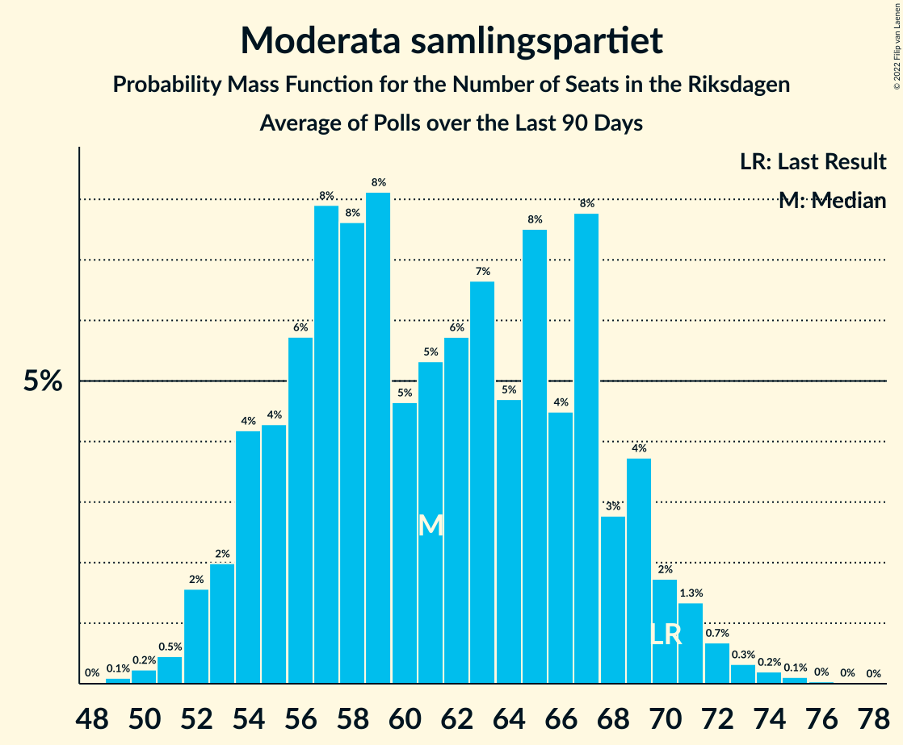

# Poll Average

<a href="#voting-intentions">Voting Intentions</a> | <a href="#seats">Seats</a> | <a href="#coalitions">Coalitions</a> | <a href="#technical-information">Technical Information</a>

## Summary

The table below lists the polls on which the average is based. They are the most recent polls (less than 90 days old) registered and analyzed so far.

| Period     | Polling firm/Commissioner(s) | S | M | SD | C | V | KD | L | MP |
|:----------:|:----------------------------:|:--:|:--:|:--:|:--:|:--:|:--:|:--:|:--:|
| 9 September 2018 | General Election | 28.3%   100 | 19.8%   70 | 17.5%   62 | 8.6%   31 | 8.0%   28 | 6.3%   22 | 5.5%   20 | 4.4%   16 |
| N/A | Poll Average | 27–33%   98–120 | 16–20%   58–74 | 17–24%   60–87 | 6–9%   22–34 | 7–9%   25–34 | 5–9%   18–33 | 3–5%   0–19 | 3–5%   0–18 |
| [2–8 January 2019](2019-01-08-Demoskop.html) | Demoskop   Expressen | 28–33%   101–122 | 15–19%   55–70 | 18–22%   64–80 | 6–8%   22–29 | 7–9%   25–33 | 6–9%   23–33 | 4–6%   0–20 | 3–5%   0–17 |
| [19–26 December 2018](2018-12-26-Inizio.html) | Inizio   Aftonbladet | 28–32%   102–117 | 17–20%   61–74 | 17–20%   64–76 | 7–10%   28–36 | 7–9%   25–32 | 7–9%   26–34 | 3–4%   0 | 3–5%   0–19 |
| [12 November–16 December 2018](2018-12-16-Novus.html) | Novus   SVT | 29–31%   101–118 | 17–19%   62–73 | 19–21%   67–81 | 8–9%   28–35 | 7–8%   25–32 | 6–7%   21–26 | 3–4%   0–16 | 4–5%   0–17 |
| [5–16 December 2018](2018-12-16-Ipsos.html) | Ipsos   Dagens Nyheter | 30–34%   108–127 | 16–20%   57–74 | 16–20%   57–73 | 6–8%   21–30 | 7–9%   25–34 | 7–9%   24–36 | 3–5%   0–16 | 3–5%   0–18 |
| [3–13 December 2018](2018-12-13-Sifo.html) | Sifo   Svenska Dagbladet | 29–31%   102–116 | 18–20%   64–74 | 19–21%   68–77 | 7–8%   26–31 | 7–8%   25–31 | 6–7%   22–26 | 4%   0–16 | 4–5%   0–17 |
| [29 November–3 December 2018](2018-12-03-Sentio.html) | Sentio   Nyheter Idag | 26–31%   93–117 | 16–20%   57–76 | 20–25%   72–94 | 5–9%   20–32 | 7–10%   24–37 | 5–8%   17–29 | 3–6%   0–20 | 3–5%   0–19 |
| [29 October–27 November 2018](2018-11-27-SCB.html) | SCB | 29–32%   105–116 | 18–20%   65–74 | 17–19%   62–73 | 8–9%   28–34 | 8–9%   28–34 | 5–6%   17–22 | 4–5%   0–17 | 3–5%   0–16 |
| 9 September 2018 | General Election | 28.3%   100 | 19.8%   70 | 17.5%   62 | 8.6%   31 | 8.0%   28 | 6.3%   22 | 5.5%   20 | 4.4%   16 |

Only polls for which at least the sample size has been published are included in the table above.

**Legend:**
+ **Top half of each row:** Voting intentions (95% confidence interval)
+ **Bottom half of each row:** Seat projections for the Riksdagen (95% confidence interval)
+ **S:** Sveriges socialdemokratiska arbetareparti
+ **M:** Moderata samlingspartiet
+ **SD:** Sverigedemokraterna
+ **C:** Centerpartiet
+ **V:** Vänsterpartiet
+ **KD:** Kristdemokraterna
+ **L:** Liberalerna
+ **MP:** Miljöpartiet de gröna
+ **N/A (single party):** Party not included the published results
+ **N/A (entire row):** Calculation for this opinion poll not started yet

## Voting Intentions

### Confidence Intervals

| Party | Last Result | Median | 80% Confidence Interval | 90% Confidence Interval | 95% Confidence Interval | 99% Confidence Interval |
|:-----:|:-----------:|:------:|:-----------------------:|:-----------------------:|:-----------------------:|:-----------------------:|
| <a href="#sveriges-socialdemokratiska-arbetareparti">Sveriges socialdemokratiska arbetareparti</a> | 28.3% | 30.1% | 28.5–31.8% |27.8–32.6% | 27.1–33.2% | 25.9–34.2% |
| <a href="#moderata-samlingspartiet">Moderata samlingspartiet</a> | 19.8% | 18.4% | 16.9–19.5% |16.4–19.8% | 16.0–20.1% | 15.3–20.6% |
| <a href="#sverigedemokraterna">Sverigedemokraterna</a> | 17.5% | 19.5% | 17.8–21.7% |17.4–22.9% | 17.0–23.6% | 16.3–24.8% |
| <a href="#centerpartiet">Centerpartiet</a> | 8.6% | 7.8% | 6.5–8.9% |6.2–9.1% | 5.9–9.3% | 5.5–9.6% |
| <a href="#vänsterpartiet">Vänsterpartiet</a> | 8.0% | 7.9% | 7.2–8.8% |7.0–9.1% | 6.8–9.3% | 6.4–9.9% |
| <a href="#kristdemokraterna">Kristdemokraterna</a> | 6.3% | 6.8% | 5.4–8.5% |5.1–8.8% | 5.0–9.1% | 4.7–9.6% |
| <a href="#liberalerna">Liberalerna</a> | 5.5% | 4.0% | 3.3–4.8% |3.1–5.0% | 2.9–5.3% | 2.6–5.7% |
| <a href="#miljöpartiet-de-gröna">Miljöpartiet de gröna</a> | 4.4% | 4.1% | 3.5–4.6% |3.3–4.7% | 3.1–4.9% | 2.8–5.3% |

### Sveriges socialdemokratiska arbetareparti

*For a full overview of the results for this party, see the [Sveriges socialdemokratiska arbetareparti](party-sverigessocialdemokratiskaarbetareparti.html) page.*

| Voting Intentions | Probability | Accumulated | Special Marks |
|:-----------------:|:-----------:|:-----------:|:-------------:|
| 23.5–24.5% | 0% | 100% |  |
| 24.5–25.5% | 0.2% | 100% |  |
| 25.5–26.5% | 1.0% | 99.7% |  |
| 26.5–27.5% | 3% | 98.8% |  |
| 27.5–28.5% | 6% | 96% | Last Result |
| 28.5–29.5% | 21% | 90% |  |
| 29.5–30.5% | 36% | 69% | Median |
| 30.5–31.5% | 20% | 33% |  |
| 31.5–32.5% | 8% | 13% |  |
| 32.5–33.5% | 4% | 5% |  |
| 33.5–34.5% | 1.2% | 1.5% |  |
| 34.5–35.5% | 0.2% | 0.3% |  |
| 35.5–36.5% | 0% | 0% |  |

### Moderata samlingspartiet

*For a full overview of the results for this party, see the [Moderata samlingspartiet](party-moderatasamlingspartiet.html) page.*

| Voting Intentions | Probability | Accumulated | Special Marks |
|:-----------------:|:-----------:|:-----------:|:-------------:|
| 13.5–14.5% | 0% | 100% |  |
| 14.5–15.5% | 0.8% | 100% |  |
| 15.5–16.5% | 5% | 99.1% |  |
| 16.5–17.5% | 16% | 94% |  |
| 17.5–18.5% | 33% | 78% | Median |
| 18.5–19.5% | 36% | 45% |  |
| 19.5–20.5% | 8% | 9% | Last Result |
| 20.5–21.5% | 0.6% | 0.6% |  |
| 21.5–22.5% | 0% | 0% |  |

### Sverigedemokraterna

*For a full overview of the results for this party, see the [Sverigedemokraterna](party-sverigedemokraterna.html) page.*

| Voting Intentions | Probability | Accumulated | Special Marks |
|:-----------------:|:-----------:|:-----------:|:-------------:|
| 14.5–15.5% | 0.1% | 100% |  |
| 15.5–16.5% | 0.8% | 99.9% |  |
| 16.5–17.5% | 6% | 99.1% |  |
| 17.5–18.5% | 20% | 94% | Last Result |
| 18.5–19.5% | 26% | 73% | Median |
| 19.5–20.5% | 28% | 47% |  |
| 20.5–21.5% | 8% | 19% |  |
| 21.5–22.5% | 5% | 11% |  |
| 22.5–23.5% | 4% | 6% |  |
| 23.5–24.5% | 2% | 3% |  |
| 24.5–25.5% | 0.6% | 0.7% |  |
| 25.5–26.5% | 0.1% | 0.1% |  |
| 26.5–27.5% | 0% | 0% |  |

### Centerpartiet

*For a full overview of the results for this party, see the [Centerpartiet](party-centerpartiet.html) page.*

| Voting Intentions | Probability | Accumulated | Special Marks |
|:-----------------:|:-----------:|:-----------:|:-------------:|
| 3.5–4.5% | 0% | 100% |  |
| 4.5–5.5% | 0.7% | 100% |  |
| 5.5–6.5% | 11% | 99.3% |  |
| 6.5–7.5% | 27% | 88% |  |
| 7.5–8.5% | 38% | 61% | Median |
| 8.5–9.5% | 22% | 23% | Last Result |
| 9.5–10.5% | 0.8% | 0.8% |  |
| 10.5–11.5% | 0% | 0% |  |

### Vänsterpartiet

*For a full overview of the results for this party, see the [Vänsterpartiet](party-vänsterpartiet.html) page.*

| Voting Intentions | Probability | Accumulated | Special Marks |
|:-----------------:|:-----------:|:-----------:|:-------------:|
| 4.5–5.5% | 0% | 100% |  |
| 5.5–6.5% | 0.9% | 100% |  |
| 6.5–7.5% | 24% | 99.1% |  |
| 7.5–8.5% | 58% | 75% | Last Result, Median |
| 8.5–9.5% | 16% | 17% |  |
| 9.5–10.5% | 1.2% | 1.2% |  |
| 10.5–11.5% | 0.1% | 0.1% |  |
| 11.5–12.5% | 0% | 0% |  |

### Kristdemokraterna

*For a full overview of the results for this party, see the [Kristdemokraterna](party-kristdemokraterna.html) page.*

| Voting Intentions | Probability | Accumulated | Special Marks |
|:-----------------:|:-----------:|:-----------:|:-------------:|
| 2.5–3.5% | 0% | 100% |  |
| 3.5–4.5% | 0.2% | 100% |  |
| 4.5–5.5% | 13% | 99.8% |  |
| 5.5–6.5% | 25% | 86% | Last Result |
| 6.5–7.5% | 28% | 61% | Median |
| 7.5–8.5% | 24% | 33% |  |
| 8.5–9.5% | 8% | 9% |  |
| 9.5–10.5% | 0.5% | 0.5% |  |
| 10.5–11.5% | 0% | 0% |  |

### Liberalerna

*For a full overview of the results for this party, see the [Liberalerna](party-liberalerna.html) page.*

| Voting Intentions | Probability | Accumulated | Special Marks |
|:-----------------:|:-----------:|:-----------:|:-------------:|
| 0.5–1.5% | 0% | 100% |  |
| 1.5–2.5% | 0.3% | 100% |  |
| 2.5–3.5% | 17% | 99.7% |  |
| 3.5–4.5% | 66% | 83% | Median |
| 4.5–5.5% | 16% | 17% | Last Result |
| 5.5–6.5% | 0.9% | 0.9% |  |
| 6.5–7.5% | 0% | 0% |  |

### Miljöpartiet de gröna

*For a full overview of the results for this party, see the [Miljöpartiet de gröna](party-miljöpartietdegröna.html) page.*

| Voting Intentions | Probability | Accumulated | Special Marks |
|:-----------------:|:-----------:|:-----------:|:-------------:|
| 1.5–2.5% | 0.1% | 100% |  |
| 2.5–3.5% | 12% | 99.9% |  |
| 3.5–4.5% | 78% | 88% | Last Result, Median |
| 4.5–5.5% | 10% | 10% |  |
| 5.5–6.5% | 0.2% | 0.2% |  |
| 6.5–7.5% | 0% | 0% |  |

## Seats

### Confidence Intervals

| Party | Last Result | Median | 80% Confidence Interval | 90% Confidence Interval | 95% Confidence Interval | 99% Confidence Interval |
|:-----:|:-----------:|:------:|:-----------------------:|:-----------------------:|:-----------------------:|:-----------------------:|
| <a href="#sveriges-socialdemokratiska-arbetareparti">Sveriges socialdemokratiska arbetareparti</a> | 100 | 110 | 103–117 |101–118 | 98–120 | 94–126 |
| <a href="#moderata-samlingspartiet">Moderata samlingspartiet</a> | 70 | 67 | 62–71 |60–73 | 58–74 | 55–77 |
| <a href="#sverigedemokraterna">Sverigedemokraterna</a> | 62 | 71 | 64–80 |62–84 | 60–87 | 59–93 |
| <a href="#centerpartiet">Centerpartiet</a> | 31 | 28 | 24–32 |23–33 | 22–34 | 20–36 |
| <a href="#vänsterpartiet">Vänsterpartiet</a> | 28 | 29 | 26–32 |25–33 | 25–34 | 23–37 |
| <a href="#kristdemokraterna">Kristdemokraterna</a> | 22 | 25 | 19–31 |18–32 | 18–33 | 17–36 |
| <a href="#liberalerna">Liberalerna</a> | 20 | 15 | 0–17 |0–18 | 0–19 | 0–20 |
| <a href="#miljöpartiet-de-gröna">Miljöpartiet de gröna</a> | 16 | 15 | 0–17 |0–17 | 0–18 | 0–19 |

### Sveriges socialdemokratiska arbetareparti

*For a full overview of the results for this party, see the [Sveriges socialdemokratiska arbetareparti](party-sverigessocialdemokratiskaarbetareparti.html) page.*

| Number of Seats | Probability | Accumulated | Special Marks |
|:---------------:|:-----------:|:-----------:|:-------------:|
| 89 | 0% | 100% |  |
| 90 | 0% | 99.9% |  |
| 91 | 0.1% | 99.9% |  |
| 92 | 0.1% | 99.8% |  |
| 93 | 0.1% | 99.7% |  |
| 94 | 0.2% | 99.6% |  |
| 95 | 0.4% | 99.4% |  |
| 96 | 0.3% | 99.0% |  |
| 97 | 0.5% | 98.6% |  |
| 98 | 0.6% | 98% |  |
| 99 | 0.4% | 97% |  |
| 100 | 1.3% | 97% | Last Result |
| 101 | 2% | 96% |  |
| 102 | 3% | 94% |  |
| 103 | 2% | 91% |  |
| 104 | 4% | 89% |  |
| 105 | 4% | 84% |  |
| 106 | 7% | 80% |  |
| 107 | 5% | 73% |  |
| 108 | 7% | 67% |  |
| 109 | 10% | 60% |  |
| 110 | 8% | 50% | Median |
| 111 | 10% | 42% |  |
| 112 | 7% | 32% |  |
| 113 | 6% | 25% |  |
| 114 | 2% | 20% |  |
| 115 | 3% | 17% |  |
| 116 | 2% | 14% |  |
| 117 | 6% | 12% |  |
| 118 | 1.1% | 6% |  |
| 119 | 0.9% | 5% |  |
| 120 | 2% | 4% |  |
| 121 | 0.4% | 2% |  |
| 122 | 0.8% | 2% |  |
| 123 | 0.2% | 1.2% |  |
| 124 | 0.1% | 1.1% |  |
| 125 | 0.3% | 1.0% |  |
| 126 | 0.2% | 0.7% |  |
| 127 | 0.2% | 0.5% |  |
| 128 | 0.1% | 0.3% |  |
| 129 | 0% | 0.2% |  |
| 130 | 0.1% | 0.2% |  |
| 131 | 0% | 0.1% |  |
| 132 | 0% | 0.1% |  |
| 133 | 0.1% | 0.1% |  |
| 134 | 0% | 0% |  |

### Moderata samlingspartiet

*For a full overview of the results for this party, see the [Moderata samlingspartiet](party-moderatasamlingspartiet.html) page.*

| Number of Seats | Probability | Accumulated | Special Marks |
|:---------------:|:-----------:|:-----------:|:-------------:|
| 53 | 0% | 100% |  |
| 54 | 0.1% | 99.9% |  |
| 55 | 0.4% | 99.8% |  |
| 56 | 0.5% | 99.4% |  |
| 57 | 1.4% | 98.9% |  |
| 58 | 1.0% | 98% |  |
| 59 | 0.8% | 97% |  |
| 60 | 2% | 96% |  |
| 61 | 4% | 94% |  |
| 62 | 3% | 90% |  |
| 63 | 5% | 87% |  |
| 64 | 4% | 82% |  |
| 65 | 10% | 78% |  |
| 66 | 9% | 68% |  |
| 67 | 19% | 59% | Median |
| 68 | 8% | 40% |  |
| 69 | 11% | 32% |  |
| 70 | 7% | 21% | Last Result |
| 71 | 5% | 14% |  |
| 72 | 2% | 8% |  |
| 73 | 2% | 6% |  |
| 74 | 2% | 4% |  |
| 75 | 0.6% | 2% |  |
| 76 | 0.3% | 1.0% |  |
| 77 | 0.3% | 0.6% |  |
| 78 | 0.2% | 0.4% |  |
| 79 | 0.1% | 0.2% |  |
| 80 | 0% | 0.1% |  |
| 81 | 0% | 0% |  |

### Sverigedemokraterna

*For a full overview of the results for this party, see the [Sverigedemokraterna](party-sverigedemokraterna.html) page.*

| Number of Seats | Probability | Accumulated | Special Marks |
|:---------------:|:-----------:|:-----------:|:-------------:|
| 56 | 0% | 100% |  |
| 57 | 0.3% | 99.9% |  |
| 58 | 0.1% | 99.6% |  |
| 59 | 0.2% | 99.6% |  |
| 60 | 4% | 99.3% |  |
| 61 | 0.3% | 96% |  |
| 62 | 2% | 95% | Last Result |
| 63 | 2% | 94% |  |
| 64 | 2% | 92% |  |
| 65 | 3% | 90% |  |
| 66 | 8% | 86% |  |
| 67 | 3% | 78% |  |
| 68 | 5% | 76% |  |
| 69 | 8% | 71% |  |
| 70 | 10% | 62% |  |
| 71 | 9% | 52% | Median |
| 72 | 8% | 43% |  |
| 73 | 5% | 35% |  |
| 74 | 6% | 30% |  |
| 75 | 5% | 24% |  |
| 76 | 3% | 19% |  |
| 77 | 2% | 16% |  |
| 78 | 2% | 14% |  |
| 79 | 1.5% | 12% |  |
| 80 | 2% | 11% |  |
| 81 | 1.0% | 9% |  |
| 82 | 1.0% | 8% |  |
| 83 | 0.8% | 7% |  |
| 84 | 1.4% | 6% |  |
| 85 | 0.9% | 5% |  |
| 86 | 0.6% | 4% |  |
| 87 | 1.0% | 3% |  |
| 88 | 0.6% | 2% |  |
| 89 | 0.4% | 1.5% |  |
| 90 | 0.2% | 1.1% |  |
| 91 | 0.2% | 0.9% |  |
| 92 | 0.2% | 0.7% |  |
| 93 | 0.1% | 0.5% |  |
| 94 | 0.1% | 0.4% |  |
| 95 | 0.1% | 0.3% |  |
| 96 | 0% | 0.2% |  |
| 97 | 0.1% | 0.1% |  |
| 98 | 0% | 0.1% |  |
| 99 | 0% | 0% |  |

### Centerpartiet

*For a full overview of the results for this party, see the [Centerpartiet](party-centerpartiet.html) page.*

| Number of Seats | Probability | Accumulated | Special Marks |
|:---------------:|:-----------:|:-----------:|:-------------:|
| 18 | 0.1% | 100% |  |
| 19 | 0.2% | 99.9% |  |
| 20 | 0.4% | 99.7% |  |
| 21 | 1.1% | 99.3% |  |
| 22 | 2% | 98% |  |
| 23 | 3% | 96% |  |
| 24 | 7% | 93% |  |
| 25 | 6% | 85% |  |
| 26 | 13% | 79% |  |
| 27 | 8% | 65% |  |
| 28 | 9% | 58% | Median |
| 29 | 9% | 49% |  |
| 30 | 7% | 40% |  |
| 31 | 11% | 32% | Last Result |
| 32 | 13% | 21% |  |
| 33 | 4% | 8% |  |
| 34 | 3% | 5% |  |
| 35 | 0.7% | 2% |  |
| 36 | 0.7% | 1.0% |  |
| 37 | 0.2% | 0.3% |  |
| 38 | 0.1% | 0.1% |  |
| 39 | 0% | 0% |  |

### Vänsterpartiet

*For a full overview of the results for this party, see the [Vänsterpartiet](party-vänsterpartiet.html) page.*

| Number of Seats | Probability | Accumulated | Special Marks |
|:---------------:|:-----------:|:-----------:|:-------------:|
| 21 | 0% | 100% |  |
| 22 | 0.1% | 99.9% |  |
| 23 | 0.4% | 99.8% |  |
| 24 | 1.0% | 99.4% |  |
| 25 | 5% | 98% |  |
| 26 | 7% | 93% |  |
| 27 | 10% | 86% |  |
| 28 | 21% | 76% | Last Result |
| 29 | 14% | 56% | Median |
| 30 | 17% | 41% |  |
| 31 | 8% | 25% |  |
| 32 | 9% | 17% |  |
| 33 | 5% | 8% |  |
| 34 | 2% | 4% |  |
| 35 | 0.8% | 2% |  |
| 36 | 0.5% | 1.1% |  |
| 37 | 0.4% | 0.6% |  |
| 38 | 0.1% | 0.2% |  |
| 39 | 0.1% | 0.1% |  |
| 40 | 0% | 0.1% |  |
| 41 | 0% | 0% |  |

### Kristdemokraterna

*For a full overview of the results for this party, see the [Kristdemokraterna](party-kristdemokraterna.html) page.*

| Number of Seats | Probability | Accumulated | Special Marks |
|:---------------:|:-----------:|:-----------:|:-------------:|
| 16 | 0.3% | 100% |  |
| 17 | 1.4% | 99.7% |  |
| 18 | 5% | 98% |  |
| 19 | 4% | 93% |  |
| 20 | 5% | 89% |  |
| 21 | 4% | 84% |  |
| 22 | 8% | 81% | Last Result |
| 23 | 12% | 73% |  |
| 24 | 8% | 61% |  |
| 25 | 8% | 52% | Median |
| 26 | 6% | 44% |  |
| 27 | 7% | 38% |  |
| 28 | 6% | 32% |  |
| 29 | 4% | 25% |  |
| 30 | 7% | 21% |  |
| 31 | 7% | 14% |  |
| 32 | 3% | 6% |  |
| 33 | 2% | 3% |  |
| 34 | 0.5% | 1.3% |  |
| 35 | 0.1% | 0.7% |  |
| 36 | 0.4% | 0.6% |  |
| 37 | 0.1% | 0.2% |  |
| 38 | 0% | 0.1% |  |
| 39 | 0% | 0% |  |

### Liberalerna

*For a full overview of the results for this party, see the [Liberalerna](party-liberalerna.html) page.*

| Number of Seats | Probability | Accumulated | Special Marks |
|:---------------:|:-----------:|:-----------:|:-------------:|
| 0 | 40% | 100% |  |
| 1 | 0% | 60% |  |
| 2 | 0% | 60% |  |
| 3 | 0% | 60% |  |
| 4 | 0% | 60% |  |
| 5 | 0% | 60% |  |
| 6 | 0% | 60% |  |
| 7 | 0% | 60% |  |
| 8 | 0% | 60% |  |
| 9 | 0% | 60% |  |
| 10 | 0% | 60% |  |
| 11 | 0% | 60% |  |
| 12 | 0% | 60% |  |
| 13 | 0% | 60% |  |
| 14 | 5% | 60% |  |
| 15 | 20% | 55% | Median |
| 16 | 20% | 35% |  |
| 17 | 6% | 15% |  |
| 18 | 4% | 9% |  |
| 19 | 3% | 5% |  |
| 20 | 1.1% | 2% | Last Result |
| 21 | 0.2% | 0.5% |  |
| 22 | 0.2% | 0.3% |  |
| 23 | 0.1% | 0.1% |  |
| 24 | 0% | 0% |  |

### Miljöpartiet de gröna

*For a full overview of the results for this party, see the [Miljöpartiet de gröna](party-miljöpartietdegröna.html) page.*

| Number of Seats | Probability | Accumulated | Special Marks |
|:---------------:|:-----------:|:-----------:|:-------------:|
| 0 | 41% | 100% |  |
| 1 | 0% | 59% |  |
| 2 | 0% | 59% |  |
| 3 | 0% | 59% |  |
| 4 | 0% | 59% |  |
| 5 | 0% | 59% |  |
| 6 | 0% | 59% |  |
| 7 | 0% | 59% |  |
| 8 | 0% | 59% |  |
| 9 | 0% | 59% |  |
| 10 | 0% | 59% |  |
| 11 | 0% | 59% |  |
| 12 | 0% | 59% |  |
| 13 | 0% | 59% |  |
| 14 | 8% | 59% |  |
| 15 | 25% | 51% | Median |
| 16 | 15% | 26% | Last Result |
| 17 | 8% | 11% |  |
| 18 | 2% | 4% |  |
| 19 | 1.0% | 1.3% |  |
| 20 | 0.2% | 0.3% |  |
| 21 | 0.1% | 0.1% |  |
| 22 | 0% | 0% |  |

## Coalitions

### Confidence Intervals

| Coalition | Last Result | Median | Majority? | 80% Confidence Interval | 90% Confidence Interval | 95% Confidence Interval | 99% Confidence Interval |
|:---------:|:-----------:|:------:|:---------:|:-----------------------:|:-----------------------:|:-----------------------:|:-----------------------:|
| Sveriges socialdemokratiska arbetareparti – Moderata samlingspartiet – Centerpartiet | 201 | 205 | 100% | 195–215 | 191–218 | 187–220 | 182–225 |
| Sveriges socialdemokratiska arbetareparti – Centerpartiet – Vänsterpartiet – Liberalerna – Miljöpartiet de gröna | 195 | 186 | 92% | 176–195 | 173–198 | 170–199 | 163–202 |
| Sveriges socialdemokratiska arbetareparti – Moderata samlingspartiet | 170 | 176 | 60% | 168–184 | 165–188 | 162–190 | 157–193 |
| Moderata samlingspartiet – Sverigedemokraterna – Kristdemokraterna | 154 | 163 | 8% | 154–173 | 151–176 | 150–179 | 147–186 |
| Sveriges socialdemokratiska arbetareparti – Centerpartiet – Liberalerna – Miljöpartiet de gröna | 167 | 157 | 0.2% | 145–167 | 143–169 | 140–169 | 133–172 |
| Sveriges socialdemokratiska arbetareparti – Vänsterpartiet – Miljöpartiet de gröna | 144 | 148 | 0% | 139–156 | 136–159 | 133–161 | 128–166 |
| Moderata samlingspartiet – Sverigedemokraterna | 132 | 138 | 0% | 130–148 | 126–152 | 125–154 | 120–162 |
| Sveriges socialdemokratiska arbetareparti – Vänsterpartiet | 128 | 138 | 0% | 131–147 | 129–149 | 127–151 | 123–158 |
| Moderata samlingspartiet – Centerpartiet – Kristdemokraterna – Liberalerna | 143 | 131 | 0% | 121–137 | 118–139 | 115–140 | 111–143 |
| Moderata samlingspartiet – Centerpartiet – Kristdemokraterna | 123 | 120 | 0% | 113–129 | 110–132 | 107–132 | 103–137 |
| Sveriges socialdemokratiska arbetareparti – Miljöpartiet de gröna | 116 | 120 | 0% | 109–128 | 107–129 | 103–132 | 99–136 |
| Moderata samlingspartiet – Centerpartiet – Liberalerna | 121 | 105 | 0% | 95–115 | 93–117 | 90–117 | 85–120 |
| Moderata samlingspartiet – Centerpartiet | 101 | 95 | 0% | 87–102 | 85–104 | 83–105 | 80–108 |

### Sveriges socialdemokratiska arbetareparti – Moderata samlingspartiet – Centerpartiet

| Number of Seats | Probability | Accumulated | Special Marks |
|:---------------:|:-----------:|:-----------:|:-------------:|
| 176 | 0% | 100% |  |
| 177 | 0% | 99.9% |  |
| 178 | 0.1% | 99.9% |  |
| 179 | 0.1% | 99.8% |  |
| 180 | 0.1% | 99.8% |  |
| 181 | 0.1% | 99.7% |  |
| 182 | 0.2% | 99.5% |  |
| 183 | 0.5% | 99.3% |  |
| 184 | 0.2% | 98.9% |  |
| 185 | 0.3% | 98.6% |  |
| 186 | 0.4% | 98% |  |
| 187 | 0.6% | 98% |  |
| 188 | 0.5% | 97% |  |
| 189 | 0.4% | 97% |  |
| 190 | 0.9% | 96% |  |
| 191 | 0.6% | 96% |  |
| 192 | 1.0% | 95% |  |
| 193 | 1.2% | 94% |  |
| 194 | 2% | 93% |  |
| 195 | 3% | 91% |  |
| 196 | 2% | 88% |  |
| 197 | 4% | 86% |  |
| 198 | 5% | 82% |  |
| 199 | 4% | 78% |  |
| 200 | 2% | 74% |  |
| 201 | 4% | 72% | Last Result |
| 202 | 5% | 67% |  |
| 203 | 5% | 62% |  |
| 204 | 3% | 57% |  |
| 205 | 5% | 55% | Median |
| 206 | 7% | 49% |  |
| 207 | 11% | 42% |  |
| 208 | 5% | 31% |  |
| 209 | 2% | 27% |  |
| 210 | 2% | 25% |  |
| 211 | 3% | 23% |  |
| 212 | 1.3% | 20% |  |
| 213 | 7% | 19% |  |
| 214 | 0.7% | 12% |  |
| 215 | 3% | 11% |  |
| 216 | 2% | 8% |  |
| 217 | 0.4% | 6% |  |
| 218 | 1.1% | 6% |  |
| 219 | 1.2% | 4% |  |
| 220 | 0.8% | 3% |  |
| 221 | 0.7% | 2% |  |
| 222 | 0.4% | 2% |  |
| 223 | 0.6% | 1.2% |  |
| 224 | 0.1% | 0.6% |  |
| 225 | 0.3% | 0.5% |  |
| 226 | 0.2% | 0.2% |  |
| 227 | 0% | 0.1% |  |
| 228 | 0% | 0.1% |  |
| 229 | 0% | 0% |  |

### Sveriges socialdemokratiska arbetareparti – Centerpartiet – Vänsterpartiet – Liberalerna – Miljöpartiet de gröna

| Number of Seats | Probability | Accumulated | Special Marks |
|:---------------:|:-----------:|:-----------:|:-------------:|
| 156 | 0% | 100% |  |
| 157 | 0% | 99.9% |  |
| 158 | 0% | 99.9% |  |
| 159 | 0.1% | 99.9% |  |
| 160 | 0% | 99.8% |  |
| 161 | 0.1% | 99.8% |  |
| 162 | 0.1% | 99.7% |  |
| 163 | 0.2% | 99.6% |  |
| 164 | 0.1% | 99.4% |  |
| 165 | 0.2% | 99.3% |  |
| 166 | 0.2% | 99.1% |  |
| 167 | 0.2% | 98.8% |  |
| 168 | 0.3% | 98.7% |  |
| 169 | 0.6% | 98% |  |
| 170 | 0.6% | 98% |  |
| 171 | 0.8% | 97% |  |
| 172 | 1.2% | 96% |  |
| 173 | 2% | 95% |  |
| 174 | 2% | 93% |  |
| 175 | 1.1% | 92% | Majority |
| 176 | 2% | 91% |  |
| 177 | 3% | 89% |  |
| 178 | 3% | 86% |  |
| 179 | 4% | 83% |  |
| 180 | 3% | 79% |  |
| 181 | 2% | 76% |  |
| 182 | 7% | 74% |  |
| 183 | 3% | 68% |  |
| 184 | 6% | 65% |  |
| 185 | 7% | 59% |  |
| 186 | 3% | 52% |  |
| 187 | 3% | 49% |  |
| 188 | 10% | 46% |  |
| 189 | 7% | 36% |  |
| 190 | 6% | 30% |  |
| 191 | 5% | 24% |  |
| 192 | 0.9% | 19% |  |
| 193 | 2% | 18% |  |
| 194 | 2% | 16% |  |
| 195 | 5% | 14% | Last Result |
| 196 | 1.1% | 9% |  |
| 197 | 0.7% | 8% | Median |
| 198 | 4% | 8% |  |
| 199 | 1.1% | 3% |  |
| 200 | 1.2% | 2% |  |
| 201 | 0.4% | 1.0% |  |
| 202 | 0.4% | 0.7% |  |
| 203 | 0.1% | 0.3% |  |
| 204 | 0.1% | 0.2% |  |
| 205 | 0% | 0.1% |  |
| 206 | 0.1% | 0.1% |  |
| 207 | 0% | 0% |  |

### Sveriges socialdemokratiska arbetareparti – Moderata samlingspartiet

| Number of Seats | Probability | Accumulated | Special Marks |
|:---------------:|:-----------:|:-----------:|:-------------:|
| 151 | 0% | 100% |  |
| 152 | 0% | 99.9% |  |
| 153 | 0.1% | 99.9% |  |
| 154 | 0.1% | 99.9% |  |
| 155 | 0.1% | 99.8% |  |
| 156 | 0.1% | 99.7% |  |
| 157 | 0.1% | 99.6% |  |
| 158 | 0.3% | 99.4% |  |
| 159 | 0.4% | 99.2% |  |
| 160 | 0.2% | 98.8% |  |
| 161 | 0.6% | 98.6% |  |
| 162 | 0.6% | 98% |  |
| 163 | 0.5% | 97% |  |
| 164 | 0.9% | 97% |  |
| 165 | 1.1% | 96% |  |
| 166 | 2% | 95% |  |
| 167 | 1.4% | 93% |  |
| 168 | 2% | 92% |  |
| 169 | 2% | 89% |  |
| 170 | 3% | 87% | Last Result |
| 171 | 6% | 84% |  |
| 172 | 3% | 78% |  |
| 173 | 8% | 75% |  |
| 174 | 7% | 67% |  |
| 175 | 3% | 60% | Majority |
| 176 | 10% | 57% |  |
| 177 | 4% | 46% | Median |
| 178 | 6% | 42% |  |
| 179 | 3% | 37% |  |
| 180 | 4% | 33% |  |
| 181 | 8% | 29% |  |
| 182 | 7% | 21% |  |
| 183 | 3% | 14% |  |
| 184 | 2% | 11% |  |
| 185 | 0.7% | 9% |  |
| 186 | 1.1% | 8% |  |
| 187 | 2% | 7% |  |
| 188 | 1.2% | 5% |  |
| 189 | 1.4% | 4% |  |
| 190 | 0.7% | 3% |  |
| 191 | 0.3% | 2% |  |
| 192 | 0.3% | 2% |  |
| 193 | 0.8% | 1.2% |  |
| 194 | 0% | 0.4% |  |
| 195 | 0.1% | 0.4% |  |
| 196 | 0.1% | 0.3% |  |
| 197 | 0.1% | 0.3% |  |
| 198 | 0% | 0.2% |  |
| 199 | 0% | 0.1% |  |
| 200 | 0.1% | 0.1% |  |
| 201 | 0% | 0% |  |

### Moderata samlingspartiet – Sverigedemokraterna – Kristdemokraterna

| Number of Seats | Probability | Accumulated | Special Marks |
|:---------------:|:-----------:|:-----------:|:-------------:|
| 143 | 0.1% | 100% |  |
| 144 | 0% | 99.9% |  |
| 145 | 0.1% | 99.9% |  |
| 146 | 0.1% | 99.8% |  |
| 147 | 0.4% | 99.7% |  |
| 148 | 0.4% | 99.3% |  |
| 149 | 1.2% | 99.0% |  |
| 150 | 1.1% | 98% |  |
| 151 | 4% | 97% |  |
| 152 | 0.7% | 92% |  |
| 153 | 1.1% | 92% |  |
| 154 | 5% | 91% | Last Result |
| 155 | 2% | 86% |  |
| 156 | 2% | 84% |  |
| 157 | 0.9% | 82% |  |
| 158 | 5% | 81% |  |
| 159 | 6% | 76% |  |
| 160 | 7% | 70% |  |
| 161 | 10% | 64% |  |
| 162 | 3% | 54% |  |
| 163 | 3% | 51% | Median |
| 164 | 7% | 48% |  |
| 165 | 6% | 41% |  |
| 166 | 3% | 35% |  |
| 167 | 7% | 32% |  |
| 168 | 2% | 26% |  |
| 169 | 3% | 24% |  |
| 170 | 4% | 21% |  |
| 171 | 3% | 17% |  |
| 172 | 3% | 14% |  |
| 173 | 2% | 11% |  |
| 174 | 1.1% | 9% |  |
| 175 | 2% | 8% | Majority |
| 176 | 2% | 7% |  |
| 177 | 1.2% | 5% |  |
| 178 | 0.8% | 4% |  |
| 179 | 0.6% | 3% |  |
| 180 | 0.6% | 2% |  |
| 181 | 0.3% | 2% |  |
| 182 | 0.2% | 1.3% |  |
| 183 | 0.2% | 1.1% |  |
| 184 | 0.2% | 0.9% |  |
| 185 | 0.1% | 0.7% |  |
| 186 | 0.2% | 0.6% |  |
| 187 | 0.1% | 0.4% |  |
| 188 | 0.1% | 0.3% |  |
| 189 | 0% | 0.2% |  |
| 190 | 0.1% | 0.2% |  |
| 191 | 0% | 0.1% |  |
| 192 | 0% | 0.1% |  |
| 193 | 0% | 0.1% |  |
| 194 | 0% | 0% |  |

### Sveriges socialdemokratiska arbetareparti – Centerpartiet – Liberalerna – Miljöpartiet de gröna

| Number of Seats | Probability | Accumulated | Special Marks |
|:---------------:|:-----------:|:-----------:|:-------------:|
| 125 | 0% | 100% |  |
| 126 | 0.1% | 99.9% |  |
| 127 | 0% | 99.9% |  |
| 128 | 0% | 99.8% |  |
| 129 | 0% | 99.8% |  |
| 130 | 0.1% | 99.8% |  |
| 131 | 0.1% | 99.7% |  |
| 132 | 0.1% | 99.6% |  |
| 133 | 0.2% | 99.5% |  |
| 134 | 0.1% | 99.3% |  |
| 135 | 0.1% | 99.2% |  |
| 136 | 0.2% | 99.1% |  |
| 137 | 0.4% | 98.8% |  |
| 138 | 0.4% | 98% |  |
| 139 | 0.5% | 98% |  |
| 140 | 0.5% | 98% |  |
| 141 | 0.6% | 97% |  |
| 142 | 1.3% | 97% |  |
| 143 | 1.3% | 95% |  |
| 144 | 2% | 94% |  |
| 145 | 4% | 92% |  |
| 146 | 2% | 88% |  |
| 147 | 1.4% | 87% |  |
| 148 | 1.3% | 85% |  |
| 149 | 2% | 84% |  |
| 150 | 3% | 82% |  |
| 151 | 4% | 79% |  |
| 152 | 2% | 75% |  |
| 153 | 4% | 74% |  |
| 154 | 5% | 69% |  |
| 155 | 3% | 64% |  |
| 156 | 8% | 61% |  |
| 157 | 4% | 54% |  |
| 158 | 9% | 49% |  |
| 159 | 4% | 41% |  |
| 160 | 6% | 37% |  |
| 161 | 5% | 30% |  |
| 162 | 4% | 26% |  |
| 163 | 3% | 22% |  |
| 164 | 1.4% | 18% |  |
| 165 | 2% | 17% |  |
| 166 | 1.1% | 15% |  |
| 167 | 4% | 14% | Last Result |
| 168 | 2% | 10% | Median |
| 169 | 5% | 8% |  |
| 170 | 0.8% | 2% |  |
| 171 | 0.7% | 2% |  |
| 172 | 0.5% | 0.9% |  |
| 173 | 0.2% | 0.5% |  |
| 174 | 0.1% | 0.3% |  |
| 175 | 0.1% | 0.2% | Majority |
| 176 | 0% | 0.1% |  |
| 177 | 0.1% | 0.1% |  |
| 178 | 0% | 0% |  |

### Sveriges socialdemokratiska arbetareparti – Vänsterpartiet – Miljöpartiet de gröna

| Number of Seats | Probability | Accumulated | Special Marks |
|:---------------:|:-----------:|:-----------:|:-------------:|
| 122 | 0% | 100% |  |
| 123 | 0.1% | 99.9% |  |
| 124 | 0.1% | 99.9% |  |
| 125 | 0.1% | 99.8% |  |
| 126 | 0.1% | 99.8% |  |
| 127 | 0.1% | 99.7% |  |
| 128 | 0.4% | 99.6% |  |
| 129 | 0.2% | 99.2% |  |
| 130 | 0.2% | 99.1% |  |
| 131 | 0.6% | 98.9% |  |
| 132 | 0.7% | 98% |  |
| 133 | 0.5% | 98% |  |
| 134 | 1.1% | 97% |  |
| 135 | 0.9% | 96% |  |
| 136 | 1.0% | 95% |  |
| 137 | 1.4% | 94% |  |
| 138 | 1.2% | 93% |  |
| 139 | 2% | 91% |  |
| 140 | 2% | 89% |  |
| 141 | 3% | 87% |  |
| 142 | 7% | 85% |  |
| 143 | 3% | 77% |  |
| 144 | 5% | 75% | Last Result |
| 145 | 5% | 69% |  |
| 146 | 4% | 64% |  |
| 147 | 8% | 60% |  |
| 148 | 5% | 52% |  |
| 149 | 4% | 47% |  |
| 150 | 6% | 43% |  |
| 151 | 4% | 37% |  |
| 152 | 8% | 33% |  |
| 153 | 6% | 25% |  |
| 154 | 3% | 19% | Median |
| 155 | 3% | 16% |  |
| 156 | 6% | 13% |  |
| 157 | 1.0% | 7% |  |
| 158 | 1.1% | 6% |  |
| 159 | 1.1% | 5% |  |
| 160 | 1.3% | 4% |  |
| 161 | 0.4% | 3% |  |
| 162 | 0.5% | 2% |  |
| 163 | 1.1% | 2% |  |
| 164 | 0.1% | 0.9% |  |
| 165 | 0.1% | 0.8% |  |
| 166 | 0.2% | 0.6% |  |
| 167 | 0% | 0.5% |  |
| 168 | 0.2% | 0.4% |  |
| 169 | 0.1% | 0.2% |  |
| 170 | 0% | 0.1% |  |
| 171 | 0.1% | 0.1% |  |
| 172 | 0% | 0% |  |

### Moderata samlingspartiet – Sverigedemokraterna

| Number of Seats | Probability | Accumulated | Special Marks |
|:---------------:|:-----------:|:-----------:|:-------------:|
| 117 | 0.2% | 100% |  |
| 118 | 0% | 99.8% |  |
| 119 | 0% | 99.8% |  |
| 120 | 0.6% | 99.7% |  |
| 121 | 0.1% | 99.1% |  |
| 122 | 0.3% | 99.0% |  |
| 123 | 0.2% | 98.8% |  |
| 124 | 0.7% | 98.6% |  |
| 125 | 0.4% | 98% |  |
| 126 | 4% | 97% |  |
| 127 | 1.4% | 94% |  |
| 128 | 1.1% | 92% |  |
| 129 | 1.3% | 91% |  |
| 130 | 2% | 90% |  |
| 131 | 2% | 88% |  |
| 132 | 5% | 85% | Last Result |
| 133 | 7% | 80% |  |
| 134 | 7% | 74% |  |
| 135 | 5% | 67% |  |
| 136 | 4% | 62% |  |
| 137 | 5% | 58% |  |
| 138 | 8% | 53% | Median |
| 139 | 6% | 44% |  |
| 140 | 5% | 38% |  |
| 141 | 5% | 34% |  |
| 142 | 6% | 28% |  |
| 143 | 3% | 22% |  |
| 144 | 2% | 20% |  |
| 145 | 3% | 17% |  |
| 146 | 2% | 15% |  |
| 147 | 2% | 12% |  |
| 148 | 1.3% | 10% |  |
| 149 | 1.0% | 9% |  |
| 150 | 1.5% | 8% |  |
| 151 | 0.9% | 7% |  |
| 152 | 1.5% | 6% |  |
| 153 | 0.7% | 4% |  |
| 154 | 1.0% | 3% |  |
| 155 | 0.3% | 2% |  |
| 156 | 0.4% | 2% |  |
| 157 | 0.2% | 2% |  |
| 158 | 0.3% | 2% |  |
| 159 | 0.3% | 1.3% |  |
| 160 | 0.2% | 0.9% |  |
| 161 | 0.1% | 0.7% |  |
| 162 | 0.2% | 0.6% |  |
| 163 | 0.1% | 0.4% |  |
| 164 | 0% | 0.3% |  |
| 165 | 0% | 0.3% |  |
| 166 | 0.1% | 0.2% |  |
| 167 | 0.1% | 0.2% |  |
| 168 | 0% | 0.1% |  |
| 169 | 0% | 0.1% |  |
| 170 | 0% | 0% |  |

### Sveriges socialdemokratiska arbetareparti – Vänsterpartiet

| Number of Seats | Probability | Accumulated | Special Marks |
|:---------------:|:-----------:|:-----------:|:-------------:|
| 117 | 0% | 100% |  |
| 118 | 0% | 99.9% |  |
| 119 | 0% | 99.9% |  |
| 120 | 0.1% | 99.9% |  |
| 121 | 0.1% | 99.8% |  |
| 122 | 0.1% | 99.6% |  |
| 123 | 0.2% | 99.5% |  |
| 124 | 0.3% | 99.3% |  |
| 125 | 0.6% | 99.0% |  |
| 126 | 0.4% | 98% |  |
| 127 | 1.4% | 98% |  |
| 128 | 1.4% | 97% | Last Result |
| 129 | 2% | 95% |  |
| 130 | 1.0% | 94% |  |
| 131 | 6% | 92% |  |
| 132 | 3% | 87% |  |
| 133 | 5% | 84% |  |
| 134 | 5% | 80% |  |
| 135 | 6% | 75% |  |
| 136 | 6% | 69% |  |
| 137 | 7% | 63% |  |
| 138 | 9% | 57% |  |
| 139 | 6% | 48% | Median |
| 140 | 3% | 41% |  |
| 141 | 6% | 39% |  |
| 142 | 7% | 33% |  |
| 143 | 2% | 26% |  |
| 144 | 4% | 23% |  |
| 145 | 4% | 19% |  |
| 146 | 3% | 14% |  |
| 147 | 4% | 11% |  |
| 148 | 2% | 7% |  |
| 149 | 1.0% | 5% |  |
| 150 | 2% | 4% |  |
| 151 | 0.4% | 3% |  |
| 152 | 0.6% | 2% |  |
| 153 | 0.2% | 2% |  |
| 154 | 0.3% | 1.3% |  |
| 155 | 0.3% | 1.0% |  |
| 156 | 0.1% | 0.7% |  |
| 157 | 0% | 0.6% |  |
| 158 | 0.1% | 0.6% |  |
| 159 | 0% | 0.5% |  |
| 160 | 0.2% | 0.4% |  |
| 161 | 0% | 0.2% |  |
| 162 | 0.1% | 0.2% |  |
| 163 | 0% | 0.1% |  |
| 164 | 0% | 0.1% |  |
| 165 | 0.1% | 0.1% |  |
| 166 | 0% | 0% |  |

### Moderata samlingspartiet – Centerpartiet – Kristdemokraterna – Liberalerna

| Number of Seats | Probability | Accumulated | Special Marks |
|:---------------:|:-----------:|:-----------:|:-------------:|
| 104 | 0% | 100% |  |
| 105 | 0% | 99.9% |  |
| 106 | 0% | 99.9% |  |
| 107 | 0% | 99.9% |  |
| 108 | 0.2% | 99.8% |  |
| 109 | 0.1% | 99.7% |  |
| 110 | 0.1% | 99.6% |  |
| 111 | 0.2% | 99.5% |  |
| 112 | 0.4% | 99.3% |  |
| 113 | 0.3% | 98.9% |  |
| 114 | 0.9% | 98.7% |  |
| 115 | 0.4% | 98% |  |
| 116 | 0.5% | 97% |  |
| 117 | 1.2% | 97% |  |
| 118 | 0.9% | 96% |  |
| 119 | 2% | 95% |  |
| 120 | 3% | 93% |  |
| 121 | 2% | 91% |  |
| 122 | 2% | 89% |  |
| 123 | 4% | 86% |  |
| 124 | 2% | 83% |  |
| 125 | 4% | 80% |  |
| 126 | 3% | 76% |  |
| 127 | 5% | 73% |  |
| 128 | 4% | 69% |  |
| 129 | 4% | 65% |  |
| 130 | 7% | 61% |  |
| 131 | 11% | 54% |  |
| 132 | 7% | 42% |  |
| 133 | 9% | 35% |  |
| 134 | 4% | 27% |  |
| 135 | 4% | 22% | Median |
| 136 | 7% | 18% |  |
| 137 | 5% | 11% |  |
| 138 | 1.4% | 7% |  |
| 139 | 2% | 5% |  |
| 140 | 1.0% | 3% |  |
| 141 | 0.5% | 2% |  |
| 142 | 0.6% | 2% |  |
| 143 | 0.9% | 1.3% | Last Result |
| 144 | 0.2% | 0.4% |  |
| 145 | 0.1% | 0.3% |  |
| 146 | 0.1% | 0.2% |  |
| 147 | 0% | 0.1% |  |
| 148 | 0% | 0.1% |  |
| 149 | 0.1% | 0.1% |  |
| 150 | 0% | 0% |  |

### Moderata samlingspartiet – Centerpartiet – Kristdemokraterna

| Number of Seats | Probability | Accumulated | Special Marks |
|:---------------:|:-----------:|:-----------:|:-------------:|
| 98 | 0% | 100% |  |
| 99 | 0% | 99.9% |  |
| 100 | 0.1% | 99.9% |  |
| 101 | 0.1% | 99.8% |  |
| 102 | 0.1% | 99.7% |  |
| 103 | 0.2% | 99.6% |  |
| 104 | 0.3% | 99.3% |  |
| 105 | 0.2% | 99.0% |  |
| 106 | 0.7% | 98.8% |  |
| 107 | 0.6% | 98% |  |
| 108 | 0.8% | 97% |  |
| 109 | 0.7% | 97% |  |
| 110 | 1.1% | 96% |  |
| 111 | 1.3% | 95% |  |
| 112 | 1.5% | 93% |  |
| 113 | 3% | 92% |  |
| 114 | 5% | 89% |  |
| 115 | 3% | 84% |  |
| 116 | 13% | 81% |  |
| 117 | 7% | 69% |  |
| 118 | 4% | 61% |  |
| 119 | 6% | 58% |  |
| 120 | 8% | 52% | Median |
| 121 | 8% | 43% |  |
| 122 | 3% | 35% |  |
| 123 | 5% | 33% | Last Result |
| 124 | 3% | 28% |  |
| 125 | 4% | 25% |  |
| 126 | 3% | 22% |  |
| 127 | 4% | 19% |  |
| 128 | 2% | 15% |  |
| 129 | 3% | 13% |  |
| 130 | 3% | 10% |  |
| 131 | 2% | 7% |  |
| 132 | 3% | 5% |  |
| 133 | 0.9% | 2% |  |
| 134 | 0.2% | 1.5% |  |
| 135 | 0.7% | 1.3% |  |
| 136 | 0.1% | 0.6% |  |
| 137 | 0.2% | 0.5% |  |
| 138 | 0.1% | 0.3% |  |
| 139 | 0% | 0.2% |  |
| 140 | 0% | 0.2% |  |
| 141 | 0% | 0.2% |  |
| 142 | 0.1% | 0.2% |  |
| 143 | 0.1% | 0.1% |  |
| 144 | 0% | 0% |  |

### Sveriges socialdemokratiska arbetareparti – Miljöpartiet de gröna

| Number of Seats | Probability | Accumulated | Special Marks |
|:---------------:|:-----------:|:-----------:|:-------------:|
| 93 | 0% | 100% |  |
| 94 | 0% | 99.9% |  |
| 95 | 0.1% | 99.9% |  |
| 96 | 0.1% | 99.9% |  |
| 97 | 0.1% | 99.7% |  |
| 98 | 0.1% | 99.6% |  |
| 99 | 0.1% | 99.5% |  |
| 100 | 0.6% | 99.4% |  |
| 101 | 0.3% | 98.8% |  |
| 102 | 0.6% | 98% |  |
| 103 | 0.5% | 98% |  |
| 104 | 0.5% | 97% |  |
| 105 | 0.9% | 97% |  |
| 106 | 0.8% | 96% |  |
| 107 | 1.5% | 95% |  |
| 108 | 2% | 94% |  |
| 109 | 2% | 92% |  |
| 110 | 4% | 90% |  |
| 111 | 4% | 86% |  |
| 112 | 6% | 82% |  |
| 113 | 4% | 76% |  |
| 114 | 2% | 72% |  |
| 115 | 3% | 70% |  |
| 116 | 3% | 67% | Last Result |
| 117 | 7% | 64% |  |
| 118 | 3% | 57% |  |
| 119 | 3% | 54% |  |
| 120 | 5% | 51% |  |
| 121 | 6% | 46% |  |
| 122 | 4% | 40% |  |
| 123 | 8% | 36% |  |
| 124 | 3% | 28% |  |
| 125 | 8% | 24% | Median |
| 126 | 3% | 16% |  |
| 127 | 2% | 13% |  |
| 128 | 5% | 11% |  |
| 129 | 1.5% | 6% |  |
| 130 | 0.6% | 4% |  |
| 131 | 0.7% | 4% |  |
| 132 | 0.8% | 3% |  |
| 133 | 0.3% | 2% |  |
| 134 | 0.4% | 2% |  |
| 135 | 1.0% | 2% |  |
| 136 | 0.2% | 0.7% |  |
| 137 | 0% | 0.5% |  |
| 138 | 0% | 0.4% |  |
| 139 | 0.1% | 0.4% |  |
| 140 | 0% | 0.3% |  |
| 141 | 0.2% | 0.3% |  |
| 142 | 0% | 0.1% |  |
| 143 | 0.1% | 0.1% |  |
| 144 | 0% | 0% |  |

### Moderata samlingspartiet – Centerpartiet – Liberalerna

| Number of Seats | Probability | Accumulated | Special Marks |
|:---------------:|:-----------:|:-----------:|:-------------:|
| 82 | 0.1% | 100% |  |
| 83 | 0% | 99.9% |  |
| 84 | 0.3% | 99.9% |  |
| 85 | 0.1% | 99.6% |  |
| 86 | 0.4% | 99.4% |  |
| 87 | 0.3% | 99.0% |  |
| 88 | 0.4% | 98.7% |  |
| 89 | 0.7% | 98% |  |
| 90 | 0.4% | 98% |  |
| 91 | 0.7% | 97% |  |
| 92 | 1.1% | 97% |  |
| 93 | 3% | 95% |  |
| 94 | 0.8% | 92% |  |
| 95 | 3% | 91% |  |
| 96 | 4% | 88% |  |
| 97 | 4% | 85% |  |
| 98 | 3% | 80% |  |
| 99 | 4% | 78% |  |
| 100 | 4% | 74% |  |
| 101 | 5% | 70% |  |
| 102 | 5% | 65% |  |
| 103 | 3% | 59% |  |
| 104 | 3% | 56% |  |
| 105 | 4% | 53% |  |
| 106 | 6% | 49% |  |
| 107 | 3% | 43% |  |
| 108 | 11% | 40% |  |
| 109 | 4% | 29% |  |
| 110 | 4% | 25% | Median |
| 111 | 3% | 22% |  |
| 112 | 3% | 19% |  |
| 113 | 5% | 16% |  |
| 114 | 1.0% | 12% |  |
| 115 | 2% | 11% |  |
| 116 | 2% | 8% |  |
| 117 | 5% | 7% |  |
| 118 | 0.6% | 2% |  |
| 119 | 0.5% | 1.3% |  |
| 120 | 0.3% | 0.8% |  |
| 121 | 0.1% | 0.5% | Last Result |
| 122 | 0.2% | 0.3% |  |
| 123 | 0% | 0.2% |  |
| 124 | 0.1% | 0.1% |  |
| 125 | 0% | 0% |  |

### Moderata samlingspartiet – Centerpartiet

| Number of Seats | Probability | Accumulated | Special Marks |
|:---------------:|:-----------:|:-----------:|:-------------:|
| 76 | 0% | 100% |  |
| 77 | 0.2% | 99.9% |  |
| 78 | 0.1% | 99.7% |  |
| 79 | 0.2% | 99.7% |  |
| 80 | 0.1% | 99.5% |  |
| 81 | 0.4% | 99.4% |  |
| 82 | 0.5% | 98.9% |  |
| 83 | 1.2% | 98% |  |
| 84 | 2% | 97% |  |
| 85 | 2% | 95% |  |
| 86 | 2% | 94% |  |
| 87 | 2% | 91% |  |
| 88 | 3% | 89% |  |
| 89 | 5% | 86% |  |
| 90 | 4% | 81% |  |
| 91 | 3% | 78% |  |
| 92 | 6% | 75% |  |
| 93 | 9% | 69% |  |
| 94 | 4% | 60% |  |
| 95 | 6% | 55% | Median |
| 96 | 6% | 49% |  |
| 97 | 6% | 43% |  |
| 98 | 7% | 37% |  |
| 99 | 5% | 30% |  |
| 100 | 5% | 25% |  |
| 101 | 7% | 20% | Last Result |
| 102 | 6% | 13% |  |
| 103 | 2% | 8% |  |
| 104 | 2% | 5% |  |
| 105 | 1.5% | 3% |  |
| 106 | 0.7% | 2% |  |
| 107 | 0.6% | 1.2% |  |
| 108 | 0.2% | 0.6% |  |
| 109 | 0.1% | 0.4% |  |
| 110 | 0.2% | 0.3% |  |
| 111 | 0% | 0.1% |  |
| 112 | 0% | 0% |  |

## Technical Information

+ **Number of polls included in this average:** 7
+ **Lowest number of simulations done in a poll included in this average:** 131,072
+ **Total number of simulations done in the polls included in this average:** 1,835,008
+ **Error estimate:** 1.59%
