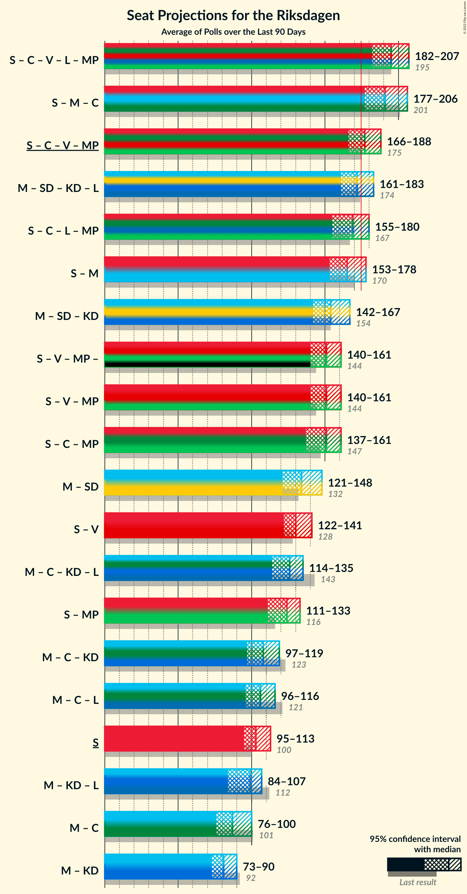

# Poll Average

<a href="#voting-intentions">Voting Intentions</a> | <a href="#seats">Seats</a> | <a href="#coalitions">Coalitions</a> | <a href="#technical-information">Technical Information</a>

## Summary

The table below lists the polls on which the average is based. They are the most recent polls (less than 90 days old) registered and analyzed so far.

| Period     | Polling firm/Commissioner(s) | S | M | SD | C | V | KD | L | MP |
|:----------:|:----------------------------:|:--:|:--:|:--:|:--:|:--:|:--:|:--:|:--:|
| 9 September 2018 | General Election | 28.3%   100 | 19.8%   70 | 17.5%   62 | 8.6%   31 | 8.0%   28 | 6.3%   22 | 5.5%   20 | 4.4%   16 |
| N/A | Poll Average | 28–32%   102–123 | 18–23%   66–87 | 17–22%   64–81 | 6–9%   22–34 | 9–12%   32–43 | 4–6%   15–24 | 2–4%   0 | 2–5%   0–17 |
| [10 December–22 January 2022](2022-01-22-Sifo.html) | Sifo   Svenska Dagbladet | 30–32%   113–123 | 20–22%   76–84 | 18–20%   69–77 | 6–8%   24–29 | 9–10%   34–40 | 4–5%   0–19 | 3%   0 | 3%   0 |
| [28 December 2021–5 January 2022](2022-01-05-Demoskop.html) | Demoskop   Aftonbladet | 27–31%   104–117 | 20–23%   77–89 | 16–19%   62–73 | 7–9%   28–36 | 8–11%   31–40 | 5–6%   17–24 | 3–4%   0 | 2–4%   0 |
| [6 December 2021–2 January 2022](2022-01-02-Novus.html) | Novus   SVT | 29–33%   108–125 | 17–20%   63–77 | 18–22%   68–82 | 6–8%   21–29 | 9–12%   34–44 | 5–7%   17–25 | 2–3%   0 | 3–4%   0–16 |
| [7–20 December 2021](2021-12-20-Ipsos.html) | Ipsos   Dagens Nyheter | 27–31%   99–119 | 18–22%   67–83 | 18–22%   67–83 | 6–8%   22–32 | 9–12%   32–44 | 4–6%   15–23 | 2–4%   0 | 3–5%   0–19 |
| [28 October–25 November 2021](2021-11-25-SCB.html) | SCB | 28–30%   103–112 | 22–24%   80–88 | 18–19%   65–73 | 8–9%   29–34 | 9–10%   31–37 | 4–5%   15–19 | 2–3%   0 | 4%   0–16 |
| 9 September 2018 | General Election | 28.3%   100 | 19.8%   70 | 17.5%   62 | 8.6%   31 | 8.0%   28 | 6.3%   22 | 5.5%   20 | 4.4%   16 |

Only polls for which at least the sample size has been published are included in the table above.

**Legend:**
+ **Top half of each row:** Voting intentions (95% confidence interval)
+ **Bottom half of each row:** Seat projections for the Riksdagen (95% confidence interval)
+ **S:** Sveriges socialdemokratiska arbetareparti
+ **M:** Moderata samlingspartiet
+ **SD:** Sverigedemokraterna
+ **C:** Centerpartiet
+ **V:** Vänsterpartiet
+ **KD:** Kristdemokraterna
+ **L:** Liberalerna
+ **MP:** Miljöpartiet de gröna
+ **N/A (single party):** Party not included the published results
+ **N/A (entire row):** Calculation for this opinion poll not started yet

## Voting Intentions

### Confidence Intervals

| Party | Last Result | Median | 80% Confidence Interval | 90% Confidence Interval | 95% Confidence Interval | 99% Confidence Interval |
|:-----:|:-----------:|:------:|:-----------------------:|:-----------------------:|:-----------------------:|:-----------------------:|
| <a href="#sveriges-socialdemokratiska-arbetareparti">Sveriges socialdemokratiska arbetareparti</a> | 28.3% | 29.8% | 28.3–31.7% |27.9–32.1% | 27.5–32.5% | 26.7–33.3% |
| <a href="#moderata-samlingspartiet">Moderata samlingspartiet</a> | 19.8% | 20.9% | 18.6–22.8% |18.1–23.1% | 17.7–23.3% | 17.0–23.7% |
| <a href="#sverigedemokraterna">Sverigedemokraterna</a> | 17.5% | 19.1% | 17.7–20.7% |17.3–21.2% | 16.9–21.5% | 16.3–22.2% |
| <a href="#centerpartiet">Centerpartiet</a> | 8.6% | 7.4% | 6.4–8.6% |6.2–8.9% | 6.0–9.0% | 5.6–9.5% |
| <a href="#vänsterpartiet">Vänsterpartiet</a> | 8.0% | 9.6% | 8.9–10.8% |8.7–11.2% | 8.6–11.5% | 8.2–12.0% |
| <a href="#kristdemokraterna">Kristdemokraterna</a> | 6.3% | 4.9% | 4.3–5.9% |4.2–6.2% | 4.1–6.4% | 3.9–6.8% |
| <a href="#liberalerna">Liberalerna</a> | 5.5% | 2.8% | 2.2–3.4% |2.0–3.6% | 1.9–3.8% | 1.6–4.1% |
| <a href="#miljöpartiet-de-gröna">Miljöpartiet de gröna</a> | 4.4% | 3.4% | 2.7–4.2% |2.6–4.4% | 2.4–4.6% | 2.2–5.1% |

### Sveriges socialdemokratiska arbetareparti

*For a full overview of the results for this party, see the [Sveriges socialdemokratiska arbetareparti](party-sverigessocialdemokratiskaarbetareparti.html) page.*

| Voting Intentions | Probability | Accumulated | Special Marks |
|:-----------------:|:-----------:|:-----------:|:-------------:|
| 24.5–25.5% | 0% | 100% |  |
| 25.5–26.5% | 0.3% | 100% |  |
| 26.5–27.5% | 2% | 99.7% |  |
| 27.5–28.5% | 12% | 97% | Last Result |
| 28.5–29.5% | 30% | 86% |  |
| 29.5–30.5% | 20% | 56% | Median |
| 30.5–31.5% | 23% | 35% |  |
| 31.5–32.5% | 10% | 13% |  |
| 32.5–33.5% | 2% | 2% |  |
| 33.5–34.5% | 0.3% | 0.3% |  |
| 34.5–35.5% | 0% | 0% |  |

### Moderata samlingspartiet

*For a full overview of the results for this party, see the [Moderata samlingspartiet](party-moderatasamlingspartiet.html) page.*

| Voting Intentions | Probability | Accumulated | Special Marks |
|:-----------------:|:-----------:|:-----------:|:-------------:|
| 14.5–15.5% | 0% | 100% |  |
| 15.5–16.5% | 0.1% | 100% |  |
| 16.5–17.5% | 2% | 99.9% |  |
| 17.5–18.5% | 8% | 98% |  |
| 18.5–19.5% | 13% | 90% |  |
| 19.5–20.5% | 16% | 77% | Last Result |
| 20.5–21.5% | 25% | 61% | Median |
| 21.5–22.5% | 19% | 36% |  |
| 22.5–23.5% | 16% | 17% |  |
| 23.5–24.5% | 1.0% | 1.0% |  |
| 24.5–25.5% | 0% | 0% |  |

### Sverigedemokraterna

*For a full overview of the results for this party, see the [Sverigedemokraterna](party-sverigedemokraterna.html) page.*

| Voting Intentions | Probability | Accumulated | Special Marks |
|:-----------------:|:-----------:|:-----------:|:-------------:|
| 14.5–15.5% | 0% | 100% |  |
| 15.5–16.5% | 1.0% | 100% |  |
| 16.5–17.5% | 7% | 99.0% |  |
| 17.5–18.5% | 22% | 92% | Last Result |
| 18.5–19.5% | 37% | 71% | Median |
| 19.5–20.5% | 21% | 33% |  |
| 20.5–21.5% | 10% | 12% |  |
| 21.5–22.5% | 2% | 2% |  |
| 22.5–23.5% | 0.2% | 0.2% |  |
| 23.5–24.5% | 0% | 0% |  |

### Centerpartiet

*For a full overview of the results for this party, see the [Centerpartiet](party-centerpartiet.html) page.*

| Voting Intentions | Probability | Accumulated | Special Marks |
|:-----------------:|:-----------:|:-----------:|:-------------:|
| 3.5–4.5% | 0% | 100% |  |
| 4.5–5.5% | 0.4% | 100% |  |
| 5.5–6.5% | 13% | 99.6% |  |
| 6.5–7.5% | 41% | 87% | Median |
| 7.5–8.5% | 32% | 46% |  |
| 8.5–9.5% | 13% | 14% | Last Result |
| 9.5–10.5% | 0.4% | 0.4% |  |
| 10.5–11.5% | 0% | 0% |  |

### Vänsterpartiet

*For a full overview of the results for this party, see the [Vänsterpartiet](party-vänsterpartiet.html) page.*

| Voting Intentions | Probability | Accumulated | Special Marks |
|:-----------------:|:-----------:|:-----------:|:-------------:|
| 6.5–7.5% | 0% | 100% |  |
| 7.5–8.5% | 2% | 100% | Last Result |
| 8.5–9.5% | 44% | 98% |  |
| 9.5–10.5% | 38% | 54% | Median |
| 10.5–11.5% | 13% | 15% |  |
| 11.5–12.5% | 2% | 2% |  |
| 12.5–13.5% | 0.1% | 0.1% |  |
| 13.5–14.5% | 0% | 0% |  |

### Kristdemokraterna

*For a full overview of the results for this party, see the [Kristdemokraterna](party-kristdemokraterna.html) page.*

| Voting Intentions | Probability | Accumulated | Special Marks |
|:-----------------:|:-----------:|:-----------:|:-------------:|
| 2.5–3.5% | 0% | 100% |  |
| 3.5–4.5% | 27% | 100% |  |
| 4.5–5.5% | 50% | 73% | Median |
| 5.5–6.5% | 22% | 23% | Last Result |
| 6.5–7.5% | 1.2% | 1.2% |  |
| 7.5–8.5% | 0% | 0% |  |

### Liberalerna

*For a full overview of the results for this party, see the [Liberalerna](party-liberalerna.html) page.*

| Voting Intentions | Probability | Accumulated | Special Marks |
|:-----------------:|:-----------:|:-----------:|:-------------:|
| 0.0–0.5% | 0% | 100% |  |
| 0.5–1.5% | 0.2% | 100% |  |
| 1.5–2.5% | 32% | 99.8% |  |
| 2.5–3.5% | 62% | 68% | Median |
| 3.5–4.5% | 6% | 6% |  |
| 4.5–5.5% | 0% | 0% | Last Result |

### Miljöpartiet de gröna

*For a full overview of the results for this party, see the [Miljöpartiet de gröna](party-miljöpartietdegröna.html) page.*

| Voting Intentions | Probability | Accumulated | Special Marks |
|:-----------------:|:-----------:|:-----------:|:-------------:|
| 0.5–1.5% | 0% | 100% |  |
| 1.5–2.5% | 4% | 100% |  |
| 2.5–3.5% | 51% | 96% | Median |
| 3.5–4.5% | 42% | 45% | Last Result |
| 4.5–5.5% | 3% | 3% |  |
| 5.5–6.5% | 0.1% | 0.1% |  |
| 6.5–7.5% | 0% | 0% |  |

## Seats

### Confidence Intervals

| Party | Last Result | Median | 80% Confidence Interval | 90% Confidence Interval | 95% Confidence Interval | 99% Confidence Interval |
|:-----:|:-----------:|:------:|:-----------------------:|:-----------------------:|:-----------------------:|:-----------------------:|
| <a href="#sveriges-socialdemokratiska-arbetareparti">Sveriges socialdemokratiska arbetareparti</a> | 100 | 112 | 105–120 |103–121 | 102–123 | 99–125 |
| <a href="#moderata-samlingspartiet">Moderata samlingspartiet</a> | 70 | 79 | 69–86 |67–87 | 66–87 | 63–90 |
| <a href="#sverigedemokraterna">Sverigedemokraterna</a> | 62 | 72 | 66–78 |65–79 | 64–81 | 62–84 |
| <a href="#centerpartiet">Centerpartiet</a> | 31 | 28 | 24–33 |23–33 | 22–34 | 21–36 |
| <a href="#vänsterpartiet">Vänsterpartiet</a> | 28 | 36 | 33–41 |32–42 | 32–43 | 31–45 |
| <a href="#kristdemokraterna">Kristdemokraterna</a> | 22 | 18 | 16–22 |16–23 | 15–24 | 0–25 |
| <a href="#liberalerna">Liberalerna</a> | 20 | 0 | 0 |0 | 0 | 0–15 |
| <a href="#miljöpartiet-de-gröna">Miljöpartiet de gröna</a> | 16 | 0 | 0–15 |0–16 | 0–17 | 0–19 |

### Sveriges socialdemokratiska arbetareparti

*For a full overview of the results for this party, see the [Sveriges socialdemokratiska arbetareparti](party-sverigessocialdemokratiskaarbetareparti.html) page.*

| Number of Seats | Probability | Accumulated | Special Marks |
|:---------------:|:-----------:|:-----------:|:-------------:|
| 95 | 0% | 100% |  |
| 96 | 0.1% | 99.9% |  |
| 97 | 0.1% | 99.9% |  |
| 98 | 0.1% | 99.7% |  |
| 99 | 0.3% | 99.6% |  |
| 100 | 0.5% | 99.3% | Last Result |
| 101 | 1.2% | 98.9% |  |
| 102 | 1.1% | 98% |  |
| 103 | 2% | 97% |  |
| 104 | 3% | 95% |  |
| 105 | 4% | 92% |  |
| 106 | 4% | 88% |  |
| 107 | 6% | 84% |  |
| 108 | 6% | 78% |  |
| 109 | 6% | 72% |  |
| 110 | 9% | 66% |  |
| 111 | 5% | 58% |  |
| 112 | 5% | 53% | Median |
| 113 | 4% | 48% |  |
| 114 | 5% | 43% |  |
| 115 | 6% | 38% |  |
| 116 | 4% | 32% |  |
| 117 | 7% | 28% |  |
| 118 | 7% | 21% |  |
| 119 | 3% | 15% |  |
| 120 | 4% | 12% |  |
| 121 | 3% | 7% |  |
| 122 | 1.4% | 4% |  |
| 123 | 1.1% | 3% |  |
| 124 | 0.8% | 2% |  |
| 125 | 0.4% | 0.9% |  |
| 126 | 0.2% | 0.5% |  |
| 127 | 0.1% | 0.3% |  |
| 128 | 0% | 0.1% |  |
| 129 | 0% | 0.1% |  |
| 130 | 0% | 0% |  |

### Moderata samlingspartiet

*For a full overview of the results for this party, see the [Moderata samlingspartiet](party-moderatasamlingspartiet.html) page.*

| Number of Seats | Probability | Accumulated | Special Marks |
|:---------------:|:-----------:|:-----------:|:-------------:|
| 61 | 0.1% | 100% |  |
| 62 | 0.2% | 99.9% |  |
| 63 | 0.4% | 99.7% |  |
| 64 | 0.5% | 99.3% |  |
| 65 | 0.9% | 98.8% |  |
| 66 | 1.2% | 98% |  |
| 67 | 3% | 97% |  |
| 68 | 2% | 94% |  |
| 69 | 3% | 92% |  |
| 70 | 3% | 88% | Last Result |
| 71 | 3% | 85% |  |
| 72 | 3% | 82% |  |
| 73 | 2% | 78% |  |
| 74 | 4% | 76% |  |
| 75 | 3% | 72% |  |
| 76 | 3% | 69% |  |
| 77 | 4% | 66% |  |
| 78 | 7% | 61% |  |
| 79 | 6% | 55% | Median |
| 80 | 7% | 48% |  |
| 81 | 6% | 41% |  |
| 82 | 6% | 35% |  |
| 83 | 5% | 29% |  |
| 84 | 6% | 23% |  |
| 85 | 6% | 17% |  |
| 86 | 5% | 11% |  |
| 87 | 4% | 6% |  |
| 88 | 1.1% | 2% |  |
| 89 | 0.7% | 1.2% |  |
| 90 | 0.4% | 0.5% |  |
| 91 | 0.1% | 0.2% |  |
| 92 | 0% | 0.1% |  |
| 93 | 0% | 0% |  |

### Sverigedemokraterna

*For a full overview of the results for this party, see the [Sverigedemokraterna](party-sverigedemokraterna.html) page.*

| Number of Seats | Probability | Accumulated | Special Marks |
|:---------------:|:-----------:|:-----------:|:-------------:|
| 60 | 0.1% | 100% |  |
| 61 | 0.2% | 99.9% |  |
| 62 | 0.7% | 99.6% | Last Result |
| 63 | 0.7% | 98.9% |  |
| 64 | 2% | 98% |  |
| 65 | 2% | 96% |  |
| 66 | 5% | 94% |  |
| 67 | 5% | 90% |  |
| 68 | 6% | 85% |  |
| 69 | 6% | 79% |  |
| 70 | 12% | 73% |  |
| 71 | 8% | 60% |  |
| 72 | 8% | 52% | Median |
| 73 | 10% | 43% |  |
| 74 | 7% | 33% |  |
| 75 | 6% | 26% |  |
| 76 | 6% | 20% |  |
| 77 | 4% | 15% |  |
| 78 | 3% | 10% |  |
| 79 | 3% | 8% |  |
| 80 | 2% | 5% |  |
| 81 | 1.3% | 3% |  |
| 82 | 0.8% | 2% |  |
| 83 | 0.4% | 1.0% |  |
| 84 | 0.3% | 0.6% |  |
| 85 | 0.1% | 0.3% |  |
| 86 | 0.1% | 0.1% |  |
| 87 | 0.1% | 0.1% |  |
| 88 | 0% | 0% |  |

### Centerpartiet

*For a full overview of the results for this party, see the [Centerpartiet](party-centerpartiet.html) page.*

| Number of Seats | Probability | Accumulated | Special Marks |
|:---------------:|:-----------:|:-----------:|:-------------:|
| 19 | 0.1% | 100% |  |
| 20 | 0.2% | 99.9% |  |
| 21 | 0.8% | 99.7% |  |
| 22 | 2% | 98.9% |  |
| 23 | 4% | 97% |  |
| 24 | 6% | 93% |  |
| 25 | 11% | 87% |  |
| 26 | 11% | 76% |  |
| 27 | 12% | 65% |  |
| 28 | 8% | 53% | Median |
| 29 | 6% | 45% |  |
| 30 | 10% | 39% |  |
| 31 | 8% | 29% | Last Result |
| 32 | 10% | 20% |  |
| 33 | 6% | 10% |  |
| 34 | 2% | 4% |  |
| 35 | 1.4% | 2% |  |
| 36 | 0.4% | 0.7% |  |
| 37 | 0.2% | 0.3% |  |
| 38 | 0.1% | 0.1% |  |
| 39 | 0% | 0% |  |

### Vänsterpartiet

*For a full overview of the results for this party, see the [Vänsterpartiet](party-vänsterpartiet.html) page.*

| Number of Seats | Probability | Accumulated | Special Marks |
|:---------------:|:-----------:|:-----------:|:-------------:|
| 28 | 0% | 100% | Last Result |
| 29 | 0.1% | 100% |  |
| 30 | 0.3% | 99.9% |  |
| 31 | 1.5% | 99.6% |  |
| 32 | 3% | 98% |  |
| 33 | 7% | 95% |  |
| 34 | 12% | 88% |  |
| 35 | 15% | 75% |  |
| 36 | 14% | 60% | Median |
| 37 | 13% | 46% |  |
| 38 | 10% | 33% |  |
| 39 | 7% | 23% |  |
| 40 | 5% | 16% |  |
| 41 | 4% | 10% |  |
| 42 | 2% | 6% |  |
| 43 | 2% | 4% |  |
| 44 | 1.0% | 2% |  |
| 45 | 0.5% | 0.8% |  |
| 46 | 0.2% | 0.4% |  |
| 47 | 0.1% | 0.1% |  |
| 48 | 0% | 0% |  |

### Kristdemokraterna

*For a full overview of the results for this party, see the [Kristdemokraterna](party-kristdemokraterna.html) page.*

| Number of Seats | Probability | Accumulated | Special Marks |
|:---------------:|:-----------:|:-----------:|:-------------:|
| 0 | 2% | 100% |  |
| 1 | 0% | 98% |  |
| 2 | 0% | 98% |  |
| 3 | 0% | 98% |  |
| 4 | 0% | 98% |  |
| 5 | 0% | 98% |  |
| 6 | 0% | 98% |  |
| 7 | 0% | 98% |  |
| 8 | 0% | 98% |  |
| 9 | 0% | 98% |  |
| 10 | 0% | 98% |  |
| 11 | 0% | 98% |  |
| 12 | 0% | 98% |  |
| 13 | 0% | 98% |  |
| 14 | 0% | 98% |  |
| 15 | 3% | 98% |  |
| 16 | 13% | 95% |  |
| 17 | 17% | 82% |  |
| 18 | 16% | 65% | Median |
| 19 | 11% | 49% |  |
| 20 | 9% | 38% |  |
| 21 | 10% | 28% |  |
| 22 | 10% | 18% | Last Result |
| 23 | 5% | 8% |  |
| 24 | 2% | 4% |  |
| 25 | 0.9% | 1.3% |  |
| 26 | 0.3% | 0.4% |  |
| 27 | 0.1% | 0.1% |  |
| 28 | 0% | 0% |  |

### Liberalerna

*For a full overview of the results for this party, see the [Liberalerna](party-liberalerna.html) page.*

| Number of Seats | Probability | Accumulated | Special Marks |
|:---------------:|:-----------:|:-----------:|:-------------:|
| 0 | 99.3% | 100% | Median |
| 1 | 0% | 0.7% |  |
| 2 | 0% | 0.7% |  |
| 3 | 0% | 0.7% |  |
| 4 | 0% | 0.7% |  |
| 5 | 0% | 0.7% |  |
| 6 | 0% | 0.7% |  |
| 7 | 0% | 0.7% |  |
| 8 | 0% | 0.7% |  |
| 9 | 0% | 0.7% |  |
| 10 | 0% | 0.7% |  |
| 11 | 0% | 0.7% |  |
| 12 | 0% | 0.7% |  |
| 13 | 0% | 0.7% |  |
| 14 | 0% | 0.7% |  |
| 15 | 0.4% | 0.7% |  |
| 16 | 0.2% | 0.2% |  |
| 17 | 0% | 0% |  |
| 18 | 0% | 0% |  |
| 19 | 0% | 0% |  |
| 20 | 0% | 0% | Last Result |

### Miljöpartiet de gröna

*For a full overview of the results for this party, see the [Miljöpartiet de gröna](party-miljöpartietdegröna.html) page.*

| Number of Seats | Probability | Accumulated | Special Marks |
|:---------------:|:-----------:|:-----------:|:-------------:|
| 0 | 81% | 100% | Median |
| 1 | 0% | 19% |  |
| 2 | 0% | 19% |  |
| 3 | 0% | 19% |  |
| 4 | 0% | 19% |  |
| 5 | 0% | 19% |  |
| 6 | 0% | 19% |  |
| 7 | 0% | 19% |  |
| 8 | 0% | 19% |  |
| 9 | 0% | 19% |  |
| 10 | 0% | 19% |  |
| 11 | 0% | 19% |  |
| 12 | 0% | 19% |  |
| 13 | 0% | 19% |  |
| 14 | 0.5% | 19% |  |
| 15 | 10% | 18% |  |
| 16 | 4% | 8% | Last Result |
| 17 | 2% | 4% |  |
| 18 | 1.2% | 2% |  |
| 19 | 0.4% | 0.6% |  |
| 20 | 0.1% | 0.2% |  |
| 21 | 0% | 0% |  |

## Coalitions

### Confidence Intervals

| Coalition | Last Result | Median | Majority? | 80% Confidence Interval | 90% Confidence Interval | 95% Confidence Interval | 99% Confidence Interval |
|:---------:|:-----------:|:------:|:---------:|:-----------------------:|:-----------------------:|:-----------------------:|:-----------------------:|
| Sveriges socialdemokratiska arbetareparti – Moderata samlingspartiet – Centerpartiet | 201 | 221 | 100% | 207–228 | 203–229 | 201–231 | 197–235 |
| Sveriges socialdemokratiska arbetareparti – Moderata samlingspartiet | 170 | 192 | 98% | 181–198 | 178–199 | 175–201 | 171–206 |
| Sveriges socialdemokratiska arbetareparti – Centerpartiet – Vänsterpartiet – Liberalerna – Miljöpartiet de gröna | 195 | 180 | 88% | 174–186 | 173–189 | 171–191 | 169–195 |
| Moderata samlingspartiet – Sverigedemokraterna – Kristdemokraterna | 154 | 169 | 12% | 163–175 | 160–176 | 158–178 | 154–180 |
| Sveriges socialdemokratiska arbetareparti – Vänsterpartiet – Miljöpartiet de gröna | 144 | 152 | 0% | 143–160 | 142–163 | 141–165 | 138–169 |
| Sveriges socialdemokratiska arbetareparti – Vänsterpartiet | 128 | 148 | 0% | 140–158 | 138–160 | 136–162 | 134–165 |
| Moderata samlingspartiet – Sverigedemokraterna | 132 | 151 | 0% | 143–156 | 141–157 | 139–159 | 135–162 |
| Sveriges socialdemokratiska arbetareparti – Centerpartiet – Liberalerna – Miljöpartiet de gröna | 167 | 143 | 0% | 138–150 | 136–152 | 134–154 | 130–158 |
| Moderata samlingspartiet – Centerpartiet – Kristdemokraterna – Liberalerna | 143 | 124 | 0% | 114–137 | 112–138 | 110–140 | 106–143 |
| Moderata samlingspartiet – Centerpartiet – Kristdemokraterna | 123 | 124 | 0% | 114–136 | 112–138 | 110–139 | 106–142 |
| Sveriges socialdemokratiska arbetareparti – Miljöpartiet de gröna | 116 | 116 | 0% | 108–122 | 107–125 | 105–127 | 103–131 |
| Moderata samlingspartiet – Centerpartiet – Liberalerna | 121 | 106 | 0% | 94–118 | 92–119 | 90–120 | 88–123 |
| Moderata samlingspartiet – Centerpartiet | 101 | 106 | 0% | 94–118 | 92–119 | 90–119 | 88–122 |

### Sveriges socialdemokratiska arbetareparti – Moderata samlingspartiet – Centerpartiet

| Number of Seats | Probability | Accumulated | Special Marks |
|:---------------:|:-----------:|:-----------:|:-------------:|
| 191 | 0% | 100% |  |
| 192 | 0% | 99.9% |  |
| 193 | 0.1% | 99.9% |  |
| 194 | 0.1% | 99.9% |  |
| 195 | 0.1% | 99.8% |  |
| 196 | 0.2% | 99.7% |  |
| 197 | 0.2% | 99.5% |  |
| 198 | 0.3% | 99.3% |  |
| 199 | 0.6% | 99.0% |  |
| 200 | 0.6% | 98% |  |
| 201 | 1.1% | 98% | Last Result |
| 202 | 0.8% | 97% |  |
| 203 | 1.3% | 96% |  |
| 204 | 1.3% | 95% |  |
| 205 | 0.9% | 93% |  |
| 206 | 2% | 92% |  |
| 207 | 1.5% | 90% |  |
| 208 | 2% | 89% |  |
| 209 | 3% | 87% |  |
| 210 | 2% | 84% |  |
| 211 | 3% | 82% |  |
| 212 | 3% | 80% |  |
| 213 | 3% | 77% |  |
| 214 | 4% | 74% |  |
| 215 | 3% | 70% |  |
| 216 | 3% | 67% |  |
| 217 | 3% | 64% |  |
| 218 | 4% | 61% |  |
| 219 | 3% | 57% | Median |
| 220 | 4% | 54% |  |
| 221 | 5% | 51% |  |
| 222 | 4% | 46% |  |
| 223 | 5% | 42% |  |
| 224 | 6% | 37% |  |
| 225 | 7% | 30% |  |
| 226 | 7% | 23% |  |
| 227 | 5% | 16% |  |
| 228 | 5% | 11% |  |
| 229 | 2% | 6% |  |
| 230 | 1.4% | 5% |  |
| 231 | 2% | 3% |  |
| 232 | 0.6% | 2% |  |
| 233 | 0.2% | 1.1% |  |
| 234 | 0.4% | 1.0% |  |
| 235 | 0.3% | 0.6% |  |
| 236 | 0.1% | 0.3% |  |
| 237 | 0.1% | 0.2% |  |
| 238 | 0% | 0.1% |  |
| 239 | 0% | 0.1% |  |
| 240 | 0% | 0% |  |

### Sveriges socialdemokratiska arbetareparti – Moderata samlingspartiet

| Number of Seats | Probability | Accumulated | Special Marks |
|:---------------:|:-----------:|:-----------:|:-------------:|
| 167 | 0% | 100% |  |
| 168 | 0% | 99.9% |  |
| 169 | 0.1% | 99.9% |  |
| 170 | 0.1% | 99.8% | Last Result |
| 171 | 0.4% | 99.7% |  |
| 172 | 0.6% | 99.3% |  |
| 173 | 0.4% | 98.6% |  |
| 174 | 0.4% | 98% |  |
| 175 | 0.7% | 98% | Majority |
| 176 | 0.7% | 97% |  |
| 177 | 1.0% | 96% |  |
| 178 | 2% | 95% |  |
| 179 | 1.0% | 94% |  |
| 180 | 1.5% | 93% |  |
| 181 | 2% | 91% |  |
| 182 | 2% | 89% |  |
| 183 | 2% | 86% |  |
| 184 | 2% | 85% |  |
| 185 | 3% | 83% |  |
| 186 | 5% | 80% |  |
| 187 | 5% | 74% |  |
| 188 | 5% | 69% |  |
| 189 | 4% | 64% |  |
| 190 | 5% | 60% |  |
| 191 | 4% | 55% | Median |
| 192 | 4% | 51% |  |
| 193 | 5% | 48% |  |
| 194 | 10% | 43% |  |
| 195 | 8% | 33% |  |
| 196 | 7% | 25% |  |
| 197 | 4% | 18% |  |
| 198 | 5% | 14% |  |
| 199 | 4% | 9% |  |
| 200 | 2% | 5% |  |
| 201 | 1.1% | 3% |  |
| 202 | 0.4% | 2% |  |
| 203 | 0.3% | 1.3% |  |
| 204 | 0.1% | 1.1% |  |
| 205 | 0.2% | 0.9% |  |
| 206 | 0.3% | 0.7% |  |
| 207 | 0.1% | 0.4% |  |
| 208 | 0.1% | 0.3% |  |
| 209 | 0.1% | 0.2% |  |
| 210 | 0% | 0.1% |  |
| 211 | 0% | 0.1% |  |
| 212 | 0% | 0% |  |

### Sveriges socialdemokratiska arbetareparti – Centerpartiet – Vänsterpartiet – Liberalerna – Miljöpartiet de gröna

| Number of Seats | Probability | Accumulated | Special Marks |
|:---------------:|:-----------:|:-----------:|:-------------:|
| 165 | 0.1% | 100% |  |
| 166 | 0.1% | 99.9% |  |
| 167 | 0.1% | 99.8% |  |
| 168 | 0.2% | 99.7% |  |
| 169 | 0.3% | 99.5% |  |
| 170 | 0.6% | 99.3% |  |
| 171 | 2% | 98.6% |  |
| 172 | 1.5% | 97% |  |
| 173 | 2% | 96% |  |
| 174 | 5% | 93% |  |
| 175 | 6% | 88% | Majority |
| 176 | 7% | 82% | Median |
| 177 | 6% | 76% |  |
| 178 | 7% | 70% |  |
| 179 | 8% | 63% |  |
| 180 | 9% | 55% |  |
| 181 | 9% | 46% |  |
| 182 | 7% | 36% |  |
| 183 | 5% | 29% |  |
| 184 | 7% | 24% |  |
| 185 | 5% | 17% |  |
| 186 | 3% | 12% |  |
| 187 | 2% | 9% |  |
| 188 | 2% | 7% |  |
| 189 | 2% | 6% |  |
| 190 | 1.1% | 4% |  |
| 191 | 0.8% | 3% |  |
| 192 | 0.7% | 2% |  |
| 193 | 0.3% | 1.4% |  |
| 194 | 0.5% | 1.1% |  |
| 195 | 0.3% | 0.6% | Last Result |
| 196 | 0.1% | 0.3% |  |
| 197 | 0.1% | 0.3% |  |
| 198 | 0.1% | 0.2% |  |
| 199 | 0% | 0.1% |  |
| 200 | 0% | 0.1% |  |
| 201 | 0% | 0% |  |

### Moderata samlingspartiet – Sverigedemokraterna – Kristdemokraterna

| Number of Seats | Probability | Accumulated | Special Marks |
|:---------------:|:-----------:|:-----------:|:-------------:|
| 149 | 0% | 100% |  |
| 150 | 0% | 99.9% |  |
| 151 | 0.1% | 99.9% |  |
| 152 | 0.1% | 99.8% |  |
| 153 | 0.1% | 99.7% |  |
| 154 | 0.3% | 99.7% | Last Result |
| 155 | 0.5% | 99.4% |  |
| 156 | 0.3% | 98.9% |  |
| 157 | 0.7% | 98.6% |  |
| 158 | 0.8% | 98% |  |
| 159 | 1.1% | 97% |  |
| 160 | 2% | 96% |  |
| 161 | 2% | 94% |  |
| 162 | 2% | 93% |  |
| 163 | 3% | 91% |  |
| 164 | 5% | 88% |  |
| 165 | 7% | 83% |  |
| 166 | 5% | 76% |  |
| 167 | 7% | 71% |  |
| 168 | 9% | 64% |  |
| 169 | 9% | 54% | Median |
| 170 | 8% | 45% |  |
| 171 | 7% | 37% |  |
| 172 | 6% | 30% |  |
| 173 | 7% | 24% |  |
| 174 | 6% | 18% |  |
| 175 | 5% | 12% | Majority |
| 176 | 2% | 7% |  |
| 177 | 1.5% | 4% |  |
| 178 | 2% | 3% |  |
| 179 | 0.6% | 1.4% |  |
| 180 | 0.3% | 0.7% |  |
| 181 | 0.2% | 0.5% |  |
| 182 | 0.1% | 0.3% |  |
| 183 | 0.1% | 0.2% |  |
| 184 | 0.1% | 0.1% |  |
| 185 | 0% | 0% |  |

### Sveriges socialdemokratiska arbetareparti – Vänsterpartiet – Miljöpartiet de gröna

| Number of Seats | Probability | Accumulated | Special Marks |
|:---------------:|:-----------:|:-----------:|:-------------:|
| 135 | 0% | 100% |  |
| 136 | 0.1% | 99.9% |  |
| 137 | 0.2% | 99.8% |  |
| 138 | 0.2% | 99.7% |  |
| 139 | 0.4% | 99.5% |  |
| 140 | 1.2% | 99.0% |  |
| 141 | 1.4% | 98% |  |
| 142 | 4% | 96% |  |
| 143 | 5% | 93% |  |
| 144 | 4% | 88% | Last Result |
| 145 | 6% | 84% |  |
| 146 | 5% | 78% |  |
| 147 | 3% | 73% |  |
| 148 | 3% | 70% | Median |
| 149 | 3% | 66% |  |
| 150 | 3% | 63% |  |
| 151 | 5% | 60% |  |
| 152 | 6% | 55% |  |
| 153 | 6% | 49% |  |
| 154 | 7% | 43% |  |
| 155 | 8% | 36% |  |
| 156 | 5% | 28% |  |
| 157 | 5% | 24% |  |
| 158 | 4% | 19% |  |
| 159 | 4% | 15% |  |
| 160 | 2% | 12% |  |
| 161 | 2% | 9% |  |
| 162 | 1.4% | 7% |  |
| 163 | 2% | 6% |  |
| 164 | 1.3% | 4% |  |
| 165 | 0.7% | 3% |  |
| 166 | 0.6% | 2% |  |
| 167 | 0.4% | 1.5% |  |
| 168 | 0.4% | 1.1% |  |
| 169 | 0.3% | 0.7% |  |
| 170 | 0.1% | 0.5% |  |
| 171 | 0.2% | 0.3% |  |
| 172 | 0.1% | 0.2% |  |
| 173 | 0% | 0.1% |  |
| 174 | 0% | 0.1% |  |
| 175 | 0% | 0% | Majority |

### Sveriges socialdemokratiska arbetareparti – Vänsterpartiet

| Number of Seats | Probability | Accumulated | Special Marks |
|:---------------:|:-----------:|:-----------:|:-------------:|
| 128 | 0% | 100% | Last Result |
| 129 | 0% | 100% |  |
| 130 | 0% | 100% |  |
| 131 | 0% | 99.9% |  |
| 132 | 0.1% | 99.9% |  |
| 133 | 0.1% | 99.8% |  |
| 134 | 0.3% | 99.7% |  |
| 135 | 0.6% | 99.4% |  |
| 136 | 1.4% | 98.9% |  |
| 137 | 2% | 97% |  |
| 138 | 3% | 95% |  |
| 139 | 2% | 93% |  |
| 140 | 3% | 91% |  |
| 141 | 3% | 88% |  |
| 142 | 4% | 85% |  |
| 143 | 6% | 81% |  |
| 144 | 5% | 75% |  |
| 145 | 7% | 70% |  |
| 146 | 6% | 64% |  |
| 147 | 3% | 58% |  |
| 148 | 4% | 54% | Median |
| 149 | 3% | 50% |  |
| 150 | 3% | 47% |  |
| 151 | 4% | 43% |  |
| 152 | 5% | 39% |  |
| 153 | 5% | 35% |  |
| 154 | 5% | 30% |  |
| 155 | 7% | 25% |  |
| 156 | 4% | 18% |  |
| 157 | 4% | 15% |  |
| 158 | 2% | 11% |  |
| 159 | 3% | 9% |  |
| 160 | 2% | 6% |  |
| 161 | 1.1% | 4% |  |
| 162 | 0.9% | 3% |  |
| 163 | 0.9% | 2% |  |
| 164 | 0.7% | 1.3% |  |
| 165 | 0.2% | 0.7% |  |
| 166 | 0.2% | 0.4% |  |
| 167 | 0.1% | 0.2% |  |
| 168 | 0.1% | 0.1% |  |
| 169 | 0% | 0% |  |

### Moderata samlingspartiet – Sverigedemokraterna

| Number of Seats | Probability | Accumulated | Special Marks |
|:---------------:|:-----------:|:-----------:|:-------------:|
| 132 | 0% | 100% | Last Result |
| 133 | 0.1% | 99.9% |  |
| 134 | 0.2% | 99.8% |  |
| 135 | 0.3% | 99.7% |  |
| 136 | 0.2% | 99.4% |  |
| 137 | 0.5% | 99.2% |  |
| 138 | 1.0% | 98.6% |  |
| 139 | 1.0% | 98% |  |
| 140 | 0.9% | 97% |  |
| 141 | 2% | 96% |  |
| 142 | 2% | 94% |  |
| 143 | 3% | 92% |  |
| 144 | 3% | 89% |  |
| 145 | 4% | 86% |  |
| 146 | 4% | 82% |  |
| 147 | 6% | 78% |  |
| 148 | 8% | 73% |  |
| 149 | 6% | 64% |  |
| 150 | 8% | 58% |  |
| 151 | 8% | 51% | Median |
| 152 | 8% | 43% |  |
| 153 | 9% | 35% |  |
| 154 | 5% | 26% |  |
| 155 | 6% | 21% |  |
| 156 | 6% | 16% |  |
| 157 | 5% | 10% |  |
| 158 | 2% | 5% |  |
| 159 | 1.4% | 3% |  |
| 160 | 0.8% | 2% |  |
| 161 | 0.5% | 1.1% |  |
| 162 | 0.3% | 0.7% |  |
| 163 | 0.2% | 0.4% |  |
| 164 | 0.1% | 0.2% |  |
| 165 | 0.1% | 0.2% |  |
| 166 | 0% | 0.1% |  |
| 167 | 0% | 0.1% |  |
| 168 | 0% | 0% |  |

### Sveriges socialdemokratiska arbetareparti – Centerpartiet – Liberalerna – Miljöpartiet de gröna

| Number of Seats | Probability | Accumulated | Special Marks |
|:---------------:|:-----------:|:-----------:|:-------------:|
| 126 | 0% | 100% |  |
| 127 | 0% | 99.9% |  |
| 128 | 0.1% | 99.9% |  |
| 129 | 0.1% | 99.9% |  |
| 130 | 0.3% | 99.8% |  |
| 131 | 0.3% | 99.4% |  |
| 132 | 0.5% | 99.1% |  |
| 133 | 0.8% | 98.6% |  |
| 134 | 0.9% | 98% |  |
| 135 | 1.2% | 97% |  |
| 136 | 2% | 96% |  |
| 137 | 3% | 94% |  |
| 138 | 3% | 91% |  |
| 139 | 5% | 89% |  |
| 140 | 9% | 84% | Median |
| 141 | 9% | 75% |  |
| 142 | 10% | 66% |  |
| 143 | 8% | 56% |  |
| 144 | 10% | 48% |  |
| 145 | 7% | 38% |  |
| 146 | 6% | 31% |  |
| 147 | 5% | 25% |  |
| 148 | 4% | 20% |  |
| 149 | 4% | 16% |  |
| 150 | 3% | 12% |  |
| 151 | 3% | 9% |  |
| 152 | 3% | 7% |  |
| 153 | 1.4% | 4% |  |
| 154 | 0.7% | 3% |  |
| 155 | 0.7% | 2% |  |
| 156 | 0.4% | 1.3% |  |
| 157 | 0.3% | 0.8% |  |
| 158 | 0.2% | 0.5% |  |
| 159 | 0.1% | 0.3% |  |
| 160 | 0.1% | 0.2% |  |
| 161 | 0% | 0.1% |  |
| 162 | 0% | 0.1% |  |
| 163 | 0% | 0% |  |
| 164 | 0% | 0% |  |
| 165 | 0% | 0% |  |
| 166 | 0% | 0% |  |
| 167 | 0% | 0% | Last Result |

### Moderata samlingspartiet – Centerpartiet – Kristdemokraterna – Liberalerna

| Number of Seats | Probability | Accumulated | Special Marks |
|:---------------:|:-----------:|:-----------:|:-------------:|
| 101 | 0% | 100% |  |
| 102 | 0% | 99.9% |  |
| 103 | 0% | 99.9% |  |
| 104 | 0% | 99.9% |  |
| 105 | 0.1% | 99.8% |  |
| 106 | 0.3% | 99.7% |  |
| 107 | 0.3% | 99.5% |  |
| 108 | 0.5% | 99.2% |  |
| 109 | 0.6% | 98.7% |  |
| 110 | 0.8% | 98% |  |
| 111 | 2% | 97% |  |
| 112 | 2% | 96% |  |
| 113 | 3% | 94% |  |
| 114 | 2% | 91% |  |
| 115 | 3% | 89% |  |
| 116 | 2% | 86% |  |
| 117 | 4% | 84% |  |
| 118 | 4% | 80% |  |
| 119 | 4% | 76% |  |
| 120 | 5% | 72% |  |
| 121 | 6% | 67% |  |
| 122 | 5% | 61% |  |
| 123 | 5% | 57% |  |
| 124 | 5% | 52% |  |
| 125 | 3% | 48% | Median |
| 126 | 2% | 44% |  |
| 127 | 2% | 42% |  |
| 128 | 2% | 40% |  |
| 129 | 2% | 38% |  |
| 130 | 3% | 36% |  |
| 131 | 2% | 33% |  |
| 132 | 3% | 31% |  |
| 133 | 4% | 28% |  |
| 134 | 6% | 24% |  |
| 135 | 3% | 18% |  |
| 136 | 5% | 15% |  |
| 137 | 4% | 10% |  |
| 138 | 1.3% | 6% |  |
| 139 | 2% | 5% |  |
| 140 | 1.0% | 3% |  |
| 141 | 0.7% | 2% |  |
| 142 | 0.3% | 1.0% |  |
| 143 | 0.2% | 0.7% | Last Result |
| 144 | 0.2% | 0.5% |  |
| 145 | 0.1% | 0.3% |  |
| 146 | 0.1% | 0.2% |  |
| 147 | 0.1% | 0.1% |  |
| 148 | 0% | 0.1% |  |
| 149 | 0% | 0% |  |

### Moderata samlingspartiet – Centerpartiet – Kristdemokraterna

| Number of Seats | Probability | Accumulated | Special Marks |
|:---------------:|:-----------:|:-----------:|:-------------:|
| 100 | 0% | 100% |  |
| 101 | 0% | 99.9% |  |
| 102 | 0% | 99.9% |  |
| 103 | 0% | 99.9% |  |
| 104 | 0% | 99.9% |  |
| 105 | 0.1% | 99.8% |  |
| 106 | 0.3% | 99.7% |  |
| 107 | 0.3% | 99.5% |  |
| 108 | 0.5% | 99.1% |  |
| 109 | 0.6% | 98.7% |  |
| 110 | 0.8% | 98% |  |
| 111 | 2% | 97% |  |
| 112 | 2% | 96% |  |
| 113 | 3% | 93% |  |
| 114 | 2% | 91% |  |
| 115 | 3% | 89% |  |
| 116 | 2% | 86% |  |
| 117 | 4% | 84% |  |
| 118 | 4% | 80% |  |
| 119 | 4% | 76% |  |
| 120 | 5% | 72% |  |
| 121 | 6% | 67% |  |
| 122 | 5% | 61% |  |
| 123 | 5% | 56% | Last Result |
| 124 | 5% | 52% |  |
| 125 | 3% | 47% | Median |
| 126 | 2% | 44% |  |
| 127 | 2% | 42% |  |
| 128 | 2% | 40% |  |
| 129 | 2% | 37% |  |
| 130 | 3% | 36% |  |
| 131 | 2% | 33% |  |
| 132 | 3% | 30% |  |
| 133 | 4% | 27% |  |
| 134 | 6% | 24% |  |
| 135 | 3% | 18% |  |
| 136 | 5% | 15% |  |
| 137 | 4% | 10% |  |
| 138 | 1.3% | 6% |  |
| 139 | 2% | 5% |  |
| 140 | 0.9% | 2% |  |
| 141 | 0.7% | 1.4% |  |
| 142 | 0.3% | 0.7% |  |
| 143 | 0.2% | 0.5% |  |
| 144 | 0.2% | 0.3% |  |
| 145 | 0.1% | 0.1% |  |
| 146 | 0% | 0% |  |

### Sveriges socialdemokratiska arbetareparti – Miljöpartiet de gröna

| Number of Seats | Probability | Accumulated | Special Marks |
|:---------------:|:-----------:|:-----------:|:-------------:|
| 99 | 0% | 100% |  |
| 100 | 0% | 99.9% |  |
| 101 | 0.1% | 99.9% |  |
| 102 | 0.2% | 99.8% |  |
| 103 | 0.4% | 99.6% |  |
| 104 | 0.7% | 99.2% |  |
| 105 | 1.0% | 98% |  |
| 106 | 2% | 97% |  |
| 107 | 4% | 96% |  |
| 108 | 5% | 92% |  |
| 109 | 5% | 87% |  |
| 110 | 8% | 82% |  |
| 111 | 4% | 74% |  |
| 112 | 5% | 69% | Median |
| 113 | 4% | 65% |  |
| 114 | 5% | 61% |  |
| 115 | 6% | 56% |  |
| 116 | 5% | 50% | Last Result |
| 117 | 8% | 45% |  |
| 118 | 7% | 38% |  |
| 119 | 6% | 30% |  |
| 120 | 7% | 25% |  |
| 121 | 5% | 18% |  |
| 122 | 4% | 13% |  |
| 123 | 2% | 9% |  |
| 124 | 2% | 7% |  |
| 125 | 1.0% | 5% |  |
| 126 | 0.6% | 4% |  |
| 127 | 0.9% | 3% |  |
| 128 | 0.9% | 2% |  |
| 129 | 0.4% | 2% |  |
| 130 | 0.5% | 1.1% |  |
| 131 | 0.2% | 0.7% |  |
| 132 | 0.2% | 0.4% |  |
| 133 | 0.1% | 0.3% |  |
| 134 | 0.1% | 0.1% |  |
| 135 | 0% | 0.1% |  |
| 136 | 0% | 0% |  |

### Moderata samlingspartiet – Centerpartiet – Liberalerna

| Number of Seats | Probability | Accumulated | Special Marks |
|:---------------:|:-----------:|:-----------:|:-------------:|
| 84 | 0% | 100% |  |
| 85 | 0.1% | 99.9% |  |
| 86 | 0.1% | 99.9% |  |
| 87 | 0.2% | 99.8% |  |
| 88 | 0.5% | 99.6% |  |
| 89 | 0.8% | 99.0% |  |
| 90 | 1.0% | 98% |  |
| 91 | 1.1% | 97% |  |
| 92 | 2% | 96% |  |
| 93 | 3% | 94% |  |
| 94 | 2% | 91% |  |
| 95 | 2% | 89% |  |
| 96 | 3% | 87% |  |
| 97 | 3% | 84% |  |
| 98 | 2% | 81% |  |
| 99 | 3% | 79% |  |
| 100 | 4% | 76% |  |
| 101 | 2% | 72% |  |
| 102 | 3% | 71% |  |
| 103 | 3% | 68% |  |
| 104 | 5% | 65% |  |
| 105 | 6% | 61% |  |
| 106 | 5% | 54% |  |
| 107 | 4% | 49% | Median |
| 108 | 2% | 46% |  |
| 109 | 2% | 43% |  |
| 110 | 2% | 41% |  |
| 111 | 4% | 39% |  |
| 112 | 3% | 35% |  |
| 113 | 4% | 32% |  |
| 114 | 4% | 28% |  |
| 115 | 4% | 24% |  |
| 116 | 4% | 20% |  |
| 117 | 5% | 16% |  |
| 118 | 5% | 11% |  |
| 119 | 3% | 5% |  |
| 120 | 0.9% | 3% |  |
| 121 | 0.9% | 2% | Last Result |
| 122 | 0.3% | 0.9% |  |
| 123 | 0.2% | 0.5% |  |
| 124 | 0.1% | 0.4% |  |
| 125 | 0.1% | 0.2% |  |
| 126 | 0.1% | 0.2% |  |
| 127 | 0% | 0.1% |  |
| 128 | 0% | 0.1% |  |
| 129 | 0% | 0% |  |

### Moderata samlingspartiet – Centerpartiet

| Number of Seats | Probability | Accumulated | Special Marks |
|:---------------:|:-----------:|:-----------:|:-------------:|
| 84 | 0% | 100% |  |
| 85 | 0.1% | 99.9% |  |
| 86 | 0.1% | 99.9% |  |
| 87 | 0.2% | 99.8% |  |
| 88 | 0.5% | 99.6% |  |
| 89 | 0.8% | 99.0% |  |
| 90 | 1.0% | 98% |  |
| 91 | 1.1% | 97% |  |
| 92 | 2% | 96% |  |
| 93 | 3% | 94% |  |
| 94 | 2% | 91% |  |
| 95 | 2% | 89% |  |
| 96 | 3% | 87% |  |
| 97 | 3% | 83% |  |
| 98 | 2% | 80% |  |
| 99 | 3% | 79% |  |
| 100 | 4% | 76% |  |
| 101 | 2% | 72% | Last Result |
| 102 | 3% | 70% |  |
| 103 | 3% | 68% |  |
| 104 | 5% | 65% |  |
| 105 | 6% | 60% |  |
| 106 | 5% | 54% |  |
| 107 | 4% | 49% | Median |
| 108 | 3% | 45% |  |
| 109 | 2% | 43% |  |
| 110 | 2% | 40% |  |
| 111 | 4% | 38% |  |
| 112 | 3% | 34% |  |
| 113 | 4% | 31% |  |
| 114 | 4% | 27% |  |
| 115 | 4% | 23% |  |
| 116 | 4% | 19% |  |
| 117 | 5% | 16% |  |
| 118 | 5% | 10% |  |
| 119 | 3% | 5% |  |
| 120 | 0.8% | 2% |  |
| 121 | 0.9% | 1.4% |  |
| 122 | 0.3% | 0.6% |  |
| 123 | 0.1% | 0.3% |  |
| 124 | 0.1% | 0.1% |  |
| 125 | 0% | 0% |  |

## Technical Information

+ **Number of polls included in this average:** 5
+ **Lowest number of simulations done in a poll included in this average:** 1,048,576
+ **Total number of simulations done in the polls included in this average:** 5,242,880
+ **Error estimate:** 1.16%
