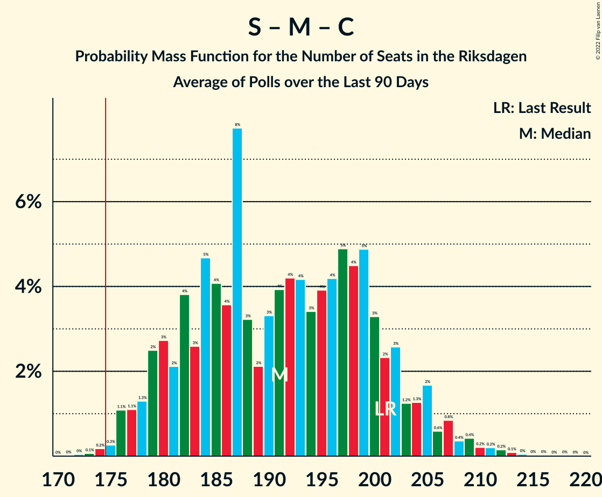

# Poll Average

<a href="#voting-intentions">Voting Intentions</a> | <a href="#seats">Seats</a> | <a href="#coalitions">Coalitions</a> | <a href="#technical-information">Technical Information</a>

## Summary

The table below lists the polls on which the average is based. They are the most recent polls (less than 90 days old) registered and analyzed so far.

| Period     | Polling firm/Commissioner(s) | S | M | SD | C | V | KD | L | MP |
|:----------:|:----------------------------:|:--:|:--:|:--:|:--:|:--:|:--:|:--:|:--:|
| 9 September 2018 | General Election | 28.3%   100 | 19.8%   70 | 17.5%   62 | 8.6%   31 | 8.0%   28 | 6.3%   22 | 5.5%   20 | 4.4%   16 |
| N/A | Poll Average | 27–34%   97–129 | 17–22%   62–83 | 15–20%   55–74 | 4–8%   17–29 | 7–11%   24–41 | 5–7%   17–25 | 3–7%   0–26 | 3–6%   0–22 |
| [14–16 August 2022](2022-08-16-Sifo.html) | Sifo   Svenska Dagbladet | 28–32%   98–113 | 17–21%   62–75 | 16–19%   56–68 | 5–7%   19–27 | 7–10%   26–35 | 5–7%   18–25 | 5–7%   17–24 | 4–6%   16–23 |
| [6–16 August 2022](2022-08-16-Demoskop.html) | Demoskop   Aftonbladet | 28–32%   98–112 | 18–22%   65–76 | 17–20%   59–71 | 6–9%   23–31 | 6–9%   22–30 | 5–7%   17–24 | 4–6%   14–21 | 4–6%   15–22 |
| [8–15 August 2022](2022-08-15-Novus.html) | Novus   SVT | 27–30%   94–109 | 18–21%   63–76 | 17–21%   61–73 | 5–7%   18–25 | 8–11%   30–39 | 5–7%   17–24 | 5–7%   18–25 | 4–5%   0–19 |
| [8–11 July 2022](2022-07-11-SKOP.html) | SKOP | 29–34%   103–125 | 16–21%   58–75 | 14–19%   51–69 | 5–8%   18–29 | 9–12%   31–45 | 4–7%   16–27 | 5–8%   17–28 | 3–5%   0–17 |
| [7–19 June 2022](2022-06-19-Ipsos.html) | Ipsos   Dagens Nyheter | 29–33%   106–123 | 18–22%   66–81 | 17–21%   63–77 | 4–6%   15–23 | 8–10%   28–39 | 5–7%   18–26 | 4–6%   15–23 | 2–4%   0 |
| [28 April–25 May 2022](2022-05-25-SCB.html) | SCB | 32–34%   124–131 | 20–22%   78–84 | 16–18%   62–68 | 6–7%   24–28 | 7–8%   28–32 | 5–6%   18–22 | 3–4%   0 | 3–4%   0 |
| 9 September 2018 | General Election | 28.3%   100 | 19.8%   70 | 17.5%   62 | 8.6%   31 | 8.0%   28 | 6.3%   22 | 5.5%   20 | 4.4%   16 |

Only polls for which at least the sample size has been published are included in the table above.

**Legend:**
+ **Top half of each row:** Voting intentions (95% confidence interval)
+ **Bottom half of each row:** Seat projections for the Riksdagen (95% confidence interval)
+ **S:** Sveriges socialdemokratiska arbetareparti
+ **M:** Moderata samlingspartiet
+ **SD:** Sverigedemokraterna
+ **C:** Centerpartiet
+ **V:** Vänsterpartiet
+ **KD:** Kristdemokraterna
+ **L:** Liberalerna
+ **MP:** Miljöpartiet de gröna
+ **N/A (single party):** Party not included the published results
+ **N/A (entire row):** Calculation for this opinion poll not started yet

## Voting Intentions

### Confidence Intervals

| Party | Last Result | Median | 80% Confidence Interval | 90% Confidence Interval | 95% Confidence Interval | 99% Confidence Interval |
|:-----:|:-----------:|:------:|:-----------------------:|:-----------------------:|:-----------------------:|:-----------------------:|
| <a href="#sveriges-socialdemokratiska-arbetareparti">Sveriges socialdemokratiska arbetareparti</a> | 28.3% | 30.4% | 28.3–33.4% |27.8–33.7% | 27.4–34.0% | 26.6–34.5% |
| <a href="#moderata-samlingspartiet">Moderata samlingspartiet</a> | 19.8% | 19.8% | 18.2–21.3% |17.7–21.6% | 17.2–21.8% | 16.3–22.3% |
| <a href="#sverigedemokraterna">Sverigedemokraterna</a> | 17.5% | 17.9% | 16.4–19.6% |15.9–20.0% | 15.4–20.3% | 14.5–21.0% |
| <a href="#centerpartiet">Centerpartiet</a> | 8.6% | 6.4% | 5.1–7.5% |4.7–7.9% | 4.5–8.2% | 4.1–8.7% |
| <a href="#vänsterpartiet">Vänsterpartiet</a> | 8.0% | 8.6% | 7.4–10.5% |7.1–11.0% | 6.8–11.4% | 6.4–12.3% |
| <a href="#kristdemokraterna">Kristdemokraterna</a> | 6.3% | 5.7% | 5.0–6.5% |4.9–6.8% | 4.8–7.0% | 4.4–7.5% |
| <a href="#liberalerna">Liberalerna</a> | 5.5% | 5.3% | 3.5–6.4% |3.3–6.8% | 3.2–7.1% | 3.1–7.7% |
| <a href="#miljöpartiet-de-gröna">Miljöpartiet de gröna</a> | 4.4% | 4.2% | 3.0–5.6% |2.8–5.9% | 2.6–6.1% | 2.3–6.5% |

### Sveriges socialdemokratiska arbetareparti

*For a full overview of the results for this party, see the [Sveriges socialdemokratiska arbetareparti](party-sverigessocialdemokratiskaarbetareparti.html) page.*

| Voting Intentions | Probability | Accumulated | Special Marks |
|:-----------------:|:-----------:|:-----------:|:-------------:|
| 24.5–25.5% | 0% | 100% |  |
| 25.5–26.5% | 0.4% | 100% |  |
| 26.5–27.5% | 3% | 99.6% |  |
| 27.5–28.5% | 10% | 97% | Last Result |
| 28.5–29.5% | 19% | 86% |  |
| 29.5–30.5% | 20% | 67% | Median |
| 30.5–31.5% | 15% | 46% |  |
| 31.5–32.5% | 10% | 31% |  |
| 32.5–33.5% | 14% | 21% |  |
| 33.5–34.5% | 7% | 7% |  |
| 34.5–35.5% | 0.4% | 0.5% |  |
| 35.5–36.5% | 0.1% | 0.1% |  |
| 36.5–37.5% | 0% | 0% |  |

### Moderata samlingspartiet

*For a full overview of the results for this party, see the [Moderata samlingspartiet](party-moderatasamlingspartiet.html) page.*

| Voting Intentions | Probability | Accumulated | Special Marks |
|:-----------------:|:-----------:|:-----------:|:-------------:|
| 13.5–14.5% | 0% | 100% |  |
| 14.5–15.5% | 0.1% | 100% |  |
| 15.5–16.5% | 0.7% | 99.9% |  |
| 16.5–17.5% | 3% | 99.2% |  |
| 17.5–18.5% | 12% | 96% |  |
| 18.5–19.5% | 27% | 84% |  |
| 19.5–20.5% | 28% | 57% | Last Result, Median |
| 20.5–21.5% | 23% | 29% |  |
| 21.5–22.5% | 6% | 6% |  |
| 22.5–23.5% | 0.2% | 0.2% |  |
| 23.5–24.5% | 0% | 0% |  |

### Sverigedemokraterna

*For a full overview of the results for this party, see the [Sverigedemokraterna](party-sverigedemokraterna.html) page.*

| Voting Intentions | Probability | Accumulated | Special Marks |
|:-----------------:|:-----------:|:-----------:|:-------------:|
| 12.5–13.5% | 0% | 100% |  |
| 13.5–14.5% | 0.5% | 99.9% |  |
| 14.5–15.5% | 3% | 99.4% |  |
| 15.5–16.5% | 9% | 97% |  |
| 16.5–17.5% | 29% | 87% |  |
| 17.5–18.5% | 26% | 58% | Last Result, Median |
| 18.5–19.5% | 22% | 32% |  |
| 19.5–20.5% | 8% | 10% |  |
| 20.5–21.5% | 2% | 2% |  |
| 21.5–22.5% | 0.1% | 0.1% |  |
| 22.5–23.5% | 0% | 0% |  |

### Centerpartiet

*For a full overview of the results for this party, see the [Centerpartiet](party-centerpartiet.html) page.*

| Voting Intentions | Probability | Accumulated | Special Marks |
|:-----------------:|:-----------:|:-----------:|:-------------:|
| 2.5–3.5% | 0% | 100% |  |
| 3.5–4.5% | 3% | 100% |  |
| 4.5–5.5% | 17% | 97% |  |
| 5.5–6.5% | 37% | 80% | Median |
| 6.5–7.5% | 33% | 43% |  |
| 7.5–8.5% | 9% | 10% |  |
| 8.5–9.5% | 0.8% | 0.8% | Last Result |
| 9.5–10.5% | 0% | 0% |  |

### Vänsterpartiet

*For a full overview of the results for this party, see the [Vänsterpartiet](party-vänsterpartiet.html) page.*

| Voting Intentions | Probability | Accumulated | Special Marks |
|:-----------------:|:-----------:|:-----------:|:-------------:|
| 4.5–5.5% | 0% | 100% |  |
| 5.5–6.5% | 0.9% | 100% |  |
| 6.5–7.5% | 13% | 99.1% |  |
| 7.5–8.5% | 33% | 86% | Last Result |
| 8.5–9.5% | 25% | 52% | Median |
| 9.5–10.5% | 19% | 28% |  |
| 10.5–11.5% | 7% | 9% |  |
| 11.5–12.5% | 2% | 2% |  |
| 12.5–13.5% | 0.2% | 0.3% |  |
| 13.5–14.5% | 0% | 0% |  |

### Kristdemokraterna

*For a full overview of the results for this party, see the [Kristdemokraterna](party-kristdemokraterna.html) page.*

| Voting Intentions | Probability | Accumulated | Special Marks |
|:-----------------:|:-----------:|:-----------:|:-------------:|
| 2.5–3.5% | 0% | 100% |  |
| 3.5–4.5% | 0.9% | 100% |  |
| 4.5–5.5% | 40% | 99.1% |  |
| 5.5–6.5% | 49% | 59% | Last Result, Median |
| 6.5–7.5% | 9% | 10% |  |
| 7.5–8.5% | 0.4% | 0.4% |  |
| 8.5–9.5% | 0% | 0% |  |

### Liberalerna

*For a full overview of the results for this party, see the [Liberalerna](party-liberalerna.html) page.*

| Voting Intentions | Probability | Accumulated | Special Marks |
|:-----------------:|:-----------:|:-----------:|:-------------:|
| 1.5–2.5% | 0% | 100% |  |
| 2.5–3.5% | 13% | 100% |  |
| 3.5–4.5% | 11% | 87% |  |
| 4.5–5.5% | 37% | 76% | Last Result, Median |
| 5.5–6.5% | 32% | 39% |  |
| 6.5–7.5% | 7% | 8% |  |
| 7.5–8.5% | 0.8% | 0.8% |  |
| 8.5–9.5% | 0% | 0% |  |
| 9.5–10.5% | 0% | 0% |  |

### Miljöpartiet de gröna

*For a full overview of the results for this party, see the [Miljöpartiet de gröna](party-miljöpartietdegröna.html) page.*

| Voting Intentions | Probability | Accumulated | Special Marks |
|:-----------------:|:-----------:|:-----------:|:-------------:|
| 0.5–1.5% | 0% | 100% |  |
| 1.5–2.5% | 2% | 100% |  |
| 2.5–3.5% | 35% | 98% |  |
| 3.5–4.5% | 22% | 63% | Last Result, Median |
| 4.5–5.5% | 30% | 41% |  |
| 5.5–6.5% | 11% | 11% |  |
| 6.5–7.5% | 0.3% | 0.4% |  |
| 7.5–8.5% | 0% | 0% |  |

## Seats

### Confidence Intervals

| Party | Last Result | Median | 80% Confidence Interval | 90% Confidence Interval | 95% Confidence Interval | 99% Confidence Interval |
|:-----:|:-----------:|:------:|:-----------------------:|:-----------------------:|:-----------------------:|:-----------------------:|
| <a href="#sveriges-socialdemokratiska-arbetareparti">Sveriges socialdemokratiska arbetareparti</a> | 100 | 109 | 100–127 |99–128 | 97–129 | 94–131 |
| <a href="#moderata-samlingspartiet">Moderata samlingspartiet</a> | 70 | 71 | 65–81 |64–82 | 62–83 | 58–84 |
| <a href="#sverigedemokraterna">Sverigedemokraterna</a> | 62 | 65 | 59–70 |57–72 | 55–74 | 52–77 |
| <a href="#centerpartiet">Centerpartiet</a> | 31 | 23 | 18–27 |17–28 | 17–29 | 15–31 |
| <a href="#vänsterpartiet">Vänsterpartiet</a> | 28 | 31 | 26–38 |25–40 | 24–41 | 23–45 |
| <a href="#kristdemokraterna">Kristdemokraterna</a> | 22 | 21 | 18–24 |18–25 | 17–25 | 16–27 |
| <a href="#liberalerna">Liberalerna</a> | 20 | 19 | 0–23 |0–24 | 0–26 | 0–28 |
| <a href="#miljöpartiet-de-gröna">Miljöpartiet de gröna</a> | 16 | 15 | 0–20 |0–21 | 0–22 | 0–23 |

### Sveriges socialdemokratiska arbetareparti

*For a full overview of the results for this party, see the [Sveriges socialdemokratiska arbetareparti](party-sverigessocialdemokratiskaarbetareparti.html) page.*

| Number of Seats | Probability | Accumulated | Special Marks |
|:---------------:|:-----------:|:-----------:|:-------------:|
| 91 | 0% | 100% |  |
| 92 | 0.1% | 99.9% |  |
| 93 | 0.2% | 99.9% |  |
| 94 | 0.2% | 99.7% |  |
| 95 | 0.7% | 99.5% |  |
| 96 | 1.1% | 98.8% |  |
| 97 | 1.0% | 98% |  |
| 98 | 2% | 97% |  |
| 99 | 3% | 95% |  |
| 100 | 4% | 92% | Last Result |
| 101 | 3% | 88% |  |
| 102 | 5% | 85% |  |
| 103 | 5% | 81% |  |
| 104 | 4% | 76% |  |
| 105 | 5% | 72% |  |
| 106 | 4% | 66% |  |
| 107 | 6% | 62% |  |
| 108 | 4% | 56% |  |
| 109 | 4% | 52% | Median |
| 110 | 3% | 47% |  |
| 111 | 4% | 44% |  |
| 112 | 3% | 40% |  |
| 113 | 4% | 37% |  |
| 114 | 2% | 33% |  |
| 115 | 3% | 31% |  |
| 116 | 3% | 28% |  |
| 117 | 2% | 25% |  |
| 118 | 2% | 24% |  |
| 119 | 1.2% | 22% |  |
| 120 | 1.2% | 21% |  |
| 121 | 0.9% | 20% |  |
| 122 | 0.7% | 19% |  |
| 123 | 0.7% | 18% |  |
| 124 | 0.8% | 17% |  |
| 125 | 1.5% | 17% |  |
| 126 | 3% | 15% |  |
| 127 | 4% | 12% |  |
| 128 | 4% | 8% |  |
| 129 | 2% | 4% |  |
| 130 | 1.4% | 2% |  |
| 131 | 0.6% | 0.9% |  |
| 132 | 0.2% | 0.3% |  |
| 133 | 0% | 0.1% |  |
| 134 | 0% | 0% |  |

### Moderata samlingspartiet

*For a full overview of the results for this party, see the [Moderata samlingspartiet](party-moderatasamlingspartiet.html) page.*

| Number of Seats | Probability | Accumulated | Special Marks |
|:---------------:|:-----------:|:-----------:|:-------------:|
| 55 | 0.1% | 100% |  |
| 56 | 0.1% | 99.9% |  |
| 57 | 0.2% | 99.8% |  |
| 58 | 0.2% | 99.6% |  |
| 59 | 0.2% | 99.4% |  |
| 60 | 0.2% | 99.2% |  |
| 61 | 0.6% | 99.0% |  |
| 62 | 1.3% | 98% |  |
| 63 | 2% | 97% |  |
| 64 | 3% | 95% |  |
| 65 | 5% | 92% |  |
| 66 | 6% | 88% |  |
| 67 | 7% | 82% |  |
| 68 | 7% | 74% |  |
| 69 | 7% | 67% |  |
| 70 | 8% | 60% | Last Result |
| 71 | 7% | 53% | Median |
| 72 | 7% | 46% |  |
| 73 | 6% | 38% |  |
| 74 | 5% | 32% |  |
| 75 | 4% | 27% |  |
| 76 | 3% | 23% |  |
| 77 | 1.4% | 20% |  |
| 78 | 1.5% | 19% |  |
| 79 | 3% | 18% |  |
| 80 | 3% | 14% |  |
| 81 | 4% | 11% |  |
| 82 | 4% | 7% |  |
| 83 | 2% | 3% |  |
| 84 | 0.8% | 1.2% |  |
| 85 | 0.3% | 0.4% |  |
| 86 | 0% | 0.1% |  |
| 87 | 0% | 0% |  |

### Sverigedemokraterna

*For a full overview of the results for this party, see the [Sverigedemokraterna](party-sverigedemokraterna.html) page.*

| Number of Seats | Probability | Accumulated | Special Marks |
|:---------------:|:-----------:|:-----------:|:-------------:|
| 49 | 0.1% | 100% |  |
| 50 | 0.1% | 99.9% |  |
| 51 | 0.2% | 99.8% |  |
| 52 | 0.2% | 99.6% |  |
| 53 | 0.5% | 99.4% |  |
| 54 | 1.1% | 98.9% |  |
| 55 | 0.9% | 98% |  |
| 56 | 1.0% | 97% |  |
| 57 | 2% | 96% |  |
| 58 | 2% | 94% |  |
| 59 | 4% | 92% |  |
| 60 | 4% | 88% |  |
| 61 | 4% | 84% |  |
| 62 | 7% | 80% | Last Result |
| 63 | 9% | 73% |  |
| 64 | 9% | 64% |  |
| 65 | 12% | 55% | Median |
| 66 | 10% | 43% |  |
| 67 | 8% | 33% |  |
| 68 | 7% | 25% |  |
| 69 | 4% | 18% |  |
| 70 | 4% | 14% |  |
| 71 | 4% | 10% |  |
| 72 | 2% | 6% |  |
| 73 | 1.4% | 4% |  |
| 74 | 1.2% | 3% |  |
| 75 | 0.8% | 2% |  |
| 76 | 0.4% | 0.9% |  |
| 77 | 0.3% | 0.6% |  |
| 78 | 0.1% | 0.3% |  |
| 79 | 0.1% | 0.2% |  |
| 80 | 0% | 0.1% |  |
| 81 | 0% | 0% |  |

### Centerpartiet

*For a full overview of the results for this party, see the [Centerpartiet](party-centerpartiet.html) page.*

| Number of Seats | Probability | Accumulated | Special Marks |
|:---------------:|:-----------:|:-----------:|:-------------:|
| 0 | 0.2% | 100% |  |
| 1 | 0% | 99.8% |  |
| 2 | 0% | 99.8% |  |
| 3 | 0% | 99.8% |  |
| 4 | 0% | 99.8% |  |
| 5 | 0% | 99.8% |  |
| 6 | 0% | 99.8% |  |
| 7 | 0% | 99.8% |  |
| 8 | 0% | 99.8% |  |
| 9 | 0% | 99.8% |  |
| 10 | 0% | 99.8% |  |
| 11 | 0% | 99.8% |  |
| 12 | 0% | 99.8% |  |
| 13 | 0% | 99.8% |  |
| 14 | 0% | 99.8% |  |
| 15 | 0.9% | 99.8% |  |
| 16 | 1.2% | 98.9% |  |
| 17 | 3% | 98% |  |
| 18 | 4% | 94% |  |
| 19 | 6% | 90% |  |
| 20 | 9% | 84% |  |
| 21 | 9% | 74% |  |
| 22 | 10% | 65% |  |
| 23 | 9% | 55% | Median |
| 24 | 9% | 46% |  |
| 25 | 10% | 37% |  |
| 26 | 13% | 27% |  |
| 27 | 7% | 14% |  |
| 28 | 3% | 7% |  |
| 29 | 2% | 4% |  |
| 30 | 1.2% | 2% |  |
| 31 | 0.4% | 0.6% | Last Result |
| 32 | 0.1% | 0.2% |  |
| 33 | 0% | 0.1% |  |
| 34 | 0% | 0% |  |

### Vänsterpartiet

*For a full overview of the results for this party, see the [Vänsterpartiet](party-vänsterpartiet.html) page.*

| Number of Seats | Probability | Accumulated | Special Marks |
|:---------------:|:-----------:|:-----------:|:-------------:|
| 21 | 0.1% | 100% |  |
| 22 | 0.3% | 99.8% |  |
| 23 | 0.9% | 99.6% |  |
| 24 | 2% | 98.7% |  |
| 25 | 3% | 97% |  |
| 26 | 4% | 94% |  |
| 27 | 4% | 89% |  |
| 28 | 6% | 85% | Last Result |
| 29 | 9% | 79% |  |
| 30 | 13% | 70% |  |
| 31 | 9% | 57% | Median |
| 32 | 6% | 48% |  |
| 33 | 8% | 42% |  |
| 34 | 8% | 34% |  |
| 35 | 6% | 26% |  |
| 36 | 5% | 20% |  |
| 37 | 3% | 16% |  |
| 38 | 3% | 12% |  |
| 39 | 3% | 9% |  |
| 40 | 3% | 6% |  |
| 41 | 1.0% | 3% |  |
| 42 | 0.7% | 2% |  |
| 43 | 0.8% | 2% |  |
| 44 | 0.3% | 0.8% |  |
| 45 | 0.3% | 0.5% |  |
| 46 | 0.1% | 0.2% |  |
| 47 | 0% | 0.1% |  |
| 48 | 0% | 0.1% |  |
| 49 | 0% | 0% |  |

### Kristdemokraterna

*For a full overview of the results for this party, see the [Kristdemokraterna](party-kristdemokraterna.html) page.*

| Number of Seats | Probability | Accumulated | Special Marks |
|:---------------:|:-----------:|:-----------:|:-------------:|
| 0 | 0.1% | 100% |  |
| 1 | 0% | 99.9% |  |
| 2 | 0% | 99.9% |  |
| 3 | 0% | 99.9% |  |
| 4 | 0% | 99.9% |  |
| 5 | 0% | 99.9% |  |
| 6 | 0% | 99.9% |  |
| 7 | 0% | 99.9% |  |
| 8 | 0% | 99.9% |  |
| 9 | 0% | 99.9% |  |
| 10 | 0% | 99.9% |  |
| 11 | 0% | 99.9% |  |
| 12 | 0% | 99.9% |  |
| 13 | 0% | 99.9% |  |
| 14 | 0% | 99.9% |  |
| 15 | 0.2% | 99.9% |  |
| 16 | 0.9% | 99.7% |  |
| 17 | 2% | 98.8% |  |
| 18 | 8% | 96% |  |
| 19 | 15% | 89% |  |
| 20 | 23% | 74% |  |
| 21 | 17% | 50% | Median |
| 22 | 14% | 33% | Last Result |
| 23 | 9% | 20% |  |
| 24 | 5% | 10% |  |
| 25 | 3% | 5% |  |
| 26 | 2% | 2% |  |
| 27 | 0.5% | 0.9% |  |
| 28 | 0.2% | 0.4% |  |
| 29 | 0.1% | 0.2% |  |
| 30 | 0% | 0% |  |

### Liberalerna

*For a full overview of the results for this party, see the [Liberalerna](party-liberalerna.html) page.*

| Number of Seats | Probability | Accumulated | Special Marks |
|:---------------:|:-----------:|:-----------:|:-------------:|
| 0 | 17% | 100% |  |
| 1 | 0% | 83% |  |
| 2 | 0% | 83% |  |
| 3 | 0% | 83% |  |
| 4 | 0% | 83% |  |
| 5 | 0% | 83% |  |
| 6 | 0% | 83% |  |
| 7 | 0% | 83% |  |
| 8 | 0% | 83% |  |
| 9 | 0% | 83% |  |
| 10 | 0% | 83% |  |
| 11 | 0% | 83% |  |
| 12 | 0% | 83% |  |
| 13 | 0% | 83% |  |
| 14 | 0.2% | 83% |  |
| 15 | 2% | 83% |  |
| 16 | 4% | 80% |  |
| 17 | 8% | 76% |  |
| 18 | 13% | 68% |  |
| 19 | 13% | 55% | Median |
| 20 | 10% | 43% | Last Result |
| 21 | 11% | 33% |  |
| 22 | 10% | 22% |  |
| 23 | 4% | 12% |  |
| 24 | 3% | 8% |  |
| 25 | 2% | 4% |  |
| 26 | 1.2% | 3% |  |
| 27 | 0.7% | 1.3% |  |
| 28 | 0.3% | 0.7% |  |
| 29 | 0.2% | 0.4% |  |
| 30 | 0.1% | 0.2% |  |
| 31 | 0% | 0.1% |  |
| 32 | 0% | 0% |  |

### Miljöpartiet de gröna

*For a full overview of the results for this party, see the [Miljöpartiet de gröna](party-miljöpartietdegröna.html) page.*

| Number of Seats | Probability | Accumulated | Special Marks |
|:---------------:|:-----------:|:-----------:|:-------------:|
| 0 | 47% | 100% |  |
| 1 | 0% | 53% |  |
| 2 | 0% | 53% |  |
| 3 | 0% | 53% |  |
| 4 | 0% | 53% |  |
| 5 | 0% | 53% |  |
| 6 | 0% | 53% |  |
| 7 | 0% | 53% |  |
| 8 | 0% | 53% |  |
| 9 | 0% | 53% |  |
| 10 | 0% | 53% |  |
| 11 | 0% | 53% |  |
| 12 | 0% | 53% |  |
| 13 | 0% | 53% |  |
| 14 | 2% | 53% |  |
| 15 | 6% | 51% | Median |
| 16 | 7% | 45% | Last Result |
| 17 | 8% | 38% |  |
| 18 | 9% | 30% |  |
| 19 | 9% | 21% |  |
| 20 | 6% | 12% |  |
| 21 | 3% | 6% |  |
| 22 | 2% | 3% |  |
| 23 | 0.6% | 0.9% |  |
| 24 | 0.2% | 0.2% |  |
| 25 | 0% | 0.1% |  |
| 26 | 0% | 0% |  |

## Coalitions

### Confidence Intervals

| Coalition | Last Result | Median | Majority? | 80% Confidence Interval | 90% Confidence Interval | 95% Confidence Interval | 99% Confidence Interval |
|:---------:|:-----------:|:------:|:---------:|:-----------------------:|:-----------------------:|:-----------------------:|:-----------------------:|
| Sveriges socialdemokratiska arbetareparti – Moderata samlingspartiet – Centerpartiet | 201 | 202 | 100% | 191–234 | 189–235 | 187–236 | 184–238 |
| Sveriges socialdemokratiska arbetareparti – Moderata samlingspartiet | 170 | 178 | 68% | 169–208 | 167–210 | 166–210 | 163–212 |
| Sveriges socialdemokratiska arbetareparti – Centerpartiet – Vänsterpartiet – Liberalerna – Miljöpartiet de gröna | 195 | 192 | 99.4% | 182–202 | 180–205 | 179–208 | 174–213 |
| Sveriges socialdemokratiska arbetareparti – Centerpartiet – Liberalerna – Miljöpartiet de gröna | 167 | 160 | 2% | 150–170 | 148–172 | 146–174 | 141–177 |
| Moderata samlingspartiet – Sverigedemokraterna – Kristdemokraterna | 154 | 157 | 0.6% | 147–167 | 144–169 | 141–170 | 136–175 |
| Sveriges socialdemokratiska arbetareparti – Vänsterpartiet – Miljöpartiet de gröna | 144 | 152 | 0.1% | 145–159 | 143–161 | 141–163 | 137–169 |
| Sveriges socialdemokratiska arbetareparti – Vänsterpartiet | 128 | 141 | 0% | 130–158 | 128–159 | 126–160 | 124–163 |
| Moderata samlingspartiet – Sverigedemokraterna | 132 | 136 | 0% | 126–146 | 124–148 | 121–149 | 116–153 |
| Moderata samlingspartiet – Centerpartiet – Kristdemokraterna – Liberalerna | 143 | 132 | 0% | 126–138 | 124–140 | 123–142 | 119–145 |
| Sveriges socialdemokratiska arbetareparti – Miljöpartiet de gröna | 116 | 121 | 0% | 111–128 | 109–130 | 107–131 | 102–134 |
| Moderata samlingspartiet – Centerpartiet – Kristdemokraterna | 123 | 114 | 0% | 108–126 | 105–128 | 103–129 | 100–130 |
| Moderata samlingspartiet – Centerpartiet – Liberalerna | 121 | 111 | 0% | 105–117 | 104–119 | 103–121 | 98–124 |
| Moderata samlingspartiet – Centerpartiet | 101 | 93 | 0% | 87–106 | 85–108 | 83–109 | 79–110 |

### Sveriges socialdemokratiska arbetareparti – Moderata samlingspartiet – Centerpartiet

| Number of Seats | Probability | Accumulated | Special Marks |
|:---------------:|:-----------:|:-----------:|:-------------:|
| 181 | 0.1% | 100% |  |
| 182 | 0.1% | 99.9% |  |
| 183 | 0.1% | 99.8% |  |
| 184 | 0.3% | 99.7% |  |
| 185 | 0.5% | 99.3% |  |
| 186 | 0.8% | 98.9% |  |
| 187 | 0.8% | 98% |  |
| 188 | 2% | 97% |  |
| 189 | 1.5% | 95% |  |
| 190 | 2% | 94% |  |
| 191 | 3% | 92% |  |
| 192 | 3% | 89% |  |
| 193 | 3% | 87% |  |
| 194 | 3% | 84% |  |
| 195 | 3% | 81% |  |
| 196 | 3% | 77% |  |
| 197 | 3% | 74% |  |
| 198 | 4% | 71% |  |
| 199 | 5% | 66% |  |
| 200 | 5% | 61% |  |
| 201 | 4% | 56% | Last Result |
| 202 | 4% | 52% |  |
| 203 | 6% | 48% | Median |
| 204 | 5% | 42% |  |
| 205 | 3% | 38% |  |
| 206 | 4% | 34% |  |
| 207 | 3% | 30% |  |
| 208 | 2% | 27% |  |
| 209 | 2% | 25% |  |
| 210 | 2% | 23% |  |
| 211 | 1.3% | 22% |  |
| 212 | 1.0% | 20% |  |
| 213 | 0.9% | 19% |  |
| 214 | 0.5% | 19% |  |
| 215 | 0.4% | 18% |  |
| 216 | 0.3% | 18% |  |
| 217 | 0.2% | 17% |  |
| 218 | 0.2% | 17% |  |
| 219 | 0.1% | 17% |  |
| 220 | 0.1% | 17% |  |
| 221 | 0% | 17% |  |
| 222 | 0% | 17% |  |
| 223 | 0% | 17% |  |
| 224 | 0% | 17% |  |
| 225 | 0% | 17% |  |
| 226 | 0% | 17% |  |
| 227 | 0% | 17% |  |
| 228 | 0% | 17% |  |
| 229 | 0.1% | 17% |  |
| 230 | 0.2% | 17% |  |
| 231 | 0.7% | 16% |  |
| 232 | 2% | 16% |  |
| 233 | 3% | 14% |  |
| 234 | 3% | 11% |  |
| 235 | 4% | 8% |  |
| 236 | 2% | 4% |  |
| 237 | 0.8% | 2% |  |
| 238 | 0.7% | 0.8% |  |
| 239 | 0.1% | 0.1% |  |
| 240 | 0% | 0% |  |

### Sveriges socialdemokratiska arbetareparti – Moderata samlingspartiet

| Number of Seats | Probability | Accumulated | Special Marks |
|:---------------:|:-----------:|:-----------:|:-------------:|
| 159 | 0% | 100% |  |
| 160 | 0.1% | 99.9% |  |
| 161 | 0.1% | 99.9% |  |
| 162 | 0.2% | 99.8% |  |
| 163 | 0.4% | 99.5% |  |
| 164 | 0.7% | 99.2% |  |
| 165 | 1.0% | 98% |  |
| 166 | 2% | 98% |  |
| 167 | 2% | 96% |  |
| 168 | 3% | 94% |  |
| 169 | 3% | 91% |  |
| 170 | 4% | 89% | Last Result |
| 171 | 4% | 85% |  |
| 172 | 5% | 81% |  |
| 173 | 5% | 76% |  |
| 174 | 4% | 71% |  |
| 175 | 5% | 68% | Majority |
| 176 | 5% | 63% |  |
| 177 | 4% | 58% |  |
| 178 | 5% | 54% |  |
| 179 | 3% | 49% |  |
| 180 | 2% | 47% | Median |
| 181 | 3% | 44% |  |
| 182 | 2% | 41% |  |
| 183 | 3% | 39% |  |
| 184 | 2% | 36% |  |
| 185 | 2% | 34% |  |
| 186 | 2% | 32% |  |
| 187 | 2% | 29% |  |
| 188 | 3% | 27% |  |
| 189 | 2% | 24% |  |
| 190 | 1.4% | 22% |  |
| 191 | 0.8% | 21% |  |
| 192 | 0.9% | 20% |  |
| 193 | 0.8% | 19% |  |
| 194 | 0.4% | 18% |  |
| 195 | 0.3% | 18% |  |
| 196 | 0.3% | 18% |  |
| 197 | 0.2% | 17% |  |
| 198 | 0.1% | 17% |  |
| 199 | 0.1% | 17% |  |
| 200 | 0.1% | 17% |  |
| 201 | 0.1% | 17% |  |
| 202 | 0.1% | 17% |  |
| 203 | 0.1% | 17% |  |
| 204 | 0.2% | 17% |  |
| 205 | 0.5% | 16% |  |
| 206 | 2% | 16% |  |
| 207 | 2% | 14% |  |
| 208 | 4% | 12% |  |
| 209 | 2% | 8% |  |
| 210 | 3% | 5% |  |
| 211 | 1.1% | 2% |  |
| 212 | 0.8% | 1.1% |  |
| 213 | 0.2% | 0.2% |  |
| 214 | 0% | 0.1% |  |
| 215 | 0% | 0% |  |

### Sveriges socialdemokratiska arbetareparti – Centerpartiet – Vänsterpartiet – Liberalerna – Miljöpartiet de gröna

| Number of Seats | Probability | Accumulated | Special Marks |
|:---------------:|:-----------:|:-----------:|:-------------:|
| 168 | 0% | 100% |  |
| 169 | 0% | 99.9% |  |
| 170 | 0% | 99.9% |  |
| 171 | 0% | 99.9% |  |
| 172 | 0.1% | 99.9% |  |
| 173 | 0.1% | 99.7% |  |
| 174 | 0.2% | 99.6% |  |
| 175 | 0.2% | 99.4% | Majority |
| 176 | 0.4% | 99.3% |  |
| 177 | 0.4% | 98.9% |  |
| 178 | 0.7% | 98.6% |  |
| 179 | 1.1% | 98% |  |
| 180 | 2% | 97% |  |
| 181 | 2% | 95% |  |
| 182 | 6% | 93% |  |
| 183 | 4% | 86% |  |
| 184 | 5% | 82% |  |
| 185 | 4% | 76% |  |
| 186 | 3% | 72% |  |
| 187 | 3% | 70% |  |
| 188 | 4% | 66% |  |
| 189 | 2% | 63% |  |
| 190 | 3% | 60% |  |
| 191 | 4% | 57% |  |
| 192 | 4% | 54% |  |
| 193 | 6% | 50% |  |
| 194 | 5% | 44% |  |
| 195 | 7% | 39% | Last Result |
| 196 | 5% | 32% |  |
| 197 | 5% | 28% | Median |
| 198 | 4% | 23% |  |
| 199 | 2% | 19% |  |
| 200 | 3% | 17% |  |
| 201 | 4% | 14% |  |
| 202 | 2% | 11% |  |
| 203 | 2% | 8% |  |
| 204 | 1.1% | 6% |  |
| 205 | 1.0% | 5% |  |
| 206 | 1.0% | 4% |  |
| 207 | 0.8% | 3% |  |
| 208 | 0.6% | 3% |  |
| 209 | 0.6% | 2% |  |
| 210 | 0.3% | 1.4% |  |
| 211 | 0.2% | 1.1% |  |
| 212 | 0.1% | 0.8% |  |
| 213 | 0.2% | 0.7% |  |
| 214 | 0.2% | 0.4% |  |
| 215 | 0.1% | 0.3% |  |
| 216 | 0% | 0.2% |  |
| 217 | 0.1% | 0.1% |  |
| 218 | 0% | 0.1% |  |
| 219 | 0% | 0% |  |

### Sveriges socialdemokratiska arbetareparti – Centerpartiet – Liberalerna – Miljöpartiet de gröna

| Number of Seats | Probability | Accumulated | Special Marks |
|:---------------:|:-----------:|:-----------:|:-------------:|
| 133 | 0% | 100% |  |
| 134 | 0% | 99.9% |  |
| 135 | 0% | 99.9% |  |
| 136 | 0% | 99.9% |  |
| 137 | 0% | 99.9% |  |
| 138 | 0% | 99.8% |  |
| 139 | 0.1% | 99.8% |  |
| 140 | 0.1% | 99.7% |  |
| 141 | 0.2% | 99.6% |  |
| 142 | 0.3% | 99.4% |  |
| 143 | 0.4% | 99.2% |  |
| 144 | 0.4% | 98.8% |  |
| 145 | 0.5% | 98% |  |
| 146 | 0.8% | 98% |  |
| 147 | 1.1% | 97% |  |
| 148 | 2% | 96% |  |
| 149 | 3% | 93% |  |
| 150 | 2% | 91% |  |
| 151 | 3% | 89% |  |
| 152 | 5% | 86% |  |
| 153 | 6% | 81% |  |
| 154 | 6% | 75% |  |
| 155 | 5% | 68% |  |
| 156 | 3% | 64% |  |
| 157 | 3% | 60% |  |
| 158 | 3% | 57% |  |
| 159 | 3% | 54% |  |
| 160 | 3% | 51% |  |
| 161 | 3% | 48% |  |
| 162 | 4% | 45% |  |
| 163 | 4% | 40% |  |
| 164 | 4% | 37% |  |
| 165 | 4% | 32% |  |
| 166 | 4% | 29% | Median |
| 167 | 4% | 25% | Last Result |
| 168 | 4% | 21% |  |
| 169 | 4% | 17% |  |
| 170 | 3% | 13% |  |
| 171 | 3% | 9% |  |
| 172 | 3% | 7% |  |
| 173 | 1.4% | 4% |  |
| 174 | 1.0% | 3% |  |
| 175 | 0.7% | 2% | Majority |
| 176 | 0.4% | 1.1% |  |
| 177 | 0.3% | 0.8% |  |
| 178 | 0.2% | 0.5% |  |
| 179 | 0.1% | 0.3% |  |
| 180 | 0% | 0.2% |  |
| 181 | 0.1% | 0.2% |  |
| 182 | 0% | 0.1% |  |
| 183 | 0% | 0% |  |

### Moderata samlingspartiet – Sverigedemokraterna – Kristdemokraterna

| Number of Seats | Probability | Accumulated | Special Marks |
|:---------------:|:-----------:|:-----------:|:-------------:|
| 131 | 0% | 100% |  |
| 132 | 0.1% | 99.9% |  |
| 133 | 0% | 99.9% |  |
| 134 | 0.1% | 99.8% |  |
| 135 | 0.2% | 99.7% |  |
| 136 | 0.2% | 99.6% |  |
| 137 | 0.1% | 99.3% |  |
| 138 | 0.2% | 99.2% |  |
| 139 | 0.3% | 98.9% |  |
| 140 | 0.6% | 98.6% |  |
| 141 | 0.6% | 98% |  |
| 142 | 0.8% | 97% |  |
| 143 | 1.0% | 97% |  |
| 144 | 1.0% | 96% |  |
| 145 | 1.1% | 95% |  |
| 146 | 2% | 94% |  |
| 147 | 2% | 92% |  |
| 148 | 4% | 89% |  |
| 149 | 3% | 86% |  |
| 150 | 2% | 83% |  |
| 151 | 4% | 81% |  |
| 152 | 5% | 77% |  |
| 153 | 5% | 72% |  |
| 154 | 7% | 68% | Last Result |
| 155 | 5% | 61% |  |
| 156 | 6% | 56% |  |
| 157 | 4% | 50% | Median |
| 158 | 4% | 46% |  |
| 159 | 3% | 43% |  |
| 160 | 2% | 40% |  |
| 161 | 4% | 37% |  |
| 162 | 3% | 34% |  |
| 163 | 3% | 30% |  |
| 164 | 4% | 28% |  |
| 165 | 5% | 24% |  |
| 166 | 4% | 18% |  |
| 167 | 6% | 14% |  |
| 168 | 2% | 7% |  |
| 169 | 2% | 5% |  |
| 170 | 1.1% | 3% |  |
| 171 | 0.7% | 2% |  |
| 172 | 0.4% | 1.4% |  |
| 173 | 0.4% | 1.1% |  |
| 174 | 0.2% | 0.7% |  |
| 175 | 0.2% | 0.6% | Majority |
| 176 | 0.1% | 0.4% |  |
| 177 | 0.1% | 0.3% |  |
| 178 | 0% | 0.1% |  |
| 179 | 0% | 0.1% |  |
| 180 | 0% | 0.1% |  |
| 181 | 0% | 0.1% |  |
| 182 | 0% | 0% |  |

### Sveriges socialdemokratiska arbetareparti – Vänsterpartiet – Miljöpartiet de gröna

| Number of Seats | Probability | Accumulated | Special Marks |
|:---------------:|:-----------:|:-----------:|:-------------:|
| 133 | 0% | 100% |  |
| 134 | 0.1% | 99.9% |  |
| 135 | 0.1% | 99.9% |  |
| 136 | 0.2% | 99.8% |  |
| 137 | 0.2% | 99.6% |  |
| 138 | 0.5% | 99.4% |  |
| 139 | 0.5% | 98.9% |  |
| 140 | 0.7% | 98% |  |
| 141 | 1.0% | 98% |  |
| 142 | 1.5% | 97% |  |
| 143 | 2% | 95% |  |
| 144 | 3% | 93% | Last Result |
| 145 | 4% | 91% |  |
| 146 | 4% | 87% |  |
| 147 | 4% | 83% |  |
| 148 | 4% | 79% |  |
| 149 | 7% | 75% |  |
| 150 | 5% | 68% |  |
| 151 | 7% | 63% |  |
| 152 | 7% | 56% |  |
| 153 | 5% | 49% |  |
| 154 | 4% | 44% |  |
| 155 | 6% | 39% | Median |
| 156 | 7% | 34% |  |
| 157 | 6% | 27% |  |
| 158 | 8% | 20% |  |
| 159 | 3% | 13% |  |
| 160 | 3% | 9% |  |
| 161 | 2% | 6% |  |
| 162 | 1.3% | 5% |  |
| 163 | 0.8% | 3% |  |
| 164 | 0.6% | 2% |  |
| 165 | 0.6% | 2% |  |
| 166 | 0.2% | 1.2% |  |
| 167 | 0.2% | 1.0% |  |
| 168 | 0.2% | 0.8% |  |
| 169 | 0.1% | 0.6% |  |
| 170 | 0.2% | 0.4% |  |
| 171 | 0.1% | 0.3% |  |
| 172 | 0% | 0.2% |  |
| 173 | 0% | 0.2% |  |
| 174 | 0.1% | 0.1% |  |
| 175 | 0% | 0.1% | Majority |
| 176 | 0% | 0% |  |

### Sveriges socialdemokratiska arbetareparti – Vänsterpartiet

| Number of Seats | Probability | Accumulated | Special Marks |
|:---------------:|:-----------:|:-----------:|:-------------:|
| 121 | 0% | 100% |  |
| 122 | 0.1% | 99.9% |  |
| 123 | 0.2% | 99.8% |  |
| 124 | 0.2% | 99.5% |  |
| 125 | 0.9% | 99.3% |  |
| 126 | 1.3% | 98% |  |
| 127 | 0.9% | 97% |  |
| 128 | 2% | 96% | Last Result |
| 129 | 2% | 94% |  |
| 130 | 3% | 92% |  |
| 131 | 4% | 89% |  |
| 132 | 4% | 85% |  |
| 133 | 4% | 81% |  |
| 134 | 5% | 77% |  |
| 135 | 3% | 72% |  |
| 136 | 4% | 68% |  |
| 137 | 3% | 64% |  |
| 138 | 3% | 61% |  |
| 139 | 3% | 57% |  |
| 140 | 2% | 55% | Median |
| 141 | 2% | 52% |  |
| 142 | 2% | 50% |  |
| 143 | 2% | 48% |  |
| 144 | 3% | 46% |  |
| 145 | 3% | 43% |  |
| 146 | 2% | 40% |  |
| 147 | 3% | 38% |  |
| 148 | 2% | 36% |  |
| 149 | 3% | 34% |  |
| 150 | 2% | 32% |  |
| 151 | 3% | 30% |  |
| 152 | 2% | 28% |  |
| 153 | 2% | 26% |  |
| 154 | 2% | 24% |  |
| 155 | 2% | 22% |  |
| 156 | 5% | 19% |  |
| 157 | 4% | 15% |  |
| 158 | 5% | 11% |  |
| 159 | 2% | 6% |  |
| 160 | 2% | 4% |  |
| 161 | 0.7% | 2% |  |
| 162 | 0.5% | 1.4% |  |
| 163 | 0.3% | 0.8% |  |
| 164 | 0.1% | 0.5% |  |
| 165 | 0.2% | 0.4% |  |
| 166 | 0.1% | 0.2% |  |
| 167 | 0% | 0.1% |  |
| 168 | 0% | 0.1% |  |
| 169 | 0% | 0% |  |

### Moderata samlingspartiet – Sverigedemokraterna

| Number of Seats | Probability | Accumulated | Special Marks |
|:---------------:|:-----------:|:-----------:|:-------------:|
| 111 | 0% | 100% |  |
| 112 | 0% | 99.9% |  |
| 113 | 0.1% | 99.9% |  |
| 114 | 0.1% | 99.8% |  |
| 115 | 0.2% | 99.7% |  |
| 116 | 0.2% | 99.5% |  |
| 117 | 0.3% | 99.4% |  |
| 118 | 0.2% | 99.1% |  |
| 119 | 0.6% | 98.9% |  |
| 120 | 0.6% | 98% |  |
| 121 | 0.7% | 98% |  |
| 122 | 0.7% | 97% |  |
| 123 | 1.1% | 96% |  |
| 124 | 1.2% | 95% |  |
| 125 | 2% | 94% |  |
| 126 | 2% | 92% |  |
| 127 | 4% | 90% |  |
| 128 | 4% | 86% |  |
| 129 | 2% | 82% |  |
| 130 | 2% | 80% |  |
| 131 | 2% | 77% |  |
| 132 | 6% | 75% | Last Result |
| 133 | 6% | 69% |  |
| 134 | 4% | 63% |  |
| 135 | 5% | 59% |  |
| 136 | 5% | 54% | Median |
| 137 | 7% | 49% |  |
| 138 | 4% | 42% |  |
| 139 | 2% | 38% |  |
| 140 | 2% | 36% |  |
| 141 | 3% | 34% |  |
| 142 | 4% | 31% |  |
| 143 | 3% | 27% |  |
| 144 | 4% | 25% |  |
| 145 | 5% | 21% |  |
| 146 | 6% | 16% |  |
| 147 | 4% | 10% |  |
| 148 | 2% | 6% |  |
| 149 | 2% | 4% |  |
| 150 | 0.8% | 2% |  |
| 151 | 0.3% | 1.1% |  |
| 152 | 0.3% | 0.8% |  |
| 153 | 0.2% | 0.5% |  |
| 154 | 0.1% | 0.3% |  |
| 155 | 0.1% | 0.2% |  |
| 156 | 0% | 0.1% |  |
| 157 | 0% | 0.1% |  |
| 158 | 0% | 0% |  |

### Moderata samlingspartiet – Centerpartiet – Kristdemokraterna – Liberalerna

| Number of Seats | Probability | Accumulated | Special Marks |
|:---------------:|:-----------:|:-----------:|:-------------:|
| 114 | 0% | 100% |  |
| 115 | 0.1% | 99.9% |  |
| 116 | 0.1% | 99.9% |  |
| 117 | 0.1% | 99.8% |  |
| 118 | 0.1% | 99.7% |  |
| 119 | 0.2% | 99.6% |  |
| 120 | 0.3% | 99.4% |  |
| 121 | 0.3% | 99.1% |  |
| 122 | 0.7% | 98.8% |  |
| 123 | 1.3% | 98% |  |
| 124 | 3% | 97% |  |
| 125 | 4% | 94% |  |
| 126 | 5% | 91% |  |
| 127 | 7% | 86% |  |
| 128 | 6% | 79% |  |
| 129 | 6% | 72% |  |
| 130 | 6% | 66% |  |
| 131 | 8% | 60% |  |
| 132 | 8% | 52% |  |
| 133 | 7% | 44% |  |
| 134 | 7% | 37% | Median |
| 135 | 7% | 29% |  |
| 136 | 5% | 22% |  |
| 137 | 4% | 18% |  |
| 138 | 4% | 14% |  |
| 139 | 3% | 10% |  |
| 140 | 2% | 6% |  |
| 141 | 1.5% | 5% |  |
| 142 | 1.0% | 3% |  |
| 143 | 0.7% | 2% | Last Result |
| 144 | 0.6% | 1.3% |  |
| 145 | 0.3% | 0.8% |  |
| 146 | 0.1% | 0.5% |  |
| 147 | 0.2% | 0.4% |  |
| 148 | 0.1% | 0.1% |  |
| 149 | 0% | 0.1% |  |
| 150 | 0% | 0.1% |  |
| 151 | 0% | 0% |  |

### Sveriges socialdemokratiska arbetareparti – Miljöpartiet de gröna

| Number of Seats | Probability | Accumulated | Special Marks |
|:---------------:|:-----------:|:-----------:|:-------------:|
| 98 | 0% | 100% |  |
| 99 | 0.1% | 99.9% |  |
| 100 | 0.1% | 99.9% |  |
| 101 | 0.1% | 99.7% |  |
| 102 | 0.2% | 99.6% |  |
| 103 | 0.3% | 99.4% |  |
| 104 | 0.4% | 99.1% |  |
| 105 | 0.4% | 98.8% |  |
| 106 | 0.7% | 98% |  |
| 107 | 1.2% | 98% |  |
| 108 | 1.3% | 97% |  |
| 109 | 1.1% | 95% |  |
| 110 | 2% | 94% |  |
| 111 | 4% | 92% |  |
| 112 | 2% | 88% |  |
| 113 | 4% | 86% |  |
| 114 | 3% | 82% |  |
| 115 | 5% | 79% |  |
| 116 | 4% | 74% | Last Result |
| 117 | 4% | 70% |  |
| 118 | 4% | 66% |  |
| 119 | 4% | 62% |  |
| 120 | 5% | 58% |  |
| 121 | 4% | 52% |  |
| 122 | 4% | 49% |  |
| 123 | 5% | 45% |  |
| 124 | 6% | 40% | Median |
| 125 | 5% | 34% |  |
| 126 | 6% | 29% |  |
| 127 | 7% | 23% |  |
| 128 | 7% | 16% |  |
| 129 | 4% | 9% |  |
| 130 | 3% | 6% |  |
| 131 | 2% | 3% |  |
| 132 | 0.8% | 2% |  |
| 133 | 0.4% | 1.0% |  |
| 134 | 0.2% | 0.6% |  |
| 135 | 0.2% | 0.4% |  |
| 136 | 0.1% | 0.2% |  |
| 137 | 0% | 0.1% |  |
| 138 | 0% | 0.1% |  |
| 139 | 0% | 0% |  |

### Moderata samlingspartiet – Centerpartiet – Kristdemokraterna

| Number of Seats | Probability | Accumulated | Special Marks |
|:---------------:|:-----------:|:-----------:|:-------------:|
| 94 | 0% | 100% |  |
| 95 | 0% | 99.9% |  |
| 96 | 0.1% | 99.9% |  |
| 97 | 0.1% | 99.9% |  |
| 98 | 0.1% | 99.8% |  |
| 99 | 0.2% | 99.7% |  |
| 100 | 0.2% | 99.5% |  |
| 101 | 0.5% | 99.3% |  |
| 102 | 0.4% | 98.8% |  |
| 103 | 1.2% | 98% |  |
| 104 | 1.2% | 97% |  |
| 105 | 1.5% | 96% |  |
| 106 | 2% | 94% |  |
| 107 | 2% | 93% |  |
| 108 | 3% | 91% |  |
| 109 | 6% | 87% |  |
| 110 | 6% | 81% |  |
| 111 | 7% | 75% |  |
| 112 | 6% | 68% |  |
| 113 | 6% | 61% |  |
| 114 | 5% | 55% |  |
| 115 | 6% | 50% | Median |
| 116 | 7% | 44% |  |
| 117 | 5% | 37% |  |
| 118 | 4% | 32% |  |
| 119 | 3% | 28% |  |
| 120 | 2% | 25% |  |
| 121 | 2% | 23% |  |
| 122 | 2% | 21% |  |
| 123 | 1.5% | 19% | Last Result |
| 124 | 2% | 17% |  |
| 125 | 3% | 15% |  |
| 126 | 3% | 13% |  |
| 127 | 4% | 10% |  |
| 128 | 3% | 6% |  |
| 129 | 2% | 3% |  |
| 130 | 0.7% | 1.0% |  |
| 131 | 0.2% | 0.3% |  |
| 132 | 0.1% | 0.1% |  |
| 133 | 0% | 0% |  |

### Moderata samlingspartiet – Centerpartiet – Liberalerna

| Number of Seats | Probability | Accumulated | Special Marks |
|:---------------:|:-----------:|:-----------:|:-------------:|
| 91 | 0% | 100% |  |
| 92 | 0% | 99.9% |  |
| 93 | 0% | 99.9% |  |
| 94 | 0% | 99.9% |  |
| 95 | 0.1% | 99.8% |  |
| 96 | 0.1% | 99.8% |  |
| 97 | 0.1% | 99.7% |  |
| 98 | 0.1% | 99.6% |  |
| 99 | 0.2% | 99.5% |  |
| 100 | 0.3% | 99.3% |  |
| 101 | 0.5% | 99.0% |  |
| 102 | 0.7% | 98% |  |
| 103 | 1.1% | 98% |  |
| 104 | 2% | 97% |  |
| 105 | 5% | 94% |  |
| 106 | 6% | 89% |  |
| 107 | 7% | 83% |  |
| 108 | 8% | 76% |  |
| 109 | 7% | 68% |  |
| 110 | 9% | 61% |  |
| 111 | 7% | 52% |  |
| 112 | 6% | 45% |  |
| 113 | 6% | 39% | Median |
| 114 | 10% | 32% |  |
| 115 | 6% | 23% |  |
| 116 | 4% | 17% |  |
| 117 | 3% | 13% |  |
| 118 | 3% | 9% |  |
| 119 | 2% | 6% |  |
| 120 | 1.2% | 4% |  |
| 121 | 0.9% | 3% | Last Result |
| 122 | 0.9% | 2% |  |
| 123 | 0.3% | 0.9% |  |
| 124 | 0.2% | 0.6% |  |
| 125 | 0.2% | 0.4% |  |
| 126 | 0.1% | 0.2% |  |
| 127 | 0.1% | 0.1% |  |
| 128 | 0% | 0.1% |  |
| 129 | 0% | 0.1% |  |
| 130 | 0% | 0% |  |

### Moderata samlingspartiet – Centerpartiet

| Number of Seats | Probability | Accumulated | Special Marks |
|:---------------:|:-----------:|:-----------:|:-------------:|
| 74 | 0% | 100% |  |
| 75 | 0% | 99.9% |  |
| 76 | 0% | 99.9% |  |
| 77 | 0.1% | 99.8% |  |
| 78 | 0.1% | 99.7% |  |
| 79 | 0.2% | 99.7% |  |
| 80 | 0.2% | 99.5% |  |
| 81 | 0.4% | 99.3% |  |
| 82 | 0.7% | 98.9% |  |
| 83 | 1.0% | 98% |  |
| 84 | 2% | 97% |  |
| 85 | 2% | 96% |  |
| 86 | 3% | 94% |  |
| 87 | 4% | 91% |  |
| 88 | 5% | 87% |  |
| 89 | 6% | 82% |  |
| 90 | 7% | 76% |  |
| 91 | 7% | 69% |  |
| 92 | 6% | 62% |  |
| 93 | 7% | 56% |  |
| 94 | 6% | 49% | Median |
| 95 | 5% | 42% |  |
| 96 | 6% | 38% |  |
| 97 | 5% | 32% |  |
| 98 | 3% | 27% |  |
| 99 | 3% | 24% |  |
| 100 | 1.3% | 21% |  |
| 101 | 1.5% | 20% | Last Result |
| 102 | 0.9% | 19% |  |
| 103 | 0.9% | 18% |  |
| 104 | 1.2% | 17% |  |
| 105 | 3% | 16% |  |
| 106 | 3% | 13% |  |
| 107 | 3% | 9% |  |
| 108 | 4% | 6% |  |
| 109 | 2% | 3% |  |
| 110 | 0.7% | 1.0% |  |
| 111 | 0.3% | 0.3% |  |
| 112 | 0% | 0% |  |

## Technical Information

+ **Number of polls included in this average:** 6
+ **Lowest number of simulations done in a poll included in this average:** 1,048,576
+ **Total number of simulations done in the polls included in this average:** 6,291,456
+ **Error estimate:** 1.22%
