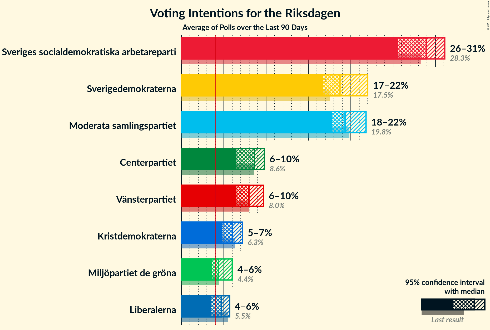
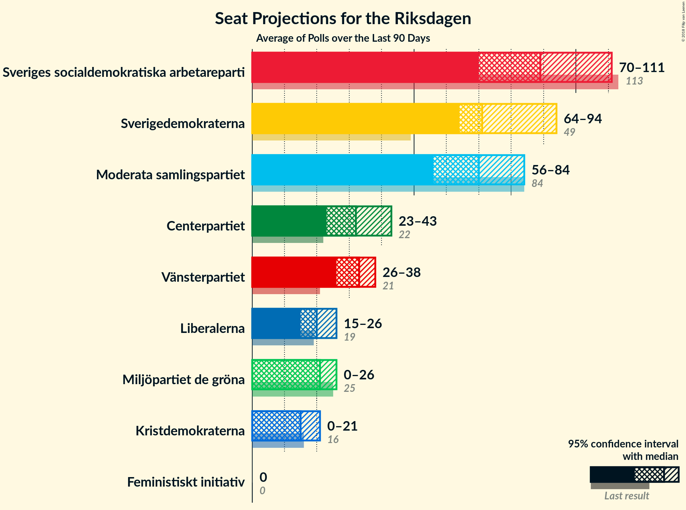
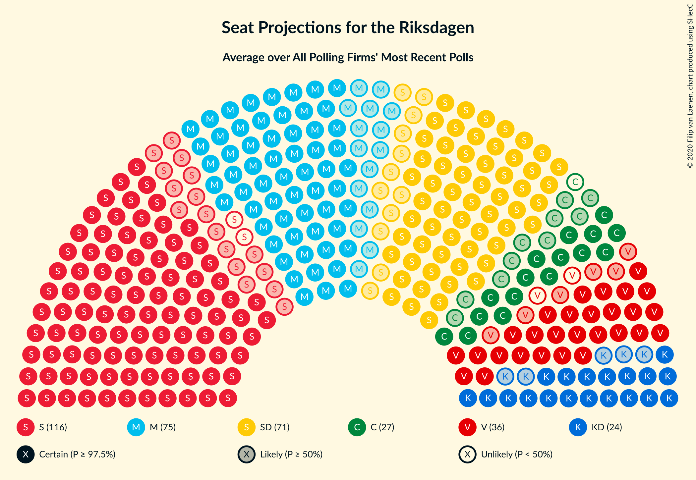
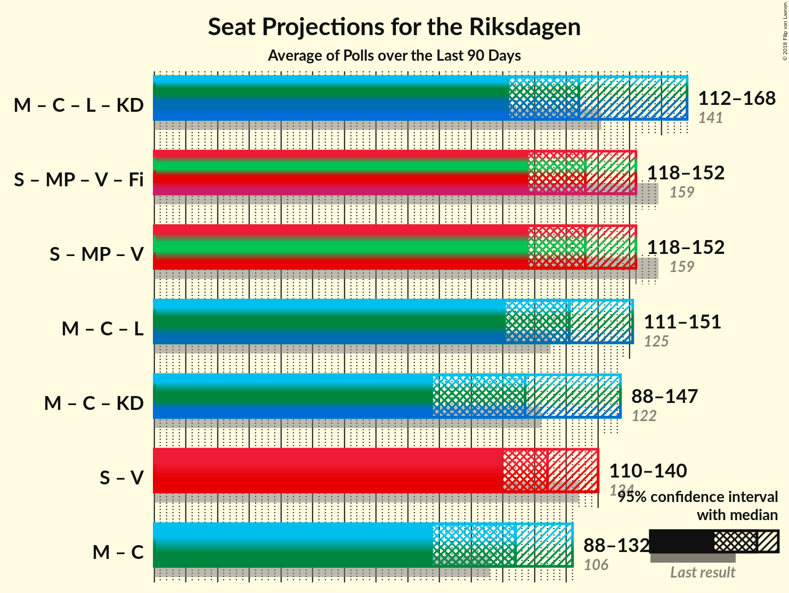

# Overview

The table below lists the most recent polls (less than 90 days old) registered and analyzed so far.

| Period     | Polling firm/Commissioner(s) | S | M | SD | C | V | KD | L | MP |
|:----------:|:----------------------------:|:--:|:--:|:--:|:--:|:--:|:--:|:--:|:--:|
| 9 September 2018 | General Election | 28.3%   100 | 19.8%   70 | 17.5%   62 | 8.6%   31 | 8.0%   28 | 6.3%   22 | 5.5%   20 | 4.4%   16 |
| N/A | [Poll Average](average.html) | 24–29%   89–110 | 19–26%   69–96 | 14–24%   54–87 | 5–11%   19–42 | 8–12%   28–44 | 4–7%   0–26 | 2–4%   0–15 | 3–6%   0–21 |
| [30 March–7 April 2021](2021-04-07-Demoskop.html) | Demoskop | 24–27%   89–103 | 21–24%   80–93 | 18–21%   67–79 | 9–11%   33–42 | 7–10%   28–36 | 4–6%   17–24 | 3–4%   0–16 | 3–4%   0–15 |
| [1 March–4 April 2021](2021-04-04-Novus.html) | Novus   SVT | 26–29%   97–108 | 21–24%   78–90 | 18–20%   65–74 | 8–9%   28–34 | 9–10%   32–39 | 4–5%   0–18 | 2–3%   0 | 4–5%   15–19 |
| [26–29 March 2021](2021-03-29-Sentio.html) | Sentio | 24–30%   86–110 | 17–23%   64–85 | 19–25%   71–93 | 5–8%   16–29 | 7–11%   26–41 | 5–8%   16–29 | 2–4%   0–16 | 4–7%   0–25 |
| [9–21 March 2021](2021-03-21-Ipsos.html) | Ipsos   Dagens Nyheter | 25–29%   92–111 | 20–24%   72–92 | 18–22%   66–83 | 8–11%   29–40 | 9–13%   35–47 | 3–5%   0–19 | 2–4%   0–15 | 3–5%   0–18 |
| [1–11 March 2021](2021-03-11-Sifo.html) | Sifo | 26–28%   96–107 | 22–24%   80–89 | 18–19%   64–72 | 8–9%   30–35 | 9–10%   33–39 | 4–5%   15–18 | 3%   0 | 4–5%   0–17 |
| [19–23 February 2021](2021-02-23-SKOP.html) | SKOP | 25–30%   91–114 | 22–27%   81–102 | 13–18%   48–67 | 8–12%   31–45 | 8–12%   31–46 | 3–6%   0–22 | 2–4%   0 | 3–5%   0–20 |
| 9 September 2018 | General Election | 28.3%   100 | 19.8%   70 | 17.5%   62 | 8.6%   31 | 8.0%   28 | 6.3%   22 | 5.5%   20 | 4.4%   16 |

Only polls for which at least the sample size has been published are included in the table above.

**Legend:**
+ **Top half of each row:** Voting intentions (95% confidence interval)
+ **Bottom half of each row:** Seat projections for the Riksdagen (95% confidence interval)
+ **S:** Sveriges socialdemokratiska arbetareparti
+ **M:** Moderata samlingspartiet
+ **SD:** Sverigedemokraterna
+ **C:** Centerpartiet
+ **V:** Vänsterpartiet
+ **KD:** Kristdemokraterna
+ **L:** Liberalerna
+ **MP:** Miljöpartiet de gröna
+ **N/A (single party):** Party not included the published results
+ **N/A (entire row):** Calculation for this opinion poll not started yet

