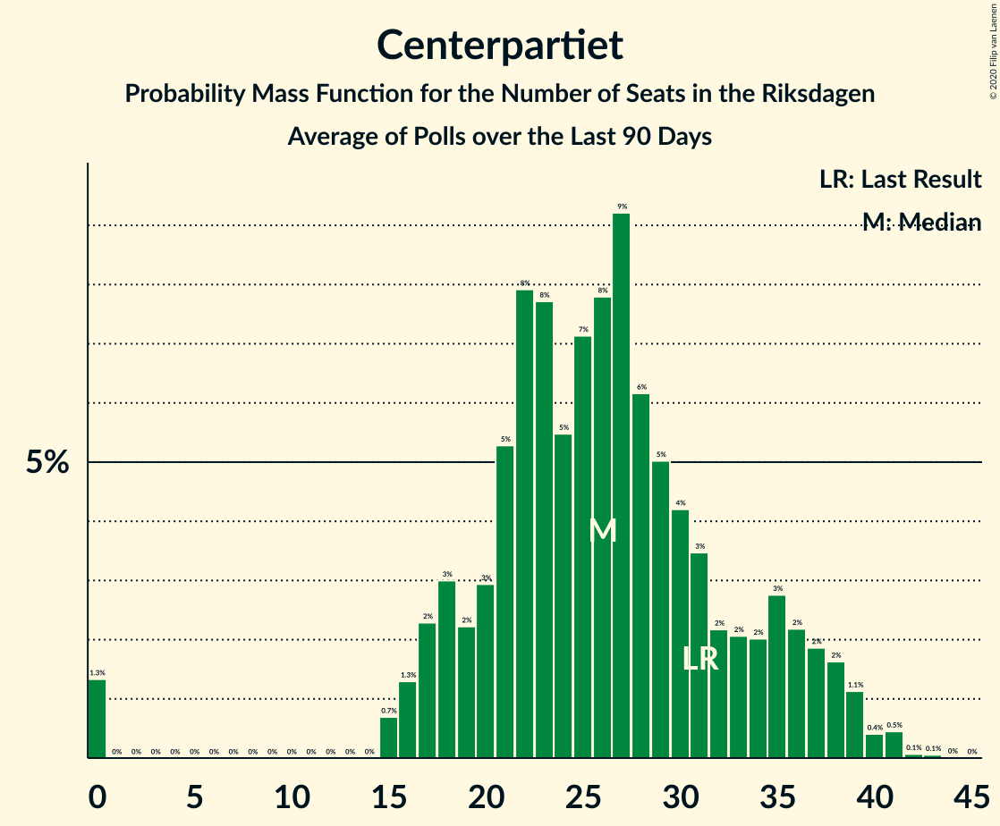

# Centerpartiet

<a href="#voting-intentions">Voting Intentions</a> | <a href="#seats">Seats</a>

## Voting Intentions

Last result: **6.1%** (General Election of 14 September 2014)

### Confidence Intervals

| Period     | Polling firm/Commissioner(s) | Median | 80% Confidence Interval | 90% Confidence Interval | 95% Confidence Interval | 99% Confidence Interval |
|:----------:|:----------------:|:-----------:|:-----------------------:|:-----------------------:|:-----------------------:|:-----------------------:|
| N/A | [Poll Average](average.html) | 8.8% | 7.6–10.8% | 7.2–11.3% | 6.9–11.7% | 6.2–12.5% |
| [16–24 August 2018](2018-08-24-Ipsos.html) | Ipsos   Dagens Nyheter | 8.8% | 8.0–9.7% | 7.8–10.0% | 7.6–10.2% | 7.2–10.6% |
| [20–23 August 2018](2018-08-23-Sifo.html) | Sifo   Svenska Dagbladet | 10.3% | 9.7–10.9% | 9.5–11.1% | 9.4–11.3% | 9.1–11.6% |
| [16–22 August 2018](2018-08-22-SKOP.html) | SKOP | 8.2% | 7.5–9.0% | 7.3–9.3% | 7.1–9.4% | 6.8–9.9% |
| [13–21 August 2018](2018-08-21-Novus.html) | Novus   SVT | 10.0% | 9.1–11.0% | 8.8–11.3% | 8.6–11.5% | 8.2–12.0% |
| [17–20 August 2018](2018-08-20-YouGov.html) | YouGov   Metro | 7.9% | 7.1–8.9% | 6.9–9.2% | 6.7–9.4% | 6.3–9.9% |
| [13–16 August 2018](2018-08-16-Sifo.html) | Sifo   Svenska Dagbladet | 9.5% | 8.9–10.2% | 8.7–10.3% | 8.6–10.5% | 8.3–10.9% |
| [7–16 August 2018](2018-08-16-Ipsos.html) | Ipsos   Dagens Nyheter | 10.1% | 9.3–11.0% | 9.0–11.3% | 8.8–11.5% | 8.4–12.0% |
| [10–16 August 2018](2018-08-16-Inizio.html) | Inizio   Aftonbladet | 8.5% | 7.7–9.3% | 7.5–9.6% | 7.4–9.8% | 7.0–10.2% |
| [8–15 August 2018](2018-08-15-Demoskop.html) | Demoskop   Expressen | 11.1% | 10.1–12.1% | 9.9–12.5% | 9.6–12.7% | 9.2–13.2% |
| [9–14 August 2018](2018-08-14-Sentio.html) | Sentio   Nyheter Idag | 7.7% | 6.6–9.0% | 6.2–9.4% | 6.0–9.8% | 5.5–10.4% |
| [23 July–12 August 2018](2018-08-12-Novus.html) | Novus   SVT | 9.5% | 8.9–10.1% | 8.8–10.3% | 8.7–10.4% | 8.4–10.7% |
| [6–9 August 2018](2018-08-09-Sifo.html) | Sifo   Svenska Dagbladet | 10.3% | 9.5–11.2% | 9.3–11.4% | 9.1–11.6% | 8.7–12.0% |
| [25 July–2 August 2018](2018-08-02-Inizio.html) | Inizio   Aftonbladet | 9.5% | 8.7–10.3% | 8.5–10.6% | 8.4–10.8% | 8.0–11.2% |
| [27 July–1 August 2018](2018-08-01-Sentio.html) | Sentio   Nyheter Idag | 6.9% | 5.8–8.2% | 5.5–8.6% | 5.3–8.9% | 4.8–9.6% |
| [25 June–22 July 2018](2018-07-22-Novus.html) | Novus   SVT | 8.4% | 7.9–8.9% | 7.8–9.1% | 7.7–9.2% | 7.4–9.5% |
| [20 June–21 July 2018](2018-07-21-SKOP.html) | SKOP | 10.1% | 9.0–11.3% | 8.7–11.6% | 8.5–11.9% | 8.0–12.5% |
| [13–15 July 2018](2018-07-15-YouGov.html) | YouGov   Metro | 8.6% | 7.7–9.7% | 7.4–10.0% | 7.1–10.3% | 6.7–10.9% |
| [28 June–3 July 2018](2018-07-03-Sentio.html) | Sentio   Nyheter Idag | 7.1% | 6.1–8.5% | 5.7–8.9% | 5.5–9.2% | 5.0–9.9% |
| [25 June–3 July 2018](2018-07-03-Demoskop.html) | Demoskop   Expressen | 9.8% | 8.9–10.8% | 8.6–11.1% | 8.4–11.3% | 8.0–11.8% |
| [20–26 June 2018](2018-06-26-Inizio.html) | Inizio   Aftonbladet | 9.5% | 8.7–10.4% | 8.5–10.6% | 8.3–10.8% | 7.9–11.3% |
| [7–24 June 2018](2018-06-24-Novus.html) | Novus   SVT | 8.9% | 8.2–9.6% | 8.0–9.9% | 7.8–10.0% | 7.5–10.4% |
| [15–18 June 2018](2018-06-18-YouGov.html) | YouGov   Metro | 7.1% | 6.3–8.0% | 6.1–8.3% | 5.9–8.5% | 5.6–9.0% |
| [8 May–18 June 2018](2018-06-18-SKOP.html) | SKOP | 9.0% | 8.0–10.1% | 7.8–10.5% | 7.5–10.7% | 7.1–11.3% |
| [7–18 June 2018](2018-06-18-Ipsos.html) | Ipsos   Dagens Nyheter | 10.0% | 9.2–11.0% | 8.9–11.3% | 8.7–11.5% | 8.3–12.0% |
| [4–14 June 2018](2018-06-14-Sifo.html) | Sifo   Svenska Dagbladet | 10.8% | 10.0–11.7% | 9.8–12.0% | 9.6–12.2% | 9.2–12.7% |
| [14 May–6 June 2018](2018-06-06-Novus.html) | Novus   SVT | 8.9% | 8.4–9.5% | 8.2–9.6% | 8.1–9.8% | 7.9–10.0% |
| [29 May–6 June 2018](2018-06-06-Demoskop.html) | Demoskop   Expressen | 9.8% | 8.9–10.8% | 8.7–11.1% | 8.5–11.4% | 8.0–11.9% |
| [1–5 June 2018](2018-06-05-Sentio.html) | Sentio   Nyheter Idag | 7.2% | 6.2–8.3% | 6.0–8.7% | 5.7–8.9% | 5.3–9.5% |
| [21–30 May 2018](2018-05-30-Inizio.html) | Inizio   Aftonbladet | 9.5% | 8.7–10.4% | 8.5–10.6% | 8.3–10.8% | 8.0–11.3% |
| [27 April–29 May 2018](2018-05-29-SCB.html) | SCB | 8.7% | 8.2–9.3% | 8.0–9.4% | 7.9–9.6% | 7.7–9.8% |
| [10–21 May 2018](2018-05-21-Ipsos.html) | Ipsos   Dagens Nyheter | 8.9% | 8.1–9.8% | 7.9–10.1% | 7.7–10.3% | 7.3–10.8% |
| [7–17 May 2018](2018-05-17-Sifo.html) | Sifo   Svenska Dagbladet | 8.1% | 7.7–8.5% | 7.6–8.6% | 7.5–8.7% | 7.3–8.9% |
| [11–14 May 2018](2018-05-14-YouGov.html) | YouGov   Metro | 10.1% | 9.2–11.2% | 8.9–11.5% | 8.7–11.7% | 8.3–12.3% |
| [16 April–13 May 2018](2018-05-13-Novus.html) | Novus   SVT | 9.4% | 8.9–9.9% | 8.8–10.1% | 8.6–10.2% | 8.4–10.5% |
| [4–7 May 2018](2018-05-07-Sentio.html) | Sentio   Nyheter Idag | 7.6% | 6.6–8.8% | 6.4–9.1% | 6.1–9.4% | 5.7–10.0% |
| [1–7 May 2018](2018-05-07-Inizio.html) | Inizio   Aftonbladet | 9.0% | 8.3–9.8% | 8.1–10.1% | 7.9–10.3% | 7.6–10.7% |
| [24 April–2 May 2018](2018-05-02-Demoskop.html) | Demoskop   Expressen | 9.1% | 8.2–10.1% | 8.0–10.4% | 7.8–10.6% | 7.4–11.1% |
| [12–23 April 2018](2018-04-23-Ipsos.html) | Ipsos   Dagens Nyheter | 12.0% | 11.0–13.1% | 10.7–13.4% | 10.5–13.7% | 10.0–14.3% |
| [13–16 April 2018](2018-04-16-YouGov.html) | YouGov   Metro | 8.9% | 8.0–9.9% | 7.8–10.2% | 7.5–10.4% | 7.1–10.9% |
| [19 March–15 April 2018](2018-04-15-Novus.html) | Novus   SVT | 9.2% | 8.7–9.8% | 8.5–9.9% | 8.4–10.0% | 8.2–10.3% |
| [16 March–13 April 2018](2018-04-13-SKOP.html) | SKOP | 9.0% | 8.1–10.1% | 7.8–10.4% | 7.6–10.7% | 7.2–11.2% |
| [2–12 April 2018](2018-04-12-Sifo.html) | Sifo   Svenska Dagbladet | 9.7% | 9.3–10.1% | 9.2–10.2% | 9.1–10.3% | 8.9–10.5% |
| [5–10 April 2018](2018-04-10-Sentio.html) | Sentio   Nyheter Idag | 6.4% | 5.5–7.4% | 5.3–7.7% | 5.1–8.0% | 4.7–8.5% |
| [3–9 April 2018](2018-04-09-Inizio.html) | Inizio   Aftonbladet | 9.0% | 8.2–9.9% | 8.0–10.1% | 7.8–10.3% | 7.5–10.7% |
| [27 March–4 April 2018](2018-04-04-Demoskop.html) | Demoskop   Expressen | 9.5% | 8.6–10.5% | 8.4–10.8% | 8.2–11.1% | 7.7–11.5% |
| [16–19 March 2018](2018-03-19-YouGov.html) | YouGov   Metro | 7.6% | 6.7–8.7% | 6.4–9.1% | 6.2–9.3% | 5.8–9.9% |
| [8–19 March 2018](2018-03-19-Ipsos.html) | Ipsos   Dagens Nyheter | 9.9% | 9.0–11.0% | 8.7–11.3% | 8.5–11.5% | 8.1–12.0% |
| [19 February–18 March 2018](2018-03-18-Novus.html) | Novus   SVT | 9.3% | 8.8–9.8% | 8.7–10.0% | 8.6–10.1% | 8.3–10.4% |
| [5–15 March 2018](2018-03-15-Sifo.html) | Sifo   Svenska Dagbladet | 10.0% | 9.6–10.4% | 9.5–10.5% | 9.4–10.6% | 9.2–10.8% |
| [8–14 March 2018](2018-03-14-Sentio.html) | Sentio   Nyheter Idag | 6.4% | 5.4–7.7% | 5.1–8.1% | 4.9–8.4% | 4.4–9.1% |
| [27 February–7 March 2018](2018-03-07-Demoskop.html) | Demoskop   Expressen | 7.9% | 7.1–8.8% | 6.9–9.1% | 6.7–9.3% | 6.3–9.8% |
| [1–5 March 2018](2018-03-05-Inizio.html) | Inizio   Aftonbladet | 8.8% | 8.1–9.6% | 7.9–9.8% | 7.7–10.0% | 7.4–10.4% |
| [16–19 February 2018](2018-02-19-YouGov.html) | YouGov   Metro | 9.3% | 8.3–10.5% | 8.0–10.9% | 7.8–11.2% | 7.3–11.8% |
| [8–19 February 2018](2018-02-19-Ipsos.html) | Ipsos   Dagens Nyheter | 11.0% | 10.0–12.1% | 9.7–12.5% | 9.5–12.8% | 9.0–13.3% |
| [22 January–18 February 2018](2018-02-18-Novus.html) | Novus   SVT | 8.8% | 8.3–9.3% | 8.2–9.5% | 8.0–9.6% | 7.8–9.9% |
| [5–15 February 2018](2018-02-15-Sifo.html) | Sifo   Svenska Dagbladet | 10.5% | 10.1–10.9% | 10.0–11.0% | 9.9–11.1% | 9.7–11.3% |
| [9–14 February 2018](2018-02-14-Sentio.html) | Sentio   Nyheter Idag | 10.9% | 9.5–12.5% | 9.1–13.0% | 8.7–13.4% | 8.1–14.2% |
| [30 January–6 February 2018](2018-02-06-Demoskop.html) | Demoskop   Expressen | 9.3% | 8.5–10.3% | 8.2–10.6% | 8.0–10.9% | 7.6–11.3% |
| [30 January–5 February 2018](2018-02-05-Inizio.html) | Inizio   Aftonbladet | 9.3% | 8.5–10.1% | 8.3–10.4% | 8.1–10.6% | 7.8–11.0% |
| [11 January–2 February 2018](2018-02-02-SKOP.html) | SKOP | 10.7% | 9.6–11.8% | 9.4–12.1% | 9.1–12.4% | 8.7–13.0% |
| [2–22 January 2018](2018-01-22-Novus.html) | Novus   SVT | 8.9% | 8.4–9.5% | 8.2–9.7% | 8.1–9.8% | 7.8–10.1% |
| [10–21 January 2018](2018-01-21-Ipsos.html) | Ipsos   Dagens Nyheter | 9.0% | 8.2–10.0% | 7.9–10.3% | 7.7–10.5% | 7.3–11.0% |
| [8–18 January 2018](2018-01-18-Sifo.html) | Sifo   Svenska Dagbladet | 8.8% | 8.0–9.6% | 7.8–9.8% | 7.7–10.1% | 7.3–10.5% |
| [12–16 January 2018](2018-01-16-Sentio.html) | Sentio   Nyheter Idag | 8.6% | 7.6–9.7% | 7.3–10.0% | 7.1–10.3% | 6.7–10.9% |
| [12–15 January 2018](2018-01-15-YouGov.html) | YouGov   Metro | 9.1% | 8.1–10.3% | 7.8–10.6% | 7.6–10.9% | 7.1–11.5% |
| [2–9 January 2018](2018-01-09-Demoskop.html) | Demoskop   Expressen | 9.2% | 8.3–10.2% | 8.1–10.5% | 7.9–10.7% | 7.5–11.2% |
| [3–8 January 2018](2018-01-08-Inizio.html) | Inizio   Aftonbladet | 9.9% | 9.1–10.8% | 8.9–11.0% | 8.7–11.2% | 8.4–11.6% |
| [27 November–21 December 2017](2017-12-21-Novus.html) | Novus   SVT | 9.8% | 9.2–10.4% | 9.1–10.6% | 8.9–10.8% | 8.6–11.1% |
| [15–18 December 2017](2017-12-18-YouGov.html) | YouGov   Metro | 7.9% | 7.1–8.9% | 6.9–9.2% | 6.7–9.4% | 6.3–9.9% |
| [4–14 December 2017](2017-12-14-Sifo.html) | Sifo   Svenska Dagbladet | 10.2% | 9.4–11.1% | 9.2–11.3% | 9.0–11.6% | 8.6–12.0% |
| [6–14 December 2017](2017-12-14-Ipsos.html) | Ipsos   Dagens Nyheter | 10.0% | 9.1–11.0% | 8.9–11.2% | 8.7–11.5% | 8.2–12.0% |
| [1–6 December 2017](2017-12-06-Sentio.html) | Sentio   Nyheter Idag | 10.0% | 8.8–11.5% | 8.5–11.9% | 8.2–12.2% | 7.7–12.9% |
| [28 November–5 December 2017](2017-12-05-Demoskop.html) | Demoskop   Expressen | 9.1% | 8.2–10.1% | 8.0–10.3% | 7.8–10.6% | 7.4–11.1% |

### Probability Mass Function

The following table shows the probability mass function per percentage block of voting intentions for the [poll average](average.html) for Centerpartiet.

| Voting Intentions | Probability | Accumulated | Special Marks |
|:-----------------:|:-----------:|:-----------:|:-------------:|
| 4.5–5.5% | 0.1% | 100% |  |
| 5.5–6.5% | 1.2% | 99.9% | Last Result |
| 6.5–7.5% | 9% | 98.7% |  |
| 7.5–8.5% | 29% | 90% |  |
| 8.5–9.5% | 28% | 61% | Median |
| 9.5–10.5% | 18% | 33% |  |
| 10.5–11.5% | 11% | 15% |  |
| 11.5–12.5% | 3% | 4% |  |
| 12.5–13.5% | 0.4% | 0.4% |  |
| 13.5–14.5% | 0% | 0% |  |

## Seats

Last result: **22** seats (General Election of 14 September 2014)

### Confidence Intervals

| Period     | Polling firm/Commissioner(s) | Median | 80% Confidence Interval | 90% Confidence Interval | 95% Confidence Interval | 99% Confidence Interval |
|:----------:|:----------------:|:------:|:-----------------------:|:-----------------------:|:-----------------------:|:-----------------------:|
| N/A | [Poll Average](average.html) | 33 | 28–40 | 26–42 | 25–43 | 23–46 |
| [16–24 August 2018](2018-08-24-Ipsos.html) | Ipsos   Dagens Nyheter | 33 | 29–33 | 29–37 | 26–37 | 26–38 |
| [20–23 August 2018](2018-08-23-Sifo.html) | Sifo   Svenska Dagbladet | 34 | 34–39 | 34–43 | 34–43 | 34–43 |
| [16–22 August 2018](2018-08-22-SKOP.html) | SKOP | 30 | 30 | 30–31 | 27–31 | 27–35 |
| [13–21 August 2018](2018-08-21-Novus.html) | Novus   SVT | 37 | 37 | 33–37 | 33–37 | 33–41 |
| [17–20 August 2018](2018-08-20-YouGov.html) | YouGov   Metro | 30 | 26–33 | 25–34 | 24–35 | 23–37 |
| [13–16 August 2018](2018-08-16-Sifo.html) | Sifo   Svenska Dagbladet | 34 | 32–37 | 31–37 | 31–38 | 29–39 |
| [7–16 August 2018](2018-08-16-Ipsos.html) | Ipsos   Dagens Nyheter | 36 | 33–40 | 32–41 | 31–42 | 31–44 |
| [10–16 August 2018](2018-08-16-Inizio.html) | Inizio   Aftonbladet | 31 | 28–34 | 27–35 | 26–35 | 25–37 |
| [8–15 August 2018](2018-08-15-Demoskop.html) | Demoskop   Expressen | 41 | 37–45 | 36–46 | 35–47 | 34–49 |
| [9–14 August 2018](2018-08-14-Sentio.html) | Sentio   Nyheter Idag | 29 | 24–34 | 23–35 | 22–37 | 21–39 |
| [23 July–12 August 2018](2018-08-12-Novus.html) | Novus   SVT | 35 | 35–38 | 33–38 | 32–38 | 32–40 |
| [6–9 August 2018](2018-08-09-Sifo.html) | Sifo   Svenska Dagbladet | 38 | 35–41 | 35–42 | 34–43 | 32–44 |
| [25 July–2 August 2018](2018-08-02-Inizio.html) | Inizio   Aftonbladet | 35 | 32–38 | 31–39 | 31–39 | 29–41 |
| [27 July–1 August 2018](2018-08-01-Sentio.html) | Sentio   Nyheter Idag | 26 | 22–31 | 21–33 | 20–34 | 18–37 |
| [25 June–22 July 2018](2018-07-22-Novus.html) | Novus   SVT | 31 | 29–33 | 29–34 | 28–34 | 27–35 |
| [20 June–21 July 2018](2018-07-21-SKOP.html) | SKOP | 39 | 34–43 | 33–44 | 31–45 | 30–48 |
| [13–15 July 2018](2018-07-15-YouGov.html) | YouGov   Metro | 31 | 28–36 | 27–37 | 26–38 | 24–40 |
| [28 June–3 July 2018](2018-07-03-Sentio.html) | Sentio   Nyheter Idag | 27 | 22–32 | 21–33 | 20–35 | 18–37 |
| [25 June–3 July 2018](2018-07-03-Demoskop.html) | Demoskop   Expressen | 37 | 33–41 | 32–42 | 32–43 | 30–45 |
| [20–26 June 2018](2018-06-26-Inizio.html) | Inizio   Aftonbladet | 35 | 32–38 | 31–40 | 31–40 | 29–42 |
| [7–24 June 2018](2018-06-24-Novus.html) | Novus   SVT | 33 | 30–36 | 30–37 | 29–38 | 28–39 |
| [15–18 June 2018](2018-06-18-YouGov.html) | YouGov   Metro | 28 | 24–31 | 23–32 | 23–33 | 21–35 |
| [8 May–18 June 2018](2018-06-18-SKOP.html) | SKOP | 34 | 30–38 | 29–40 | 28–41 | 27–43 |
| [7–18 June 2018](2018-06-18-Ipsos.html) | Ipsos   Dagens Nyheter | 39 | 34–43 | 33–44 | 33–45 | 31–47 |
| [4–14 June 2018](2018-06-14-Sifo.html) | Sifo   Svenska Dagbladet | 40 | 37–44 | 36–45 | 36–46 | 34–48 |
| [14 May–6 June 2018](2018-06-06-Novus.html) | Novus   SVT | 33 | 31–35 | 31–36 | 30–36 | 29–38 |
| [29 May–6 June 2018](2018-06-06-Demoskop.html) | Demoskop   Expressen | 37 | 33–41 | 32–42 | 31–42 | 30–45 |
| [1–5 June 2018](2018-06-05-Sentio.html) | Sentio   Nyheter Idag | 28 | 23–31 | 22–32 | 21–33 | 20–35 |
| [21–30 May 2018](2018-05-30-Inizio.html) | Inizio   Aftonbladet | 36 | 33–39 | 31–40 | 31–41 | 29–42 |
| [27 April–29 May 2018](2018-05-29-SCB.html) | SCB | 32 | 31–35 | 30–35 | 29–36 | 29–37 |
| [10–21 May 2018](2018-05-21-Ipsos.html) | Ipsos   Dagens Nyheter | 30 | 28–34 | 27–35 | 27–36 | 26–42 |
| [7–17 May 2018](2018-05-17-Sifo.html) | Sifo   Svenska Dagbladet | 31 | 29–32 | 29–33 | 28–34 | 27–34 |
| [11–14 May 2018](2018-05-14-YouGov.html) | YouGov   Metro | 39 | 35–44 | 34–46 | 33–48 | 32–49 |
| [16 April–13 May 2018](2018-05-13-Novus.html) | Novus   SVT | 36 | 33–38 | 33–38 | 32–39 | 32–40 |
| [4–7 May 2018](2018-05-07-Sentio.html) | Sentio   Nyheter Idag | 29 | 26–34 | 24–35 | 24–36 | 22–38 |
| [1–7 May 2018](2018-05-07-Inizio.html) | Inizio   Aftonbladet | 35 | 31–37 | 30–38 | 29–39 | 28–41 |
| [24 April–2 May 2018](2018-05-02-Demoskop.html) | Demoskop   Expressen | 34 | 31–38 | 30–38 | 29–39 | 28–42 |
| [12–23 April 2018](2018-04-23-Ipsos.html) | Ipsos   Dagens Nyheter | 46 | 42–50 | 41–52 | 39–53 | 38–55 |
| [13–16 April 2018](2018-04-16-YouGov.html) | YouGov   Metro | 35 | 31–39 | 30–40 | 29–41 | 27–44 |
| [19 March–15 April 2018](2018-04-15-Novus.html) | Novus   SVT | 35 | 33–37 | 32–38 | 31–38 | 31–39 |
| [16 March–13 April 2018](2018-04-13-SKOP.html) | SKOP | 35 | 31–37 | 29–38 | 28–40 | 27–42 |
| [2–12 April 2018](2018-04-12-Sifo.html) | Sifo   Svenska Dagbladet | 37 | 35–40 | 34–40 | 34–41 | 33–41 |
| [5–10 April 2018](2018-04-10-Sentio.html) | Sentio   Nyheter Idag | 25 | 21–29 | 20–30 | 19–31 | 18–33 |
| [3–9 April 2018](2018-04-09-Inizio.html) | Inizio   Aftonbladet | 34 | 32–38 | 31–39 | 30–40 | 28–42 |
| [27 March–4 April 2018](2018-04-04-Demoskop.html) | Demoskop   Expressen | 35 | 33–40 | 31–41 | 30–41 | 29–44 |
| [16–19 March 2018](2018-03-19-YouGov.html) | YouGov   Metro | 29 | 26–33 | 24–35 | 23–36 | 22–38 |
| [8–19 March 2018](2018-03-19-Ipsos.html) | Ipsos   Dagens Nyheter | 38 | 34–42 | 33–44 | 32–44 | 31–47 |
| [19 February–18 March 2018](2018-03-18-Novus.html) | Novus   SVT | 36 | 34–38 | 33–38 | 32–39 | 31–40 |
| [5–15 March 2018](2018-03-15-Sifo.html) | Sifo   Svenska Dagbladet | 39 | 37–40 | 36–41 | 36–41 | 35–42 |
| [8–14 March 2018](2018-03-14-Sentio.html) | Sentio   Nyheter Idag | 25 | 20–29 | 19–31 | 18–32 | 16–35 |
| [27 February–7 March 2018](2018-03-07-Demoskop.html) | Demoskop   Expressen | 29 | 27–33 | 26–34 | 25–35 | 23–37 |
| [1–5 March 2018](2018-03-05-Inizio.html) | Inizio   Aftonbladet | 34 | 31–38 | 31–38 | 30–39 | 29–41 |
| [16–19 February 2018](2018-02-19-YouGov.html) | YouGov   Metro | 37 | 32–41 | 31–42 | 30–44 | 29–46 |
| [8–19 February 2018](2018-02-19-Ipsos.html) | Ipsos   Dagens Nyheter | 43 | 38–46 | 37–47 | 36–49 | 34–52 |
| [22 January–18 February 2018](2018-02-18-Novus.html) | Novus   SVT | 33 | 31–35 | 30–35 | 30–36 | 29–37 |
| [5–15 February 2018](2018-02-15-Sifo.html) | Sifo   Svenska Dagbladet | 39 | 37–40 | 37–40 | 36–41 | 36–42 |
| [9–14 February 2018](2018-02-14-Sentio.html) | Sentio   Nyheter Idag | 42 | 36–48 | 34–50 | 33–51 | 31–55 |
| [30 January–6 February 2018](2018-02-06-Demoskop.html) | Demoskop   Expressen | 35 | 32–39 | 30–40 | 30–41 | 28–42 |
| [30 January–5 February 2018](2018-02-05-Inizio.html) | Inizio   Aftonbladet | 37 | 33–40 | 32–41 | 32–42 | 30–44 |
| [11 January–2 February 2018](2018-02-02-SKOP.html) | SKOP | 41 | 36–45 | 36–46 | 34–47 | 33–49 |
| [2–22 January 2018](2018-01-22-Novus.html) | Novus   SVT | 36 | 32–37 | 31–37 | 30–38 | 29–38 |
| [10–21 January 2018](2018-01-21-Ipsos.html) | Ipsos   Dagens Nyheter | 34 | 30–38 | 30–38 | 30–39 | 27–41 |
| [8–18 January 2018](2018-01-18-Sifo.html) | Sifo   Svenska Dagbladet | 32 | 30–36 | 30–38 | 29–40 | 27–40 |
| [12–16 January 2018](2018-01-16-Sentio.html) | Sentio   Nyheter Idag | 34 | 30–38 | 29–40 | 28–40 | 26–43 |
| [12–15 January 2018](2018-01-15-YouGov.html) | YouGov   Metro | 35 | 31–40 | 30–41 | 29–42 | 28–44 |
| [2–9 January 2018](2018-01-09-Demoskop.html) | Demoskop   Expressen | 34 | 30–38 | 29–38 | 29–39 | 27–43 |
| [3–8 January 2018](2018-01-08-Inizio.html) | Inizio   Aftonbladet | 39 | 36–43 | 36–43 | 33–43 | 32–45 |
| [27 November–21 December 2017](2017-12-21-Novus.html) | Novus   SVT | 36 | 33–38 | 33–40 | 33–40 | 32–41 |
| [15–18 December 2017](2017-12-18-YouGov.html) | YouGov   Metro | 31 | 27–34 | 26–35 | 26–36 | 24–38 |
| [4–14 December 2017](2017-12-14-Sifo.html) | Sifo   Svenska Dagbladet | 35 | 35–41 | 35–42 | 35–42 | 33–45 |
| [6–14 December 2017](2017-12-14-Ipsos.html) | Ipsos   Dagens Nyheter | 40 | 35–42 | 34–42 | 32–43 | 31–45 |
| [1–6 December 2017](2017-12-06-Sentio.html) | Sentio   Nyheter Idag | 39 | 34–44 | 32–47 | 31–48 | 29–52 |
| [28 November–5 December 2017](2017-12-05-Demoskop.html) | Demoskop   Expressen | 33 | 31–38 | 30–40 | 29–40 | 28–42 |

### Probability Mass Function

The following table shows the probability mass function per seat for the [poll average](average.html) for Centerpartiet.

| Number of Seats | Probability | Accumulated | Special Marks |
|:---------------:|:-----------:|:-----------:|:-------------:|
| 20 | 0% | 100% |  |
| 21 | 0.1% | 99.9% |  |
| 22 | 0.2% | 99.8% | Last Result |
| 23 | 0.4% | 99.6% |  |
| 24 | 0.9% | 99.2% |  |
| 25 | 1.2% | 98% |  |
| 26 | 3% | 97% |  |
| 27 | 3% | 94% |  |
| 28 | 4% | 92% |  |
| 29 | 6% | 88% |  |
| 30 | 6% | 83% |  |
| 31 | 7% | 77% |  |
| 32 | 17% | 70% |  |
| 33 | 13% | 53% | Median |
| 34 | 14% | 40% |  |
| 35 | 3% | 26% |  |
| 36 | 3% | 23% |  |
| 37 | 4% | 20% |  |
| 38 | 2% | 16% |  |
| 39 | 3% | 14% |  |
| 40 | 2% | 11% |  |
| 41 | 3% | 9% |  |
| 42 | 2% | 5% |  |
| 43 | 2% | 4% |  |
| 44 | 0.4% | 2% |  |
| 45 | 0.5% | 1.2% |  |
| 46 | 0.4% | 0.7% |  |
| 47 | 0.1% | 0.3% |  |
| 48 | 0.1% | 0.2% |  |
| 49 | 0% | 0.1% |  |
| 50 | 0% | 0% |  |

