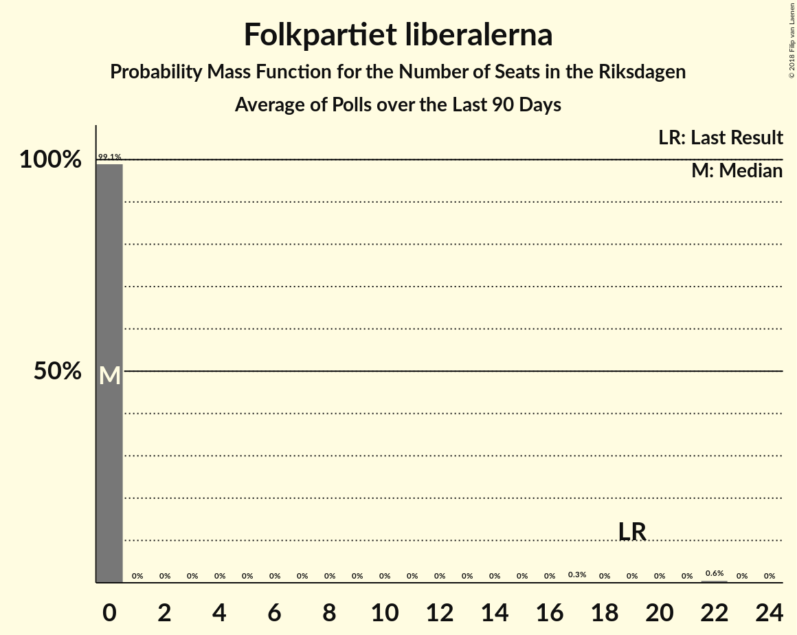

# Folkpartiet liberalerna

<a href="#voting-intentions">Voting Intentions</a> | <a href="#seats">Seats</a>

## Voting Intentions

Last result: **5.4%** (General Election of 14 September 2014)

### Confidence Intervals

| Period     | Polling firm/Commissioner(s) | Median | 80% Confidence Interval | 90% Confidence Interval | 95% Confidence Interval | 99% Confidence Interval |
|:----------:|:----------------:|:-----------:|:-----------------------:|:-----------------------:|:-----------------------:|:-----------------------:|
| N/A | [Poll Average](average.html) | 4.3% | 3.8–4.9% | 3.6–5.1% | 3.5–5.3% | 3.2–5.6% |
| [21–30 May 2018](2018-05-30-Inizio.html) | Inizio   Aftonbladet | 4.3% | 3.7–4.9% | 3.6–5.2% | 3.4–5.3% | 3.2–5.6% |
| [27 April–29 May 2018](2018-05-29-SCB.html) | SCB | 4.4% | N/A | N/A | N/A | N/A |
| [10–21 May 2018](2018-05-21-Ipsos.html) | Ipsos   Dagens Nyheter | 5.0% | N/A | N/A | N/A | N/A |
| [7–17 May 2018](2018-05-17-Sifo.html) | Sifo   Svenska Dagbladet | 4.8% | N/A | N/A | N/A | N/A |
| [11–14 May 2018](2018-05-14-YouGov.html) | YouGov   Metro | 4.2% | N/A | N/A | N/A | N/A |
| [16 April–13 May 2018](2018-05-13-Novus.html) | Novus   SVT | 4.4% | N/A | N/A | N/A | N/A |
| [4–7 May 2018](2018-05-07-Sentio.html) | Sentio   Nyheter Idag | 3.7% | N/A | N/A | N/A | N/A |
| [1–7 May 2018](2018-05-07-Inizio.html) | Inizio   Aftonbladet | 4.2% | N/A | N/A | N/A | N/A |
| [24 April–2 May 2018](2018-05-02-Demoskop.html) | Demoskop   Expressen | 4.9% | N/A | N/A | N/A | N/A |
| [12–23 April 2018](2018-04-23-Ipsos.html) | Ipsos   Dagens Nyheter | 5.0% | N/A | N/A | N/A | N/A |
| [13–16 April 2018](2018-04-16-YouGov.html) | YouGov   Metro | 4.0% | N/A | N/A | N/A | N/A |
| [19 March–15 April 2018](2018-04-15-Novus.html) | Novus   SVT | 5.0% | N/A | N/A | N/A | N/A |
| [16 March–13 April 2018](2018-04-13-SKOP.html) | SKOP | 5.1% | N/A | N/A | N/A | N/A |
| [2–12 April 2018](2018-04-12-Sifo.html) | Sifo   Svenska Dagbladet | 4.4% | N/A | N/A | N/A | N/A |
| [5–10 April 2018](2018-04-10-Sentio.html) | Sentio   Nyheter Idag | 4.4% | N/A | N/A | N/A | N/A |
| [3–9 April 2018](2018-04-09-Inizio.html) | Inizio   Aftonbladet | 3.9% | N/A | N/A | N/A | N/A |
| [27 March–4 April 2018](2018-04-04-Demoskop.html) | Demoskop   Expressen | 4.0% | N/A | N/A | N/A | N/A |
| [16–19 March 2018](2018-03-19-YouGov.html) | YouGov   Metro | 4.7% | N/A | N/A | N/A | N/A |
| [8–19 March 2018](2018-03-19-Ipsos.html) | Ipsos   Dagens Nyheter | 5.0% | N/A | N/A | N/A | N/A |
| [19 February–18 March 2018](2018-03-18-Novus.html) | Novus   SVT | 5.0% | N/A | N/A | N/A | N/A |
| [5–15 March 2018](2018-03-15-Sifo.html) | Sifo   Svenska Dagbladet | 4.4% | N/A | N/A | N/A | N/A |
| [8–14 March 2018](2018-03-14-Sentio.html) | Sentio   Nyheter Idag | 3.9% | N/A | N/A | N/A | N/A |
| [27 February–7 March 2018](2018-03-07-Demoskop.html) | Demoskop   Expressen | 5.1% | N/A | N/A | N/A | N/A |
| [1–5 March 2018](2018-03-05-Inizio.html) | Inizio   Aftonbladet | 3.6% | N/A | N/A | N/A | N/A |
| [16–19 February 2018](2018-02-19-YouGov.html) | YouGov   Metro | 4.7% | N/A | N/A | N/A | N/A |
| [8–19 February 2018](2018-02-19-Ipsos.html) | Ipsos   Dagens Nyheter | 5.0% | N/A | N/A | N/A | N/A |
| [22 January–18 February 2018](2018-02-18-Novus.html) | Novus   SVT | 4.6% | N/A | N/A | N/A | N/A |
| [5–15 February 2018](2018-02-15-Sifo.html) | Sifo   Svenska Dagbladet | 5.0% | N/A | N/A | N/A | N/A |
| [9–14 February 2018](2018-02-14-Sentio.html) | Sentio   Nyheter Idag | 4.3% | N/A | N/A | N/A | N/A |
| [30 January–6 February 2018](2018-02-06-Demoskop.html) | Demoskop   Expressen | 4.9% | N/A | N/A | N/A | N/A |
| [30 January–5 February 2018](2018-02-05-Inizio.html) | Inizio   Aftonbladet | 4.0% | N/A | N/A | N/A | N/A |
| [11 January–2 February 2018](2018-02-02-SKOP.html) | SKOP | 5.1% | N/A | N/A | N/A | N/A |

### Probability Mass Function

The following table shows the probability mass function per percentage block of voting intentions for the [poll average](average.html) for Folkpartiet liberalerna.

| Voting Intentions | Probability | Accumulated | Special Marks |
|:-----------------:|:-----------:|:-----------:|:-------------:|
| 1.5–2.5% | 0% | 100% |  |
| 2.5–3.5% | 3% | 100% |  |
| 3.5–4.5% | 64% | 97% | Median |
| 4.5–5.5% | 32% | 33% | Last Result |
| 5.5–6.5% | 0.7% | 0.7% |  |
| 6.5–7.5% | 0% | 0% |  |

## Seats

Last result: **19** seats (General Election of 14 September 2014)

### Confidence Intervals

| Period     | Polling firm/Commissioner(s) | Median | 80% Confidence Interval | 90% Confidence Interval | 95% Confidence Interval | 99% Confidence Interval |
|:----------:|:----------------:|:------:|:-----------------------:|:-----------------------:|:-----------------------:|:-----------------------:|
| N/A | [Poll Average](average.html) |  |  |  |  |  |
| [21–30 May 2018](2018-05-30-Inizio.html) | Inizio   Aftonbladet |  |  |  |  |  |
| [27 April–29 May 2018](2018-05-29-SCB.html) | SCB |  |  |  |  |  |
| [10–21 May 2018](2018-05-21-Ipsos.html) | Ipsos   Dagens Nyheter |  |  |  |  |  |
| [7–17 May 2018](2018-05-17-Sifo.html) | Sifo   Svenska Dagbladet |  |  |  |  |  |
| [11–14 May 2018](2018-05-14-YouGov.html) | YouGov   Metro |  |  |  |  |  |
| [16 April–13 May 2018](2018-05-13-Novus.html) | Novus   SVT |  |  |  |  |  |
| [4–7 May 2018](2018-05-07-Sentio.html) | Sentio   Nyheter Idag |  |  |  |  |  |
| [1–7 May 2018](2018-05-07-Inizio.html) | Inizio   Aftonbladet |  |  |  |  |  |
| [24 April–2 May 2018](2018-05-02-Demoskop.html) | Demoskop   Expressen |  |  |  |  |  |
| [12–23 April 2018](2018-04-23-Ipsos.html) | Ipsos   Dagens Nyheter |  |  |  |  |  |
| [13–16 April 2018](2018-04-16-YouGov.html) | YouGov   Metro |  |  |  |  |  |
| [19 March–15 April 2018](2018-04-15-Novus.html) | Novus   SVT |  |  |  |  |  |
| [16 March–13 April 2018](2018-04-13-SKOP.html) | SKOP |  |  |  |  |  |
| [2–12 April 2018](2018-04-12-Sifo.html) | Sifo   Svenska Dagbladet |  |  |  |  |  |
| [5–10 April 2018](2018-04-10-Sentio.html) | Sentio   Nyheter Idag |  |  |  |  |  |
| [3–9 April 2018](2018-04-09-Inizio.html) | Inizio   Aftonbladet |  |  |  |  |  |
| [27 March–4 April 2018](2018-04-04-Demoskop.html) | Demoskop   Expressen |  |  |  |  |  |
| [16–19 March 2018](2018-03-19-YouGov.html) | YouGov   Metro |  |  |  |  |  |
| [8–19 March 2018](2018-03-19-Ipsos.html) | Ipsos   Dagens Nyheter |  |  |  |  |  |
| [19 February–18 March 2018](2018-03-18-Novus.html) | Novus   SVT |  |  |  |  |  |
| [5–15 March 2018](2018-03-15-Sifo.html) | Sifo   Svenska Dagbladet |  |  |  |  |  |
| [8–14 March 2018](2018-03-14-Sentio.html) | Sentio   Nyheter Idag |  |  |  |  |  |
| [27 February–7 March 2018](2018-03-07-Demoskop.html) | Demoskop   Expressen |  |  |  |  |  |
| [1–5 March 2018](2018-03-05-Inizio.html) | Inizio   Aftonbladet |  |  |  |  |  |
| [16–19 February 2018](2018-02-19-YouGov.html) | YouGov   Metro |  |  |  |  |  |
| [8–19 February 2018](2018-02-19-Ipsos.html) | Ipsos   Dagens Nyheter |  |  |  |  |  |
| [22 January–18 February 2018](2018-02-18-Novus.html) | Novus   SVT |  |  |  |  |  |
| [5–15 February 2018](2018-02-15-Sifo.html) | Sifo   Svenska Dagbladet |  |  |  |  |  |
| [9–14 February 2018](2018-02-14-Sentio.html) | Sentio   Nyheter Idag |  |  |  |  |  |
| [30 January–6 February 2018](2018-02-06-Demoskop.html) | Demoskop   Expressen |  |  |  |  |  |
| [30 January–5 February 2018](2018-02-05-Inizio.html) | Inizio   Aftonbladet |  |  |  |  |  |
| [11 January–2 February 2018](2018-02-02-SKOP.html) | SKOP |  |  |  |  |  |

### Probability Mass Function

The following table shows the probability mass function per seat for the [poll average](average.html) for Folkpartiet liberalerna.

