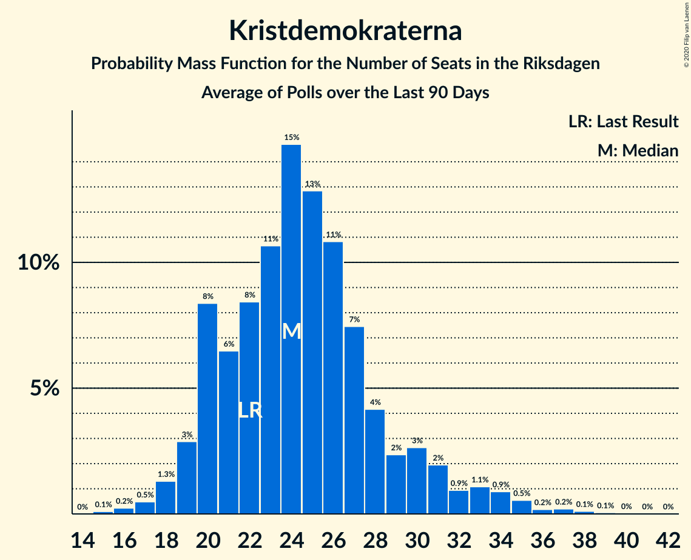

# Kristdemokraterna

<a href="#voting-intentions">Voting Intentions</a> | <a href="#seats">Seats</a>

## Voting Intentions

Last result: **6.3%** (General Election of 9 September 2018)

### Confidence Intervals

| Period     | Polling firm/Commissioner(s) | Median | 80% Confidence Interval | 90% Confidence Interval | 95% Confidence Interval | 99% Confidence Interval |
|:----------:|:----------------:|:-----------:|:-----------------------:|:-----------------------:|:-----------------------:|:-----------------------:|
| N/A | [Poll Average](average.html) | 6.1% | 5.1–6.9% | 5.0–7.1% | 4.9–7.3% | 4.5–7.7% |
| [8–11 July 2022](2022-07-11-SKOP.html) | SKOP | 5.7% | 4.9–6.8% | 4.7–7.1% | 4.5–7.4% | 4.1–7.9% |
| [22–30 June 2022](2022-06-30-Demoskop.html) | Demoskop   Aftonbladet | 6.1% | 5.5–6.8% | 5.3–7.0% | 5.2–7.2% | 4.9–7.6% |
| [6–26 June 2022](2022-06-26-Novus.html) | Novus   SVT | 6.7% | 6.1–7.3% | 6.0–7.5% | 5.8–7.7% | 5.6–8.0% |
| [7–19 June 2022](2022-06-19-Ipsos.html) | Ipsos   Dagens Nyheter | 6.0% | 5.3–6.8% | 5.1–7.1% | 4.9–7.3% | 4.6–7.7% |
| [6–16 June 2022](2022-06-16-Sifo.html) | Sifo   Svenska Dagbladet | 6.3% | 6.0–6.6% | 5.9–6.7% | 5.8–6.8% | 5.7–7.0% |
| [31 May–9 June 2022](2022-06-09-Demoskop.html) | Demoskop   Aftonbladet | 5.7% | 5.1–6.4% | 4.9–6.6% | 4.8–6.8% | 4.5–7.1% |
| [9 May–5 June 2022](2022-06-05-Novus.html) | Novus   SVT | 6.3% | 5.8–6.8% | 5.7–7.0% | 5.6–7.1% | 5.3–7.4% |
| [28 April–25 May 2022](2022-05-25-SCB.html) | SCB | 5.2% | 4.9–5.5% | 4.8–5.6% | 4.8–5.7% | 4.6–5.8% |
| [10–22 May 2022](2022-05-22-Ipsos.html) | Ipsos   Dagens Nyheter | 5.0% | 4.3–5.8% | 4.1–6.0% | 4.0–6.2% | 3.7–6.6% |
| [2–12 May 2022](2022-05-12-Sifo.html) | Sifo   Svenska Dagbladet | 5.6% | 5.3–6.0% | 5.2–6.1% | 5.1–6.2% | 4.9–6.4% |
| [4–10 May 2022](2022-05-10-Infostat.html) | Infostat | 6.0% | 5.3–6.8% | 5.1–7.0% | 4.9–7.2% | 4.6–7.6% |
| [26 April–4 May 2022](2022-05-04-Demoskop.html) | Demoskop   Aftonbladet | 6.9% | 6.2–7.6% | 6.0–7.8% | 5.9–8.0% | 5.6–8.4% |
| [4 April–1 May 2022](2022-05-01-Novus.html) | Novus   SVT | 5.9% | 5.4–6.4% | 5.3–6.6% | 5.2–6.7% | 4.9–7.0% |
| [12–26 April 2022](2022-04-26-Ipsos.html) | Ipsos   Dagens Nyheter | 6.0% | 5.3–6.8% | 5.1–7.1% | 4.9–7.3% | 4.6–7.7% |
| [11–21 April 2022](2022-04-21-Sifo.html) | Sifo   Svenska Dagbladet | 4.9% | 4.6–5.2% | 4.5–5.3% | 4.4–5.4% | 4.3–5.6% |
| [6–14 April 2022](2022-04-14-SKOP.html) | SKOP | 5.8% | 4.9–6.8% | 4.7–7.1% | 4.5–7.4% | 4.1–7.9% |
| [29 March–5 April 2022](2022-04-05-Demoskop.html) | Demoskop   Aftonbladet | 5.4% | 4.8–6.1% | 4.7–6.3% | 4.5–6.4% | 4.3–6.8% |
| [7 March–3 April 2022](2022-04-03-Novus.html) | Novus   SVT | 5.7% | 5.2–6.2% | 5.1–6.3% | 5.0–6.5% | 4.8–6.7% |
| [15–27 March 2022](2022-03-27-Ipsos.html) | Ipsos   Dagens Nyheter | 6.0% | 5.3–6.8% | 5.1–7.1% | 4.9–7.3% | 4.6–7.7% |
| [7–17 March 2022](2022-03-17-Sifo.html) | Sifo   Svenska Dagbladet | 4.9% | 4.6–5.3% | 4.5–5.3% | 4.4–5.4% | 4.3–5.6% |
| [1–9 March 2022](2022-03-09-Demoskop.html) | Demoskop   Aftonbladet | 6.5% | 5.9–7.2% | 5.7–7.4% | 5.5–7.6% | 5.2–8.0% |
| [31 January–27 February 2022](2022-02-27-Novus.html) | Novus   SVT | 5.1% | 4.6–5.7% | 4.4–5.9% | 4.3–6.1% | 4.1–6.4% |
| [8–20 February 2022](2022-02-20-Ipsos.html) | Ipsos   Dagens Nyheter | 5.0% | 4.4–5.8% | 4.2–6.0% | 4.0–6.2% | 3.8–6.5% |
| [7–17 February 2022](2022-02-17-Sifo.html) | Sifo   Svenska Dagbladet | 5.3% | 4.9–5.7% | 4.8–5.8% | 4.8–5.9% | 4.6–6.1% |
| [11–14 February 2022](2022-02-14-SKOP.html) | SKOP | 4.2% | 3.5–5.2% | 3.3–5.4% | 3.2–5.7% | 2.9–6.2% |
| [1–8 February 2022](2022-02-08-Demoskop.html) | Demoskop   Aftonbladet | 5.6% | 5.0–6.2% | 4.9–6.4% | 4.8–6.6% | 4.5–6.9% |
| [3–30 January 2022](2022-01-30-Novus.html) | Novus   SVT | 5.4% | 5.0–5.9% | 4.8–6.1% | 4.7–6.2% | 4.5–6.4% |
| [11–24 January 2022](2022-01-24-Ipsos.html) | Ipsos   Dagens Nyheter | 6.0% | 5.3–6.8% | 5.1–7.1% | 5.0–7.3% | 4.7–7.7% |
| [10–20 January 2022](2022-01-20-Sifo.html) | Sifo   Svenska Dagbladet | 4.4% | 4.1–4.7% | 4.0–4.8% | 3.9–4.9% | 3.8–5.1% |
| [28 December 2021–5 January 2022](2022-01-05-Demoskop.html) | Demoskop   Aftonbladet | 5.4% | 4.9–6.1% | 4.7–6.2% | 4.6–6.4% | 4.3–6.7% |
| [6 December 2021–2 January 2022](2022-01-02-Novus.html) | Novus   SVT | 5.6% | 5.0–6.3% | 4.8–6.5% | 4.7–6.7% | 4.4–7.1% |
| [7–20 December 2021](2021-12-20-Ipsos.html) | Ipsos   Dagens Nyheter | 5.0% | 4.4–5.8% | 4.2–6.0% | 4.0–6.2% | 3.7–6.6% |
| [6–16 December 2021](2021-12-16-Sifo.html) | Sifo   Svenska Dagbladet | 5.2% | 4.8–5.6% | 4.7–5.7% | 4.7–5.8% | 4.5–6.0% |
| [30 November–8 December 2021](2021-12-08-Demoskop.html) | Demoskop   Aftonbladet | 6.0% | 5.4–6.7% | 5.3–6.9% | 5.1–7.0% | 4.9–7.4% |
| [8 November–5 December 2021](2021-12-05-Novus.html) | Novus   SVT | 4.7% | 4.3–5.2% | 4.2–5.3% | 4.1–5.4% | 3.9–5.6% |
| [28 October–25 November 2021](2021-11-25-SCB.html) | SCB | 4.6% | 4.3–4.9% | 4.3–5.0% | 4.2–5.1% | 4.1–5.2% |
| [9–22 November 2021](2021-11-22-Ipsos.html) | Ipsos   Dagens Nyheter | 6.0% | 5.3–6.9% | 5.1–7.1% | 5.0–7.3% | 4.7–7.7% |
| [8–18 November 2021](2021-11-18-Sifo.html) | Sifo   Svenska Dagbladet | 4.6% | 4.3–5.0% | 4.2–5.1% | 4.1–5.2% | 3.9–5.4% |
| [5–11 November 2021](2021-11-11-Demoskop.html) | Demoskop   Aftonbladet | 5.3% | 4.7–5.9% | 4.6–6.1% | 4.5–6.3% | 4.2–6.6% |
| [4–31 October 2021](2021-10-31-Novus.html) | Novus   SVT | 4.1% | 3.7–4.6% | 3.6–4.7% | 3.5–4.8% | 3.3–5.0% |
| [12–25 October 2021](2021-10-25-Ipsos.html) | Ipsos   Dagens Nyheter | 4.0% | 3.4–4.7% | 3.3–4.9% | 3.1–5.1% | 2.9–5.5% |
| [15–17 October 2021](2021-10-17-SKOP.html) | SKOP | 3.7% | 3.0–4.5% | 2.8–4.8% | 2.7–5.0% | 2.4–5.5% |
| [4–14 October 2021](2021-10-14-Sifo.html) | Sifo | 5.0% | N/A | N/A | N/A | N/A |
| [29 September–6 October 2021](2021-10-06-Demoskop.html) | Demoskop   Aftonbladet | 5.5% | N/A | N/A | N/A | N/A |
| [30 August–3 October 2021](2021-10-03-Novus.html) | Novus   SVT | 4.6% | N/A | N/A | N/A | N/A |
| [14–26 September 2021](2021-09-26-Ipsos.html) | Ipsos   Dagens Nyheter | 4.0% | N/A | N/A | N/A | N/A |
| [6–16 September 2021](2021-09-16-Sifo.html) | Sifo | 4.7% | N/A | N/A | N/A | N/A |
| [3–11 September 2021](2021-09-11-SKOP.html) | SKOP | 5.0% | N/A | N/A | N/A | N/A |
| [31 August–8 September 2021](2021-09-08-Demoskop.html) | Demoskop   Aftonbladet | 5.6% | N/A | N/A | N/A | N/A |
| [2–29 August 2021](2021-08-29-Novus.html) | Novus   SVT | 4.5% | N/A | N/A | N/A | N/A |
| [10–23 August 2021](2021-08-23-Ipsos.html) | Ipsos   Dagens Nyheter | 4.1% | N/A | N/A | N/A | N/A |
| [9–18 August 2021](2021-08-18-Sifo.html) | Sifo | 4.9% | N/A | N/A | N/A | N/A |
| [2–5 August 2021](2021-08-05-Demoskop.html) | Demoskop   Aftonbladet | 5.4% | 4.9–6.1% | 4.7–6.2% | 4.6–6.4% | 4.3–6.7% |
| [19–26 July 2021](2021-07-26-Novus.html) | Novus   SVT | 4.5% | 4.0–5.1% | 3.9–5.3% | 3.8–5.4% | 3.5–5.7% |
| [19–23 July 2021](2021-07-23-SKOP.html) | SKOP | 3.5% | 2.8–4.3% | 2.6–4.6% | 2.5–4.8% | 2.2–5.2% |
| [29 June–7 July 2021](2021-07-07-Demoskop.html) | Demoskop   Aftonbladet | 6.1% | 5.6–6.7% | 5.4–6.8% | 5.3–7.0% | 5.1–7.3% |
| [23–28 June 2021](2021-06-28-Demoskop.html) | Demoskop   Aftonbladet | 6.8% | 6.1–7.5% | 6.0–7.8% | 5.8–8.0% | 5.5–8.3% |
| [21–27 June 2021](2021-06-27-Novus.html) | Novus   SVT | 5.0% | 4.5–5.6% | 4.3–5.8% | 4.2–5.9% | 3.9–6.2% |
| [8–20 June 2021](2021-06-20-Ipsos.html) | Ipsos   Dagens Nyheter | 6.0% | 5.3–6.9% | 5.1–7.1% | 4.9–7.3% | 4.6–7.7% |
| [7–17 June 2021](2021-06-17-Sifo.html) | Sifo | 5.1% | 4.8–5.5% | 4.7–5.6% | 4.6–5.7% | 4.4–5.8% |
| [3 May–6 June 2021](2021-06-06-Novus.html) | Novus   SVT | 5.3% | 4.9–5.7% | 4.8–5.9% | 4.7–6.0% | 4.5–6.2% |
| [26 May–2 June 2021](2021-06-02-Demoskop.html) | Demoskop | 5.6% | 5.1–6.2% | 4.9–6.4% | 4.8–6.5% | 4.6–6.8% |
| [28 April–27 May 2021](2021-05-27-SCB.html) | SCB | 4.5% | 4.2–4.8% | 4.1–4.9% | 4.1–4.9% | 4.0–5.1% |
| [11–23 May 2021](2021-05-23-Ipsos.html) | Ipsos   Dagens Nyheter | 5.0% | 4.3–5.8% | 4.1–6.0% | 4.0–6.2% | 3.7–6.6% |
| [3–13 May 2021](2021-05-13-Sifo.html) | Sifo | 5.2% | 4.9–5.5% | 4.8–5.6% | 4.8–5.7% | 4.6–5.8% |
| [28 April–5 May 2021](2021-05-05-Demoskop.html) | Demoskop | 5.2% | 4.7–5.8% | 4.5–6.0% | 4.4–6.1% | 4.2–6.4% |
| [5 April–2 May 2021](2021-05-02-Novus.html) | Novus   SVT | 5.3% | 4.9–5.8% | 4.7–6.0% | 4.6–6.1% | 4.4–6.3% |
| [13–25 April 2021](2021-04-25-Ipsos.html) | Ipsos   Dagens Nyheter | 5.0% | 4.4–5.7% | 4.3–5.9% | 4.1–6.1% | 3.9–6.4% |
| [5–15 April 2021](2021-04-15-Sifo.html) | Sifo | 4.8% | 4.5–5.2% | 4.4–5.3% | 4.3–5.3% | 4.2–5.5% |
| [30 March–7 April 2021](2021-04-07-Demoskop.html) | Demoskop | 5.2% | 4.7–5.8% | 4.5–6.0% | 4.4–6.1% | 4.2–6.4% |
| [1 March–4 April 2021](2021-04-04-Novus.html) | Novus   SVT | 4.2% | 3.9–4.6% | 3.8–4.7% | 3.7–4.8% | 3.5–5.0% |
| [9–21 March 2021](2021-03-21-Ipsos.html) | Ipsos   Dagens Nyheter | 4.0% | 3.4–4.7% | 3.3–5.0% | 3.1–5.1% | 2.9–5.5% |
| [1–11 March 2021](2021-03-11-Sifo.html) | Sifo | 4.4% | 4.1–4.7% | 4.0–4.8% | 3.9–4.9% | 3.8–5.0% |
| [26 February–3 March 2021](2021-03-03-Demoskop.html) | Demoskop | 5.8% | 5.2–6.5% | 5.0–6.7% | 4.9–6.8% | 4.6–7.2% |
| [1–28 February 2021](2021-02-28-Novus.html) | Novus   SVT | 4.1% | 3.7–4.5% | 3.6–4.7% | 3.5–4.8% | 3.3–5.0% |
| [19–23 February 2021](2021-02-23-SKOP.html) | SKOP | 4.6% | 3.9–5.6% | 3.6–5.9% | 3.5–6.1% | 3.1–6.6% |
| [9–21 February 2021](2021-02-21-Ipsos.html) | Ipsos   Dagens Nyheter | 5.0% | 4.3–5.8% | 4.1–6.0% | 4.0–6.2% | 3.7–6.6% |
| [1–11 February 2021](2021-02-11-Sifo.html) | Sifo | 4.3% | 4.0–4.6% | 3.9–4.7% | 3.8–4.8% | 3.7–5.0% |
| [26 January–3 February 2021](2021-02-03-Demoskop.html) | Demoskop | 6.5% | 5.9–7.2% | 5.7–7.4% | 5.5–7.6% | 5.2–8.0% |
| [11–31 January 2021](2021-01-31-Novus.html) | Novus   SVT | 4.7% | 4.2–5.3% | 4.1–5.4% | 4.0–5.5% | 3.8–5.8% |
| [13–25 January 2021](2021-01-25-Ipsos.html) | Ipsos   Dagens Nyheter | 5.0% | 4.4–5.8% | 4.2–6.1% | 4.0–6.2% | 3.7–6.6% |
| [11–21 January 2021](2021-01-21-Sifo.html) | Sifo | 4.9% | 4.6–5.2% | 4.5–5.3% | 4.4–5.4% | 4.3–5.6% |
| [29 December 2020–11 January 2021](2021-01-11-Demoskop.html) | Demoskop | 5.9% | 5.3–6.6% | 5.1–6.8% | 4.9–7.0% | 4.7–7.3% |
| [7 December 2020–10 January 2021](2021-01-10-Novus.html) | Novus   SVT | 4.6% | 4.1–5.2% | 4.0–5.3% | 3.9–5.5% | 3.7–5.7% |
| [1–13 December 2020](2020-12-13-Ipsos.html) | Ipsos   Dagens Nyheter | 5.0% | 4.4–5.8% | 4.2–6.1% | 4.0–6.2% | 3.7–6.6% |
| [30 November–10 December 2020](2020-12-10-Sifo.html) | Sifo | 5.4% | 5.1–5.7% | 5.0–5.9% | 4.9–5.9% | 4.7–6.1% |
| [9 November–6 December 2020](2020-12-06-Novus.html) | Novus   SVT | 5.4% | 5.0–5.9% | 4.8–6.1% | 4.7–6.2% | 4.5–6.4% |
| [30 November–3 December 2020](2020-12-03-SKOP.html) | SKOP | 6.5% | 5.6–7.6% | 5.3–7.9% | 5.1–8.2% | 4.7–8.7% |
| [26 November–2 December 2020](2020-12-02-Demoskop.html) | Demoskop | 5.7% | 5.1–6.4% | 5.0–6.6% | 4.8–6.7% | 4.6–7.1% |
| [2–26 November 2020](2020-11-26-SCB.html) | SCB | 5.4% | 5.0–5.9% | 4.9–6.0% | 4.8–6.1% | 4.6–6.3% |
| [10–22 November 2020](2020-11-22-Ipsos.html) | Ipsos   Dagens Nyheter | 5.0% | 4.3–5.8% | 4.1–6.0% | 4.0–6.2% | 3.7–6.6% |
| [2–11 November 2020](2020-11-11-Sifo.html) | Sifo | 5.7% | 5.0–6.6% | 4.8–6.8% | 4.7–7.0% | 4.4–7.4% |
| [12 October–8 November 2020](2020-11-08-Novus.html) | Novus   SVT | 5.0% | 4.6–5.5% | 4.4–5.6% | 4.3–5.7% | 4.1–6.0% |
| [27 October–4 November 2020](2020-11-04-Demoskop.html) | Demoskop | 6.9% | 6.2–7.7% | 6.1–7.9% | 5.9–8.0% | 5.6–8.4% |
| [23–26 October 2020](2020-10-26-SKOP.html) | SKOP | 5.9% | 5.0–7.0% | 4.8–7.3% | 4.6–7.5% | 4.2–8.1% |
| [13–25 October 2020](2020-10-25-Ipsos.html) | Ipsos   Dagens Nyheter | 6.0% | 5.3–6.9% | 5.1–7.1% | 4.9–7.3% | 4.6–7.8% |
| [5–15 October 2020](2020-10-15-Sifo.html) | Sifo | 5.9% | 5.6–6.3% | 5.5–6.4% | 5.4–6.5% | 5.2–6.7% |
| [14 September–11 October 2020](2020-10-11-Novus.html) | Novus   SVT | 5.7% | 5.2–6.2% | 5.1–6.4% | 5.0–6.5% | 4.8–6.7% |
| [1–7 October 2020](2020-10-07-Demoskop.html) | Demoskop | 6.7% | 6.1–7.3% | 5.9–7.5% | 5.8–7.7% | 5.5–8.0% |
| [8–21 September 2020](2020-09-21-Ipsos.html) | Ipsos   Dagens Nyheter | 7.0% | 6.2–7.9% | 6.0–8.1% | 5.8–8.4% | 5.4–8.8% |
| [7–17 September 2020](2020-09-17-Sifo.html) | Sifo | 6.2% | 5.8–6.7% | 5.7–6.8% | 5.6–6.9% | 5.4–7.1% |
| [24 August–13 September 2020](2020-09-13-Novus.html) | Novus   SVT | 5.7% | 5.2–6.3% | 5.1–6.4% | 4.9–6.6% | 4.7–6.9% |
| [25 August–1 September 2020](2020-09-01-Demoskop.html) | Demoskop | 5.3% | 4.7–5.9% | 4.6–6.1% | 4.5–6.3% | 4.2–6.6% |
| [3–23 August 2020](2020-08-23-Novus.html) | Novus   SVT | 5.8% | 5.3–6.3% | 5.2–6.5% | 5.1–6.6% | 4.9–6.9% |
| [11–23 August 2020](2020-08-23-Ipsos.html) | Ipsos   Dagens Nyheter | 6.0% | 5.3–6.9% | 5.1–7.1% | 4.9–7.3% | 4.6–7.8% |
| [10–20 August 2020](2020-08-20-Sifo.html) | Sifo | 6.4% | 6.0–6.8% | 5.9–7.0% | 5.8–7.1% | 5.6–7.3% |
| [28 July–4 August 2020](2020-08-04-Demoskop.html) | Demoskop | 5.6% | 5.0–6.2% | 4.9–6.4% | 4.8–6.5% | 4.5–6.8% |
| [23–28 July 2020](2020-07-28-SKOP.html) | SKOP | 5.9% | 5.1–7.0% | 4.8–7.3% | 4.6–7.6% | 4.3–8.1% |
| [30 June–7 July 2020](2020-07-07-Demoskop.html) | Demoskop | 5.7% | 5.1–6.4% | 5.0–6.6% | 4.8–6.8% | 4.5–7.1% |
| [25 May–21 June 2020](2020-06-21-Novus.html) | Novus   SVT | 5.7% | 5.2–6.2% | 5.1–6.4% | 5.0–6.5% | 4.8–6.7% |
| [12–15 June 2020](2020-06-15-Ipsos.html) | Ipsos   Dagens Nyheter | 7.0% | 6.2–7.9% | 6.0–8.2% | 5.8–8.4% | 5.5–8.9% |
| [1–11 June 2020](2020-06-11-Sifo.html) | Sifo | 6.8% | 6.4–7.2% | 6.3–7.3% | 6.2–7.4% | 6.1–7.6% |
| [26 May–3 June 2020](2020-06-03-Demoskop.html) | Demoskop | 6.5% | 5.9–7.2% | 5.7–7.4% | 5.6–7.5% | 5.3–7.9% |
| [31 May–2 June 2020](2020-06-02-SKOP.html) | SKOP | 5.8% | 4.9–6.8% | 4.7–7.1% | 4.5–7.4% | 4.1–7.9% |
| [29 April–27 May 2020](2020-05-27-SCB.html) | SCB | 6.4% | 6.1–6.7% | 6.0–6.8% | 5.9–6.9% | 5.8–7.1% |
| [27 April–24 May 2020](2020-05-24-Novus.html) | Novus   SVT | 5.5% | 5.1–6.0% | 4.9–6.1% | 4.8–6.3% | 4.6–6.5% |
| [12–24 May 2020](2020-05-24-Ipsos.html) | Ipsos   Dagens Nyheter | 5.9% | 5.2–6.8% | 5.0–7.0% | 4.9–7.3% | 4.5–7.7% |
| [4–14 May 2020](2020-05-14-Sifo.html) | Sifo | 6.1% | 5.7–6.5% | 5.6–6.6% | 5.5–6.7% | 5.4–6.8% |
| [30 April–8 May 2020](2020-05-08-SKOP.html) | SKOP | 5.2% | 4.4–6.2% | 4.2–6.5% | 4.0–6.8% | 3.6–7.3% |
| [28 April–5 May 2020](2020-05-05-Demoskop.html) | Demoskop | 6.5% | 5.9–7.2% | 5.7–7.4% | 5.5–7.6% | 5.3–7.9% |
| [14–26 April 2020](2020-04-26-Ipsos.html) | Ipsos   Dagens Nyheter | 6.0% | 5.3–6.9% | 5.1–7.1% | 4.9–7.3% | 4.6–7.8% |
| [30 March–19 April 2020](2020-04-19-Novus.html) | Novus   SVT | 6.1% | 5.6–6.6% | 5.5–6.8% | 5.4–6.9% | 5.2–7.2% |
| [30 March–8 April 2020](2020-04-08-Sifo.html) | Sifo | 5.9% | 5.5–6.3% | 5.5–6.4% | 5.4–6.5% | 5.2–6.7% |
| [25 March–1 April 2020](2020-04-01-Demoskop.html) | Demoskop | 6.7% | 6.1–7.4% | 5.9–7.6% | 5.8–7.8% | 5.5–8.1% |
| [24 February–22 March 2020](2020-03-22-Novus.html) | Novus   SVT | 6.5% | 6.0–7.1% | 5.9–7.2% | 5.7–7.3% | 5.5–7.6% |
| [10–20 March 2020](2020-03-20-Ipsos.html) | Ipsos   Dagens Nyheter | 6.0% | 5.3–6.8% | 5.1–7.1% | 4.9–7.3% | 4.6–7.7% |
| [2–12 March 2020](2020-03-12-Sifo.html) | Sifo | 6.8% | 6.4–7.2% | 6.3–7.3% | 6.2–7.4% | 6.1–7.6% |
| [25 February–3 March 2020](2020-03-03-Demoskop.html) | Demoskop | 7.5% | 6.8–8.2% | 6.6–8.4% | 6.5–8.6% | 6.2–9.0% |
| [11–23 February 2020](2020-02-23-Ipsos.html) | Ipsos   Dagens Nyheter | 8.0% | 7.2–9.0% | 7.0–9.3% | 6.8–9.5% | 6.4–10.0% |
| [27 January–16 February 2020](2020-02-16-Novus.html) | Novus   SVT | 5.9% | 5.4–6.5% | 5.2–6.7% | 5.1–6.8% | 4.9–7.1% |
| [3–13 February 2020](2020-02-13-Sifo.html) | Sifo | 6.1% | 5.8–6.5% | 5.7–6.6% | 5.6–6.6% | 5.4–6.8% |
| [25 January–5 February 2020](2020-02-05-Demoskop.html) | Demoskop | 6.3% | 5.7–7.0% | 5.5–7.2% | 5.3–7.4% | 5.0–7.8% |
| [14–27 January 2020](2020-01-27-Ipsos.html) | Ipsos   Dagens Nyheter | 6.9% | 6.2–7.8% | 5.9–8.1% | 5.8–8.3% | 5.4–8.8% |
| [7–26 January 2020](2020-01-26-Novus.html) | Novus   SVT | 6.1% | 5.7–6.6% | 5.5–6.7% | 5.4–6.8% | 5.2–7.1% |
| [14–24 January 2020](2020-01-24-SKOP.html) | SKOP | 6.7% | 5.8–7.9% | 5.6–8.2% | 5.3–8.5% | 4.9–9.0% |
| [6–16 January 2020](2020-01-16-Sifo.html) | Sifo | 6.6% | 6.2–7.0% | 6.1–7.1% | 6.1–7.2% | 5.9–7.4% |
| [30 December 2019–7 January 2020](2020-01-07-Demoskop.html) | Demoskop | 5.9% | 5.3–6.6% | 5.1–6.8% | 5.0–7.0% | 4.7–7.4% |
| [18 November–15 December 2019](2019-12-15-Novus.html) | Novus   SVT | 6.2% | 5.7–6.7% | 5.6–6.9% | 5.5–7.0% | 5.3–7.3% |
| [3–15 December 2019](2019-12-15-Ipsos.html) | Ipsos   Dagens Nyheter | 6.0% | 5.3–6.8% | 5.1–7.1% | 4.9–7.3% | 4.6–7.7% |
| [2–12 December 2019](2019-12-12-Sifo.html) | Sifo | 6.0% | 5.7–6.4% | 5.6–6.5% | 5.5–6.5% | 5.3–6.7% |
| [26 November–4 December 2019](2019-12-04-Demoskop.html) | Demoskop | 5.9% | 5.3–6.6% | 5.1–6.8% | 5.0–7.0% | 4.7–7.4% |
| [28 October–26 November 2019](2019-11-26-SCB.html) | SCB | 6.6% | 6.2–7.1% | 6.0–7.2% | 5.9–7.4% | 5.7–7.6% |
| [11–24 November 2019](2019-11-24-Ipsos.html) | Ipsos   Dagens Nyheter | 7.9% | 7.1–8.9% | 6.9–9.2% | 6.7–9.4% | 6.3–9.9% |
| [21 October–17 November 2019](2019-11-17-Novus.html) | Novus   SVT | 7.1% | 6.6–7.7% | 6.4–7.8% | 6.3–8.0% | 6.1–8.3% |
| [4–14 November 2019](2019-11-14-Sifo.html) | Sifo | 7.9% | 7.5–8.3% | 7.4–8.4% | 7.3–8.5% | 7.1–8.7% |
| [4–13 November 2019](2019-11-13-Demoskop.html) | Demoskop | 7.6% | 6.9–8.4% | 6.7–8.7% | 6.5–8.9% | 6.2–9.3% |
| [8–21 October 2019](2019-10-21-Ipsos.html) | Ipsos   Dagens Nyheter | 8.0% | 7.2–9.0% | 7.0–9.3% | 6.8–9.5% | 6.4–10.0% |
| [23 September–20 October 2019](2019-10-20-Novus.html) | Novus   SVT | 7.0% | 6.5–7.6% | 6.3–7.7% | 6.2–7.9% | 6.0–8.1% |
| [7–17 October 2019](2019-10-17-Sifo.html) | Sifo | 6.9% | 6.5–7.2% | 6.4–7.3% | 6.3–7.4% | 6.1–7.6% |
| [8–14 October 2019](2019-10-14-Inizio.html) | Inizio   Aftonbladet | 6.5% | 5.9–7.3% | 5.7–7.5% | 5.5–7.7% | 5.2–8.0% |
| [24 September–1 October 2019](2019-10-01-Demoskop.html) | Demoskop | 6.6% | 5.9–7.5% | 5.7–7.7% | 5.5–7.9% | 5.2–8.4% |
| [20–25 September 2019](2019-09-25-Inizio.html) | Inizio   Aftonbladet | 6.0% | 5.4–6.7% | 5.2–6.9% | 5.1–7.1% | 4.8–7.5% |
| [10–23 September 2019](2019-09-23-Ipsos.html) | Ipsos   Dagens Nyheter | 7.0% | 6.2–7.9% | 6.0–8.2% | 5.9–8.4% | 5.5–8.9% |
| [26 August–22 September 2019](2019-09-22-Novus.html) | Novus   SVT | 6.8% | 6.3–7.3% | 6.1–7.5% | 6.0–7.6% | 5.8–7.9% |
| [2–12 September 2019](2019-09-12-Sifo.html) | Sifo | 7.3% | 7.0–7.7% | 6.9–7.8% | 6.8–7.9% | 6.6–8.0% |
| [27 August–3 September 2019](2019-09-03-Demoskop.html) | Demoskop | 6.5% | 5.8–7.4% | 5.6–7.6% | 5.4–7.8% | 5.1–8.3% |
| [22–28 August 2019](2019-08-28-Inizio.html) | Inizio   Aftonbladet | 7.7% | 7.0–8.5% | 6.8–8.7% | 6.6–8.9% | 6.3–9.4% |
| [5–25 August 2019](2019-08-25-Novus.html) | Novus   SVT | 7.2% | 6.6–7.9% | 6.4–8.1% | 6.3–8.3% | 6.0–8.6% |
| [13–25 August 2019](2019-08-25-Ipsos.html) | Ipsos   Dagens Nyheter | 7.0% | 6.2–7.9% | 6.0–8.2% | 5.8–8.4% | 5.5–8.9% |
| [6–15 August 2019](2019-08-15-Sifo.html) | Sifo | 8.4% | 8.0–8.9% | 7.8–9.0% | 7.7–9.1% | 7.5–9.3% |
| [1–8 August 2019](2019-08-08-Inizio.html) | Inizio   Aftonbladet | 7.3% | 6.6–8.1% | 6.4–8.3% | 6.3–8.5% | 6.0–8.9% |
| [25 June–16 July 2019](2019-07-16-SKOP.html) | SKOP | 9.2% | 8.1–10.4% | 7.8–10.8% | 7.6–11.1% | 7.1–11.7% |
| [24 June–1 July 2019](2019-07-01-Demoskop.html) | Demoskop | 8.0% | 7.2–9.0% | 7.0–9.2% | 6.8–9.5% | 6.4–9.9% |
| [17–24 June 2019](2019-06-24-Inizio.html) | Inizio   Aftonbladet | 7.0% | 6.3–7.8% | 6.1–8.0% | 6.0–8.2% | 5.7–8.6% |
| [3–23 June 2019](2019-06-23-Novus.html) | Novus   SVT | 7.7% | 7.1–8.4% | 6.9–8.6% | 6.7–8.7% | 6.4–9.1% |
| [4–18 June 2019](2019-06-18-Ipsos.html) | Ipsos   Dagens Nyheter | 8.0% | 7.2–8.9% | 7.0–9.2% | 6.8–9.4% | 6.4–9.9% |
| [3–13 June 2019](2019-06-13-Sifo.html) | Sifo | 9.5% | 9.1–9.9% | 9.0–10.0% | 8.9–10.1% | 8.7–10.3% |
| [27 May–3 June 2019](2019-06-03-Demoskop.html) | Demoskop   Expressen | 7.5% | 6.7–8.4% | 6.5–8.7% | 6.3–8.9% | 5.9–9.3% |
| [6 May–2 June 2019](2019-06-02-Novus.html) | Novus   SVT | 10.0% | 9.4–10.7% | 9.2–10.9% | 9.1–11.0% | 8.8–11.3% |
| [29 April–28 May 2019](2019-05-28-SCB.html) | SCB | 13.0% | 12.5–13.5% | 12.4–13.6% | 12.3–13.7% | 12.1–13.9% |
| [21–28 May 2019](2019-05-28-Inizio.html) | Inizio   Aftonbladet | 9.0% | 8.2–9.8% | 8.0–10.1% | 7.8–10.3% | 7.5–10.7% |
| [6–21 May 2019](2019-05-21-Ipsos.html) | Ipsos   Dagens Nyheter | 12.0% | 11.1–12.9% | 10.9–13.2% | 10.7–13.4% | 10.3–13.9% |
| [6–16 May 2019](2019-05-16-Sifo.html) | Sifo | 12.0% | 11.6–12.4% | 11.5–12.6% | 11.4–12.7% | 11.2–12.9% |
| [10–15 May 2019](2019-05-15-Sifo.html) | Sifo   Svenska Dagbladet | 11.2% | 10.5–12.0% | 10.3–12.2% | 10.1–12.4% | 9.8–12.8% |
| [29 April–7 May 2019](2019-05-07-Demoskop.html) | Demoskop   Expressen | 11.5% | 10.5–12.6% | 10.3–12.9% | 10.0–13.2% | 9.6–13.7% |
| [8 April–5 May 2019](2019-05-05-Novus.html) | Novus   SVT | 10.7% | 10.0–11.4% | 9.8–11.6% | 9.7–11.8% | 9.4–12.1% |
| [22–29 April 2019](2019-04-29-Inizio.html) | Inizio   Aftonbladet | 11.4% | 10.6–12.4% | 10.3–12.6% | 10.1–12.8% | 9.7–13.3% |
| [9–22 April 2019](2019-04-22-Ipsos.html) | Ipsos   Dagens Nyheter | 12.1% | 11.1–13.3% | 10.8–13.6% | 10.5–13.9% | 10.1–14.4% |
| [1–11 April 2019](2019-04-11-Sifo.html) | Sifo   Svenska Dagbladet | 12.2% | 11.8–12.7% | 11.6–12.8% | 11.5–12.9% | 11.3–13.2% |
| [26 March–3 April 2019](2019-04-03-Demoskop.html) | Demoskop   Expressen | 11.7% | 10.7–12.8% | 10.4–13.1% | 10.2–13.4% | 9.8–13.9% |
| [4–31 March 2019](2019-03-31-Novus.html) | Novus   SVT | 10.6% | 10.0–11.3% | 9.8–11.5% | 9.6–11.6% | 9.3–12.0% |
| [23–28 March 2019](2019-03-28-Inizio.html) | Inizio   Aftonbladet | 12.1% | 11.4–12.9% | 11.2–13.1% | 11.0–13.3% | 10.6–13.7% |
| [7–27 March 2019](2019-03-27-SKOP.html) | SKOP | 10.1% | 9.1–11.1% | 8.9–11.4% | 8.6–11.7% | 8.2–12.2% |
| [12–25 March 2019](2019-03-25-Ipsos.html) | Ipsos   Dagens Nyheter | 9.0% | 8.1–10.0% | 7.9–10.3% | 7.7–10.6% | 7.3–11.1% |
| [3–14 March 2019](2019-03-14-Sifo.html) | Sifo   Svenska Dagbladet | 9.4% | 9.0–9.8% | 8.9–9.9% | 8.8–10.0% | 8.6–10.2% |
| [26 February–5 March 2019](2019-03-05-Demoskop.html) | Demoskop   Expressen | 10.6% | 9.7–11.7% | 9.4–12.0% | 9.2–12.2% | 8.8–12.7% |
| [4 February–3 March 2019](2019-03-03-Novus.html) | Novus   SVT | 8.6% | 8.0–9.2% | 7.9–9.4% | 7.7–9.6% | 7.5–9.9% |
| [7–20 February 2019](2019-02-20-Ipsos.html) | Ipsos   Dagens Nyheter | 9.0% | 8.1–10.0% | 7.8–10.3% | 7.6–10.5% | 7.2–11.0% |
| [11–18 February 2019](2019-02-18-Inizio.html) | Inizio   Aftonbladet | 9.0% | 8.2–9.8% | 8.0–10.1% | 7.8–10.3% | 7.5–10.7% |
| [4–14 February 2019](2019-02-14-Sifo.html) | Sifo   Svenska Dagbladet | 8.6% | 8.2–9.0% | 8.1–9.1% | 8.0–9.2% | 7.8–9.4% |
| [29 January–5 February 2019](2019-02-05-Demoskop.html) | Demoskop   Expressen | 7.0% | 6.2–7.9% | 6.0–8.1% | 5.8–8.3% | 5.5–8.8% |
| [14 January–3 February 2019](2019-02-03-Novus.html) | Novus   SVT | 7.4% | 6.8–8.0% | 6.6–8.2% | 6.5–8.4% | 6.2–8.7% |
| [16–23 January 2019](2019-01-23-Inizio.html) | Inizio   Aftonbladet | 8.3% | 7.5–9.1% | 7.3–9.3% | 7.2–9.6% | 6.8–10.0% |
| [10–20 January 2019](2019-01-20-Ipsos.html) | Ipsos   Dagens Nyheter | 7.0% | 6.2–7.9% | 6.0–8.1% | 5.8–8.4% | 5.5–8.8% |
| [14–17 January 2019](2019-01-17-Sifo.html) | Sifo   Svenska Dagbladet | 7.5% | 7.0–8.0% | 6.8–8.2% | 6.7–8.3% | 6.5–8.6% |
| [3–17 January 2019](2019-01-17-SKOP.html) | SKOP | 9.5% | 8.5–10.7% | 8.2–11.1% | 7.9–11.4% | 7.4–12.0% |
| [2–13 January 2019](2019-01-13-Novus.html) | Novus   SVT | 6.2% | 5.6–6.9% | 5.4–7.1% | 5.3–7.3% | 5.0–7.6% |
| [2–8 January 2019](2019-01-08-Demoskop.html) | Demoskop   Expressen | 7.7% | 6.9–8.6% | 6.7–8.9% | 6.5–9.1% | 6.1–9.6% |
| [19–26 December 2018](2018-12-26-Inizio.html) | Inizio   Aftonbladet | 8.2% | 7.5–9.0% | 7.3–9.2% | 7.1–9.4% | 6.8–9.8% |
| [12 November–16 December 2018](2018-12-16-Novus.html) | Novus   SVT | 6.5% | 6.1–7.0% | 6.0–7.1% | 5.9–7.2% | 5.7–7.4% |
| [5–16 December 2018](2018-12-16-Ipsos.html) | Ipsos   Dagens Nyheter | 8.0% | 7.2–9.0% | 6.9–9.2% | 6.7–9.5% | 6.4–10.0% |
| [3–13 December 2018](2018-12-13-Sifo.html) | Sifo   Svenska Dagbladet | 6.6% | 6.3–7.0% | 6.2–7.1% | 6.1–7.1% | 5.9–7.3% |
| [4–12 December 2018](2018-12-12-Inizio.html) | Inizio   Aftonbladet | 7.7% | 7.0–8.5% | 6.8–8.7% | 6.6–8.9% | 6.3–9.3% |
| [27 November–4 December 2018](2018-12-04-Demoskop.html) | Demoskop   Expressen | 5.8% | 5.1–6.6% | 4.9–6.9% | 4.8–7.1% | 4.5–7.5% |
| [29 October–27 November 2018](2018-11-27-SCB.html) | SCB | 5.3% | 4.9–5.8% | 4.8–5.9% | 4.7–6.0% | 4.5–6.2% |
| [8–19 November 2018](2018-11-19-Ipsos.html) | Ipsos   Dagens Nyheter | 5.3% | 4.6–6.1% | 4.5–6.4% | 4.3–6.6% | 4.0–7.0% |
| [14–19 November 2018](2018-11-19-Inizio.html) | Inizio   Aftonbladet | 7.0% | 6.4–7.7% | 6.2–7.9% | 6.1–8.1% | 5.8–8.4% |
| [5–15 November 2018](2018-11-15-Sifo.html) | Sifo   Svenska Dagbladet | 6.7% | 6.4–7.0% | 6.3–7.1% | 6.2–7.2% | 6.1–7.4% |
| [15 October–11 November 2018](2018-11-11-Novus.html) | Novus   SVT | 5.9% | 5.5–6.4% | 5.4–6.5% | 5.3–6.6% | 5.1–6.8% |
| [26 October–6 November 2018](2018-11-06-Inizio.html) | Inizio   Aftonbladet | 5.9% | 5.3–6.6% | 5.1–6.8% | 5.0–7.0% | 4.7–7.3% |
| [30 October–6 November 2018](2018-11-06-Demoskop.html) | Demoskop   Expressen | 4.9% | 4.3–5.7% | 4.1–5.9% | 3.9–6.1% | 3.7–6.4% |
| [16–24 October 2018](2018-10-24-Ipsos.html) | Ipsos   Dagens Nyheter | 5.1% | 4.4–5.9% | 4.2–6.1% | 4.1–6.3% | 3.8–6.7% |
| [8–18 October 2018](2018-10-18-Sifo.html) | Sifo   Svenska Dagbladet | 6.0% | 5.7–6.3% | 5.6–6.4% | 5.5–6.5% | 5.3–6.7% |
| [1–8 October 2018](2018-10-08-Inizio.html) | Inizio   Aftonbladet | 6.3% | 5.6–7.1% | 5.4–7.3% | 5.2–7.5% | 4.9–7.9% |
| [1–4 October 2018](2018-10-04-Novus.html) | Novus   SVT | 6.0% | 5.4–6.7% | 5.2–6.9% | 5.1–7.1% | 4.8–7.4% |
| [24 September–2 October 2018](2018-10-02-Sifo.html) | Sifo   Svenska Dagbladet | 6.4% | 6.1–6.8% | 6.0–6.9% | 5.9–7.0% | 5.7–7.1% |
| [25 September–2 October 2018](2018-10-02-Demoskop.html) | Demoskop   Expressen | 6.1% | 5.4–7.0% | 5.2–7.2% | 5.0–7.4% | 4.7–7.8% |

### Probability Mass Function

The following table shows the probability mass function per percentage block of voting intentions for the [poll average](average.html) for Kristdemokraterna.

| Voting Intentions | Probability | Accumulated | Special Marks |
|:-----------------:|:-----------:|:-----------:|:-------------:|
| 2.5–3.5% | 0% | 100% |  |
| 3.5–4.5% | 0.6% | 100% |  |
| 4.5–5.5% | 25% | 99.4% |  |
| 5.5–6.5% | 52% | 74% | Last Result, Median |
| 6.5–7.5% | 21% | 22% |  |
| 7.5–8.5% | 1.1% | 1.1% |  |
| 8.5–9.5% | 0% | 0% |  |

## Seats

Last result: **22** seats (General Election of 9 September 2018)

### Confidence Intervals

| Period     | Polling firm/Commissioner(s) | Median | 80% Confidence Interval | 90% Confidence Interval | 95% Confidence Interval | 99% Confidence Interval |
|:----------:|:----------------:|:------:|:-----------------------:|:-----------------------:|:-----------------------:|:-----------------------:|
| N/A | [Poll Average](average.html) | 22 | 19–25 | 19–26 | 18–27 | 16–28 |
| [8–11 July 2022](2022-07-11-SKOP.html) | SKOP | 21 | 18–25 | 17–26 | 16–27 | 15–29 |
| [22–30 June 2022](2022-06-30-Demoskop.html) | Demoskop   Aftonbladet | 22 | 19–24 | 19–25 | 18–26 | 17–27 |
| [6–26 June 2022](2022-06-26-Novus.html) | Novus   SVT | 25 | 22–27 | 22–28 | 21–28 | 20–29 |
| [7–19 June 2022](2022-06-19-Ipsos.html) | Ipsos   Dagens Nyheter | 22 | 19–25 | 19–26 | 18–26 | 17–28 |
| [6–16 June 2022](2022-06-16-Sifo.html) | Sifo   Svenska Dagbladet | 23 | 22–25 | 22–25 | 21–25 | 21–26 |
| [31 May–9 June 2022](2022-06-09-Demoskop.html) | Demoskop   Aftonbladet | 21 | 18–24 | 18–24 | 17–25 | 16–26 |
| [9 May–5 June 2022](2022-06-05-Novus.html) | Novus   SVT | 24 | 22–26 | 22–26 | 21–27 | 20–28 |
| [28 April–25 May 2022](2022-05-25-SCB.html) | SCB | 20 | 19–21 | 19–21 | 18–22 | 18–22 |
| [10–22 May 2022](2022-05-22-Ipsos.html) | Ipsos   Dagens Nyheter | 19 | 17–22 | 16–23 | 0–24 | 0–25 |
| [2–12 May 2022](2022-05-12-Sifo.html) | Sifo   Svenska Dagbladet | 21 | 20–23 | 20–23 | 19–24 | 19–24 |
| [4–10 May 2022](2022-05-10-Infostat.html) | Infostat | 23 | 20–26 | 19–27 | 19–27 | 17–29 |
| [26 April–4 May 2022](2022-05-04-Demoskop.html) | Demoskop   Aftonbladet | 26 | 23–29 | 23–30 | 22–30 | 21–31 |
| [4 April–1 May 2022](2022-05-01-Novus.html) | Novus   SVT | 22 | 20–24 | 20–25 | 19–25 | 18–26 |
| [12–26 April 2022](2022-04-26-Ipsos.html) | Ipsos   Dagens Nyheter | 22 | 20–25 | 19–26 | 18–27 | 17–29 |
| [11–21 April 2022](2022-04-21-Sifo.html) | Sifo   Svenska Dagbladet | 18 | 17–20 | 17–20 | 17–20 | 16–21 |
| [6–14 April 2022](2022-04-14-SKOP.html) | SKOP | 22 | 19–26 | 18–27 | 17–28 | 16–30 |
| [29 March–5 April 2022](2022-04-05-Demoskop.html) | Demoskop   Aftonbladet | 20 | 18–23 | 18–23 | 17–24 | 16–25 |
| [7 March–3 April 2022](2022-04-03-Novus.html) | Novus   SVT | 21 | 20–23 | 19–24 | 19–24 | 18–25 |
| [15–27 March 2022](2022-03-27-Ipsos.html) | Ipsos   Dagens Nyheter | 22 | 19–25 | 19–26 | 18–27 | 17–29 |
| [7–17 March 2022](2022-03-17-Sifo.html) | Sifo   Svenska Dagbladet | 18 | 17–20 | 17–20 | 16–20 | 16–21 |
| [1–9 March 2022](2022-03-09-Demoskop.html) | Demoskop   Aftonbladet | 25 | 22–27 | 21–28 | 20–28 | 20–30 |
| [31 January–27 February 2022](2022-02-27-Novus.html) | Novus   SVT | 19 | 17–21 | 16–22 | 16–22 | 15–24 |
| [8–20 February 2022](2022-02-20-Ipsos.html) | Ipsos   Dagens Nyheter | 19 | 17–22 | 16–22 | 15–23 | 0–24 |
| [7–17 February 2022](2022-02-17-Sifo.html) | Sifo   Svenska Dagbladet | 20 | 19–21 | 18–22 | 18–22 | 17–23 |
| [11–14 February 2022](2022-02-14-SKOP.html) | SKOP | 16 | 0–19 | 0–20 | 0–21 | 0–23 |
| [1–8 February 2022](2022-02-08-Demoskop.html) | Demoskop   Aftonbladet | 21 | 19–23 | 18–24 | 18–25 | 17–25 |
| [3–30 January 2022](2022-01-30-Novus.html) | Novus   SVT | 20 | 18–22 | 18–23 | 18–23 | 17–24 |
| [11–24 January 2022](2022-01-24-Ipsos.html) | Ipsos   Dagens Nyheter | 23 | 20–25 | 19–26 | 18–27 | 17–29 |
| [10–20 January 2022](2022-01-20-Sifo.html) | Sifo   Svenska Dagbladet | 17 | 15–18 | 0–18 | 0–19 | 0–19 |
| [28 December 2021–5 January 2022](2022-01-05-Demoskop.html) | Demoskop   Aftonbladet | 21 | 18–23 | 18–24 | 17–24 | 16–25 |
| [6 December 2021–2 January 2022](2022-01-02-Novus.html) | Novus   SVT | 21 | 19–24 | 18–24 | 17–25 | 16–26 |
| [7–20 December 2021](2021-12-20-Ipsos.html) | Ipsos   Dagens Nyheter | 19 | 16–22 | 15–22 | 15–23 | 0–25 |
| [6–16 December 2021](2021-12-16-Sifo.html) | Sifo   Svenska Dagbladet | 20 | 18–21 | 18–21 | 18–22 | 17–22 |
| [30 November–8 December 2021](2021-12-08-Demoskop.html) | Demoskop   Aftonbladet | 22 | 20–25 | 20–25 | 19–26 | 18–27 |
| [8 November–5 December 2021](2021-12-05-Novus.html) | Novus   SVT | 18 | 16–19 | 16–20 | 15–20 | 0–21 |
| [28 October–25 November 2021](2021-11-25-SCB.html) | SCB | 17 | 16–18 | 16–19 | 15–19 | 15–19 |
| [9–22 November 2021](2021-11-22-Ipsos.html) | Ipsos   Dagens Nyheter | 22 | 20–25 | 19–26 | 19–27 | 17–28 |
| [8–18 November 2021](2021-11-18-Sifo.html) | Sifo   Svenska Dagbladet | 17 | 16–19 | 16–19 | 15–20 | 0–20 |
| [5–11 November 2021](2021-11-11-Demoskop.html) | Demoskop   Aftonbladet | 20 | 18–22 | 17–23 | 17–24 | 16–25 |
| [4–31 October 2021](2021-10-31-Novus.html) | Novus   SVT | 15 | 0–17 | 0–17 | 0–17 | 0–18 |
| [12–25 October 2021](2021-10-25-Ipsos.html) | Ipsos   Dagens Nyheter | 16 | 0–16 | 0–16 | 0–19 | 0–20 |
| [15–17 October 2021](2021-10-17-SKOP.html) | SKOP | 0 | 0–17 | 0–18 | 0–18 | 0–20 |
| [4–14 October 2021](2021-10-14-Sifo.html) | Sifo |  |  |  |  |  |
| [29 September–6 October 2021](2021-10-06-Demoskop.html) | Demoskop   Aftonbladet |  |  |  |  |  |
| [30 August–3 October 2021](2021-10-03-Novus.html) | Novus   SVT |  |  |  |  |  |
| [14–26 September 2021](2021-09-26-Ipsos.html) | Ipsos   Dagens Nyheter |  |  |  |  |  |
| [6–16 September 2021](2021-09-16-Sifo.html) | Sifo |  |  |  |  |  |
| [3–11 September 2021](2021-09-11-SKOP.html) | SKOP |  |  |  |  |  |
| [31 August–8 September 2021](2021-09-08-Demoskop.html) | Demoskop   Aftonbladet |  |  |  |  |  |
| [2–29 August 2021](2021-08-29-Novus.html) | Novus   SVT |  |  |  |  |  |
| [10–23 August 2021](2021-08-23-Ipsos.html) | Ipsos   Dagens Nyheter |  |  |  |  |  |
| [9–18 August 2021](2021-08-18-Sifo.html) | Sifo |  |  |  |  |  |
| [2–5 August 2021](2021-08-05-Demoskop.html) | Demoskop   Aftonbladet | 20 | 17–22 | 17–23 | 17–24 | 16–25 |
| [19–26 July 2021](2021-07-26-Novus.html) | Novus   SVT | 17 | 15–19 | 0–19 | 0–20 | 0–21 |
| [19–23 July 2021](2021-07-23-SKOP.html) | SKOP | 0 | 0–16 | 0–17 | 0–18 | 0–20 |
| [29 June–7 July 2021](2021-07-07-Demoskop.html) | Demoskop   Aftonbladet | 23 | 21–26 | 20–26 | 20–27 | 19–27 |
| [23–28 June 2021](2021-06-28-Demoskop.html) | Demoskop   Aftonbladet | 26 | 23–28 | 22–29 | 22–30 | 21–31 |
| [21–27 June 2021](2021-06-27-Novus.html) | Novus   SVT | 19 | 17–21 | 16–21 | 16–22 | 0–23 |
| [8–20 June 2021](2021-06-20-Ipsos.html) | Ipsos   Dagens Nyheter | 23 | 20–26 | 19–27 | 19–27 | 17–29 |
| [7–17 June 2021](2021-06-17-Sifo.html) | Sifo | 19 | 18–20 | 17–21 | 17–21 | 17–22 |
| [3 May–6 June 2021](2021-06-06-Novus.html) | Novus   SVT | 19 | 18–21 | 18–22 | 17–22 | 16–23 |
| [26 May–2 June 2021](2021-06-02-Demoskop.html) | Demoskop | 21 | 19–23 | 19–24 | 18–25 | 17–26 |
| [28 April–27 May 2021](2021-05-27-SCB.html) | SCB | 17 | 16–18 | 15–18 | 15–18 | 0–19 |
| [11–23 May 2021](2021-05-23-Ipsos.html) | Ipsos   Dagens Nyheter | 19 | 16–22 | 15–22 | 0–23 | 0–25 |
| [3–13 May 2021](2021-05-13-Sifo.html) | Sifo | 19 | 18–21 | 18–21 | 18–21 | 17–22 |
| [28 April–5 May 2021](2021-05-05-Demoskop.html) | Demoskop | 19 | 17–22 | 17–22 | 16–23 | 15–24 |
| [5 April–2 May 2021](2021-05-02-Novus.html) | Novus   SVT | 20 | 18–22 | 18–22 | 17–23 | 16–24 |
| [13–25 April 2021](2021-04-25-Ipsos.html) | Ipsos   Dagens Nyheter | 19 | 17–21 | 16–22 | 15–23 | 0–24 |
| [5–15 April 2021](2021-04-15-Sifo.html) | Sifo | 18 | 16–19 | 16–19 | 16–20 | 15–21 |
| [30 March–7 April 2021](2021-04-07-Demoskop.html) | Demoskop | 20 | 18–22 | 17–23 | 17–24 | 16–24 |
| [1 March–4 April 2021](2021-04-04-Novus.html) | Novus   SVT | 15 | 0–17 | 0–17 | 0–18 | 0–18 |
| [9–21 March 2021](2021-03-21-Ipsos.html) | Ipsos   Dagens Nyheter | 0 | 0–17 | 0–18 | 0–19 | 0–21 |
| [1–11 March 2021](2021-03-11-Sifo.html) | Sifo | 16 | 15–17 | 15–17 | 15–18 | 0–19 |
| [26 February–3 March 2021](2021-03-03-Demoskop.html) | Demoskop | 22 | 20–24 | 19–25 | 19–26 | 18–27 |
| [1–28 February 2021](2021-02-28-Novus.html) | Novus   SVT | 15 | 0–17 | 0–17 | 0–18 | 0–18 |
| [19–23 February 2021](2021-02-23-SKOP.html) | SKOP | 17 | 0–20 | 0–21 | 0–22 | 0–24 |
| [9–21 February 2021](2021-02-21-Ipsos.html) | Ipsos   Dagens Nyheter | 18 | 16–21 | 15–22 | 0–23 | 0–25 |
| [1–11 February 2021](2021-02-11-Sifo.html) | Sifo | 16 | 0–17 | 0–18 | 0–18 | 0–19 |
| [26 January–3 February 2021](2021-02-03-Demoskop.html) | Demoskop | 25 | 22–27 | 22–28 | 21–29 | 20–30 |
| [11–31 January 2021](2021-01-31-Novus.html) | Novus   SVT | 17 | 16–19 | 15–20 | 15–20 | 0–22 |
| [13–25 January 2021](2021-01-25-Ipsos.html) | Ipsos   Dagens Nyheter | 19 | 16–22 | 16–22 | 0–24 | 0–25 |
| [11–21 January 2021](2021-01-21-Sifo.html) | Sifo | 18 | 17–20 | 17–20 | 17–21 | 16–21 |
| [29 December 2020–11 January 2021](2021-01-11-Demoskop.html) | Demoskop | 21 | 19–24 | 19–25 | 18–25 | 17–27 |
| [7 December 2020–10 January 2021](2021-01-10-Novus.html) | Novus   SVT | 17 | 15–19 | 0–20 | 0–20 | 0–21 |
| [1–13 December 2020](2020-12-13-Ipsos.html) | Ipsos   Dagens Nyheter | 19 | 15–21 | 15–21 | 0–22 | 0–24 |
| [30 November–10 December 2020](2020-12-10-Sifo.html) | Sifo | 21 | 19–22 | 19–22 | 18–22 | 18–23 |
| [9 November–6 December 2020](2020-12-06-Novus.html) | Novus   SVT | 20 | 18–22 | 18–22 | 17–23 | 17–24 |
| [30 November–3 December 2020](2020-12-03-SKOP.html) | SKOP | 24 | 21–28 | 20–29 | 18–30 | 17–32 |
| [26 November–2 December 2020](2020-12-02-Demoskop.html) | Demoskop | 21 | 19–23 | 19–24 | 18–25 | 17–26 |
| [2–26 November 2020](2020-11-26-SCB.html) | SCB | 20 | 18–22 | 18–22 | 18–22 | 17–23 |
| [10–22 November 2020](2020-11-22-Ipsos.html) | Ipsos   Dagens Nyheter | 18 | 16–21 | 15–22 | 15–23 | 0–25 |
| [2–11 November 2020](2020-11-11-Sifo.html) | Sifo | 21 | 19–24 | 18–25 | 17–26 | 16–27 |
| [12 October–8 November 2020](2020-11-08-Novus.html) | Novus   SVT | 19 | 17–21 | 17–21 | 16–22 | 15–22 |
| [27 October–4 November 2020](2020-11-04-Demoskop.html) | Demoskop | 26 | 23–29 | 23–30 | 22–31 | 21–32 |
| [23–26 October 2020](2020-10-26-SKOP.html) | SKOP | 22 | 19–26 | 18–27 | 17–28 | 16–30 |
| [13–25 October 2020](2020-10-25-Ipsos.html) | Ipsos   Dagens Nyheter | 21 | 19–25 | 18–26 | 17–26 | 17–27 |
| [5–15 October 2020](2020-10-15-Sifo.html) | Sifo | 22 | 20–23 | 20–24 | 20–24 | 19–25 |
| [14 September–11 October 2020](2020-10-11-Novus.html) | Novus   SVT | 21 | 19–23 | 19–23 | 18–23 | 17–25 |
| [1–7 October 2020](2020-10-07-Demoskop.html) | Demoskop | 25 | 23–28 | 22–29 | 22–29 | 21–31 |
| [8–21 September 2020](2020-09-21-Ipsos.html) | Ipsos   Dagens Nyheter | 26 | 23–29 | 22–30 | 21–31 | 20–33 |
| [7–17 September 2020](2020-09-17-Sifo.html) | Sifo | 24 | 22–25 | 21–26 | 21–26 | 20–27 |
| [24 August–13 September 2020](2020-09-13-Novus.html) | Novus   SVT | 21 | 19–23 | 19–24 | 18–24 | 17–26 |
| [25 August–1 September 2020](2020-09-01-Demoskop.html) | Demoskop | 20 | 18–22 | 17–23 | 17–24 | 16–25 |
| [3–23 August 2020](2020-08-23-Novus.html) | Novus   SVT | 22 | 20–24 | 20–24 | 19–25 | 18–26 |
| [11–23 August 2020](2020-08-23-Ipsos.html) | Ipsos   Dagens Nyheter | 22 | 20–26 | 19–26 | 18–28 | 17–29 |
| [10–20 August 2020](2020-08-20-Sifo.html) | Sifo | 24 | 22–25 | 22–26 | 21–26 | 21–27 |
| [28 July–4 August 2020](2020-08-04-Demoskop.html) | Demoskop | 22 | 20–23 | 19–24 | 18–25 | 17–26 |
| [23–28 July 2020](2020-07-28-SKOP.html) | SKOP | 22 | 19–26 | 18–27 | 17–28 | 16–31 |
| [30 June–7 July 2020](2020-07-07-Demoskop.html) | Demoskop | 22 | 19–24 | 19–25 | 18–25 | 17–27 |
| [25 May–21 June 2020](2020-06-21-Novus.html) | Novus   SVT | 21 | 20–23 | 19–24 | 19–24 | 18–25 |
| [12–15 June 2020](2020-06-15-Ipsos.html) | Ipsos   Dagens Nyheter | 26 | 23–29 | 22–30 | 22–31 | 20–33 |
| [1–11 June 2020](2020-06-11-Sifo.html) | Sifo | 26 | 24–27 | 24–28 | 24–28 | 23–29 |
| [26 May–3 June 2020](2020-06-03-Demoskop.html) | Demoskop | 24 | 22–27 | 21–27 | 21–28 | 19–29 |
| [31 May–2 June 2020](2020-06-02-SKOP.html) | SKOP | 22 | 18–25 | 17–26 | 16–27 | 15–29 |
| [29 April–27 May 2020](2020-05-27-SCB.html) | SCB | 24 | 22–25 | 22–26 | 22–26 | 21–27 |
| [27 April–24 May 2020](2020-05-24-Novus.html) | Novus   SVT | 20 | 19–22 | 18–23 | 18–23 | 17–24 |
| [12–24 May 2020](2020-05-24-Ipsos.html) | Ipsos   Dagens Nyheter | 22 | 19–25 | 19–26 | 18–27 | 16–29 |
| [4–14 May 2020](2020-05-14-Sifo.html) | Sifo | 23 | 22–25 | 21–25 | 21–25 | 20–26 |
| [30 April–8 May 2020](2020-05-08-SKOP.html) | SKOP | 19 | 16–22 | 15–23 | 0–24 | 0–27 |
| [28 April–5 May 2020](2020-05-05-Demoskop.html) | Demoskop | 24 | 22–27 | 21–27 | 21–28 | 20–30 |
| [14–26 April 2020](2020-04-26-Ipsos.html) | Ipsos   Dagens Nyheter | 22 | 19–25 | 19–26 | 18–28 | 17–28 |
| [30 March–19 April 2020](2020-04-19-Novus.html) | Novus   SVT | 23 | 21–25 | 20–25 | 20–26 | 19–27 |
| [30 March–8 April 2020](2020-04-08-Sifo.html) | Sifo | 22 | 21–24 | 20–24 | 20–24 | 19–25 |
| [25 March–1 April 2020](2020-04-01-Demoskop.html) | Demoskop | 24 | 22–27 | 21–28 | 21–29 | 20–30 |
| [24 February–22 March 2020](2020-03-22-Novus.html) | Novus   SVT | 24 | 22–26 | 21–27 | 21–27 | 20–28 |
| [10–20 March 2020](2020-03-20-Ipsos.html) | Ipsos   Dagens Nyheter | 22 | 19–23 | 19–24 | 18–25 | 17–28 |
| [2–12 March 2020](2020-03-12-Sifo.html) | Sifo | 25 | 23–26 | 23–26 | 23–27 | 22–28 |
| [25 February–3 March 2020](2020-03-03-Demoskop.html) | Demoskop | 27 | 25–30 | 24–31 | 24–32 | 23–33 |
| [11–23 February 2020](2020-02-23-Ipsos.html) | Ipsos   Dagens Nyheter | 29 | 26–32 | 25–34 | 24–34 | 23–36 |
| [27 January–16 February 2020](2020-02-16-Novus.html) | Novus   SVT | 21 | 20–24 | 19–24 | 19–25 | 18–26 |
| [3–13 February 2020](2020-02-13-Sifo.html) | Sifo | 22 | 21–23 | 20–24 | 20–24 | 19–25 |
| [25 January–5 February 2020](2020-02-05-Demoskop.html) | Demoskop | 23 | 21–26 | 20–27 | 20–28 | 19–29 |
| [14–27 January 2020](2020-01-27-Ipsos.html) | Ipsos   Dagens Nyheter | 26 | 22–29 | 21–30 | 21–31 | 20–33 |
| [7–26 January 2020](2020-01-26-Novus.html) | Novus   SVT | 22 | 21–24 | 20–25 | 20–25 | 19–26 |
| [14–24 January 2020](2020-01-24-SKOP.html) | SKOP | 25 | 21–29 | 20–30 | 19–31 | 18–33 |
| [6–16 January 2020](2020-01-16-Sifo.html) | Sifo | 24 | 22–26 | 22–26 | 22–26 | 21–27 |
| [30 December 2019–7 January 2020](2020-01-07-Demoskop.html) | Demoskop | 22 | 19–24 | 19–25 | 18–26 | 17–27 |
| [18 November–15 December 2019](2019-12-15-Novus.html) | Novus   SVT | 23 | 21–24 | 21–25 | 20–25 | 19–27 |
| [3–15 December 2019](2019-12-15-Ipsos.html) | Ipsos   Dagens Nyheter | 21 | 19–24 | 18–25 | 17–26 | 16–27 |
| [2–12 December 2019](2019-12-12-Sifo.html) | Sifo | 22 | 20–23 | 20–24 | 19–24 | 19–24 |
| [26 November–4 December 2019](2019-12-04-Demoskop.html) | Demoskop | 21 | 19–24 | 18–25 | 18–26 | 17–27 |
| [28 October–26 November 2019](2019-11-26-SCB.html) | SCB | 24 | 22–25 | 22–26 | 21–27 | 20–28 |
| [11–24 November 2019](2019-11-24-Ipsos.html) | Ipsos   Dagens Nyheter | 28 | 26–32 | 25–33 | 25–34 | 23–36 |
| [21 October–17 November 2019](2019-11-17-Novus.html) | Novus   SVT | 26 | 24–28 | 24–29 | 23–29 | 22–30 |
| [4–14 November 2019](2019-11-14-Sifo.html) | Sifo | 29 | 28–31 | 27–31 | 27–31 | 26–32 |
| [4–13 November 2019](2019-11-13-Demoskop.html) | Demoskop | 28 | 25–31 | 24–32 | 23–32 | 22–34 |
| [8–21 October 2019](2019-10-21-Ipsos.html) | Ipsos   Dagens Nyheter | 29 | 26–32 | 25–33 | 25–34 | 23–36 |
| [23 September–20 October 2019](2019-10-20-Novus.html) | Novus   SVT | 26 | 24–28 | 23–28 | 23–29 | 22–30 |
| [7–17 October 2019](2019-10-17-Sifo.html) | Sifo | 25 | 23–26 | 23–27 | 22–27 | 22–28 |
| [8–14 October 2019](2019-10-14-Inizio.html) | Inizio   Aftonbladet | 25 | 22–27 | 21–28 | 20–28 | 19–30 |
| [24 September–1 October 2019](2019-10-01-Demoskop.html) | Demoskop | 24 | 21–27 | 21–28 | 20–29 | 19–30 |
| [20–25 September 2019](2019-09-25-Inizio.html) | Inizio   Aftonbladet | 23 | 20–25 | 19–26 | 19–27 | 18–28 |
| [10–23 September 2019](2019-09-23-Ipsos.html) | Ipsos   Dagens Nyheter | 25 | 22–28 | 21–29 | 21–30 | 19–31 |
| [26 August–22 September 2019](2019-09-22-Novus.html) | Novus   SVT | 25 | 23–27 | 23–28 | 22–28 | 21–29 |
| [2–12 September 2019](2019-09-12-Sifo.html) | Sifo | 26 | 25–27 | 24–28 | 24–28 | 24–29 |
| [27 August–3 September 2019](2019-09-03-Demoskop.html) | Demoskop | 23 | 21–26 | 20–27 | 19–28 | 18–29 |
| [22–28 August 2019](2019-08-28-Inizio.html) | Inizio   Aftonbladet | 28 | 25–31 | 24–32 | 24–33 | 23–35 |
| [5–25 August 2019](2019-08-25-Novus.html) | Novus   SVT | 26 | 24–29 | 23–30 | 23–30 | 22–32 |
| [13–25 August 2019](2019-08-25-Ipsos.html) | Ipsos   Dagens Nyheter | 25 | 22–28 | 21–29 | 21–30 | 19–31 |
| [6–15 August 2019](2019-08-15-Sifo.html) | Sifo | 31 | 29–32 | 28–33 | 28–33 | 27–34 |
| [1–8 August 2019](2019-08-08-Inizio.html) | Inizio   Aftonbladet | 28 | 25–31 | 24–31 | 23–32 | 22–34 |
| [25 June–16 July 2019](2019-07-16-SKOP.html) | SKOP | 32 | 29–36 | 28–38 | 27–39 | 25–41 |
| [24 June–1 July 2019](2019-07-01-Demoskop.html) | Demoskop | 29 | 26–32 | 26–33 | 25–34 | 23–36 |
| [17–24 June 2019](2019-06-24-Inizio.html) | Inizio   Aftonbladet | 26 | 23–29 | 22–29 | 22–30 | 21–32 |
| [3–23 June 2019](2019-06-23-Novus.html) | Novus   SVT | 28 | 26–31 | 25–31 | 24–32 | 24–33 |
| [4–18 June 2019](2019-06-18-Ipsos.html) | Ipsos   Dagens Nyheter | 28 | 26–31 | 25–32 | 24–33 | 23–35 |
| [3–13 June 2019](2019-06-13-Sifo.html) | Sifo | 35 | 33–36 | 33–37 | 32–37 | 32–38 |
| [27 May–3 June 2019](2019-06-03-Demoskop.html) | Demoskop   Expressen | 27 | 24–31 | 24–32 | 23–32 | 21–34 |
| [6 May–2 June 2019](2019-06-02-Novus.html) | Novus   SVT | 36 | 33–38 | 33–39 | 32–40 | 31–41 |
| [29 April–28 May 2019](2019-05-28-SCB.html) | SCB | 48 | 46–50 | 45–50 | 44–50 | 44–51 |
| [21–28 May 2019](2019-05-28-Inizio.html) | Inizio   Aftonbladet | 33 | 30–36 | 30–37 | 29–38 | 28–40 |
| [6–21 May 2019](2019-05-21-Ipsos.html) | Ipsos   Dagens Nyheter | 44 | 40–47 | 39–48 | 38–49 | 37–51 |
| [6–16 May 2019](2019-05-16-Sifo.html) | Sifo | 44 | 42–46 | 42–46 | 41–47 | 40–47 |
| [10–15 May 2019](2019-05-15-Sifo.html) | Sifo   Svenska Dagbladet | 41 | 38–44 | 37–45 | 37–46 | 35–47 |
| [29 April–7 May 2019](2019-05-07-Demoskop.html) | Demoskop   Expressen | 42 | 39–46 | 38–48 | 37–49 | 35–51 |
| [8 April–5 May 2019](2019-05-05-Novus.html) | Novus   SVT | 39 | 36–42 | 36–42 | 35–43 | 34–45 |
| [22–29 April 2019](2019-04-29-Inizio.html) | Inizio   Aftonbladet | 42 | 39–46 | 38–47 | 37–48 | 35–49 |
| [9–22 April 2019](2019-04-22-Ipsos.html) | Ipsos   Dagens Nyheter | 44 | 40–49 | 39–50 | 38–52 | 36–54 |
| [1–11 April 2019](2019-04-11-Sifo.html) | Sifo   Svenska Dagbladet | 45 | 43–46 | 43–47 | 42–47 | 41–48 |
| [26 March–3 April 2019](2019-04-03-Demoskop.html) | Demoskop   Expressen | 43 | 39–47 | 38–48 | 37–49 | 35–51 |
| [4–31 March 2019](2019-03-31-Novus.html) | Novus   SVT | 40 | 37–43 | 37–43 | 36–44 | 35–45 |
| [23–28 March 2019](2019-03-28-Inizio.html) | Inizio   Aftonbladet | 45 | 42–47 | 41–49 | 40–49 | 39–51 |
| [7–27 March 2019](2019-03-27-SKOP.html) | SKOP | 37 | 33–41 | 32–42 | 31–43 | 30–45 |
| [12–25 March 2019](2019-03-25-Ipsos.html) | Ipsos   Dagens Nyheter | 33 | 30–37 | 29–39 | 28–39 | 26–41 |
| [3–14 March 2019](2019-03-14-Sifo.html) | Sifo   Svenska Dagbladet | 36 | 34–37 | 33–38 | 33–38 | 32–39 |
| [26 February–5 March 2019](2019-03-05-Demoskop.html) | Demoskop   Expressen | 39 | 36–43 | 35–44 | 34–45 | 33–48 |
| [4 February–3 March 2019](2019-03-03-Novus.html) | Novus   SVT | 33 | 30–35 | 29–35 | 29–35 | 28–37 |
| [7–20 February 2019](2019-02-20-Ipsos.html) | Ipsos   Dagens Nyheter | 33 | 29–37 | 28–38 | 28–39 | 26–41 |
| [11–18 February 2019](2019-02-18-Inizio.html) | Inizio   Aftonbladet | 33 | 31–36 | 30–37 | 29–38 | 28–40 |
| [4–14 February 2019](2019-02-14-Sifo.html) | Sifo   Svenska Dagbladet | 31 | 30–33 | 29–34 | 29–34 | 28–35 |
| [29 January–5 February 2019](2019-02-05-Demoskop.html) | Demoskop   Expressen | 26 | 24–30 | 23–31 | 22–31 | 21–33 |
| [14 January–3 February 2019](2019-02-03-Novus.html) | Novus   SVT | 28 | 25–30 | 25–31 | 25–32 | 24–33 |
| [16–23 January 2019](2019-01-23-Inizio.html) | Inizio   Aftonbladet | 31 | 28–34 | 27–35 | 27–36 | 25–37 |
| [10–20 January 2019](2019-01-20-Ipsos.html) | Ipsos   Dagens Nyheter | 25 | 22–29 | 21–30 | 21–30 | 20–32 |
| [14–17 January 2019](2019-01-17-Sifo.html) | Sifo   Svenska Dagbladet | 28 | 26–30 | 25–31 | 25–31 | 24–32 |
| [3–17 January 2019](2019-01-17-SKOP.html) | SKOP | 37 | 33–41 | 31–42 | 31–43 | 28–45 |
| [2–13 January 2019](2019-01-13-Novus.html) | Novus   SVT | 23 | 21–26 | 20–26 | 20–27 | 19–29 |
| [2–8 January 2019](2019-01-08-Demoskop.html) | Demoskop   Expressen | 28 | 25–32 | 24–32 | 24–34 | 22–35 |
| [19–26 December 2018](2018-12-26-Inizio.html) | Inizio   Aftonbladet | 30 | 28–33 | 27–34 | 26–35 | 25–36 |
| [12 November–16 December 2018](2018-12-16-Novus.html) | Novus   SVT | 24 | 22–26 | 22–26 | 21–27 | 21–28 |
| [5–16 December 2018](2018-12-16-Ipsos.html) | Ipsos   Dagens Nyheter | 29 | 26–33 | 25–34 | 24–35 | 23–37 |
| [3–13 December 2018](2018-12-13-Sifo.html) | Sifo   Svenska Dagbladet | 24 | 22–26 | 22–26 | 22–27 | 21–27 |
| [4–12 December 2018](2018-12-12-Inizio.html) | Inizio   Aftonbladet | 29 | 26–32 | 26–33 | 25–34 | 24–35 |
| [27 November–4 December 2018](2018-12-04-Demoskop.html) | Demoskop   Expressen | 21 | 19–24 | 18–25 | 17–26 | 16–27 |
| [29 October–27 November 2018](2018-11-27-SCB.html) | SCB | 19 | 18–21 | 17–21 | 17–22 | 16–23 |
| [8–19 November 2018](2018-11-19-Ipsos.html) | Ipsos   Dagens Nyheter | 20 | 17–22 | 16–23 | 15–24 | 0–26 |
| [14–19 November 2018](2018-11-19-Inizio.html) | Inizio   Aftonbladet | 26 | 24–29 | 23–30 | 22–30 | 21–32 |
| [5–15 November 2018](2018-11-15-Sifo.html) | Sifo   Svenska Dagbladet | 24 | 23–25 | 22–26 | 22–26 | 22–27 |
| [15 October–11 November 2018](2018-11-11-Novus.html) | Novus   SVT | 22 | 20–23 | 20–24 | 19–24 | 19–25 |
| [26 October–6 November 2018](2018-11-06-Inizio.html) | Inizio   Aftonbladet | 22 | 20–25 | 19–26 | 18–26 | 17–28 |
| [30 October–6 November 2018](2018-11-06-Demoskop.html) | Demoskop   Expressen | 18 | 15–21 | 15–22 | 0–22 | 0–24 |
| [16–24 October 2018](2018-10-24-Ipsos.html) | Ipsos   Dagens Nyheter | 18 | 15–21 | 15–22 | 0–23 | 0–24 |
| [8–18 October 2018](2018-10-18-Sifo.html) | Sifo   Svenska Dagbladet | 22 | 20–23 | 20–23 | 20–23 | 19–24 |
| [1–8 October 2018](2018-10-08-Inizio.html) | Inizio   Aftonbladet | 23 | 20–25 | 19–26 | 19–27 | 18–28 |
| [1–4 October 2018](2018-10-04-Novus.html) | Novus   SVT | 21 | 19–24 | 18–25 | 18–25 | 17–27 |
| [24 September–2 October 2018](2018-10-02-Sifo.html) | Sifo   Svenska Dagbladet | 23 | 22–24 | 21–24 | 21–25 | 20–25 |
| [25 September–2 October 2018](2018-10-02-Demoskop.html) | Demoskop   Expressen | 22 | 20–26 | 19–26 | 18–27 | 17–29 |

### Probability Mass Function

The following table shows the probability mass function per seat for the [poll average](average.html) for Kristdemokraterna.

| Number of Seats | Probability | Accumulated | Special Marks |
|:---------------:|:-----------:|:-----------:|:-------------:|
| 15 | 0.1% | 100% |  |
| 16 | 0.5% | 99.8% |  |
| 17 | 1.0% | 99.4% |  |
| 18 | 3% | 98% |  |
| 19 | 7% | 95% |  |
| 20 | 16% | 88% |  |
| 21 | 12% | 72% |  |
| 22 | 15% | 60% | Last Result, Median |
| 23 | 16% | 45% |  |
| 24 | 12% | 29% |  |
| 25 | 8% | 17% |  |
| 26 | 5% | 9% |  |
| 27 | 2% | 4% |  |
| 28 | 1.3% | 2% |  |
| 29 | 0.3% | 0.5% |  |
| 30 | 0.1% | 0.1% |  |
| 31 | 0% | 0% |  |

