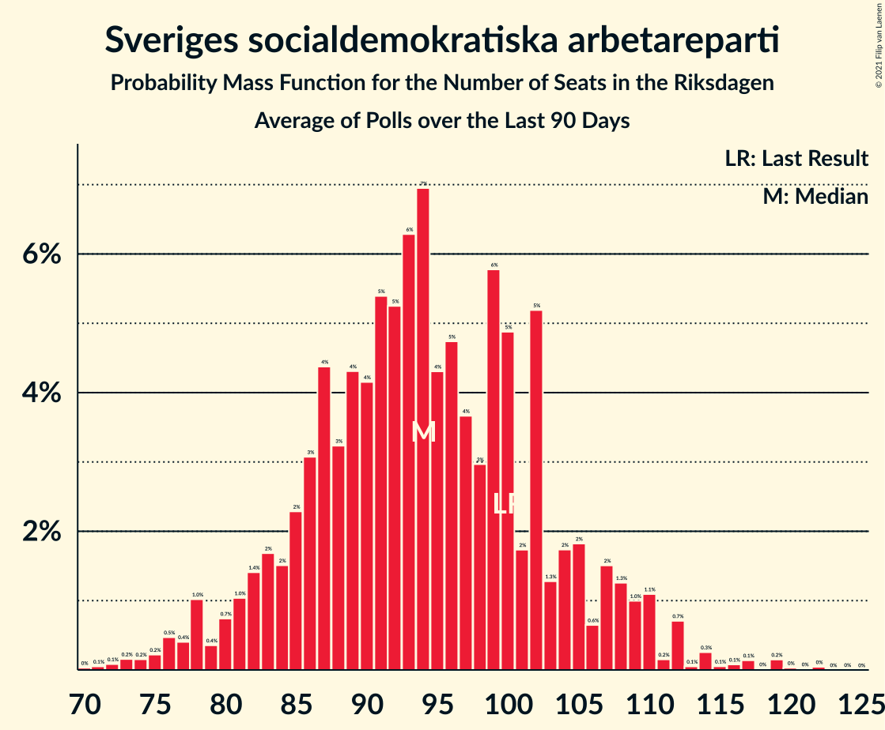

# Sveriges socialdemokratiska arbetareparti

<a href="#voting-intentions">Voting Intentions</a> | <a href="#seats">Seats</a>

## Voting Intentions

Last result: **28.3%** (General Election of 9 September 2018)

### Confidence Intervals

| Period     | Polling firm/Commissioner(s) | Median | 80% Confidence Interval | 90% Confidence Interval | 95% Confidence Interval | 99% Confidence Interval |
|:----------:|:----------------:|:-----------:|:-----------------------:|:-----------------------:|:-----------------------:|:-----------------------:|
| N/A | [Poll Average](average.html) | 28.7% | 25.9–33.5% | 24.9–33.9% | 24.1–34.2% | 22.8–34.6% |
| [10–20 August 2020](2020-08-20-Sifo.html) | Sifo | 27.8% | 27.0–28.5% | 26.8–28.8% | 26.6–29.0% | 26.2–29.3% |
| [28 July–4 August 2020](2020-08-04-Demoskop.html) | Demoskop | 27.3% | 26.2–28.4% | 25.9–28.7% | 25.6–29.0% | 25.1–29.5% |
| [23–28 July 2020](2020-07-28-SKOP.html) | SKOP | 28.2% | 26.4–30.1% | 26.0–30.6% | 25.5–31.1% | 24.7–32.0% |
| [10–12 July 2020](2020-07-12-Sentio.html) | Sentio   Nyheter Idag | 25.5% | 23.6–27.5% | 23.0–28.1% | 22.6–28.6% | 21.7–29.6% |
| [30 June–7 July 2020](2020-07-07-Demoskop.html) | Demoskop | 28.5% | 27.3–29.7% | 26.9–30.1% | 26.6–30.4% | 26.1–31.0% |
| [25 May–21 June 2020](2020-06-21-Novus.html) | Novus   SVT | 30.6% | 29.6–31.6% | 29.4–31.8% | 29.1–32.1% | 28.7–32.6% |
| [12–15 June 2020](2020-06-15-Sentio.html) | Sentio   Nyheter Idag | 28.8% | 26.8–30.9% | 26.2–31.5% | 25.7–32.0% | 24.8–33.1% |
| [12–15 June 2020](2020-06-15-Ipsos.html) | Ipsos   Dagens Nyheter | 31.0% | 29.5–32.5% | 29.1–33.0% | 28.7–33.4% | 28.0–34.1% |
| [1–11 June 2020](2020-06-11-Sifo.html) | Sifo | 30.0% | 29.3–30.7% | 29.1–30.9% | 29.0–31.0% | 28.7–31.4% |
| [26 May–3 June 2020](2020-06-03-Demoskop.html) | Demoskop | 27.8% | 26.6–29.0% | 26.3–29.3% | 26.0–29.6% | 25.5–30.2% |
| [31 May–2 June 2020](2020-06-02-SKOP.html) | SKOP | 31.3% | 29.5–33.2% | 29.0–33.8% | 28.5–34.2% | 27.6–35.2% |
| [29 April–27 May 2020](2020-05-27-SCB.html) | SCB | 33.7% | 33.1–34.3% | 32.9–34.5% | 32.7–34.7% | 32.4–35.0% |
| [27 April–24 May 2020](2020-05-24-Novus.html) | Novus   SVT | 31.5% | 30.5–32.4% | 30.3–32.7% | 30.1–33.0% | 29.6–33.4% |
| [12–24 May 2020](2020-05-24-Ipsos.html) | Ipsos   Dagens Nyheter | 30.7% | 29.2–32.3% | 28.8–32.7% | 28.5–33.1% | 27.8–33.8% |
| [15–18 May 2020](2020-05-18-Sentio.html) | Sentio   Nyheter Idag | 28.1% | 26.2–30.3% | 25.6–30.9% | 25.1–31.4% | 24.2–32.4% |
| [4–14 May 2020](2020-05-14-Sifo.html) | Sifo | 31.6% | 30.9–32.3% | 30.7–32.5% | 30.5–32.7% | 30.2–33.0% |
| [30 April–8 May 2020](2020-05-08-SKOP.html) | SKOP | 32.6% | 30.7–34.5% | 30.2–35.1% | 29.8–35.5% | 28.9–36.5% |
| [28 April–5 May 2020](2020-05-05-Demoskop.html) | Demoskop | 30.1% | 28.9–31.3% | 28.5–31.7% | 28.2–32.0% | 27.7–32.6% |
| [14–26 April 2020](2020-04-26-Ipsos.html) | Ipsos   Dagens Nyheter | 29.0% | 27.6–30.5% | 27.1–31.0% | 26.8–31.3% | 26.1–32.1% |
| [17–21 April 2020](2020-04-21-Sentio.html) | Sentio   Nyheter Idag | 27.5% | 25.5–29.6% | 25.0–30.2% | 24.5–30.7% | 23.6–31.8% |
| [30 March–19 April 2020](2020-04-19-Novus.html) | Novus   SVT | 30.4% | 29.5–31.4% | 29.2–31.7% | 29.0–31.9% | 28.5–32.4% |
| [30 March–8 April 2020](2020-04-08-Sifo.html) | Sifo | 30.6% | 29.9–31.4% | 29.7–31.6% | 29.5–31.7% | 29.2–32.1% |
| [25 March–1 April 2020](2020-04-01-Demoskop.html) | Demoskop | 27.9% | 26.7–29.1% | 26.4–29.4% | 26.1–29.7% | 25.6–30.3% |
| [20–24 March 2020](2020-03-24-Sentio.html) | Sentio   Nyheter Idag | 22.1% | 20.2–24.0% | 19.7–24.6% | 19.3–25.1% | 18.5–26.1% |
| [24 February–22 March 2020](2020-03-22-Novus.html) | Novus   SVT | 25.6% | 24.7–26.6% | 24.4–26.8% | 24.2–27.0% | 23.8–27.5% |
| [10–20 March 2020](2020-03-20-Ipsos.html) | Ipsos   Dagens Nyheter | 25.0% | 23.6–26.4% | 23.2–26.9% | 22.9–27.2% | 22.3–27.9% |
| [2–12 March 2020](2020-03-12-Sifo.html) | Sifo | 23.8% | 23.2–24.4% | 23.0–24.6% | 22.8–24.7% | 22.6–25.0% |
| [25 February–3 March 2020](2020-03-03-Demoskop.html) | Demoskop | 22.6% | 21.5–23.8% | 21.2–24.1% | 21.0–24.4% | 20.4–24.9% |
| [21–24 February 2020](2020-02-24-Sentio.html) | Sentio   Nyheter Idag | 21.5% | 19.8–23.5% | 19.3–24.1% | 18.8–24.6% | 18.0–25.5% |
| [11–23 February 2020](2020-02-23-Ipsos.html) | Ipsos   Dagens Nyheter | 22.0% | 20.7–23.4% | 20.3–23.8% | 20.0–24.2% | 19.4–24.9% |
| [27 January–16 February 2020](2020-02-16-Novus.html) | Novus   SVT | 23.2% | 22.3–24.2% | 22.0–24.5% | 21.7–24.7% | 21.3–25.2% |
| [3–13 February 2020](2020-02-13-Sifo.html) | Sifo | 23.6% | 23.0–24.2% | 22.8–24.4% | 22.7–24.5% | 22.4–24.8% |
| [25 January–5 February 2020](2020-02-05-Demoskop.html) | Demoskop | 24.7% | 23.5–26.0% | 23.2–26.3% | 22.9–26.6% | 22.4–27.2% |
| [24–28 January 2020](2020-01-28-Sentio.html) | Sentio   Nyheter Idag | 22.1% | 20.2–24.0% | 19.7–24.6% | 19.3–25.1% | 18.5–26.1% |
| [14–27 January 2020](2020-01-27-Ipsos.html) | Ipsos   Dagens Nyheter | 22.8% | 21.4–24.2% | 21.1–24.6% | 20.7–25.0% | 20.1–25.7% |
| [7–26 January 2020](2020-01-26-Novus.html) | Novus   SVT | 24.2% | 23.4–25.0% | 23.2–25.3% | 23.0–25.5% | 22.6–25.9% |
| [14–24 January 2020](2020-01-24-SKOP.html) | SKOP | 23.1% | 21.4–24.9% | 21.0–25.4% | 20.6–25.8% | 19.8–26.7% |
| [6–16 January 2020](2020-01-16-Sifo.html) | Sifo | 23.5% | 22.9–24.1% | 22.7–24.3% | 22.6–24.5% | 22.3–24.8% |
| [30 December 2019–7 January 2020](2020-01-07-Demoskop.html) | Demoskop | 23.4% | 22.2–24.6% | 21.9–25.0% | 21.6–25.3% | 21.1–25.8% |
| [13–18 December 2019](2019-12-18-Sentio.html) | Sentio   Nyheter Idag | 21.1% | 19.3–23.0% | 18.8–23.6% | 18.4–24.0% | 17.5–25.0% |
| [18 November–15 December 2019](2019-12-15-Novus.html) | Novus   SVT | 23.7% | 22.9–24.6% | 22.6–24.8% | 22.4–25.1% | 22.0–25.5% |
| [3–15 December 2019](2019-12-15-Ipsos.html) | Ipsos   Dagens Nyheter | 25.0% | 23.6–26.4% | 23.2–26.9% | 22.9–27.2% | 22.3–27.9% |
| [2–12 December 2019](2019-12-12-Sifo.html) | Sifo | 24.6% | 24.0–25.3% | 23.9–25.4% | 23.7–25.6% | 23.4–25.9% |
| [26 November–4 December 2019](2019-12-04-Demoskop.html) | Demoskop | 24.3% | 23.1–25.5% | 22.8–25.9% | 22.5–26.2% | 21.9–26.8% |
| [28 October–26 November 2019](2019-11-26-SCB.html) | SCB | 26.3% | 25.5–27.2% | 25.3–27.4% | 25.1–27.6% | 24.7–28.0% |
| [11–24 November 2019](2019-11-24-Ipsos.html) | Ipsos   Dagens Nyheter | 24.8% | 23.4–26.2% | 23.0–26.6% | 22.7–27.0% | 22.0–27.7% |
| [15–19 November 2019](2019-11-19-Sentio.html) | Sentio   Nyheter Idag | 22.6% | 20.7–24.6% | 20.2–25.1% | 19.8–25.6% | 18.9–26.6% |
| [21 October–17 November 2019](2019-11-17-Novus.html) | Novus   SVT | 26.0% | 25.1–27.0% | 24.8–27.2% | 24.6–27.5% | 24.2–27.9% |
| [4–14 November 2019](2019-11-14-Sifo.html) | Sifo | 24.4% | 23.7–25.0% | 23.6–25.1% | 23.4–25.3% | 23.1–25.6% |
| [4–13 November 2019](2019-11-13-Demoskop.html) | Demoskop | 22.2% | 21.1–23.4% | 20.7–23.8% | 20.5–24.1% | 19.9–24.7% |
| [18–24 October 2019](2019-10-24-Sentio.html) | Sentio   Nyheter Idag | 24.3% | 22.5–26.4% | 21.9–26.9% | 21.5–27.5% | 20.6–28.5% |
| [8–21 October 2019](2019-10-21-Ipsos.html) | Ipsos   Dagens Nyheter | 24.0% | 22.7–25.5% | 22.3–25.9% | 22.0–26.2% | 21.3–26.9% |
| [23 September–20 October 2019](2019-10-20-Novus.html) | Novus   SVT | 25.7% | 24.8–26.7% | 24.6–26.9% | 24.4–27.2% | 23.9–27.6% |
| [7–17 October 2019](2019-10-17-Sifo.html) | Sifo | 25.5% | 24.8–26.1% | 24.6–26.3% | 24.5–26.4% | 24.2–26.8% |
| [8–14 October 2019](2019-10-14-Inizio.html) | Inizio   Aftonbladet | 24.7% | 23.5–26.0% | 23.2–26.3% | 22.9–26.6% | 22.4–27.2% |
| [24 September–1 October 2019](2019-10-01-Demoskop.html) | Demoskop | 23.1% | 21.8–24.5% | 21.4–24.9% | 21.1–25.3% | 20.5–25.9% |
| [20–25 September 2019](2019-09-25-Inizio.html) | Inizio   Aftonbladet | 24.0% | 22.8–25.2% | 22.5–25.6% | 22.2–25.9% | 21.7–26.5% |
| [20–24 September 2019](2019-09-24-Sentio.html) | Sentio   Nyheter Idag | 23.9% | 22.2–25.7% | 21.8–26.2% | 21.4–26.6% | 20.6–27.5% |
| [10–23 September 2019](2019-09-23-Ipsos.html) | Ipsos   Dagens Nyheter | 26.0% | 24.6–27.5% | 24.2–27.9% | 23.9–28.3% | 23.2–29.0% |
| [26 August–22 September 2019](2019-09-22-Novus.html) | Novus   SVT | 24.7% | 23.7–25.6% | 23.5–25.8% | 23.3–26.1% | 22.9–26.5% |
| [2–12 September 2019](2019-09-12-Sifo.html) | Sifo | 25.8% | 25.2–26.4% | 25.0–26.6% | 24.9–26.7% | 24.6–27.0% |
| [27 August–3 September 2019](2019-09-03-Demoskop.html) | Demoskop | 24.1% | 22.8–25.6% | 22.4–26.0% | 22.1–26.3% | 21.5–27.0% |
| [22–28 August 2019](2019-08-28-Inizio.html) | Inizio   Aftonbladet | 25.5% | 24.2–26.7% | 23.9–27.1% | 23.6–27.4% | 23.0–28.0% |
| [22–27 August 2019](2019-08-27-Sentio.html) | Sentio   Nyheter Idag | 23.3% | 21.5–25.3% | 21.0–25.9% | 20.5–26.4% | 19.6–27.4% |
| [5–25 August 2019](2019-08-25-Novus.html) | Novus   SVT | 26.3% | 25.2–27.4% | 24.9–27.8% | 24.7–28.0% | 24.2–28.6% |
| [13–25 August 2019](2019-08-25-Ipsos.html) | Ipsos   Dagens Nyheter | 26.0% | 24.6–27.5% | 24.2–27.9% | 23.9–28.3% | 23.2–29.0% |
| [6–15 August 2019](2019-08-15-Sifo.html) | Sifo | 26.8% | 26.1–27.5% | 25.9–27.7% | 25.7–27.9% | 25.3–28.2% |
| [1–8 August 2019](2019-08-08-Inizio.html) | Inizio   Aftonbladet | 25.6% | 24.4–26.9% | 24.1–27.3% | 23.8–27.6% | 23.2–28.2% |
| [25 June–16 July 2019](2019-07-16-SKOP.html) | SKOP | 25.6% | 23.9–27.4% | 23.4–27.9% | 23.0–28.3% | 22.2–29.2% |
| [24 June–1 July 2019](2019-07-01-Demoskop.html) | Demoskop | 25.9% | 24.6–27.4% | 24.2–27.8% | 23.8–28.1% | 23.2–28.8% |
| [17–24 June 2019](2019-06-24-Inizio.html) | Inizio   Aftonbladet | 25.4% | 24.2–26.6% | 23.8–27.0% | 23.5–27.3% | 23.0–27.9% |
| [3–23 June 2019](2019-06-23-Novus.html) | Novus   SVT | 26.7% | 25.6–27.8% | 25.3–28.1% | 25.1–28.4% | 24.6–28.9% |
| [4–18 June 2019](2019-06-18-Ipsos.html) | Ipsos   Dagens Nyheter | 25.0% | 23.7–26.4% | 23.3–26.9% | 23.0–27.2% | 22.3–27.9% |
| [3–13 June 2019](2019-06-13-Sifo.html) | Sifo | 26.5% | 25.9–27.1% | 25.7–27.3% | 25.6–27.4% | 25.3–27.7% |
| [3–13 June 2019](2019-06-13-Sentio.html) | Sentio   Nyheter Idag | 26.1% | 23.8–27.8% | 23.3–28.4% | 22.8–28.9% | 21.9–29.9% |
| [27 May–3 June 2019](2019-06-03-Demoskop.html) | Demoskop   Expressen | 27.1% | 25.7–28.5% | 25.3–28.9% | 25.0–29.3% | 24.3–30.0% |
| [6 May–2 June 2019](2019-06-02-Novus.html) | Novus   SVT | 25.9% | 25.0–26.9% | 24.7–27.1% | 24.5–27.4% | 24.1–27.8% |
| [29 April–28 May 2019](2019-05-28-SCB.html) | SCB | 27.6% | 27.0–28.2% | 26.8–28.4% | 26.7–28.5% | 26.4–28.8% |
| [21–28 May 2019](2019-05-28-Inizio.html) | Inizio   Aftonbladet | 26.1% | 24.9–27.4% | 24.6–27.7% | 24.3–28.0% | 23.7–28.6% |
| [17–21 May 2019](2019-05-21-Sentio.html) | Sentio   Nyheter Idag | 24.9% | 23.2–26.7% | 22.8–27.3% | 22.3–27.7% | 21.6–28.6% |
| [6–21 May 2019](2019-05-21-Ipsos.html) | Ipsos   Dagens Nyheter | 26.0% | 24.8–27.2% | 24.4–27.6% | 24.2–27.9% | 23.6–28.5% |
| [6–16 May 2019](2019-05-16-Sifo.html) | Sifo | 27.0% | 26.4–27.6% | 26.3–27.8% | 26.1–27.9% | 25.8–28.2% |
| [10–15 May 2019](2019-05-15-Sifo.html) | Sifo   Svenska Dagbladet | 21.9% | 20.9–22.9% | 20.6–23.2% | 20.4–23.4% | 19.9–23.9% |
| [29 April–7 May 2019](2019-05-07-Demoskop.html) | Demoskop   Expressen | 26.6% | 25.2–28.0% | 24.8–28.4% | 24.5–28.8% | 23.8–29.5% |
| [8 April–5 May 2019](2019-05-05-Novus.html) | Novus   SVT | 26.4% | 25.5–27.4% | 25.2–27.7% | 25.0–27.9% | 24.5–28.4% |
| [22–29 April 2019](2019-04-29-Inizio.html) | Inizio   Aftonbladet | 25.6% | 24.4–26.8% | 24.1–27.2% | 23.8–27.5% | 23.2–28.1% |
| [9–22 April 2019](2019-04-22-Ipsos.html) | Ipsos   Dagens Nyheter | 27.3% | 25.8–28.8% | 25.4–29.2% | 25.0–29.6% | 24.4–30.3% |
| [1–11 April 2019](2019-04-11-Sifo.html) | Sifo   Svenska Dagbladet | 27.3% | 26.7–27.9% | 26.5–28.1% | 26.4–28.3% | 26.0–28.6% |
| [4–10 April 2019](2019-04-10-Sentio.html) | Sentio   Nyheter Idag | 25.6% | 23.7–27.7% | 23.1–28.3% | 22.7–28.8% | 21.8–29.8% |
| [26 March–3 April 2019](2019-04-03-Demoskop.html) | Demoskop   Expressen | 25.4% | 24.0–26.8% | 23.6–27.2% | 23.3–27.6% | 22.7–28.3% |
| [4–31 March 2019](2019-03-31-Novus.html) | Novus   SVT | 27.2% | 26.3–28.2% | 26.0–28.4% | 25.8–28.7% | 25.3–29.1% |
| [23–28 March 2019](2019-03-28-Inizio.html) | Inizio   Aftonbladet | 26.5% | 25.5–27.6% | 25.2–27.9% | 25.0–28.1% | 24.5–28.6% |
| [22–27 March 2019](2019-03-27-Sentio.html) | Sentio   Nyheter Idag | 24.8% | 23.1–26.6% | 22.6–27.1% | 22.2–27.5% | 21.4–28.4% |
| [7–27 March 2019](2019-03-27-SKOP.html) | SKOP | 28.7% | 27.2–30.2% | 26.8–30.6% | 26.4–31.0% | 25.8–31.8% |
| [12–25 March 2019](2019-03-25-Ipsos.html) | Ipsos   Dagens Nyheter | 27.0% | 25.6–28.5% | 25.2–28.9% | 24.8–29.3% | 24.2–30.0% |
| [3–14 March 2019](2019-03-14-Sifo.html) | Sifo   Svenska Dagbladet | 27.4% | 26.8–28.0% | 26.6–28.2% | 26.5–28.3% | 26.2–28.6% |
| [26 February–5 March 2019](2019-03-05-Demoskop.html) | Demoskop   Expressen | 25.8% | 24.4–27.3% | 24.1–27.7% | 23.7–28.0% | 23.1–28.7% |
| [4 February–3 March 2019](2019-03-03-Novus.html) | Novus   SVT | 28.2% | 27.3–29.2% | 27.0–29.4% | 26.8–29.7% | 26.3–30.1% |
| [22–25 February 2019](2019-02-25-Sentio.html) | Sentio   Nyheter Idag | 26.5% | 24.8–28.3% | 24.3–28.9% | 23.9–29.3% | 23.0–30.2% |
| [7–20 February 2019](2019-02-20-Ipsos.html) | Ipsos   Dagens Nyheter | 28.0% | 26.5–29.5% | 26.1–29.9% | 25.8–30.3% | 25.1–31.1% |
| [11–18 February 2019](2019-02-18-Inizio.html) | Inizio   Aftonbladet | 27.0% | 25.8–28.3% | 25.5–28.7% | 25.2–29.0% | 24.6–29.6% |
| [4–14 February 2019](2019-02-14-Sifo.html) | Sifo   Svenska Dagbladet | 28.4% | 27.8–29.1% | 27.6–29.2% | 27.4–29.4% | 27.1–29.7% |
| [29 January–5 February 2019](2019-02-05-Demoskop.html) | Demoskop   Expressen | 27.9% | 26.5–29.4% | 26.1–29.8% | 25.8–30.2% | 25.1–30.9% |
| [14 January–3 February 2019](2019-02-03-Novus.html) | Novus   SVT | 29.0% | 28.0–30.1% | 27.7–30.4% | 27.4–30.7% | 26.9–31.2% |
| [24–30 January 2019](2019-01-30-Sentio.html) | Sentio   Nyheter Idag | 27.8% | 26.0–29.6% | 25.5–30.2% | 25.1–30.6% | 24.2–31.6% |
| [16–23 January 2019](2019-01-23-Inizio.html) | Inizio   Aftonbladet | 28.2% | 26.9–29.5% | 26.6–29.9% | 26.3–30.2% | 25.7–30.8% |
| [10–20 January 2019](2019-01-20-Ipsos.html) | Ipsos   Dagens Nyheter | 30.0% | 28.6–31.5% | 28.2–32.0% | 27.8–32.3% | 27.1–33.1% |
| [14–17 January 2019](2019-01-17-Sifo.html) | Sifo   Svenska Dagbladet | 29.3% | 28.4–30.2% | 28.2–30.4% | 27.9–30.7% | 27.5–31.1% |
| [3–17 January 2019](2019-01-17-SKOP.html) | SKOP | 30.2% | 28.5–32.0% | 28.0–32.5% | 27.6–33.0% | 26.8–33.8% |
| [2–13 January 2019](2019-01-13-Novus.html) | Novus   SVT | 31.8% | 30.6–33.1% | 30.2–33.4% | 29.9–33.7% | 29.4–34.3% |
| [2–8 January 2019](2019-01-08-Demoskop.html) | Demoskop   Expressen | 30.2% | 28.8–31.7% | 28.4–32.2% | 28.0–32.5% | 27.4–33.3% |
| [19–26 December 2018](2018-12-26-Inizio.html) | Inizio   Aftonbladet | 29.8% | 28.6–31.0% | 28.2–31.4% | 27.9–31.7% | 27.4–32.3% |
| [12 November–16 December 2018](2018-12-16-Novus.html) | Novus   SVT | 30.0% | 29.2–30.8% | 29.0–31.0% | 28.8–31.2% | 28.4–31.6% |
| [5–16 December 2018](2018-12-16-Ipsos.html) | Ipsos   Dagens Nyheter | 32.0% | 30.5–33.6% | 30.1–34.0% | 29.7–34.4% | 29.0–35.1% |
| [3–13 December 2018](2018-12-13-Sifo.html) | Sifo   Svenska Dagbladet | 29.7% | 29.1–30.3% | 28.9–30.5% | 28.7–30.7% | 28.4–31.0% |
| [4–12 December 2018](2018-12-12-Inizio.html) | Inizio   Aftonbladet | 29.4% | 28.1–30.6% | 27.8–31.0% | 27.5–31.3% | 26.9–31.9% |
| [27 November–4 December 2018](2018-12-04-Demoskop.html) | Demoskop   Expressen | 28.4% | 27.0–29.9% | 26.6–30.3% | 26.2–30.7% | 25.6–31.4% |
| [29 November–3 December 2018](2018-12-03-Sentio.html) | Sentio   Nyheter Idag | 28.4% | 26.7–30.3% | 26.2–30.8% | 25.7–31.2% | 24.9–32.1% |
| [29 October–27 November 2018](2018-11-27-SCB.html) | SCB | 30.6% | 29.7–31.4% | 29.5–31.7% | 29.3–31.9% | 28.9–32.3% |
| [8–19 November 2018](2018-11-19-Ipsos.html) | Ipsos   Dagens Nyheter | 28.3% | 26.8–29.8% | 26.4–30.2% | 26.1–30.6% | 25.4–31.3% |
| [14–19 November 2018](2018-11-19-Inizio.html) | Inizio   Aftonbladet | 29.3% | 28.2–30.5% | 27.8–30.9% | 27.5–31.2% | 27.0–31.8% |
| [5–15 November 2018](2018-11-15-Sifo.html) | Sifo   Svenska Dagbladet | 29.0% | 28.4–29.6% | 28.2–29.8% | 28.0–29.9% | 27.8–30.2% |
| [15 October–11 November 2018](2018-11-11-Novus.html) | Novus   SVT | 29.8% | 29.0–30.7% | 28.7–30.9% | 28.5–31.1% | 28.2–31.5% |
| [1–7 November 2018](2018-11-07-Sentio.html) | Sentio   Nyheter Idag | 28.2% | 26.5–30.1% | 26.0–30.6% | 25.5–31.1% | 24.7–32.0% |
| [26 October–6 November 2018](2018-11-06-Inizio.html) | Inizio   Aftonbladet | 29.4% | 28.2–30.7% | 27.9–31.1% | 27.6–31.4% | 27.0–32.0% |
| [30 October–6 November 2018](2018-11-06-Demoskop.html) | Demoskop   Expressen | 29.1% | 27.7–30.6% | 27.3–31.0% | 27.0–31.4% | 26.3–32.1% |
| [16–24 October 2018](2018-10-24-Ipsos.html) | Ipsos   Dagens Nyheter | 28.6% | 27.2–30.1% | 26.7–30.5% | 26.4–30.9% | 25.7–31.6% |
| [8–18 October 2018](2018-10-18-Sifo.html) | Sifo   Svenska Dagbladet | 29.4% | 28.7–30.0% | 28.6–30.2% | 28.4–30.3% | 28.1–30.7% |
| [5–9 October 2018](2018-10-09-Sentio.html) | Sentio   Nyheter Idag | 27.4% | 25.7–29.3% | 25.2–29.8% | 24.7–30.2% | 23.9–31.1% |
| [1–8 October 2018](2018-10-08-Inizio.html) | Inizio   Aftonbladet | 29.7% | 28.3–31.1% | 27.9–31.5% | 27.6–31.9% | 26.9–32.5% |
| [1–4 October 2018](2018-10-04-Novus.html) | Novus   SVT | 28.3% | 27.1–29.6% | 26.8–29.9% | 26.5–30.2% | 25.9–30.8% |
| [24 September–2 October 2018](2018-10-02-Sifo.html) | Sifo   Svenska Dagbladet | 28.5% | 27.9–29.2% | 27.7–29.4% | 27.5–29.5% | 27.3–29.8% |
| [25 September–2 October 2018](2018-10-02-Demoskop.html) | Demoskop   Expressen | 30.6% | 29.1–32.1% | 28.7–32.5% | 28.4–32.9% | 27.7–33.6% |

### Probability Mass Function

The following table shows the probability mass function per percentage block of voting intentions for the [poll average](average.html) for Sveriges socialdemokratiska arbetareparti.

| Voting Intentions | Probability | Accumulated | Special Marks |
|:-----------------:|:-----------:|:-----------:|:-------------:|
| 20.5–21.5% | 0.1% | 100% |  |
| 21.5–22.5% | 0.3% | 99.9% |  |
| 22.5–23.5% | 1.0% | 99.6% |  |
| 23.5–24.5% | 2% | 98.6% |  |
| 24.5–25.5% | 4% | 96% |  |
| 25.5–26.5% | 7% | 92% |  |
| 26.5–27.5% | 16% | 85% |  |
| 27.5–28.5% | 17% | 69% | Last Result |
| 28.5–29.5% | 8% | 51% | Median |
| 29.5–30.5% | 11% | 43% |  |
| 30.5–31.5% | 11% | 32% |  |
| 31.5–32.5% | 5% | 21% |  |
| 32.5–33.5% | 6% | 16% |  |
| 33.5–34.5% | 9% | 9% |  |
| 34.5–35.5% | 0.6% | 0.6% |  |
| 35.5–36.5% | 0% | 0% |  |

## Seats

Last result: **100** seats (General Election of 9 September 2018)

### Confidence Intervals

| Period     | Polling firm/Commissioner(s) | Median | 80% Confidence Interval | 90% Confidence Interval | 95% Confidence Interval | 99% Confidence Interval |
|:----------:|:----------------:|:------:|:-----------------------:|:-----------------------:|:-----------------------:|:-----------------------:|
| N/A | [Poll Average](average.html) | 108 | 95–123 | 91–125 | 88–128 | 83–131 |
| [10–20 August 2020](2020-08-20-Sifo.html) | Sifo | 102 | 99–107 | 98–108 | 97–109 | 95–110 |
| [28 July–4 August 2020](2020-08-04-Demoskop.html) | Demoskop | 104 | 100–109 | 99–110 | 98–111 | 95–113 |
| [23–28 July 2020](2020-07-28-SKOP.html) | SKOP | 104 | 97–112 | 96–114 | 94–116 | 90–120 |
| [10–12 July 2020](2020-07-12-Sentio.html) | Sentio   Nyheter Idag | 93 | 86–101 | 84–104 | 82–106 | 79–109 |
| [30 June–7 July 2020](2020-07-07-Demoskop.html) | Demoskop | 106 | 101–112 | 99–113 | 99–115 | 96–118 |
| [25 May–21 June 2020](2020-06-21-Novus.html) | Novus   SVT | 116 | 112–119 | 111–120 | 110–121 | 107–122 |
| [12–15 June 2020](2020-06-15-Sentio.html) | Sentio   Nyheter Idag | 109 | 100–116 | 97–119 | 94–120 | 91–124 |
| [12–15 June 2020](2020-06-15-Ipsos.html) | Ipsos   Dagens Nyheter | 115 | 109–122 | 107–125 | 106–126 | 103–129 |
| [1–11 June 2020](2020-06-11-Sifo.html) | Sifo | 114 | 111–116 | 111–117 | 110–118 | 108–119 |
| [26 May–3 June 2020](2020-06-03-Demoskop.html) | Demoskop | 103 | 98–108 | 96–110 | 95–111 | 93–113 |
| [31 May–2 June 2020](2020-06-02-SKOP.html) | SKOP | 116 | 108–123 | 106–126 | 104–128 | 100–132 |
| [29 April–27 May 2020](2020-05-27-SCB.html) | SCB | 124 | 121–129 | 120–130 | 120–131 | 118–132 |
| [27 April–24 May 2020](2020-05-24-Novus.html) | Novus   SVT | 116 | 111–122 | 111–123 | 110–124 | 108–126 |
| [12–24 May 2020](2020-05-24-Ipsos.html) | Ipsos   Dagens Nyheter | 114 | 107–120 | 105–121 | 103–123 | 101–126 |
| [15–18 May 2020](2020-05-18-Sentio.html) | Sentio   Nyheter Idag | 107 | 98–116 | 95–118 | 93–121 | 89–125 |
| [4–14 May 2020](2020-05-14-Sifo.html) | Sifo | 121 | 114–123 | 113–124 | 113–125 | 111–125 |
| [30 April–8 May 2020](2020-05-08-SKOP.html) | SKOP | 120 | 112–128 | 110–131 | 109–132 | 105–137 |
| [28 April–5 May 2020](2020-05-05-Demoskop.html) | Demoskop | 112 | 108–117 | 106–118 | 105–119 | 102–121 |
| [14–26 April 2020](2020-04-26-Ipsos.html) | Ipsos   Dagens Nyheter | 106 | 99–114 | 98–115 | 96–118 | 94–121 |
| [17–21 April 2020](2020-04-21-Sentio.html) | Sentio   Nyheter Idag | 103 | 93–110 | 92–113 | 89–115 | 85–119 |
| [30 March–19 April 2020](2020-04-19-Novus.html) | Novus   SVT | 114 | 109–118 | 108–119 | 106–120 | 105–122 |
| [30 March–8 April 2020](2020-04-08-Sifo.html) | Sifo | 116 | 111–119 | 110–120 | 109–120 | 107–122 |
| [25 March–1 April 2020](2020-04-01-Demoskop.html) | Demoskop | 104 | 97–109 | 96–110 | 94–111 | 93–113 |
| [20–24 March 2020](2020-03-24-Sentio.html) | Sentio   Nyheter Idag | 81 | 74–88 | 72–90 | 70–92 | 67–95 |
| [24 February–22 March 2020](2020-03-22-Novus.html) | Novus   SVT | 93 | 89–97 | 88–98 | 86–100 | 86–101 |
| [10–20 March 2020](2020-03-20-Ipsos.html) | Ipsos   Dagens Nyheter | 86 | 82–91 | 82–92 | 82–95 | 79–99 |
| [2–12 March 2020](2020-03-12-Sifo.html) | Sifo | 87 | 83–91 | 82–92 | 82–94 | 80–95 |
| [25 February–3 March 2020](2020-03-03-Demoskop.html) | Demoskop | 83 | 79–89 | 78–91 | 77–91 | 75–93 |
| [21–24 February 2020](2020-02-24-Sentio.html) | Sentio   Nyheter Idag | 79 | 72–87 | 71–89 | 69–92 | 66–95 |
| [11–23 February 2020](2020-02-23-Ipsos.html) | Ipsos   Dagens Nyheter | 79 | 74–84 | 73–86 | 71–87 | 69–90 |
| [27 January–16 February 2020](2020-02-16-Novus.html) | Novus   SVT | 84 | 80–88 | 79–90 | 78–91 | 76–95 |
| [3–13 February 2020](2020-02-13-Sifo.html) | Sifo | 84 | 81–87 | 81–88 | 80–89 | 79–91 |
| [25 January–5 February 2020](2020-02-05-Demoskop.html) | Demoskop | 91 | 87–98 | 85–99 | 84–100 | 82–103 |
| [24–28 January 2020](2020-01-28-Sentio.html) | Sentio   Nyheter Idag | 82 | 74–89 | 72–91 | 71–93 | 68–96 |
| [14–27 January 2020](2020-01-27-Ipsos.html) | Ipsos   Dagens Nyheter | 83 | 77–90 | 75–92 | 75–94 | 72–97 |
| [7–26 January 2020](2020-01-26-Novus.html) | Novus   SVT | 89 | 85–93 | 84–93 | 84–94 | 83–96 |
| [14–24 January 2020](2020-01-24-SKOP.html) | SKOP | 84 | 77–92 | 75–94 | 74–96 | 72–99 |
| [6–16 January 2020](2020-01-16-Sifo.html) | Sifo | 87 | 83–88 | 82–89 | 81–89 | 80–91 |
| [30 December 2019–7 January 2020](2020-01-07-Demoskop.html) | Demoskop | 86 | 81–90 | 80–91 | 79–93 | 77–96 |
| [13–18 December 2019](2019-12-18-Sentio.html) | Sentio   Nyheter Idag | 78 | 71–85 | 69–87 | 67–89 | 64–93 |
| [18 November–15 December 2019](2019-12-15-Novus.html) | Novus   SVT | 87 | 84–90 | 83–91 | 82–92 | 79–93 |
| [3–15 December 2019](2019-12-15-Ipsos.html) | Ipsos   Dagens Nyheter | 88 | 83–93 | 82–95 | 81–96 | 78–99 |
| [2–12 December 2019](2019-12-12-Sifo.html) | Sifo | 88 | 85–93 | 84–93 | 84–93 | 83–95 |
| [26 November–4 December 2019](2019-12-04-Demoskop.html) | Demoskop | 88 | 83–94 | 81–95 | 79–96 | 78–100 |
| [28 October–26 November 2019](2019-11-26-SCB.html) | SCB | 94 | 91–99 | 90–100 | 89–101 | 87–103 |
| [11–24 November 2019](2019-11-24-Ipsos.html) | Ipsos   Dagens Nyheter | 92 | 86–97 | 84–98 | 83–100 | 81–103 |
| [15–19 November 2019](2019-11-19-Sentio.html) | Sentio   Nyheter Idag | 83 | 76–90 | 74–92 | 72–94 | 68–97 |
| [21 October–17 November 2019](2019-11-17-Novus.html) | Novus   SVT | 95 | 92–99 | 91–101 | 90–101 | 88–102 |
| [4–14 November 2019](2019-11-14-Sifo.html) | Sifo | 89 | 87–91 | 86–92 | 85–92 | 83–95 |
| [4–13 November 2019](2019-11-13-Demoskop.html) | Demoskop | 80 | 77–85 | 75–88 | 74–90 | 72–91 |
| [18–24 October 2019](2019-10-24-Sentio.html) | Sentio   Nyheter Idag | 89 | 81–95 | 79–98 | 77–100 | 73–104 |
| [8–21 October 2019](2019-10-21-Ipsos.html) | Ipsos   Dagens Nyheter | 88 | 82–91 | 80–94 | 78–96 | 76–99 |
| [23 September–20 October 2019](2019-10-20-Novus.html) | Novus   SVT | 95 | 91–98 | 90–100 | 89–100 | 87–101 |
| [7–17 October 2019](2019-10-17-Sifo.html) | Sifo | 93 | 90–96 | 88–97 | 87–98 | 85–99 |
| [8–14 October 2019](2019-10-14-Inizio.html) | Inizio   Aftonbladet | 91 | 86–96 | 85–97 | 84–99 | 81–101 |
| [24 September–1 October 2019](2019-10-01-Demoskop.html) | Demoskop | 84 | 79–89 | 77–91 | 77–93 | 74–96 |
| [20–25 September 2019](2019-09-25-Inizio.html) | Inizio   Aftonbladet | 90 | 85–95 | 83–96 | 81–97 | 79–100 |
| [20–24 September 2019](2019-09-24-Sentio.html) | Sentio   Nyheter Idag | 89 | 81–95 | 80–98 | 78–101 | 75–104 |
| [10–23 September 2019](2019-09-23-Ipsos.html) | Ipsos   Dagens Nyheter | 92 | 87–97 | 85–99 | 84–101 | 82–103 |
| [26 August–22 September 2019](2019-09-22-Novus.html) | Novus   SVT | 89 | 86–94 | 85–95 | 84–96 | 82–98 |
| [2–12 September 2019](2019-09-12-Sifo.html) | Sifo | 91 | 90–95 | 89–96 | 89–97 | 87–99 |
| [27 August–3 September 2019](2019-09-03-Demoskop.html) | Demoskop | 87 | 82–91 | 82–92 | 80–94 | 78–96 |
| [22–28 August 2019](2019-08-28-Inizio.html) | Inizio   Aftonbladet | 92 | 87–99 | 86–101 | 85–104 | 83–107 |
| [22–27 August 2019](2019-08-27-Sentio.html) | Sentio   Nyheter Idag | 84 | 76–90 | 74–93 | 73–95 | 69–98 |
| [5–25 August 2019](2019-08-25-Novus.html) | Novus   SVT | 97 | 91–100 | 90–101 | 89–103 | 87–105 |
| [13–25 August 2019](2019-08-25-Ipsos.html) | Ipsos   Dagens Nyheter | 93 | 87–97 | 86–99 | 85–101 | 82–103 |
| [6–15 August 2019](2019-08-15-Sifo.html) | Sifo | 97 | 93–101 | 92–103 | 92–103 | 90–103 |
| [1–8 August 2019](2019-08-08-Inizio.html) | Inizio   Aftonbladet | 97 | 90–102 | 89–103 | 87–105 | 85–107 |
| [25 June–16 July 2019](2019-07-16-SKOP.html) | SKOP | 90 | 85–97 | 83–99 | 81–101 | 78–104 |
| [24 June–1 July 2019](2019-07-01-Demoskop.html) | Demoskop | 94 | 89–100 | 87–101 | 86–103 | 83–106 |
| [17–24 June 2019](2019-06-24-Inizio.html) | Inizio   Aftonbladet | 94 | 88–98 | 87–99 | 86–101 | 83–103 |
| [3–23 June 2019](2019-06-23-Novus.html) | Novus   SVT | 97 | 93–102 | 91–103 | 90–104 | 88–106 |
| [4–18 June 2019](2019-06-18-Ipsos.html) | Ipsos   Dagens Nyheter | 89 | 84–94 | 83–95 | 82–97 | 79–100 |
| [3–13 June 2019](2019-06-13-Sifo.html) | Sifo | 97 | 94–100 | 94–100 | 93–101 | 91–102 |
| [3–13 June 2019](2019-06-13-Sentio.html) | Sentio   Nyheter Idag | 94 | 86–102 | 84–105 | 82–107 | 79–112 |
| [27 May–3 June 2019](2019-06-03-Demoskop.html) | Demoskop   Expressen | 98 | 91–104 | 90–106 | 89–107 | 87–110 |
| [6 May–2 June 2019](2019-06-02-Novus.html) | Novus   SVT | 93 | 89–97 | 88–98 | 87–99 | 85–102 |
| [29 April–28 May 2019](2019-05-28-SCB.html) | SCB | 102 | 98–104 | 97–105 | 95–105 | 95–106 |
| [21–28 May 2019](2019-05-28-Inizio.html) | Inizio   Aftonbladet | 97 | 92–102 | 91–104 | 90–105 | 88–107 |
| [17–21 May 2019](2019-05-21-Sentio.html) | Sentio   Nyheter Idag | 91 | 85–98 | 83–100 | 81–102 | 78–107 |
| [6–21 May 2019](2019-05-21-Ipsos.html) | Ipsos   Dagens Nyheter | 94 | 89–99 | 87–101 | 86–103 | 85–105 |
| [6–16 May 2019](2019-05-16-Sifo.html) | Sifo | 99 | 96–101 | 95–102 | 94–103 | 92–104 |
| [10–15 May 2019](2019-05-15-Sifo.html) | Sifo   Svenska Dagbladet | 80 | 76–84 | 75–85 | 74–87 | 72–88 |
| [29 April–7 May 2019](2019-05-07-Demoskop.html) | Demoskop   Expressen | 98 | 92–104 | 91–106 | 90–107 | 87–111 |
| [8 April–5 May 2019](2019-05-05-Novus.html) | Novus   SVT | 97 | 93–101 | 92–102 | 91–102 | 89–105 |
| [22–29 April 2019](2019-04-29-Inizio.html) | Inizio   Aftonbladet | 94 | 88–100 | 87–102 | 86–103 | 83–105 |
| [9–22 April 2019](2019-04-22-Ipsos.html) | Ipsos   Dagens Nyheter | 98 | 92–105 | 91–106 | 90–108 | 88–113 |
| [1–11 April 2019](2019-04-11-Sifo.html) | Sifo   Svenska Dagbladet | 100 | 98–102 | 97–103 | 97–104 | 95–105 |
| [4–10 April 2019](2019-04-10-Sentio.html) | Sentio   Nyheter Idag | 94 | 86–102 | 83–106 | 82–108 | 79–111 |
| [26 March–3 April 2019](2019-04-03-Demoskop.html) | Demoskop   Expressen | 92 | 87–98 | 85–101 | 84–103 | 81–106 |
| [4–31 March 2019](2019-03-31-Novus.html) | Novus   SVT | 102 | 98–107 | 97–108 | 96–109 | 93–110 |
| [23–28 March 2019](2019-03-28-Inizio.html) | Inizio   Aftonbladet | 97 | 93–102 | 92–104 | 91–105 | 89–107 |
| [22–27 March 2019](2019-03-27-Sentio.html) | Sentio   Nyheter Idag | 93 | 86–100 | 84–102 | 82–104 | 79–107 |
| [7–27 March 2019](2019-03-27-SKOP.html) | SKOP | 107 | 100–114 | 98–114 | 97–116 | 94–118 |
| [12–25 March 2019](2019-03-25-Ipsos.html) | Ipsos   Dagens Nyheter | 99 | 93–106 | 91–108 | 89–109 | 86–112 |
| [3–14 March 2019](2019-03-14-Sifo.html) | Sifo   Svenska Dagbladet | 104 | 100–106 | 98–107 | 98–107 | 97–109 |
| [26 February–5 March 2019](2019-03-05-Demoskop.html) | Demoskop   Expressen | 95 | 91–100 | 89–102 | 89–105 | 86–108 |
| [4 February–3 March 2019](2019-03-03-Novus.html) | Novus   SVT | 107 | 100–111 | 99–111 | 98–112 | 96–114 |
| [22–25 February 2019](2019-02-25-Sentio.html) | Sentio   Nyheter Idag | 100 | 93–107 | 91–109 | 89–111 | 86–114 |
| [7–20 February 2019](2019-02-20-Ipsos.html) | Ipsos   Dagens Nyheter | 102 | 94–109 | 93–112 | 91–113 | 89–116 |
| [11–18 February 2019](2019-02-18-Inizio.html) | Inizio   Aftonbladet | 102 | 99–106 | 98–108 | 96–109 | 92–110 |
| [4–14 February 2019](2019-02-14-Sifo.html) | Sifo   Svenska Dagbladet | 102 | 100–108 | 100–108 | 100–110 | 97–111 |
| [29 January–5 February 2019](2019-02-05-Demoskop.html) | Demoskop   Expressen | 106 | 100–111 | 98–113 | 97–114 | 94–117 |
| [14 January–3 February 2019](2019-02-03-Novus.html) | Novus   SVT | 109 | 105–113 | 104–114 | 103–115 | 100–117 |
| [24–30 January 2019](2019-01-30-Sentio.html) | Sentio   Nyheter Idag | 104 | 95–110 | 92–112 | 91–114 | 88–119 |
| [16–23 January 2019](2019-01-23-Inizio.html) | Inizio   Aftonbladet | 105 | 99–110 | 98–112 | 97–113 | 94–116 |
| [10–20 January 2019](2019-01-20-Ipsos.html) | Ipsos   Dagens Nyheter | 109 | 103–115 | 101–117 | 100–118 | 97–122 |
| [14–17 January 2019](2019-01-17-Sifo.html) | Sifo   Svenska Dagbladet | 109 | 104–114 | 104–115 | 102–116 | 99–117 |
| [3–17 January 2019](2019-01-17-SKOP.html) | SKOP | 115 | 108–121 | 106–122 | 103–124 | 98–127 |
| [2–13 January 2019](2019-01-13-Novus.html) | Novus   SVT | 119 | 113–125 | 111–127 | 110–128 | 107–130 |
| [2–8 January 2019](2019-01-08-Demoskop.html) | Demoskop   Expressen | 111 | 105–117 | 103–119 | 101–121 | 99–124 |
| [19–26 December 2018](2018-12-26-Inizio.html) | Inizio   Aftonbladet | 109 | 105–116 | 103–117 | 102–119 | 100–121 |
| [12 November–16 December 2018](2018-12-16-Novus.html) | Novus   SVT | 111 | 105–119 | 102–119 | 102–120 | 101–120 |
| [5–16 December 2018](2018-12-16-Ipsos.html) | Ipsos   Dagens Nyheter | 116 | 110–123 | 108–125 | 106–128 | 103–132 |
| [3–13 December 2018](2018-12-13-Sifo.html) | Sifo   Svenska Dagbladet | 108 | 103–114 | 102–115 | 102–115 | 101–118 |
| [4–12 December 2018](2018-12-12-Inizio.html) | Inizio   Aftonbladet | 111 | 106–116 | 104–118 | 102–119 | 99–120 |
| [27 November–4 December 2018](2018-12-04-Demoskop.html) | Demoskop   Expressen | 103 | 96–110 | 94–112 | 93–115 | 90–118 |
| [29 November–3 December 2018](2018-12-03-Sentio.html) | Sentio   Nyheter Idag | 105 | 97–112 | 95–115 | 93–117 | 90–120 |
| [29 October–27 November 2018](2018-11-27-SCB.html) | SCB | 111 | 106–115 | 105–117 | 104–118 | 102–121 |
| [8–19 November 2018](2018-11-19-Ipsos.html) | Ipsos   Dagens Nyheter | 102 | 95–109 | 94–111 | 93–114 | 90–116 |
| [14–19 November 2018](2018-11-19-Inizio.html) | Inizio   Aftonbladet | 110 | 104–116 | 102–117 | 101–118 | 99–121 |
| [5–15 November 2018](2018-11-15-Sifo.html) | Sifo   Svenska Dagbladet | 103 | 101–108 | 100–108 | 99–109 | 98–111 |
| [15 October–11 November 2018](2018-11-11-Novus.html) | Novus   SVT | 109 | 105–113 | 104–115 | 103–116 | 101–119 |
| [1–7 November 2018](2018-11-07-Sentio.html) | Sentio   Nyheter Idag | 106 | 98–112 | 95–114 | 94–117 | 90–122 |
| [26 October–6 November 2018](2018-11-06-Inizio.html) | Inizio   Aftonbladet | 108 | 103–115 | 101–117 | 99–118 | 97–120 |
| [30 October–6 November 2018](2018-11-06-Demoskop.html) | Demoskop   Expressen | 107 | 100–113 | 98–116 | 97–118 | 94–122 |
| [16–24 October 2018](2018-10-24-Ipsos.html) | Ipsos   Dagens Nyheter | 101 | 96–107 | 94–109 | 93–111 | 91–113 |
| [8–18 October 2018](2018-10-18-Sifo.html) | Sifo   Svenska Dagbladet | 105 | 102–109 | 101–110 | 101–111 | 99–112 |
| [5–9 October 2018](2018-10-09-Sentio.html) | Sentio   Nyheter Idag | 98 | 92–106 | 90–109 | 88–110 | 85–114 |
| [1–8 October 2018](2018-10-08-Inizio.html) | Inizio   Aftonbladet | 106 | 101–112 | 100–114 | 98–116 | 95–120 |
| [1–4 October 2018](2018-10-04-Novus.html) | Novus   SVT | 101 | 96–106 | 95–108 | 94–109 | 92–113 |
| [24 September–2 October 2018](2018-10-02-Sifo.html) | Sifo   Svenska Dagbladet | 101 | 99–104 | 99–106 | 98–107 | 97–108 |
| [25 September–2 October 2018](2018-10-02-Demoskop.html) | Demoskop   Expressen | 114 | 105–119 | 103–121 | 101–122 | 99–124 |

### Probability Mass Function

The following table shows the probability mass function per seat for the [poll average](average.html) for Sveriges socialdemokratiska arbetareparti.

| Number of Seats | Probability | Accumulated | Special Marks |
|:---------------:|:-----------:|:-----------:|:-------------:|
| 78 | 0% | 100% |  |
| 79 | 0% | 99.9% |  |
| 80 | 0.1% | 99.9% |  |
| 81 | 0.1% | 99.8% |  |
| 82 | 0.1% | 99.7% |  |
| 83 | 0.2% | 99.6% |  |
| 84 | 0.3% | 99.4% |  |
| 85 | 0.3% | 99.2% |  |
| 86 | 0.4% | 98.8% |  |
| 87 | 0.6% | 98% |  |
| 88 | 0.9% | 98% |  |
| 89 | 0.7% | 97% |  |
| 90 | 0.5% | 96% |  |
| 91 | 1.1% | 96% |  |
| 92 | 1.0% | 95% |  |
| 93 | 1.2% | 94% |  |
| 94 | 2% | 92% |  |
| 95 | 1.0% | 91% |  |
| 96 | 2% | 90% |  |
| 97 | 2% | 88% |  |
| 98 | 2% | 86% |  |
| 99 | 3% | 84% |  |
| 100 | 4% | 81% | Last Result |
| 101 | 4% | 77% |  |
| 102 | 5% | 74% |  |
| 103 | 4% | 68% |  |
| 104 | 4% | 64% |  |
| 105 | 4% | 61% |  |
| 106 | 3% | 57% |  |
| 107 | 3% | 54% |  |
| 108 | 3% | 50% | Median |
| 109 | 2% | 48% |  |
| 110 | 2% | 45% |  |
| 111 | 2% | 43% |  |
| 112 | 2% | 41% |  |
| 113 | 3% | 38% |  |
| 114 | 3% | 36% |  |
| 115 | 3% | 33% |  |
| 116 | 4% | 30% |  |
| 117 | 2% | 26% |  |
| 118 | 2% | 24% |  |
| 119 | 3% | 21% |  |
| 120 | 2% | 18% |  |
| 121 | 2% | 17% |  |
| 122 | 3% | 14% |  |
| 123 | 2% | 11% |  |
| 124 | 2% | 9% |  |
| 125 | 2% | 6% |  |
| 126 | 0.8% | 5% |  |
| 127 | 0.9% | 4% |  |
| 128 | 1.1% | 3% |  |
| 129 | 0.6% | 2% |  |
| 130 | 0.8% | 1.4% |  |
| 131 | 0.4% | 0.6% |  |
| 132 | 0.1% | 0.2% |  |
| 133 | 0% | 0.1% |  |
| 134 | 0% | 0% |  |

