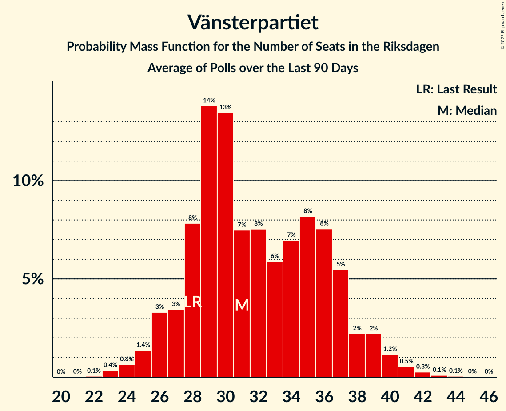

# Vänsterpartiet

<a href="#voting-intentions">Voting Intentions</a> | <a href="#seats">Seats</a>

## Voting Intentions

Last result: **8.0%** (General Election of 9 September 2018)

### Confidence Intervals

| Period     | Polling firm/Commissioner(s) | Median | 80% Confidence Interval | 90% Confidence Interval | 95% Confidence Interval | 99% Confidence Interval |
|:----------:|:----------------:|:-----------:|:-----------------------:|:-----------------------:|:-----------------------:|:-----------------------:|
| N/A | [Poll Average](average.html) | 8.9% | 7.8–10.7% | 7.5–11.3% | 7.2–11.8% | 6.8–12.8% |
| [27 August–3 September 2019](2019-09-03-Demoskop.html) | Demoskop | 8.4% | 7.5–9.3% | 7.3–9.6% | 7.1–9.8% | 6.7–10.3% |
| [22–28 August 2019](2019-08-28-Inizio.html) | Inizio   Aftonbladet | 7.9% | 7.2–8.7% | 7.0–8.9% | 6.8–9.2% | 6.4–9.6% |
| [22–27 August 2019](2019-08-27-Sentio.html) | Sentio | 10.6% | 9.3–12.1% | 8.9–12.6% | 8.6–12.9% | 8.0–13.7% |
| [5–25 August 2019](2019-08-25-Novus.html) | Novus   SVT | 9.0% | 8.3–9.7% | 8.1–10.0% | 8.0–10.1% | 7.6–10.5% |
| [13–25 August 2019](2019-08-25-Ipsos.html) | Ipsos   Dagens Nyheter | 10.0% | 9.1–11.1% | 8.8–11.4% | 8.6–11.7% | 8.2–12.2% |
| [6–15 August 2019](2019-08-15-Sifo.html) | Sifo | 8.7% | 8.2–9.2% | 8.1–9.3% | 8.0–9.4% | 7.8–9.6% |
| [1–8 August 2019](2019-08-08-Inizio.html) | Inizio   Aftonbladet | 8.5% | 7.8–9.4% | 7.6–9.6% | 7.4–9.8% | 7.1–10.2% |
| [25 June–16 July 2019](2019-07-16-SKOP.html) | SKOP | 8.9% | 7.8–10.1% | 7.5–10.5% | 7.3–10.8% | 6.8–11.4% |
| [24 June–1 July 2019](2019-07-01-Demoskop.html) | Demoskop | 7.9% | 7.1–8.8% | 6.9–9.1% | 6.7–9.3% | 6.3–9.8% |
| [17–24 June 2019](2019-06-24-Inizio.html) | Inizio   Aftonbladet | 8.3% | 7.5–9.1% | 7.3–9.4% | 7.2–9.6% | 6.8–10.0% |
| [3–23 June 2019](2019-06-23-Novus.html) | Novus   SVT | 9.0% | 8.3–9.7% | 8.1–10.0% | 8.0–10.1% | 7.7–10.5% |
| [4–18 June 2019](2019-06-18-Ipsos.html) | Ipsos   Dagens Nyheter | 10.0% | 9.1–11.0% | 8.8–11.3% | 8.6–11.6% | 8.2–12.1% |
| [3–13 June 2019](2019-06-13-Sifo.html) | Sifo | 8.6% | 8.2–9.0% | 8.1–9.1% | 8.0–9.2% | 7.9–9.4% |
| [3–13 June 2019](2019-06-13-Sentio.html) | Sentio   Nyheter Idag | 8.9% | 7.6–10.2% | 7.2–10.6% | 7.0–10.9% | 6.4–11.6% |
| [27 May–3 June 2019](2019-06-03-Demoskop.html) | Demoskop   Expressen | 8.0% | 7.2–8.9% | 7.0–9.2% | 6.8–9.4% | 6.4–9.9% |
| [6 May–2 June 2019](2019-06-02-Novus.html) | Novus   SVT | 9.0% | 8.4–9.6% | 8.2–9.8% | 8.1–10.0% | 7.8–10.3% |
| [29 April–28 May 2019](2019-05-28-SCB.html) | SCB | 8.7% | 8.3–9.1% | 8.2–9.2% | 8.1–9.3% | 8.0–9.5% |
| [21–28 May 2019](2019-05-28-Inizio.html) | Inizio   Aftonbladet | 8.3% | 7.6–9.1% | 7.4–9.3% | 7.2–9.5% | 6.9–9.9% |
| [17–21 May 2019](2019-05-21-Sentio.html) | Sentio   Nyheter Idag | 10.1% | 9.0–11.4% | 8.7–11.8% | 8.4–12.2% | 7.9–12.8% |
| [6–21 May 2019](2019-05-21-Ipsos.html) | Ipsos   Dagens Nyheter | 10.0% | 9.2–10.9% | 9.0–11.1% | 8.8–11.3% | 8.4–11.8% |
| [6–16 May 2019](2019-05-16-Sifo.html) | Sifo | 8.9% | 8.5–9.3% | 8.4–9.4% | 8.3–9.5% | 8.2–9.7% |
| [10–15 May 2019](2019-05-15-Sifo.html) | Sifo   Svenska Dagbladet | 9.5% | 8.8–10.2% | 8.6–10.4% | 8.5–10.6% | 8.2–11.0% |
| [29 April–7 May 2019](2019-05-07-Demoskop.html) | Demoskop   Expressen | 8.7% | 7.9–9.7% | 7.6–10.0% | 7.4–10.2% | 7.0–10.7% |
| [8 April–5 May 2019](2019-05-05-Novus.html) | Novus   SVT | 8.8% | 8.2–9.5% | 8.0–9.7% | 7.9–9.8% | 7.6–10.1% |
| [22–29 April 2019](2019-04-29-Inizio.html) | Inizio   Aftonbladet | 9.5% | 8.7–10.4% | 8.5–10.6% | 8.3–10.9% | 8.0–11.3% |
| [9–22 April 2019](2019-04-22-Ipsos.html) | Ipsos   Dagens Nyheter | 10.1% | 9.1–11.2% | 8.9–11.5% | 8.7–11.7% | 8.2–12.3% |
| [1–11 April 2019](2019-04-11-Sifo.html) | Sifo   Svenska Dagbladet | 8.7% | 8.3–9.1% | 8.2–9.2% | 8.1–9.3% | 7.9–9.5% |
| [4–10 April 2019](2019-04-10-Sentio.html) | Sentio   Nyheter Idag | 9.3% | 8.0–10.7% | 7.7–11.1% | 7.4–11.5% | 6.9–12.2% |
| [26 March–3 April 2019](2019-04-03-Demoskop.html) | Demoskop   Expressen | 9.6% | 8.7–10.6% | 8.5–10.9% | 8.2–11.1% | 7.8–11.6% |
| [4–31 March 2019](2019-03-31-Novus.html) | Novus   SVT | 9.7% | 9.1–10.4% | 8.9–10.5% | 8.8–10.7% | 8.5–11.0% |
| [23–28 March 2019](2019-03-28-Inizio.html) | Inizio   Aftonbladet | 8.6% | 8.0–9.3% | 7.8–9.5% | 7.7–9.7% | 7.4–10.0% |
| [22–27 March 2019](2019-03-27-Sentio.html) | Sentio   Nyheter Idag | 10.2% | 9.0–11.5% | 8.7–11.9% | 8.5–12.2% | 7.9–12.9% |
| [7–27 March 2019](2019-03-27-SKOP.html) | SKOP | 8.8% | 7.9–9.8% | 7.7–10.1% | 7.5–10.3% | 7.1–10.9% |
| [12–25 March 2019](2019-03-25-Ipsos.html) | Ipsos   Dagens Nyheter | 10.0% | 9.1–11.1% | 8.8–11.4% | 8.6–11.6% | 8.2–12.1% |
| [3–14 March 2019](2019-03-14-Sifo.html) | Sifo   Svenska Dagbladet | 9.8% | 9.4–10.2% | 9.3–10.3% | 9.2–10.4% | 9.0–10.6% |
| [26 February–5 March 2019](2019-03-05-Demoskop.html) | Demoskop   Expressen | 9.3% | 8.4–10.3% | 8.2–10.6% | 8.0–10.8% | 7.6–11.3% |
| [4 February–3 March 2019](2019-03-03-Novus.html) | Novus   SVT | 9.1% | 8.5–9.7% | 8.3–9.9% | 8.2–10.1% | 7.9–10.4% |
| [22–25 February 2019](2019-02-25-Sentio.html) | Sentio   Nyheter Idag | 10.5% | 9.3–11.8% | 9.0–12.2% | 8.7–12.6% | 8.2–13.2% |
| [7–20 February 2019](2019-02-20-Ipsos.html) | Ipsos   Dagens Nyheter | 10.0% | 9.0–11.0% | 8.8–11.3% | 8.6–11.6% | 8.1–12.1% |
| [11–18 February 2019](2019-02-18-Inizio.html) | Inizio   Aftonbladet | 9.2% | 8.4–10.0% | 8.2–10.3% | 8.0–10.5% | 7.7–10.9% |
| [4–14 February 2019](2019-02-14-Sifo.html) | Sifo   Svenska Dagbladet | 9.6% | 9.2–10.0% | 9.1–10.2% | 9.0–10.3% | 8.8–10.5% |
| [29 January–5 February 2019](2019-02-05-Demoskop.html) | Demoskop   Expressen | 9.6% | 8.7–10.6% | 8.5–10.9% | 8.2–11.2% | 7.8–11.6% |
| [14 January–3 February 2019](2019-02-03-Novus.html) | Novus   SVT | 9.1% | 8.5–9.8% | 8.3–10.0% | 8.1–10.2% | 7.8–10.5% |
| [24–30 January 2019](2019-01-30-Sentio.html) | Sentio   Nyheter Idag | 9.5% | 8.4–10.8% | 8.1–11.2% | 7.8–11.5% | 7.3–12.1% |
| [16–23 January 2019](2019-01-23-Inizio.html) | Inizio   Aftonbladet | 9.7% | 8.9–10.5% | 8.7–10.8% | 8.5–11.0% | 8.1–11.5% |
| [10–20 January 2019](2019-01-20-Ipsos.html) | Ipsos   Dagens Nyheter | 8.0% | 7.2–8.9% | 7.0–9.2% | 6.8–9.4% | 6.4–9.9% |
| [14–17 January 2019](2019-01-17-Sifo.html) | Sifo   Svenska Dagbladet | 8.5% | 8.0–9.1% | 7.8–9.2% | 7.7–9.4% | 7.5–9.7% |
| [3–17 January 2019](2019-01-17-SKOP.html) | SKOP | 8.9% | 7.9–10.1% | 7.6–10.4% | 7.3–10.7% | 6.9–11.3% |
| [2–13 January 2019](2019-01-13-Novus.html) | Novus   SVT | 7.6% | 6.9–8.4% | 6.8–8.6% | 6.6–8.7% | 6.3–9.1% |
| [2–8 January 2019](2019-01-08-Demoskop.html) | Demoskop   Expressen | 8.0% | 7.2–8.9% | 7.0–9.2% | 6.8–9.4% | 6.4–9.9% |
| [19–26 December 2018](2018-12-26-Inizio.html) | Inizio   Aftonbladet | 7.7% | 7.0–8.5% | 6.8–8.7% | 6.7–8.9% | 6.4–9.2% |
| [12 November–16 December 2018](2018-12-16-Novus.html) | Novus   SVT | 7.7% | 7.3–8.2% | 7.1–8.3% | 7.0–8.4% | 6.8–8.7% |
| [5–16 December 2018](2018-12-16-Ipsos.html) | Ipsos   Dagens Nyheter | 8.0% | 7.2–9.0% | 6.9–9.2% | 6.7–9.5% | 6.4–10.0% |
| [3–13 December 2018](2018-12-13-Sifo.html) | Sifo   Svenska Dagbladet | 7.7% | 7.3–8.1% | 7.2–8.2% | 7.1–8.3% | 7.0–8.5% |
| [4–12 December 2018](2018-12-12-Inizio.html) | Inizio   Aftonbladet | 7.2% | 6.5–8.0% | 6.3–8.2% | 6.2–8.4% | 5.9–8.7% |
| [27 November–4 December 2018](2018-12-04-Demoskop.html) | Demoskop   Expressen | 8.0% | 7.2–8.9% | 7.0–9.2% | 6.8–9.4% | 6.4–9.9% |
| [29 November–3 December 2018](2018-12-03-Sentio.html) | Sentio   Nyheter Idag | 8.0% | 7.0–9.2% | 6.8–9.5% | 6.5–9.8% | 6.1–10.4% |
| [29 October–27 November 2018](2018-11-27-SCB.html) | SCB | 8.4% | 7.9–9.0% | 7.8–9.1% | 7.7–9.2% | 7.4–9.5% |
| [8–19 November 2018](2018-11-19-Ipsos.html) | Ipsos   Dagens Nyheter | 8.2% | 7.4–9.2% | 7.1–9.5% | 6.9–9.7% | 6.6–10.2% |
| [14–19 November 2018](2018-11-19-Inizio.html) | Inizio   Aftonbladet | 7.3% | 6.6–8.0% | 6.5–8.2% | 6.3–8.4% | 6.0–8.8% |
| [5–15 November 2018](2018-11-15-Sifo.html) | Sifo   Svenska Dagbladet | 7.6% | 7.2–8.0% | 7.1–8.1% | 7.1–8.2% | 6.9–8.3% |
| [15 October–11 November 2018](2018-11-11-Novus.html) | Novus   SVT | 7.9% | 7.4–8.4% | 7.3–8.6% | 7.2–8.7% | 7.0–8.9% |
| [1–7 November 2018](2018-11-07-Sentio.html) | Sentio   Nyheter Idag | 9.3% | 8.3–10.6% | 8.0–11.0% | 7.7–11.3% | 7.2–11.9% |
| [26 October–6 November 2018](2018-11-06-Inizio.html) | Inizio   Aftonbladet | 7.8% | 7.1–8.6% | 6.9–8.8% | 6.8–9.0% | 6.4–9.4% |
| [30 October–6 November 2018](2018-11-06-Demoskop.html) | Demoskop   Expressen | 7.8% | 7.0–8.7% | 6.8–9.0% | 6.6–9.2% | 6.2–9.7% |
| [16–24 October 2018](2018-10-24-Ipsos.html) | Ipsos   Dagens Nyheter | 8.1% | 7.3–9.1% | 7.0–9.3% | 6.8–9.6% | 6.5–10.0% |
| [8–18 October 2018](2018-10-18-Sifo.html) | Sifo   Svenska Dagbladet | 7.9% | 7.5–8.3% | 7.4–8.4% | 7.3–8.5% | 7.2–8.7% |
| [5–9 October 2018](2018-10-09-Sentio.html) | Sentio   Nyheter Idag | 8.4% | 7.4–9.6% | 7.1–10.0% | 6.8–10.3% | 6.4–10.9% |
| [1–8 October 2018](2018-10-08-Inizio.html) | Inizio   Aftonbladet | 7.3% | 6.5–8.1% | 6.3–8.4% | 6.1–8.6% | 5.8–9.0% |
| [1–4 October 2018](2018-10-04-Novus.html) | Novus   SVT | 8.4% | 7.7–9.2% | 7.5–9.4% | 7.3–9.6% | 7.0–10.0% |
| [24 September–2 October 2018](2018-10-02-Sifo.html) | Sifo   Svenska Dagbladet | 7.8% | 7.4–8.2% | 7.3–8.3% | 7.2–8.4% | 7.1–8.6% |
| [25 September–2 October 2018](2018-10-02-Demoskop.html) | Demoskop   Expressen | 7.7% | 6.9–8.6% | 6.7–8.9% | 6.5–9.1% | 6.1–9.5% |

### Probability Mass Function

The following table shows the probability mass function per percentage block of voting intentions for the [poll average](average.html) for Vänsterpartiet.

| Voting Intentions | Probability | Accumulated | Special Marks |
|:-----------------:|:-----------:|:-----------:|:-------------:|
| 4.5–5.5% | 0% | 100% |  |
| 5.5–6.5% | 0.2% | 100% |  |
| 6.5–7.5% | 6% | 99.8% |  |
| 7.5–8.5% | 27% | 94% | Last Result |
| 8.5–9.5% | 37% | 67% | Median |
| 9.5–10.5% | 17% | 30% |  |
| 10.5–11.5% | 9% | 12% |  |
| 11.5–12.5% | 3% | 4% |  |
| 12.5–13.5% | 0.6% | 0.7% |  |
| 13.5–14.5% | 0.1% | 0.1% |  |
| 14.5–15.5% | 0% | 0% |  |

## Seats

Last result: **28** seats (General Election of 9 September 2018)

### Confidence Intervals

| Period     | Polling firm/Commissioner(s) | Median | 80% Confidence Interval | 90% Confidence Interval | 95% Confidence Interval | 99% Confidence Interval |
|:----------:|:----------------:|:------:|:-----------------------:|:-----------------------:|:-----------------------:|:-----------------------:|
| N/A | [Poll Average](average.html) | 32 | 28–38 | 27–40 | 26–42 | 25–46 |
| [27 August–3 September 2019](2019-09-03-Demoskop.html) | Demoskop | 30 | 27–34 | 26–35 | 25–35 | 24–37 |
| [22–28 August 2019](2019-08-28-Inizio.html) | Inizio   Aftonbladet | 29 | 26–32 | 26–34 | 25–34 | 23–36 |
| [22–27 August 2019](2019-08-27-Sentio.html) | Sentio | 38 | 33–43 | 32–45 | 31–46 | 29–49 |
| [5–25 August 2019](2019-08-25-Novus.html) | Novus   SVT | 34 | 31–36 | 30–36 | 29–37 | 28–38 |
| [13–25 August 2019](2019-08-25-Ipsos.html) | Ipsos   Dagens Nyheter | 35 | 33–39 | 32–40 | 31–41 | 29–43 |
| [6–15 August 2019](2019-08-15-Sifo.html) | Sifo | 32 | 30–33 | 29–34 | 29–34 | 28–36 |
| [1–8 August 2019](2019-08-08-Inizio.html) | Inizio   Aftonbladet | 33 | 29–35 | 28–37 | 28–37 | 26–39 |
| [25 June–16 July 2019](2019-07-16-SKOP.html) | SKOP | 30 | 29–35 | 28–36 | 26–39 | 25–39 |
| [24 June–1 July 2019](2019-07-01-Demoskop.html) | Demoskop | 29 | 26–32 | 25–33 | 24–34 | 23–35 |
| [17–24 June 2019](2019-06-24-Inizio.html) | Inizio   Aftonbladet | 31 | 28–34 | 27–34 | 26–35 | 25–37 |
| [3–23 June 2019](2019-06-23-Novus.html) | Novus   SVT | 33 | 30–35 | 29–36 | 29–37 | 28–38 |
| [4–18 June 2019](2019-06-18-Ipsos.html) | Ipsos   Dagens Nyheter | 35 | 32–39 | 31–40 | 31–41 | 29–43 |
| [3–13 June 2019](2019-06-13-Sifo.html) | Sifo | 32 | 30–33 | 30–34 | 30–34 | 29–34 |
| [3–13 June 2019](2019-06-13-Sentio.html) | Sentio   Nyheter Idag | 32 | 27–37 | 26–39 | 25–40 | 23–43 |
| [27 May–3 June 2019](2019-06-03-Demoskop.html) | Demoskop   Expressen | 29 | 26–33 | 25–34 | 24–34 | 23–36 |
| [6 May–2 June 2019](2019-06-02-Novus.html) | Novus   SVT | 32 | 30–35 | 29–35 | 29–36 | 28–38 |
| [29 April–28 May 2019](2019-05-28-SCB.html) | SCB | 32 | 30–33 | 30–34 | 30–34 | 29–35 |
| [21–28 May 2019](2019-05-28-Inizio.html) | Inizio   Aftonbladet | 31 | 28–34 | 27–35 | 26–36 | 25–37 |
| [17–21 May 2019](2019-05-21-Sentio.html) | Sentio   Nyheter Idag | 38 | 34–43 | 32–44 | 31–46 | 29–48 |
| [6–21 May 2019](2019-05-21-Ipsos.html) | Ipsos   Dagens Nyheter | 36 | 33–40 | 32–41 | 32–41 | 30–43 |
| [6–16 May 2019](2019-05-16-Sifo.html) | Sifo | 33 | 31–34 | 31–34 | 30–35 | 29–36 |
| [10–15 May 2019](2019-05-15-Sifo.html) | Sifo   Svenska Dagbladet | 35 | 32–37 | 31–38 | 31–39 | 30–40 |
| [29 April–7 May 2019](2019-05-07-Demoskop.html) | Demoskop   Expressen | 32 | 29–36 | 28–37 | 28–38 | 26–40 |
| [8 April–5 May 2019](2019-05-05-Novus.html) | Novus   SVT | 32 | 30–34 | 29–35 | 29–36 | 28–37 |
| [22–29 April 2019](2019-04-29-Inizio.html) | Inizio   Aftonbladet | 35 | 32–39 | 31–39 | 30–40 | 29–42 |
| [9–22 April 2019](2019-04-22-Ipsos.html) | Ipsos   Dagens Nyheter | 37 | 34–41 | 32–42 | 31–43 | 30–46 |
| [1–11 April 2019](2019-04-11-Sifo.html) | Sifo   Svenska Dagbladet | 32 | 30–33 | 30–34 | 30–34 | 29–35 |
| [4–10 April 2019](2019-04-10-Sentio.html) | Sentio   Nyheter Idag | 34 | 29–39 | 28–41 | 27–42 | 25–45 |
| [26 March–3 April 2019](2019-04-03-Demoskop.html) | Demoskop   Expressen | 35 | 32–39 | 31–40 | 30–41 | 28–43 |
| [4–31 March 2019](2019-03-31-Novus.html) | Novus   SVT | 36 | 34–39 | 34–40 | 33–41 | 31–42 |
| [23–28 March 2019](2019-03-28-Inizio.html) | Inizio   Aftonbladet | 32 | 29–35 | 29–35 | 28–36 | 27–37 |
| [22–27 March 2019](2019-03-27-Sentio.html) | Sentio   Nyheter Idag | 38 | 34–43 | 32–44 | 31–46 | 30–48 |
| [7–27 March 2019](2019-03-27-SKOP.html) | SKOP | 33 | 29–36 | 28–37 | 28–38 | 26–40 |
| [12–25 March 2019](2019-03-25-Ipsos.html) | Ipsos   Dagens Nyheter | 36 | 33–41 | 32–42 | 31–42 | 30–45 |
| [3–14 March 2019](2019-03-14-Sifo.html) | Sifo   Svenska Dagbladet | 37 | 36–39 | 35–40 | 34–40 | 34–41 |
| [26 February–5 March 2019](2019-03-05-Demoskop.html) | Demoskop   Expressen | 34 | 31–37 | 30–38 | 30–40 | 28–42 |
| [4 February–3 March 2019](2019-03-03-Novus.html) | Novus   SVT | 34 | 32–36 | 31–37 | 30–37 | 29–39 |
| [22–25 February 2019](2019-02-25-Sentio.html) | Sentio   Nyheter Idag | 38 | 36–45 | 34–46 | 33–48 | 31–49 |
| [7–20 February 2019](2019-02-20-Ipsos.html) | Ipsos   Dagens Nyheter | 35 | 33–40 | 32–42 | 32–44 | 30–45 |
| [11–18 February 2019](2019-02-18-Inizio.html) | Inizio   Aftonbladet | 35 | 32–37 | 31–38 | 31–39 | 30–40 |
| [4–14 February 2019](2019-02-14-Sifo.html) | Sifo   Svenska Dagbladet | 35 | 33–37 | 33–37 | 33–38 | 32–39 |
| [29 January–5 February 2019](2019-02-05-Demoskop.html) | Demoskop   Expressen | 36 | 33–39 | 33–40 | 32–41 | 30–44 |
| [14 January–3 February 2019](2019-02-03-Novus.html) | Novus   SVT | 34 | 32–37 | 31–38 | 30–38 | 29–40 |
| [24–30 January 2019](2019-01-30-Sentio.html) | Sentio   Nyheter Idag | 35 | 30–40 | 30–41 | 29–42 | 27–46 |
| [16–23 January 2019](2019-01-23-Inizio.html) | Inizio   Aftonbladet | 36 | 33–39 | 32–41 | 32–42 | 30–43 |
| [10–20 January 2019](2019-01-20-Ipsos.html) | Ipsos   Dagens Nyheter | 28 | 26–32 | 25–33 | 24–34 | 23–36 |
| [14–17 January 2019](2019-01-17-Sifo.html) | Sifo   Svenska Dagbladet | 32 | 29–34 | 29–35 | 28–35 | 28–36 |
| [3–17 January 2019](2019-01-17-SKOP.html) | SKOP | 33 | 29–37 | 28–38 | 28–39 | 25–42 |
| [2–13 January 2019](2019-01-13-Novus.html) | Novus   SVT | 28 | 26–31 | 25–32 | 24–33 | 23–34 |
| [2–8 January 2019](2019-01-08-Demoskop.html) | Demoskop   Expressen | 30 | 26–33 | 25–34 | 25–34 | 23–37 |
| [19–26 December 2018](2018-12-26-Inizio.html) | Inizio   Aftonbladet | 29 | 26–32 | 25–32 | 25–33 | 23–34 |
| [12 November–16 December 2018](2018-12-16-Novus.html) | Novus   SVT | 28 | 26–31 | 26–32 | 25–32 | 24–33 |
| [5–16 December 2018](2018-12-16-Ipsos.html) | Ipsos   Dagens Nyheter | 29 | 26–32 | 25–33 | 24–34 | 23–36 |
| [3–13 December 2018](2018-12-13-Sifo.html) | Sifo   Svenska Dagbladet | 28 | 26–30 | 25–30 | 25–30 | 25–31 |
| [4–12 December 2018](2018-12-12-Inizio.html) | Inizio   Aftonbladet | 27 | 24–30 | 24–31 | 23–32 | 22–33 |
| [27 November–4 December 2018](2018-12-04-Demoskop.html) | Demoskop   Expressen | 29 | 26–32 | 25–33 | 24–34 | 23–36 |
| [29 November–3 December 2018](2018-12-03-Sentio.html) | Sentio   Nyheter Idag | 30 | 26–34 | 25–36 | 24–37 | 22–39 |
| [29 October–27 November 2018](2018-11-27-SCB.html) | SCB | 30 | 28–33 | 28–33 | 27–34 | 27–35 |
| [8–19 November 2018](2018-11-19-Ipsos.html) | Ipsos   Dagens Nyheter | 30 | 26–33 | 25–34 | 25–35 | 23–37 |
| [14–19 November 2018](2018-11-19-Inizio.html) | Inizio   Aftonbladet | 28 | 24–31 | 24–31 | 24–32 | 22–33 |
| [5–15 November 2018](2018-11-15-Sifo.html) | Sifo   Svenska Dagbladet | 27 | 26–29 | 26–29 | 25–30 | 25–30 |
| [15 October–11 November 2018](2018-11-11-Novus.html) | Novus   SVT | 29 | 27–31 | 27–31 | 26–32 | 25–33 |
| [1–7 November 2018](2018-11-07-Sentio.html) | Sentio   Nyheter Idag | 34 | 31–40 | 29–41 | 28–42 | 26–45 |
| [26 October–6 November 2018](2018-11-06-Inizio.html) | Inizio   Aftonbladet | 29 | 26–32 | 25–33 | 25–33 | 23–35 |
| [30 October–6 November 2018](2018-11-06-Demoskop.html) | Demoskop   Expressen | 29 | 26–32 | 25–33 | 24–34 | 23–36 |
| [16–24 October 2018](2018-10-24-Ipsos.html) | Ipsos   Dagens Nyheter | 28 | 26–32 | 25–33 | 24–34 | 23–36 |
| [8–18 October 2018](2018-10-18-Sifo.html) | Sifo   Svenska Dagbladet | 28 | 27–30 | 26–30 | 26–31 | 25–31 |
| [5–9 October 2018](2018-10-09-Sentio.html) | Sentio   Nyheter Idag | 30 | 26–35 | 25–36 | 24–37 | 23–39 |
| [1–8 October 2018](2018-10-08-Inizio.html) | Inizio   Aftonbladet | 26 | 23–29 | 23–30 | 22–31 | 21–32 |
| [1–4 October 2018](2018-10-04-Novus.html) | Novus   SVT | 30 | 27–33 | 27–34 | 26–35 | 25–36 |
| [24 September–2 October 2018](2018-10-02-Sifo.html) | Sifo   Svenska Dagbladet | 28 | 26–29 | 26–30 | 26–30 | 25–31 |
| [25 September–2 October 2018](2018-10-02-Demoskop.html) | Demoskop   Expressen | 28 | 25–31 | 24–32 | 24–33 | 22–35 |

### Probability Mass Function

The following table shows the probability mass function per seat for the [poll average](average.html) for Vänsterpartiet.

| Number of Seats | Probability | Accumulated | Special Marks |
|:---------------:|:-----------:|:-----------:|:-------------:|
| 23 | 0.1% | 100% |  |
| 24 | 0.3% | 99.9% |  |
| 25 | 0.8% | 99.5% |  |
| 26 | 2% | 98.8% |  |
| 27 | 3% | 97% |  |
| 28 | 5% | 94% | Last Result |
| 29 | 10% | 89% |  |
| 30 | 11% | 79% |  |
| 31 | 9% | 69% |  |
| 32 | 11% | 60% | Median |
| 33 | 10% | 49% |  |
| 34 | 9% | 39% |  |
| 35 | 9% | 30% |  |
| 36 | 5% | 21% |  |
| 37 | 6% | 16% |  |
| 38 | 2% | 11% |  |
| 39 | 3% | 9% |  |
| 40 | 2% | 6% |  |
| 41 | 1.3% | 5% |  |
| 42 | 0.9% | 3% |  |
| 43 | 0.8% | 2% |  |
| 44 | 0.6% | 1.4% |  |
| 45 | 0.3% | 0.8% |  |
| 46 | 0.2% | 0.5% |  |
| 47 | 0.1% | 0.3% |  |
| 48 | 0.1% | 0.2% |  |
| 49 | 0% | 0.1% |  |
| 50 | 0% | 0.1% |  |
| 51 | 0% | 0% |  |

